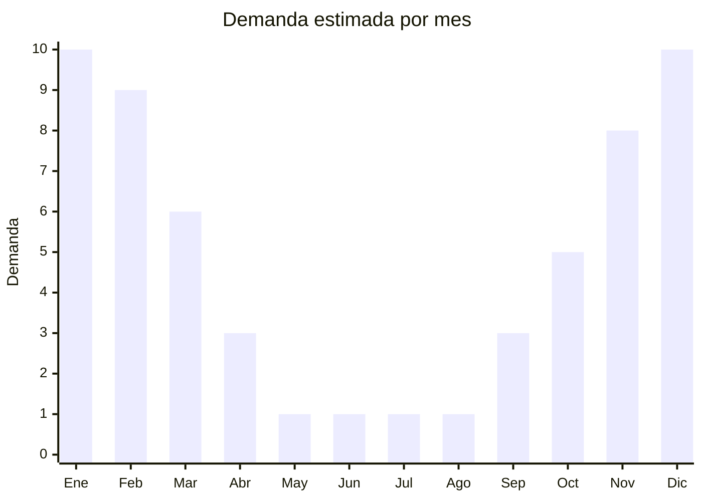

# Vestidos de verano livianos

> **Capítulo NCM 62** — Prendas y complementos de vestir, excepto los de punto | **Temporada:** Verano (Dic–Feb)

## Qué es y por qué importarlo

Los vestidos de verano livianos son prendas femeninas confeccionadas en tela plana de bajo gramaje, diseñadas para climas cálidos. Incluyen vestidos playeros (cover-ups largos), pareos con forma de vestido, sundresses de algodón o viscosa, vestidos camiseros de manga corta y vestidos casuales de lino o mezcla. Se clasifican en el Cap. 62 porque están confeccionados en tejido plano (no de punto).

Guangzhou (China) es el epicentro mundial de la moda femenina económica, con miles de fábricas y talleres en el distrito de Shisanhang que producen vestidos de verano en volúmenes enormes y con ciclos de diseño ultra rápidos. Los precios FOB de USD 3-8 permiten márgenes excelentes cuando se venden a ARS 5.000-20.000 en el mercado argentino, donde la demanda de vestidos livianos se dispara entre noviembre y marzo.

El producto es ideal para venta online por su facilidad de envío (liviano, no frágil) y la variedad de diseños disponibles. Sin embargo, como toda prenda del Cap. 62 de origen chino, está sujeto a antidumping y etiquetado obligatorio IRAM 12560.

<Warning>
**ANTIDUMPING ACTIVO:** Argentina aplica derechos antidumping sobre prendas de origen China. Verificar las NCM 6204.43 (vestidos de fibras sintéticas), 6204.42 (vestidos de algodón) y 6204.49 (otras fibras) contra la resolución vigente de CNCE. El sobrecosto puede ser significativo. Consultar con despachante antes de importar.
</Warning>

## Datos clave

| Dato | Valor |
|------|-------|
| **Posiciones NCM típicas** | 6204.42.00 (vestidos de algodón, tela plana), 6204.43.00 (vestidos de fibras sintéticas), 6204.44.00 (vestidos de fibras artificiales — viscosa), 6204.49.00 (otras fibras) |
| **Derecho de importación** | 35% (DIE) + 3% tasa estadística |
| **Antidumping** | **Sí — verificar NCM específica contra resolución CNCE vigente** |
| **Rango FOB típico** | USD 3.00 — USD 8.00 por unidad |
| **Precio de venta en Argentina** | ARS 5.000 — ARS 20.000 |
| **Margen bruto estimado** | 150% — 300% (sin antidumping) |
| **MOQ típico** | 200 — 500 unidades (variado por modelo/talle) |
| **Demanda en MercadoLibre** | Alta (estacional, femenino) |
| **Competencia en MercadoLibre** | Alta |
| **Dificultad para importar** | Media-Alta (antidumping + etiquetado) |
| **Certificaciones necesarias** | Etiquetado textil IRAM 12560 obligatorio |

## Variantes y subtipos más comunes

| Subtipo / Variante | FOB aprox. | Venta AR aprox. | Nota |
|--------------------|-----------|-----------------|------|
| Vestido playero corto (cover-up) | USD 3.00 — 5.00 | ARS 5.000 — 12.000 | **Más vendido**, playa/pileta |
| Sundress algodón tirantes | USD 3.00 — 5.00 | ARS 6.000 — 14.000 | Casual urbano + playa |
| Vestido viscosa estampado | USD 4.00 — 7.00 | ARS 8.000 — 18.000 | Caída elegante, salida nocturna |
| Vestido camisero manga corta | USD 4.00 — 8.00 | ARS 8.000 — 20.000 | Versátil, oficina + casual |
| Pareo/sarong con forma | USD 3.00 — 4.00 | ARS 5.000 — 10.000 | Multifunción, muy liviano |

## Regulaciones y requisitos

<Tabs>
  <Tab title="Certificaciones">
    | Organismo | Requiere | Detalle |
    |-----------|----------|---------|
    | ARCA (Aduana) | Sí siempre | Despacho con canal textil |
    | CNCE (Antidumping) | **Sí — verificar** | Medidas antidumping vigentes sobre prendas de tela plana de China |
    | INTI / IRAM | Sí | Etiquetado textil IRAM 12560 obligatorio |
    | ANMAT | No | No aplica |
    | ENACOM | No | No aplica |

    **Recomendación:** Los vestidos de viscosa (fibra artificial) y los de poliéster (fibra sintética) tienen NCM diferentes. La viscosa clasifica como fibra artificial (6204.44) y puede tener tratamiento antidumping distinto al poliéster (6204.43). Confirmar composición exacta con el proveedor.
  </Tab>

  <Tab title="Etiquetado">
    | Requisito | Aplica |
    |-----------|--------|
    | Idioma español | Sí (obligatorio) |
    | Datos del importador | Sí (razón social, CUIT, domicilio) |
    | Composición de fibras (%) | **Sí — IRAM 12560** (ej: 100% viscosa, o 65% algodón 35% poliéster) |
    | Talles (sistema argentino) | Sí |
    | País de origen | Sí |
    | Instrucciones de lavado | Sí (símbolos ISO) |
    | Garantía legal 6 meses | Sí |

    <Warning>
    **IRAM 12560 es obligatorio.** Para vestidos con forro, indicar composición de tela exterior y forro por separado. Los vestidos de viscosa deben indicarse como "100% viscosa" (no "rayón" que es denominación genérica no aceptada por IRAM).
    </Warning>
  </Tab>

  <Tab title="Restricciones">
    **Antidumping sobre textiles de China:** Los vestidos del Cap. 62 están sujetos a medidas antidumping. El impacto varía según la NCM exacta y la fibra predominante.

    **Licencias No Automáticas (LNA):** Textiles del Cap. 62 requieren LNA, sumando 30-60 días al proceso.

    **Alternativa:** India es una excelente alternativa para vestidos de algodón y viscosa, con tradición textil, precios competitivos y sin antidumping. Vietnam y Camboya también producen vestidos de verano de buena calidad.
  </Tab>
</Tabs>

## Logística

| Dato | Valor |
|------|-------|
| **Peso típico por unidad** | 0.15 — 0.35 kg |
| **Volumen típico** | Bajo (prendas livianas, compactas) |
| **Fragilidad** | Nula |
| **Envío recomendado** | Marítimo LCL o aéreo para reposiciones rápidas |
| **Tiempo total estimado** | 30 — 45 días (aéreo) / 60 — 90 días (marítimo + LNA) |
| **Baterías de litio** | No |
| **Requiere empaque especial** | No (bolsa individual con hang tag) |

<Tip>
Los vestidos de viscosa se arrugan fácilmente durante el transporte. Solicitar al proveedor que cada vestido vaya **enrollado (no doblado) dentro de su bolsa individual**. Esto reduce arrugas significativamente y evita tener que planchar cientos de unidades al recibirlas. Alternativamente, pedir que incluyan una etiqueta "planchar a baja temperatura antes de usar".
</Tip>

## Estacionalidad



| Aspecto | Detalle |
|---------|---------|
| **Meses pico** | Diciembre-Febrero (verano, vacaciones, salidas nocturnas) |
| **Meses valle** | Junio-Agosto (invierno, sin demanda de vestidos livianos) |
| **Cuándo pedir** | Julio-Agosto para recibir en octubre-noviembre |

## Ventajas y riesgos

<CardGroup cols={2}>
  <Card title="Ventajas" icon="circle-check">
    - Producto liviano con excelente ratio valor/peso
    - Alta variedad de diseños disponibles en Guangzhou
    - Margen muy atractivo en temporada alta
    - Ideal para marca propia / private label
    - Demanda femenina fuerte y recurrente
  </Card>
  <Card title="Riesgos" icon="triangle-exclamation">
    - **Antidumping incrementa costos**
    - Calidad de telas variable (viscosa barata puede desteñir)
    - Talles chinos no coinciden con curva argentina (pedir tabla de medidas)
    - Estacionalidad marcada: remanente difícil de vender
    - LNA demora despacho aduanero
  </Card>
</CardGroup>

## Palabras clave para buscar en Alibaba

```
summer dress wholesale women, beach dress casual wholesale, viscose dress women,
sundress cotton wholesale, cover up dress beach, Guangzhou dress factory,
women casual dress bulk, linen summer dress OEM manufacturer
```

## Fuentes

- [MercadoLibre Argentina — Vestidos de verano](https://listado.mercadolibre.com.ar/vestido-verano-mujer)
- [Alibaba — Summer dress wholesale](https://www.alibaba.com/showroom/summer-dress-wholesale.html)
- [CNCE — Medidas antidumping vigentes](https://www.argentina.gob.ar/cnce)
- [IRAM 12560 — Etiquetado textil](https://www.iram.org.ar)
