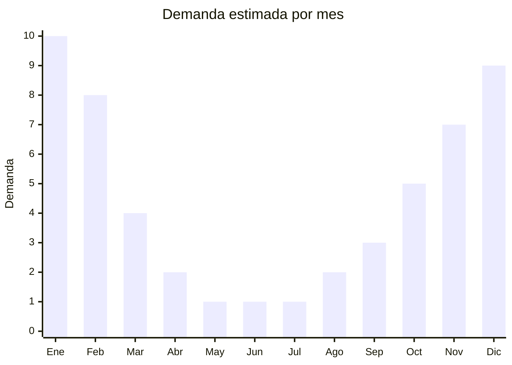

# Carpas de camping

> **Capítulo NCM 63** — Los demás artículos textiles confeccionados | **Temporada:** Verano (Dic–Feb)

## Qué es y por qué importarlo

Las carpas de camping son estructuras textiles portátiles diseñadas para pernoctar al aire libre, compuestas por una cubierta exterior impermeable (flysheet de poliéster con recubrimiento PU), un piso resistente al agua (polietileno o nylon), una estructura de varillas (fibra de vidrio o aluminio) y un sistema de ventilación con mosquitero. Los modelos más demandados en Argentina son las carpas igloo/dome de 2 a 4 personas, que ofrecen el mejor balance entre espacio habitable, peso y facilidad de armado.

China es el mayor productor mundial de carpas, con centros de manufactura especializados en Xiamen (Fujian), Nanjing (Jiangsu) y Ningbo (Zhejiang) que fabrican para marcas globales como Coleman, The North Face y Decathlon. En Argentina, marcas como Waterdog, National Geographic, Coleman y Gadnic dominan el mercado a precios de ARS 30.000-150.000, mientras que las carpas genéricas o de marca propia se ubican entre ARS 30.000 y ARS 100.000.

Las carpas clasifican en el Cap. 63, **sin antidumping**, lo que las hace viables para importar desde China. El principal desafío logístico es el alto volumen (CBM) por unidad: las carpas son productos voluminosos que ocupan mucho espacio de contenedor en relación a su valor unitario.

<Note>
**SIN ANTIDUMPING:** Las carpas de camping del Cap. 63 no están sujetas a derechos antidumping, lo que las hace viables para importar directamente desde China, a diferencia de las prendas de vestir de los capítulos 61 y 62.
</Note>

## Datos clave

| Dato | Valor |
|------|-------|
| **Posiciones NCM típicas** | 6306.22.00 (tiendas de campaña de fibras sintéticas) |
| **Derecho de importación** | 20% (DIE) + 3% tasa estadística |
| **Antidumping** | **No** |
| **Rango FOB típico** | USD 8.00 — USD 30.00 por unidad |
| **Precio de venta en Argentina** | ARS 30.000 — ARS 100.000+ |
| **Margen bruto estimado** | 100% — 250% |
| **MOQ típico** | 50 — 300 unidades |
| **Demanda en MercadoLibre** | Alta (estacional) |
| **Competencia en MercadoLibre** | Media-Alta (marcas posicionadas) |
| **Dificultad para importar** | Media (volumen alto, producto técnico) |
| **Certificaciones necesarias** | No requiere certificaciones especiales |

## Variantes y subtipos más comunes

| Subtipo / Variante | FOB aprox. | Venta AR aprox. | Nota |
|--------------------|-----------|-----------------|------|
| Carpa igloo 2 personas básica | USD 8.00 — 12.00 | ARS 30.000 — 50.000 | Económica, alta rotación |
| Carpa igloo 3-4 personas | USD 12.00 — 20.00 | ARS 50.000 — 80.000 | **Más vendida**, familiar |
| Carpa igloo 4-6 personas | USD 18.00 — 30.00 | ARS 70.000 — 100.000+ | Familiar grande |
| Carpa pop-up automática 2-3 personas | USD 10.00 — 18.00 | ARS 40.000 — 70.000 | Armado instantáneo, tendencia |
| Carpa con avance / living | USD 20.00 — 35.00 | ARS 80.000 — 120.000 | Premium, más espacio |

## Regulaciones y requisitos

<Tabs>
  <Tab title="Certificaciones">
    | Organismo | Requiere | Detalle |
    |-----------|----------|---------|
    | ARCA (Aduana) | Sí siempre | Despacho estándar |
    | CNCE (Antidumping) | No | No hay antidumping para carpas del Cap. 63 |
    | ANMAT | No | No aplica |
    | ENACOM | No | No aplica |

    **Recomendación:** Solicitar al proveedor datos técnicos de impermeabilidad (columna de agua en mm), resistencia al viento y protección UV. Aunque no son obligatorios en Argentina, estos datos son esenciales para la ficha de producto y generan confianza en el comprador. Una buena carpa debería tener mínimo 1.500 mm de columna de agua.
  </Tab>

  <Tab title="Etiquetado">
    | Requisito | Aplica |
    |-----------|--------|
    | Idioma español | Sí (obligatorio) |
    | Datos del importador | Sí (razón social, CUIT, domicilio) |
    | Composición / materiales | Sí (tipo de tela exterior, piso, varillas) |
    | Dimensiones | Sí (armada y guardada, capacidad de personas) |
    | País de origen | Sí |
    | Instrucciones de armado | Sí (manual en español, fundamental) |
    | Garantía legal 6 meses | Sí |

    El manual de instrucciones en español es crítico para evitar reclamos y devoluciones. Solicitar al proveedor que incluya manual impreso o proveer un QR con video de armado.
  </Tab>

  <Tab title="Restricciones">
    **Sin restricciones especiales.** Las carpas de camping del Cap. 63 no tienen antidumping, licencias no automáticas ni intervenciones de organismos especiales.

    **Atención:** Verificar que el proveedor utilice materiales retardantes de fuego (fire retardant) en la tela. Aunque no es obligatorio en Argentina, es un estándar de seguridad importante y puede ser requerido si se vende a empresas o instituciones.
  </Tab>
</Tabs>

## Logística

| Dato | Valor |
|------|-------|
| **Peso típico por unidad** | 2.5 — 6.0 kg (según tamaño/modelo) |
| **Volumen típico** | **Alto** (producto voluminoso empacado, alto CBM por unidad) |
| **Fragilidad** | Baja-Media (varillas de fibra de vidrio requieren cuidado) |
| **Envío recomendado** | Marítimo LCL o FCL (producto voluminoso) |
| **Tiempo total estimado** | 50 — 80 días (marítimo) |
| **Baterías de litio** | No |
| **Requiere empaque especial** | Sí (bolsa de transporte resistente, protección de varillas) |

<Tip>
Las carpas tienen un **ratio CBM/valor muy desfavorable**: ocupan mucho espacio en relación a su precio FOB. Para optimizar el flete, negociar con el proveedor embalaje comprimido al máximo y combinar el envío con productos de menor volumen (ej: accesorios de camping, linternas, colchonetas) que aprovechen los espacios vacíos del contenedor. Un FCL 20' puede contener aproximadamente 400-600 carpas de 3-4 personas.
</Tip>

## Estacionalidad



| Aspecto | Detalle |
|---------|---------|
| **Meses pico** | Diciembre-Febrero (verano, vacaciones, camping) |
| **Meses valle** | Mayo-Agosto (invierno, mínima actividad camping) |
| **Cuándo pedir** | Junio-Julio para tener stock en noviembre (lead time mayor por volumen) |

## Ventajas y riesgos

<CardGroup cols={2}>
  <Card title="Ventajas" icon="circle-check">
    - **Sin antidumping** — importación directa desde China viable
    - Ticket promedio alto (ARS 50.000-100.000+)
    - Producto técnico: el comprador valora especificaciones
    - Demanda predecible en temporada
    - Mercado en crecimiento (turismo aventura, glamping)
  </Card>
  <Card title="Riesgos" icon="triangle-exclamation">
    - **Alto CBM**: flete costoso en relación al valor
    - Estacionalidad marcada: stock sobrante ocupa mucho espacio
    - Reclamos por filtraciones si la calidad es baja
    - Competencia con marcas establecidas (Waterdog, Coleman)
    - Varillas de fibra de vidrio pueden quebrarse (repuestos necesarios)
  </Card>
</CardGroup>

## Palabras clave para buscar en Alibaba

```
camping tent wholesale, dome tent 3-4 person, igloo tent factory,
pop up camping tent, automatic camping tent wholesale, tent Xiamen factory,
family camping tent OEM, waterproof tent 2000mm, backpacking tent lightweight
```

## Fuentes

- [MercadoLibre Argentina — Carpas de camping](https://listado.mercadolibre.com.ar/carpa-camping)
- [Alibaba — Camping tent wholesale](https://www.alibaba.com/showroom/camping-tent.html)
- [CNCE — Nomenclatura arancelaria](https://www.argentina.gob.ar/cnce)
