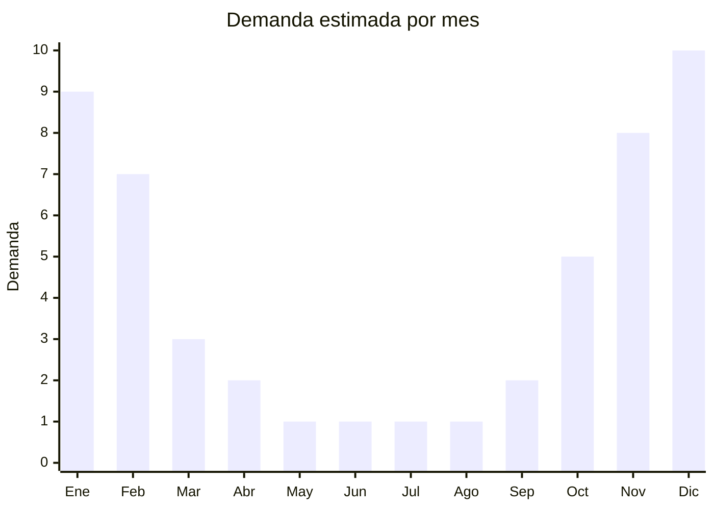

# Lonas y toldos de playa portátiles

> **Capítulo NCM 63** — Los demás artículos textiles confeccionados | **Temporada:** Verano (Dic–Feb)

## Qué es y por qué importarlo

Las lonas y toldos de playa portátiles son estructuras textiles livianas diseñadas para generar sombra en la playa, parques y actividades al aire libre. Incluyen toldos tipo sombrilla con estacas, carpas de playa estilo iglú (pop-up), lonas con postes telescópicos, parasoles portátiles con anclaje de arena y refugios UV compactos. Están confeccionados con telas de poliéster recubiertas con protección UV (UPF 50+), nylon ripstop o tela oxford, y se arman con varillas de fibra de vidrio o acero.

China es el principal productor mundial de equipamiento outdoor portátil, con centros de manufactura en Ningbo, Yiwu y Xiamen que fabrican para marcas globales y exportación genérica. Los precios FOB de USD 3-10 permiten márgenes atractivos en un mercado argentino donde un toldo de playa se vende entre ARS 8.000 y ARS 25.000. La demanda crece año a año impulsada por la mayor conciencia sobre protección solar.

Una ventaja importante es que los toldos de playa se clasifican en el Cap. 63, que **no tiene antidumping** para este tipo de productos, haciéndolo mucho más viable que importar textiles confeccionados de los capítulos 61 y 62.

<Note>
**SIN ANTIDUMPING:** Los toldos y lonas de playa del Cap. 63 no están sujetos a derechos antidumping, lo que simplifica significativamente la importación desde China.
</Note>

## Datos clave

| Dato | Valor |
|------|-------|
| **Posiciones NCM típicas** | 6306.22.00 (tiendas/carpas de fibras sintéticas), 6306.12.00 (toldos de fibras sintéticas), 6306.90.00 (otros artículos para acampar) |
| **Derecho de importación** | 20% (DIE) + 3% tasa estadística |
| **Antidumping** | **No** |
| **Rango FOB típico** | USD 3.00 — USD 10.00 por unidad |
| **Precio de venta en Argentina** | ARS 8.000 — ARS 25.000 |
| **Margen bruto estimado** | 150% — 280% |
| **MOQ típico** | 100 — 500 unidades |
| **Demanda en MercadoLibre** | Alta (estacional) |
| **Competencia en MercadoLibre** | Media |
| **Dificultad para importar** | Fácil-Media |
| **Certificaciones necesarias** | No requiere certificaciones especiales |

## Variantes y subtipos más comunes

| Subtipo / Variante | FOB aprox. | Venta AR aprox. | Nota |
|--------------------|-----------|-----------------|------|
| Carpa playa pop-up iglú 2 personas | USD 4.00 — 7.00 | ARS 10.000 — 18.000 | **Más vendida**, armado instantáneo |
| Toldo playa con estacas 200x200 cm | USD 3.00 — 6.00 | ARS 8.000 — 15.000 | Económico, práctico |
| Lona con postes telescópicos | USD 5.00 — 8.00 | ARS 12.000 — 20.000 | Mayor cobertura |
| Refugio UV familiar 3-4 personas | USD 7.00 — 10.00 | ARS 18.000 — 25.000 | Premium, UPF 50+ |
| Parasol portátil con anclaje arena | USD 3.00 — 5.00 | ARS 8.000 — 14.000 | Alternativa a sombrilla clásica |

## Regulaciones y requisitos

<Tabs>
  <Tab title="Certificaciones">
    | Organismo | Requiere | Detalle |
    |-----------|----------|---------|
    | ARCA (Aduana) | Sí siempre | Despacho estándar |
    | CNCE (Antidumping) | No | No hay antidumping para artículos del Cap. 63 tipo camping |
    | ANMAT | No | No aplica |
    | ENACOM | No | No aplica |

    **Recomendación:** Solicitar al proveedor certificado de protección UV (UPF 50+ o equivalente). Aunque no es obligatorio en Argentina, poder comunicar el nivel de protección UV es un diferencial de venta importante y da confianza al comprador.
  </Tab>

  <Tab title="Etiquetado">
    | Requisito | Aplica |
    |-----------|--------|
    | Idioma español | Sí (obligatorio) |
    | Datos del importador | Sí (razón social, CUIT, domicilio) |
    | Composición / materiales | Sí (tipo de tela, material de estructura) |
    | Dimensiones | Sí (indicar tamaño armado y plegado) |
    | País de origen | Sí |
    | Instrucciones de armado | Sí (fundamental) |
    | Garantía legal 6 meses | Sí |

    El etiquetado debe incluir instrucciones claras de armado/desarmado, especialmente para modelos pop-up que pueden resultar confusos para el usuario.
  </Tab>

  <Tab title="Restricciones">
    **Sin restricciones especiales.** Los toldos y carpas de playa del Cap. 63 no tienen antidumping, licencias no automáticas ni intervenciones de organismos especiales.

    **Atención:** Si el producto incluye componentes electrónicos (ej: luz LED solar integrada), puede requerir intervención de ENACOM. Los modelos puramente mecánicos/textiles no tienen restricción alguna.
  </Tab>
</Tabs>

## Logística

| Dato | Valor |
|------|-------|
| **Peso típico por unidad** | 1.0 — 3.0 kg (con estructura) |
| **Volumen típico** | Medio-Alto (varillas y estructura ocupan espacio) |
| **Fragilidad** | Baja-Media (varillas de fibra de vidrio pueden quebrarse si se flexionan mal) |
| **Envío recomendado** | Marítimo LCL o FCL según volumen |
| **Tiempo total estimado** | 50 — 80 días (marítimo) |
| **Baterías de litio** | No (modelos estándar) |
| **Requiere empaque especial** | Sí (bolsa de transporte incluida, protección de varillas) |

<Tip>
Solicitar al proveedor que cada toldo/carpa venga con su **bolsa de transporte con correa** incluida. Esto no solo protege el producto durante el envío sino que es esencial para la venta: el cliente necesita transportar el toldo a la playa. El costo adicional es de apenas USD 0.30-0.50 por bolsa y aumenta significativamente el valor percibido.
</Tip>

## Estacionalidad



| Aspecto | Detalle |
|---------|---------|
| **Meses pico** | Noviembre-Febrero (verano, playa, camping) |
| **Meses valle** | Mayo-Agosto (invierno, sin uso outdoor) |
| **Cuándo pedir** | Julio-Agosto para tener stock en noviembre |

## Ventajas y riesgos

<CardGroup cols={2}>
  <Card title="Ventajas" icon="circle-check">
    - **Sin antidumping** — importación directa desde China viable
    - Demanda creciente por conciencia de protección UV
    - Sin barreras regulatorias complejas
    - Producto que se compra una vez y se repone al deteriorarse
    - Competencia moderada (menos saturado que ropa)
  </Card>
  <Card title="Riesgos" icon="triangle-exclamation">
    - Estacionalidad marcada: stock sobrante hasta siguiente verano
    - Volumen: las varillas/estructura aumentan el CBM
    - Calidad de varillas: fibra de vidrio barata puede quebrarse
    - Costuras y estacas son puntos débiles (viento fuerte las rompe)
    - Competencia con marcas locales posicionadas
  </Card>
</CardGroup>

## Palabras clave para buscar en Alibaba

```
beach tent pop up wholesale, beach shade tent UV, beach canopy portable,
sun shelter beach wholesale, beach tent UPF 50, pop up beach shelter,
beach shade with stakes, Ningbo beach tent factory, camping sun shade
```

## Fuentes

- [MercadoLibre Argentina — Carpas y toldos de playa](https://listado.mercadolibre.com.ar/carpa-playa)
- [Alibaba — Beach tent wholesale](https://www.alibaba.com/showroom/beach-tent.html)
- [CNCE — Nomenclatura arancelaria](https://www.argentina.gob.ar/cnce)
