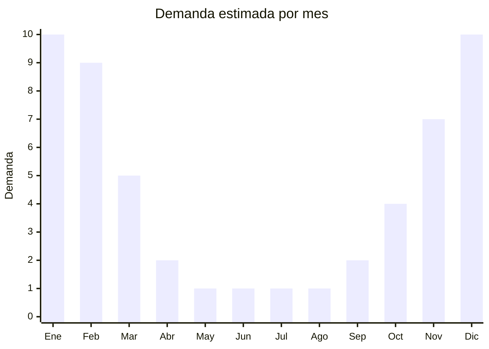

# Salidas de baño y kimonos playeros

> **Capítulo NCM 63** — Los demás artículos textiles confeccionados | **Temporada:** Verano (Dic–Feb)

## Qué es y por qué importarlo

Las salidas de baño (también llamadas cover-ups, kimonos playeros o pareos confeccionados) son prendas exteriores livianas diseñadas para cubrir el traje de baño al salir de la pileta o el mar. A diferencia de las prendas de vestir convencionales (Cap. 61-62), las salidas de baño confeccionadas en telas no tejidas, gasa, voile o telas técnicas pueden clasificarse en el Cap. 63 como artículos textiles confeccionados, siempre que su confección y acabado correspondan a esta clasificación.

Estas prendas son predominantemente femeninas y se fabrican en materiales ultra livianos como gasa de poliéster, voile de algodón, viscosa liviana, tul o encaje. Su función es estética y práctica: cubren del sol, dan privacidad y funcionan como complemento de moda playera. China, especialmente Yiwu y Guangzhou, produce millones de cover-ups por temporada a precios FOB extremadamente competitivos (USD 2-5).

La gran ventaja de clasificar estos artículos en el Cap. 63 es que **no tienen antidumping**, a diferencia de las prendas de vestir de los capítulos 61 y 62. Esto reduce significativamente el costo de importación y simplifica el trámite aduanero.

<Note>
**SIN ANTIDUMPING en Cap. 63:** Las salidas de baño clasificadas como artículos textiles confeccionados del Cap. 63 no están sujetas a derechos antidumping. Esto representa una ventaja significativa frente a las prendas de vestir de los capítulos 61 y 62. Es fundamental que la clasificación arancelaria sea correcta para beneficiarse de este régimen.
</Note>

## Datos clave

| Dato | Valor |
|------|-------|
| **Posiciones NCM típicas** | 6307.90.90 (los demás artículos confeccionados), verificar clasificación exacta con despachante |
| **Derecho de importación** | 20 — 26% (DIE) + 3% tasa estadística (según NCM exacta) |
| **Antidumping** | **No (en Cap. 63)** |
| **Rango FOB típico** | USD 2.00 — USD 5.00 por unidad |
| **Precio de venta en Argentina** | ARS 5.000 — ARS 15.000 |
| **Margen bruto estimado** | 200% — 350% |
| **MOQ típico** | 200 — 500 unidades |
| **Demanda en MercadoLibre** | Alta (estacional, femenino) |
| **Competencia en MercadoLibre** | Media |
| **Dificultad para importar** | Fácil-Media (clasificación arancelaria clave) |
| **Certificaciones necesarias** | Etiquetado textil básico |

## Variantes y subtipos más comunes

| Subtipo / Variante | FOB aprox. | Venta AR aprox. | Nota |
|--------------------|-----------|-----------------|------|
| Kimono gasa estampado | USD 2.00 — 4.00 | ARS 5.000 — 12.000 | **Más vendido**, versátil |
| Pareo/sarong confeccionado | USD 2.00 — 3.00 | ARS 5.000 — 8.000 | Clásico, multifunción |
| Cover-up largo tipo túnica | USD 3.00 — 5.00 | ARS 8.000 — 15.000 | Elegante, cobertura completa |
| Salida de baño encaje/crochet | USD 3.00 — 5.00 | ARS 8.000 — 15.000 | Tendencia boho/romántica |
| Cover-up con flecos | USD 2.50 — 4.00 | ARS 6.000 — 12.000 | Detalle decorativo, Instagram |

## Regulaciones y requisitos

<Tabs>
  <Tab title="Certificaciones">
    | Organismo | Requiere | Detalle |
    |-----------|----------|---------|
    | ARCA (Aduana) | Sí siempre | Despacho estándar |
    | CNCE (Antidumping) | No (en Cap. 63) | Sin antidumping para artículos confeccionados del Cap. 63 |
    | ANMAT | No | No aplica |
    | ENACOM | No | No aplica |

    **Recomendación crítica:** La clasificación arancelaria de las salidas de baño es un área gris. Algunos despachantes pueden clasificarlas como prenda de vestir (Cap. 61 o 62, con antidumping), y otros como artículo textil confeccionado (Cap. 63, sin antidumping). Trabajar con un despachante experimentado en textiles y tener documentación que respalde la clasificación en Cap. 63 (descripción del producto como "artículo confeccionado para playa" y no como "prenda de vestir").
  </Tab>

  <Tab title="Etiquetado">
    | Requisito | Aplica |
    |-----------|--------|
    | Idioma español | Sí (obligatorio) |
    | Datos del importador | Sí (razón social, CUIT, domicilio) |
    | Composición de fibras (%) | Sí (ej: 100% poliéster, o 100% viscosa) |
    | Talle / medidas | Recomendado (talle único en la mayoría) |
    | País de origen | Sí |
    | Instrucciones de lavado | Sí (símbolos ISO) |
    | Garantía legal 6 meses | Sí |

    El etiquetado para artículos del Cap. 63 es más simple que para prendas de vestir. No se aplica estrictamente IRAM 12560 como para indumentaria, pero igualmente se debe indicar composición, origen y datos del importador.
  </Tab>

  <Tab title="Restricciones">
    **Sin antidumping ni restricciones especiales en Cap. 63.** Sin embargo, la clasificación arancelaria correcta es fundamental.

    **Riesgo de reclasificación:** Si la aduana considera que el producto es una prenda de vestir (Cap. 61 o 62), puede reclasificarlo con el consiguiente antidumping y arancel más alto. Para minimizar este riesgo:
    - Describir el producto como "salida de baño confeccionada" o "artículo textil playero" en la factura comercial
    - Evitar descripciones como "vestido", "kimono" o "túnica" que sugieran prenda de vestir
    - Incluir fotos del producto en contexto de playa/pileta
  </Tab>
</Tabs>

## Logística

| Dato | Valor |
|------|-------|
| **Peso típico por unidad** | 0.08 — 0.20 kg |
| **Volumen típico** | Muy bajo (telas ultra livianas, altísima densidad por caja) |
| **Fragilidad** | Nula |
| **Envío recomendado** | Aéreo o marítimo LCL |
| **Tiempo total estimado** | 25 — 40 días (aéreo) / 50 — 75 días (marítimo) |
| **Baterías de litio** | No |
| **Requiere empaque especial** | No (bolsa individual con hang tag) |

<Tip>
Las salidas de baño son probablemente el producto textil con **mejor ratio valor/peso/volumen** para importar. Un cartón de 60x40x30 cm puede contener más de 200 unidades de kimonos de gasa. Esto hace que el envío aéreo sea absolutamente viable y económico, permitiendo reposiciones rápidas en plena temporada cuando se agota el stock.
</Tip>

## Estacionalidad



| Aspecto | Detalle |
|---------|---------|
| **Meses pico** | Diciembre-Febrero (verano, playa, pileta, vacaciones) |
| **Meses valle** | Mayo-Agosto (sin demanda, fuera de temporada) |
| **Cuándo pedir** | Agosto-Septiembre para stock en noviembre |

## Ventajas y riesgos

<CardGroup cols={2}>
  <Card title="Ventajas" icon="circle-check">
    - **Sin antidumping en Cap. 63** — ventaja competitiva enorme
    - Ultra liviano: mejor ratio valor/peso del rubro textil
    - MOQ bajo y precio FOB accesible
    - Talle único (mayoría de modelos), simplifica inventario
    - Alta demanda femenina en temporada
  </Card>
  <Card title="Riesgos" icon="triangle-exclamation">
    - Riesgo de reclasificación arancelaria (Cap. 61/62 con antidumping)
    - Estacionalidad extrema: fuera de verano no se vende
    - Telas ultra livianas pueden percibirse como baja calidad
    - Calidad de costuras variable en modelos baratos
    - Competencia creciente (producto fácil de copiar)
  </Card>
</CardGroup>

## Palabras clave para buscar en Alibaba

```
beach cover up wholesale, kimono beach women, sarong cover up wholesale,
chiffon beach dress cover, lace cover up swimwear, beach pareo wholesale,
tassel beach cover up, Yiwu beach cover up factory, women swimsuit cover
```

## Fuentes

- [MercadoLibre Argentina — Salidas de baño](https://listado.mercadolibre.com.ar/salida-de-bano)
- [Alibaba — Beach cover up wholesale](https://www.alibaba.com/showroom/beach-cover-up.html)
- [CNCE — Nomenclatura arancelaria](https://www.argentina.gob.ar/cnce)
