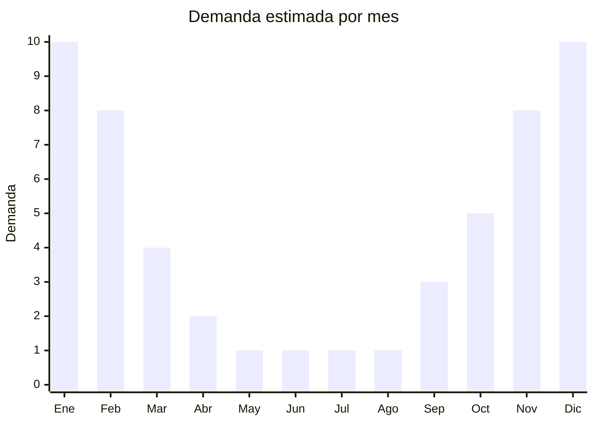

# Toallas y toallones de playa

> **Capítulo NCM 63** — Los demás artículos textiles confeccionados | **Temporada:** Verano (Dic–Feb)

## Qué es y por qué importarlo

Las toallas y toallones de playa son artículos textiles confeccionados de gran tamaño (típicamente 80x160 cm o 90x180 cm), fabricados en algodón rizo (terry), terciopelo de algodón o microfibra, diseñados para uso en playa, pileta y actividades al aire libre. A diferencia de las toallas de baño convencionales, las de playa se caracterizan por sus estampados coloridos, mayor tamaño y, en muchos casos, por un diseño decorativo que funciona como tendido para tomar sol.

Nantong (provincia de Jiangsu, China) es reconocida como la capital mundial de la blanquería y toallas, concentrando cientos de fábricas que producen para marcas globales. Las toallas de playa chinas ofrecen excelente relación calidad-precio, desde modelos básicos de algodón a USD 2 FOB hasta toallones premium de terciopelo reactivo a USD 8 FOB. En Argentina, marcas como Pinamar, Espalma, Jean Cartier y Palette dominan el mercado a precios de ARS 10.000-25.000, dejando espacio para importadores que ofrezcan diseños atractivos a precios competitivos.

Una ventaja clave de las toallas de playa es que se clasifican en el Capítulo 63, que **no tiene antidumping** para este tipo de artículos textiles confeccionados, haciéndolo significativamente más viable que importar prendas de los capítulos 61 y 62.

<Note>
**SIN ANTIDUMPING:** Las toallas de playa del Cap. 63 no están sujetas a derechos antidumping, lo que las hace mucho más viables para importar desde China que las prendas de vestir de los capítulos 61 y 62. Esto representa una ventaja competitiva significativa.
</Note>

## Datos clave

| Dato | Valor |
|------|-------|
| **Posiciones NCM típicas** | 6302.60.00 (ropa de tocador y cocina, de tejido de toalla con bucles, de algodón), 6302.91.00 (las demás, de algodón) |
| **Derecho de importación** | 26% (DIE) + 3% tasa estadística |
| **Antidumping** | **No** |
| **Rango FOB típico** | USD 2.00 — USD 8.00 por unidad |
| **Precio de venta en Argentina** | ARS 5.000 — ARS 20.000 |
| **Margen bruto estimado** | 150% — 300% |
| **MOQ típico** | 200 — 1.000 unidades |
| **Demanda en MercadoLibre** | Muy Alta (estacional) |
| **Competencia en MercadoLibre** | Media-Alta |
| **Dificultad para importar** | Fácil-Media |
| **Certificaciones necesarias** | Etiquetado textil básico |

## Variantes y subtipos más comunes

| Subtipo / Variante | FOB aprox. | Venta AR aprox. | Nota |
|--------------------|-----------|-----------------|------|
| Toalla algodón rizo 80x160 cm | USD 2.00 — 4.00 | ARS 5.000 — 10.000 | Básica, alto volumen |
| Toallón terciopelo reactivo 90x180 cm | USD 4.00 — 7.00 | ARS 10.000 — 18.000 | **Más vendido**, estampado vívido |
| Toalla redonda con flecos | USD 3.50 — 6.00 | ARS 8.000 — 15.000 | Tendencia decorativa/Instagram |
| Toalla microfibra compacta | USD 2.00 — 4.00 | ARS 5.000 — 12.000 | Secado rápido, viajeros |
| Toallón familiar XXL 100x200 cm | USD 5.00 — 8.00 | ARS 12.000 — 20.000 | Premium, tamaño extra |

## Regulaciones y requisitos

<Tabs>
  <Tab title="Certificaciones">
    | Organismo | Requiere | Detalle |
    |-----------|----------|---------|
    | ARCA (Aduana) | Sí siempre | Despacho estándar |
    | CNCE (Antidumping) | No | **No hay antidumping para toallas del Cap. 63** |
    | ANMAT | No | No aplica |
    | ENACOM | No | No aplica |

    **Recomendación:** Solicitar al proveedor de Nantong certificado de composición de fibras y test de solidez del color (color fastness). Las toallas de playa se lavan frecuentemente y se exponen al sol, cloro y agua salada; un buen test de solidez (nivel 4-5) garantiza que los estampados no destiñan prematuramente.
  </Tab>

  <Tab title="Etiquetado">
    | Requisito | Aplica |
    |-----------|--------|
    | Idioma español | Sí (obligatorio) |
    | Datos del importador | Sí (razón social, CUIT, domicilio) |
    | Composición de fibras (%) | Sí (ej: 100% algodón, o 80% algodón 20% poliéster) |
    | Dimensiones | Recomendado (indicar cm) |
    | País de origen | Sí |
    | Instrucciones de lavado | Sí (símbolos ISO) |
    | Garantía legal 6 meses | Sí |

    El etiquetado textil para artículos confeccionados del Cap. 63 es más simple que para prendas de vestir. No requiere talles ni se aplica la normativa IRAM 12560 de indumentaria, pero sí debe indicar composición, origen y datos del importador.
  </Tab>

  <Tab title="Restricciones">
    **Sin antidumping ni licencias especiales.** Las toallas de playa del Cap. 63 tienen un régimen de importación significativamente más simple que las prendas de vestir.

    **Atención al gramaje:** Toallas de algodón con gramaje inferior a 300 g/m2 pueden sentirse delgadas y generar reclamos de clientes. Para playa se recomienda mínimo 350-400 g/m2 en algodón rizo para una buena percepción de calidad.
  </Tab>
</Tabs>

## Logística

| Dato | Valor |
|------|-------|
| **Peso típico por unidad** | 0.40 — 0.80 kg |
| **Volumen típico** | Medio (toallas enrolladas o dobladas, moderado CBM) |
| **Fragilidad** | Nula |
| **Envío recomendado** | Marítimo LCL o FCL según volumen |
| **Tiempo total estimado** | 50 — 80 días (marítimo) |
| **Baterías de litio** | No |
| **Requiere empaque especial** | No (bolsa individual con fajon/etiqueta) |

<Tip>
Las toallas de playa de **terciopelo reactivo** (reactive printed velour) son las que tienen los estampados más vívidos y detallados, similares a una impresión fotográfica. El costo FOB es mayor que el rizo estampado, pero el valor percibido y el precio de venta son significativamente superiores. Es el formato preferido para diseños de marcas y licencias.
</Tip>

## Estacionalidad



| Aspecto | Detalle |
|---------|---------|
| **Meses pico** | Diciembre-Febrero (verano, playa, pileta, vacaciones) |
| **Meses valle** | Mayo-Agosto (invierno, mínima demanda) |
| **Cuándo pedir** | Julio-Agosto para stock disponible en noviembre |

## Ventajas y riesgos

<CardGroup cols={2}>
  <Card title="Ventajas" icon="circle-check">
    - **Sin antidumping** — mucho más viable que Cap. 61/62
    - Demanda masiva y predecible en verano
    - Producto robusto, no se daña en transporte
    - Ideal para marca propia con diseños exclusivos
    - Compra recurrente (reposición cada 1-2 temporadas)
  </Card>
  <Card title="Riesgos" icon="triangle-exclamation">
    - Estacionalidad marcada: stock sobrante hasta siguiente verano
    - Peso mayor que prendas: flete proporcionalmente más caro
    - Calidad de algodón variable (gramaje, suavidad)
    - Estampados pueden desteñir en modelos baratos
    - Competencia con marcas posicionadas (Pinamar, Espalma)
  </Card>
</CardGroup>

## Palabras clave para buscar en Alibaba

```
beach towel wholesale, beach towel cotton terry, large beach towel 180cm,
reactive printed beach towel, velour beach towel bulk, microfiber beach towel,
round beach towel wholesale, Nantong towel factory, custom beach towel OEM
```

## Fuentes

- [MercadoLibre Argentina — Toallas de playa](https://listado.mercadolibre.com.ar/toalla-playa)
- [Alibaba — Beach towel wholesale](https://www.alibaba.com/showroom/beach-towel-wholesale.html)
- [CNCE — Nomenclatura arancelaria](https://www.argentina.gob.ar/cnce)
