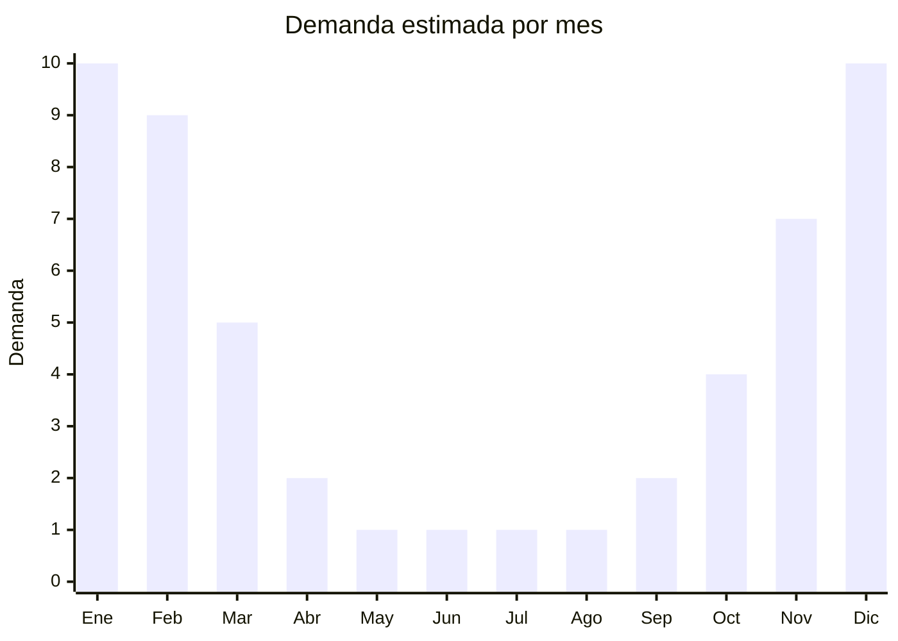

# Calzado acuático (aqua shoes)

> **Capítulo NCM 64** — Calzado, sus partes y accesorios | **Temporada:** Verano (Dic–Feb)

## Qué es y por qué importarlo

El calzado acuático (también conocido como aqua shoes, water shoes o escarpines) es un tipo de calzado ligero fabricado con neopreno, malla sintética y suela de caucho/TPR, diseñado para usarse dentro y fuera del agua. Protege los pies de rocas filosas, corales, erizos y superficies calientes, siendo ideal para playa, pileta, kayak, snorkel, trekking en arroyos y deportes acuáticos en general.

Es un nicho creciente en Argentina, impulsado por el turismo de naturaleza, el crecimiento del paddle surf, kayak y actividades al aire libre. A diferencia de las ojotas tradicionales, el calzado acuático ofrece un diferencial claro: protección y agarre en superficies mojadas y resbaladizas. Los hubs productivos están concentrados en Jinjiang (Fujian, China), la misma zona que produce calzado deportivo para marcas globales.

El FOB va de USD 1.00 a USD 5.00, con precios de venta en Argentina entre ARS 5,000 y ARS 15,000. El margen es atractivo porque el producto aún no está masificado y la competencia es menor que en ojotas. Sin embargo, como todo calzado de origen chino, es fundamental verificar la posición NCM y el antidumping aplicable antes de presupuestar la operación.

## Datos clave

| Dato | Valor |
|------|-------|
| **Posiciones NCM típicas** | 6404.19 (calzado con suela de caucho/plástico y parte superior textil), 6402.99 (si predomina caucho/plástico en el corte) |
| **Derecho de importación** | 20% (DIE, reducido por Decreto 236/2025, antes 35%) + 3% tasa estadística |
| **Antidumping** | SI — Verificar por NCM exacta. Calzado de China tiene derechos antidumping vigentes. La clasificación depende del material predominante en la capellada (textil vs. caucho/plástico) |
| **Rango FOB típico** | USD 1.00 — USD 5.00 por par |
| **Precio de venta en Argentina** | ARS 5,000 — ARS 15,000 |
| **Margen bruto estimado** | 120% — 280% (depende fuertemente del antidumping aplicable) |
| **MOQ típico** | 200 — 600 pares (curva de talles) |
| **Demanda en MercadoLibre** | Media-Alta (nicho en crecimiento) |
| **Competencia en MercadoLibre** | Media (menos saturado que ojotas) |
| **Dificultad para importar** | Media-Alta (antidumping + etiquetado INTI) |
| **Certificaciones necesarias** | Etiquetado INTI obligatorio |

## Variantes y subtipos más comunes

| Subtipo / Variante | FOB aprox. | Venta AR aprox. | Nota |
|--------------------|-----------|-----------------|------|
| Escarpín neopreno básico slip-on | USD 1.00 — 2.00 | ARS 5,000 — 8,000 | Económico, más vendido |
| Aqua shoe malla + suela gruesa | USD 2.00 — 3.50 | ARS 7,000 — 12,000 | **Más versátil**, uso mixto agua/tierra |
| Calzado acuático con cordón/ajuste | USD 3.00 — 5.00 | ARS 10,000 — 15,000 | Premium, mejor sujeción |
| Aqua shoe infantil | USD 1.00 — 2.50 | ARS 4,000 — 8,000 | Alta demanda padres, protección niños |
| Aqua shoe estilo sandalia híbrida | USD 2.50 — 4.00 | ARS 8,000 — 13,000 | Drenaje rápido, look deportivo |

## Regulaciones y requisitos

<Tabs>
  <Tab title="Certificaciones">
    | Organismo | Requiere | Detalle |
    |-----------|----------|---------|
    | ARCA (Aduana) | Sí siempre | Despacho estándar + intervención por antidumping |
    | INTI (etiquetado) | Sí obligatorio | Resolución 287/2000 — Calzado tiene etiquetado técnico obligatorio |
    | ANMAT | No | No aplica |
    | ENACOM | No | No es electrónico |

    **Recomendación:** El calzado acuático puede clasificar en diferentes NCM según el material predominante de la capellada (neopreno/textil vs. caucho/plástico). Esta diferencia puede implicar antidumping distinto. Consultar con despachante antes de comprar.
  </Tab>

  <Tab title="Etiquetado INTI">
    El etiquetado de calzado en Argentina es obligatorio y controlado por INTI. Cada par debe incluir:

    | Requisito | Aplica |
    |-----------|--------|
    | Material del corte (capellada) | Sí — Ej: "Neopreno", "Textil sintético", "Malla poliéster" |
    | Material de la suela | Sí — Ej: "Caucho", "TPR" |
    | Material del forro | Sí — Ej: "Sin forro", "Neopreno" |
    | Talle argentino | Sí — Tabla de equivalencia obligatoria |
    | País de origen | Sí — "Industria China" / "Made in China" |
    | Datos del importador | Sí — Razón social, CUIT, dirección |
    | Idioma español | Sí |

    <Warning>
    El etiquetado debe estar adherido al producto ANTES del despacho de aduana. Si llega sin etiquetas, deberá contratar etiquetado en depósito fiscal, lo que suma costos y demoras (USD 0.15-0.30 por par + días de almacenaje).
    </Warning>
  </Tab>

  <Tab title="Antidumping">
    El calzado importado de China tiene derechos antidumping vigentes en Argentina. Puntos críticos para calzado acuático:

    - Los derechos antidumping son **adicionales** al arancel de importación del 20%
    - La clasificación NCM del calzado acuático depende del material predominante en la capellada:
      - Si es **textil** (neopreno, malla): NCM 6404.xx — puede tener antidumping diferente
      - Si es **caucho/plástico**: NCM 6402.xx — verificar antidumping específico
    - El antidumping se actualiza periódicamente; verificar resoluciones vigentes de la CNCE
    - Algunos proveedores chinos tienen antidumping diferenciado si están en la lista de empresas cooperantes

    <Warning>
    NUNCA presupuestar una importación de calzado sin confirmar el antidumping exacto para la NCM del producto. La clasificación del calzado acuático es especialmente ambigua por la combinación de materiales. Consultar con despachante de aduanas especializado en calzado.
    </Warning>
  </Tab>
</Tabs>

## Logística

| Dato | Valor |
|------|-------|
| **Peso típico por par** | 0.10 — 0.30 kg |
| **Volumen típico** | Bajo (se comprimen y apilan eficientemente) |
| **Fragilidad** | Muy baja (neopreno/malla flexible) |
| **Envío recomendado** | Marítimo LCL o consolidado |
| **Tiempo total estimado** | 50 — 80 días (marítimo desde China) |
| **Baterías de litio** | No |
| **Requiere empaque especial** | No, bolsa individual por par suficiente |

<Tip>
El calzado acuático es uno de los productos más eficientes en CBM dentro de la categoría calzado: son livianos, flexibles y se comprimen. Se pueden empacar hasta 60-80 pares por caja master sin deformarse. Aprovechar esta ventaja logística para mejorar el costo de flete por unidad.
</Tip>

## Estacionalidad



| Aspecto | Detalle |
|---------|---------|
| **Meses pico** | Diciembre-Febrero (verano, vacaciones, turismo acuático) |
| **Meses valle** | Mayo-Agosto (invierno, sin actividades acuáticas) |
| **Cuándo pedir** | Junio-Julio para tener stock en octubre-noviembre (pre-temporada) |

## Ventajas y riesgos

<CardGroup cols={2}>
  <Card title="Ventajas" icon="circle-check">
    - Nicho creciente, menos saturado que ojotas
    - FOB bajo con buen margen de venta
    - Producto ultraliviano, flete eficiente
    - Diferencial claro vs. calzado de playa común
    - Ideal para marca propia (impresión sublimación)
    - Tendencia global de turismo aventura y deportes acuáticos
  </Card>
  <Card title="Riesgos" icon="triangle-exclamation">
    - Antidumping sobre calzado chino puede duplicar/triplicar costos
    - Clasificación NCM ambigua por mezcla de materiales
    - Etiquetado INTI obligatorio suma complejidad y costo
    - Estacional: stock no vendido queda hasta próximo verano
    - Producto menos conocido: requiere educar al comprador
    - Curva de talles: riesgo de quedar con talles sin vender
  </Card>
</CardGroup>

## Palabras clave para buscar en Alibaba

```
water shoes wholesale, aqua shoes neoprene, beach water shoes bulk,
swimming shoes factory, barefoot water shoes wholesale, diving shoes neoprene,
quick dry water shoes, aqua socks wholesale, reef shoes bulk order
```

## Fuentes

- [MercadoLibre Argentina — Calzado acuático](https://listado.mercadolibre.com.ar/calzado-acuatico)
- [Alibaba — Water shoes wholesale](https://www.alibaba.com/showroom/water-shoes.html)
- [CNCE — Medidas antidumping vigentes calzado](https://www.argentina.gob.ar/cnce)
- [INTI — Etiquetado de calzado](https://www.inti.gob.ar)
