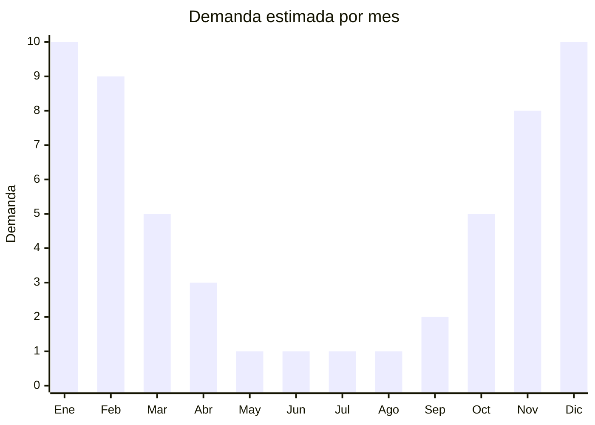

# Ojotas y sandalias de playa/pileta

> **Capítulo NCM 64** — Calzado, sus partes y accesorios | **Temporada:** Verano (Dic–Feb)

## Qué es y por qué importarlo

Las ojotas y sandalias de playa (también llamadas chancletas, chinelas o flip-flops) son calzado abierto de EVA, caucho o PVC diseñado para uso en playa, pileta, duchas y actividades casuales de verano. Son uno de los productos de mayor rotación estacional en Argentina: la demanda se multiplica entre 3 y 5 veces entre noviembre y febrero, con más de 30,000 resultados activos en MercadoLibre.

China concentra la producción mundial de ojotas económicas, con hubs en Fujian (Jinjiang, Quanzhou) y Guangdong. Las fábricas chinas producen tanto para marcas globales como Havaianas, Ipanema, Rider y Topper, como modelos genéricos de marca blanca a una fracción del costo. Un par de ojotas de EVA se consigue FOB desde USD 1.00, con precios de venta en Argentina de ARS 3,000 a 15,000 según calidad y presentación.

La gran ventaja es el volumen de mercado y la recurrencia: las ojotas son un producto de reemplazo frecuente, se compran por impulso y en múltiples pares. Sin embargo, el importador debe prestar especial atención al antidumping vigente sobre calzado de origen chino, que puede duplicar o triplicar el costo de importación dependiendo de la posición NCM exacta. Las ojotas de EVA/caucho suelen tener menor antidumping que el calzado deportivo, pero es imprescindible verificar la posición NCM específica antes de operar.

## Datos clave

| Dato | Valor |
|------|-------|
| **Posiciones NCM típicas** | 6402.99 (calzado con suela y parte superior de caucho/plástico), 6402.20.00 (calzado con tiras/bridas fijadas a la suela por tetones) |
| **Derecho de importación** | 20% (DIE, reducido por Decreto 236/2025, antes 35%) + 3% tasa estadística |
| **Antidumping** | SI — Verificar por NCM. Calzado de China tiene derechos antidumping vigentes que pueden sumar 20%-100%+ al costo. Ojotas EVA/caucho suelen tener menor incidencia que calzado deportivo, pero CONFIRMAR antes de importar |
| **Rango FOB típico** | USD 1.00 — USD 4.00 por par |
| **Precio de venta en Argentina** | ARS 3,000 — ARS 15,000 |
| **Margen bruto estimado** | 100% — 250% (depende fuertemente del antidumping aplicable) |
| **MOQ típico** | 300 — 1,000 pares (curva de talles) |
| **Demanda en MercadoLibre** | Muy Alta — 30,000+ resultados activos |
| **Competencia en MercadoLibre** | Alta (marcas + genéricos) |
| **Dificultad para importar** | Media-Alta (antidumping + etiquetado INTI) |
| **Certificaciones necesarias** | Etiquetado INTI obligatorio |

## Variantes y subtipos más comunes

| Subtipo / Variante | FOB aprox. | Venta AR aprox. | Nota |
|--------------------|-----------|-----------------|------|
| Ojota EVA lisa básica | USD 1.00 — 1.50 | ARS 3,000 — 5,000 | Masiva, menor margen unitario |
| Ojota con logo/estampado | USD 1.50 — 2.50 | ARS 5,000 — 8,000 | **Más vendida**, ideal marca propia |
| Sandalia birkenstock-style EVA | USD 2.00 — 3.50 | ARS 8,000 — 12,000 | Tendencia creciente |
| Sandalia playa con tiras | USD 2.50 — 4.00 | ARS 8,000 — 15,000 | Mujer, mayor margen |
| Ojota infantil con diseño | USD 1.00 — 2.00 | ARS 3,000 — 7,000 | Talles chicos, alta rotación |

## Regulaciones y requisitos

<Tabs>
  <Tab title="Certificaciones">
    | Organismo | Requiere | Detalle |
    |-----------|----------|---------|
    | ARCA (Aduana) | Sí siempre | Despacho estándar + intervención por antidumping |
    | INTI (etiquetado) | Sí obligatorio | Resolución 287/2000 — Calzado tiene etiquetado técnico obligatorio |
    | ANMAT | No | No aplica |
    | ENACOM | No | No es electrónico |

    **Recomendación:** Antes de cerrar la compra con el proveedor, consultar con un despachante de aduanas la posición NCM exacta del modelo a importar y verificar el derecho antidumping vigente. Un error en la clasificación puede significar pagar el doble de lo presupuestado.
  </Tab>

  <Tab title="Etiquetado INTI">
    El etiquetado de calzado en Argentina es obligatorio y controlado por INTI. Cada par debe incluir:

    | Requisito | Aplica |
    |-----------|--------|
    | Material del corte (capellada) | Sí — Ej: "EVA", "PVC", "Caucho" |
    | Material de la suela | Sí — Ej: "EVA", "Caucho" |
    | Material del forro | Sí — Ej: "Sin forro", "Textil" |
    | Talle argentino | Sí — Tabla de equivalencia obligatoria |
    | País de origen | Sí — "Industria China" / "Made in China" |
    | Datos del importador | Sí — Razón social, CUIT, dirección |
    | Idioma español | Sí |

    <Warning>
    El etiquetado debe estar adherido al producto ANTES del despacho de aduana. Si llega sin etiquetas, deberá contratar etiquetado en depósito fiscal, lo que suma costos y demoras (USD 0.15-0.30 por par + días de almacenaje).
    </Warning>
  </Tab>

  <Tab title="Antidumping">
    El calzado importado de China tiene derechos antidumping vigentes en Argentina. Este es el punto más crítico de la operación:

    - Los derechos antidumping son **adicionales** al arancel de importación del 20%
    - Pueden representar entre un 20% y más del 100% sobre el valor FOB, dependiendo del NCM
    - Las ojotas de EVA/caucho (NCM 6402.xx) suelen tener **menor** incidencia que el calzado deportivo, pero varía según la posición exacta
    - El antidumping se actualiza periódicamente; verificar resoluciones vigentes de la Comisión Nacional de Comercio Exterior (CNCE)
    - Algunos proveedores chinos tienen antidumping diferenciado (menor) si están en la lista de empresas cooperantes

    <Warning>
    NUNCA presupuestar una importación de calzado sin confirmar el antidumping exacto para la NCM del producto. Consultar con despachante de aduanas especializado en calzado. Un error puede convertir una operación rentable en una pérdida.
    </Warning>
  </Tab>
</Tabs>

## Logística

| Dato | Valor |
|------|-------|
| **Peso típico por par** | 0.15 — 0.40 kg |
| **Volumen típico** | Bajo-Medio (se apilan bien en cajas) |
| **Fragilidad** | Muy baja (EVA/caucho flexible) |
| **Envío recomendado** | Marítimo LCL o FCL según volumen |
| **Tiempo total estimado** | 50 — 80 días (marítimo desde China) |
| **Baterías de litio** | No |
| **Requiere empaque especial** | No, pero pedir bolsa individual por par |

<Tip>
Las ojotas son livianas pero voluminosas si se embalan mal. Pedir al proveedor que envíe en cajas con pares apilados (no en cajas individuales tipo retail) para reducir CBM hasta un 30%. El packaging de venta se puede agregar localmente con bolsas impresas con marca propia a bajo costo.
</Tip>

## Estacionalidad



| Aspecto | Detalle |
|---------|---------|
| **Meses pico** | Noviembre-Febrero (verano, vacaciones, playa, pileta) |
| **Meses valle** | Mayo-Agosto (invierno, demanda casi nula) |
| **Cuándo pedir** | Junio-Julio para tener stock en octubre-noviembre (pre-temporada) |

## Ventajas y riesgos

<CardGroup cols={2}>
  <Card title="Ventajas" icon="circle-check">
    - Demanda masiva y predecible en verano (x3-5)
    - FOB muy bajo, alta rotación
    - Producto liviano y resistente al transporte
    - Ideal para marca propia (impresión en plantilla/tira)
    - Compra recurrente (se desgastan, se pierden, moda)
    - Decreto 236/2025 redujo arancel de 35% a 20%
  </Card>
  <Card title="Riesgos" icon="triangle-exclamation">
    - Antidumping sobre calzado chino puede duplicar/triplicar costos
    - Etiquetado INTI obligatorio suma complejidad y costo
    - Muy estacional: stock no vendido queda hasta próximo verano
    - Alta competencia de marcas posicionadas (Havaianas, Rider)
    - Curva de talles: riesgo de quedar con talles extremos sin vender
    - Calidad variable en EVA barato (se deforma, pierde color)
  </Card>
</CardGroup>

## Palabras clave para buscar en Alibaba

```
EVA flip flops wholesale, rubber slippers bulk, beach sandals wholesale,
PVC flip flops factory, custom logo flip flops, EVA slides wholesale,
pool slippers bulk order, birkenstock style EVA sandals wholesale
```

## Fuentes

- [MercadoLibre Argentina — Ojotas](https://listado.mercadolibre.com.ar/ojotas)
- [Alibaba — EVA flip flops wholesale](https://www.alibaba.com/showroom/eva-flip-flops.html)
- [CNCE — Medidas antidumping vigentes calzado](https://www.argentina.gob.ar/cnce)
- [INTI — Etiquetado de calzado](https://www.inti.gob.ar)
