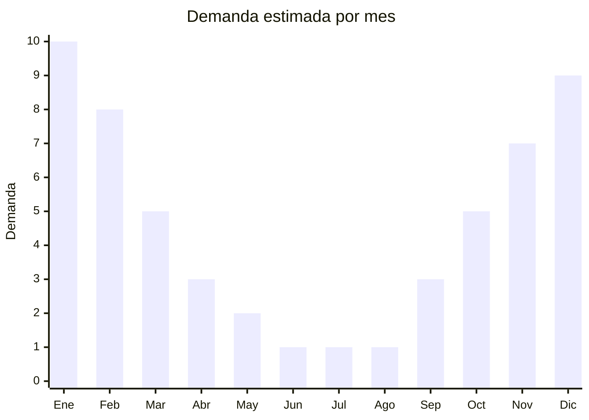

# Sandalias deportivas y outdoor

> **Capítulo NCM 64** — Calzado, sus partes y accesorios | **Temporada:** Verano (Dic–Feb)

## Qué es y por qué importarlo

Las sandalias deportivas (también llamadas sandalias outdoor, de trekking o tipo aventura) son calzado abierto con suela gruesa de caucho/EVA con agarre, sistema de correas ajustables con velcro o hebillas, y diseño pensado para caminatas, trekking liviano, ríos, camping y uso urbano casual. Las referencias premium del mercado son marcas como Teva, Keen, Merrell y Columbia, cuyos modelos se venden en Argentina entre ARS 50,000 y ARS 120,000.

Los genéricos chinos ofrecen diseños similares con calidad competitiva a un FOB de USD 3.00 a USD 10.00, permitiendo precios de venta en Argentina de ARS 10,000 a ARS 30,000, muy por debajo de las marcas premium. Las fábricas de Jinjiang y Quanzhou (Fujian) producen para marcas de segundo nivel globales y tienen capacidad para marca propia (OEM/ODM).

Este producto combina estacionalidad de verano con una ventana de demanda más amplia que las ojotas: se usan desde octubre hasta abril y también en viajes/turismo todo el año. El ticket promedio es más alto que ojotas y calzado acuático, lo que mejora el margen por unidad. Sin embargo, como todo calzado de origen chino, está sujeto a derechos antidumping que deben verificarse cuidadosamente por NCM antes de operar.

## Datos clave

| Dato | Valor |
|------|-------|
| **Posiciones NCM típicas** | 6402.99 (suela y parte superior de caucho/plástico), 6404.19 (suela caucho/plástico con parte superior textil) |
| **Derecho de importación** | 20% (DIE, reducido por Decreto 236/2025, antes 35%) + 3% tasa estadística |
| **Antidumping** | SI — Verificar por NCM exacta. Calzado de China tiene derechos antidumping vigentes que pueden sumar porcentajes significativos al costo. Confirmar antes de importar |
| **Rango FOB típico** | USD 3.00 — USD 10.00 por par |
| **Precio de venta en Argentina** | ARS 10,000 — ARS 30,000 |
| **Margen bruto estimado** | 100% — 200% (depende fuertemente del antidumping aplicable) |
| **MOQ típico** | 200 — 500 pares (curva de talles) |
| **Demanda en MercadoLibre** | Alta (creciente por tendencia outdoor) |
| **Competencia en MercadoLibre** | Media (marcas premium caras, espacio para genéricos) |
| **Dificultad para importar** | Media-Alta (antidumping + etiquetado INTI) |
| **Certificaciones necesarias** | Etiquetado INTI obligatorio |

## Variantes y subtipos más comunes

| Subtipo / Variante | FOB aprox. | Venta AR aprox. | Nota |
|--------------------|-----------|-----------------|------|
| Sandalia deportiva básica velcro | USD 3.00 — 5.00 | ARS 10,000 — 15,000 | Entrada, mayor volumen |
| Sandalia trekking 3 correas ajustables | USD 4.00 — 7.00 | ARS 13,000 — 22,000 | **Más vendida**, estilo Teva |
| Sandalia outdoor con puntera cerrada | USD 5.00 — 8.00 | ARS 18,000 — 25,000 | Estilo Keen, mayor protección |
| Sandalia deportiva con plantilla memory foam | USD 6.00 — 10.00 | ARS 20,000 — 30,000 | Premium, confort superior |
| Sandalia outdoor infantil/juvenil | USD 3.00 — 5.00 | ARS 8,000 — 15,000 | Padres buscan calidad/protección |

## Regulaciones y requisitos

<Tabs>
  <Tab title="Certificaciones">
    | Organismo | Requiere | Detalle |
    |-----------|----------|---------|
    | ARCA (Aduana) | Sí siempre | Despacho estándar + intervención por antidumping |
    | INTI (etiquetado) | Sí obligatorio | Resolución 287/2000 — Calzado tiene etiquetado técnico obligatorio |
    | ANMAT | No | No aplica |
    | ENACOM | No | No es electrónico |

    **Recomendación:** Las sandalias deportivas con combinación de materiales (textil + caucho + EVA) pueden clasificar en diferentes posiciones NCM, cada una con distinto antidumping. Solicitar al proveedor ficha técnica detallada con porcentaje de materiales para que el despachante clasifique correctamente.
  </Tab>

  <Tab title="Etiquetado INTI">
    El etiquetado de calzado en Argentina es obligatorio y controlado por INTI. Cada par debe incluir:

    | Requisito | Aplica |
    |-----------|--------|
    | Material del corte (capellada) | Sí — Ej: "Textil sintético", "Poliéster/neopreno", "PU" |
    | Material de la suela | Sí — Ej: "Caucho/EVA", "TPR" |
    | Material del forro | Sí — Ej: "Textil sintético", "Sin forro" |
    | Talle argentino | Sí — Tabla de equivalencia obligatoria |
    | País de origen | Sí — "Industria China" / "Made in China" |
    | Datos del importador | Sí — Razón social, CUIT, dirección |
    | Idioma español | Sí |

    <Warning>
    El etiquetado debe estar adherido al producto ANTES del despacho de aduana. Para sandalias deportivas con múltiples materiales, la etiqueta debe detallar cada componente. Coordinar con el proveedor para que incluya las etiquetas en español desde fábrica y así evitar el costo de re-etiquetado en depósito fiscal (USD 0.20-0.40 por par + demoras).
    </Warning>
  </Tab>

  <Tab title="Antidumping">
    El calzado importado de China tiene derechos antidumping vigentes en Argentina. Puntos críticos para sandalias deportivas:

    - Los derechos antidumping son **adicionales** al arancel de importación del 20%
    - Las sandalias deportivas suelen clasificar como calzado con suela de caucho/plástico, categoría frecuentemente alcanzada por el antidumping
    - La clasificación NCM depende del material predominante:
      - **Capellada mayormente textil** (correas de nylon/poliéster): NCM 6404.xx
      - **Capellada mayormente caucho/plástico** (PU, PVC): NCM 6402.xx
    - Cada posición puede tener antidumping diferente
    - Verificar resoluciones vigentes de la Comisión Nacional de Comercio Exterior (CNCE)

    <Warning>
    NUNCA presupuestar una importación de calzado sin confirmar el antidumping exacto. Las sandalias deportivas tienen ticket más alto que ojotas, por lo que el impacto del antidumping en el precio final es significativo pero proporcionalmente más absorbible. Aun así, confirmar siempre con despachante especializado.
    </Warning>
  </Tab>
</Tabs>

## Logística

| Dato | Valor |
|------|-------|
| **Peso típico por par** | 0.30 — 0.60 kg |
| **Volumen típico** | Medio (suelas gruesas, más volumen que ojotas) |
| **Fragilidad** | Baja (materiales flexibles y resistentes) |
| **Envío recomendado** | Marítimo LCL o FCL según volumen |
| **Tiempo total estimado** | 50 — 80 días (marítimo desde China) |
| **Baterías de litio** | No |
| **Requiere empaque especial** | No, pero pedir caja individual por par para proteger hebillas/velcro |

<Tip>
A diferencia de ojotas, las sandalias deportivas se venden mejor con caja individual (refuerza la percepción de calidad y justifica el mayor precio). Pedir al proveedor caja con diseño e impresión de marca propia desde fábrica cuesta solo USD 0.10-0.20 adicional por par y mejora significativamente la presentación.
</Tip>

## Estacionalidad



| Aspecto | Detalle |
|---------|---------|
| **Meses pico** | Noviembre-Febrero (verano, vacaciones, turismo aventura) |
| **Meses valle** | Junio-Agosto (invierno) |
| **Cuándo pedir** | Junio-Julio para tener stock en octubre-noviembre (pre-temporada) |

## Ventajas y riesgos

<CardGroup cols={2}>
  <Card title="Ventajas" icon="circle-check">
    - Ticket más alto que ojotas, mejor margen por unidad
    - Menor competencia en el segmento genérico (marcas premium son caras)
    - Tendencia creciente de outdoor, turismo aventura y vida activa
    - Ventana de demanda más amplia que ojotas (Oct-Abr)
    - Ideal para marca propia OEM/ODM
    - Decreto 236/2025 redujo arancel de 35% a 20%
  </Card>
  <Card title="Riesgos" icon="triangle-exclamation">
    - Antidumping sobre calzado chino puede impactar significativamente
    - Etiquetado INTI obligatorio con múltiples materiales a detallar
    - Curva de talles más crítica: mayor inversión en stock
    - Calidad de velcro/hebillas es punto débil (verificar con muestras)
    - Consumidor más exigente que en ojotas (compara con Teva, Keen)
    - Mayor FOB implica mayor capital de trabajo por unidad
  </Card>
</CardGroup>

## Palabras clave para buscar en Alibaba

```
sport sandals wholesale, outdoor sandals men women, trekking sandals factory,
hiking sandals velcro bulk, EVA sport sandals wholesale, adventure sandals OEM,
outdoor sandals closed toe, platform sport sandals wholesale, beach hiking sandals
```

## Fuentes

- [MercadoLibre Argentina — Sandalias deportivas](https://listado.mercadolibre.com.ar/sandalias-deportivas)
- [Alibaba — Sport sandals wholesale](https://www.alibaba.com/showroom/sport-sandals.html)
- [CNCE — Medidas antidumping vigentes calzado](https://www.argentina.gob.ar/cnce)
- [INTI — Etiquetado de calzado](https://www.inti.gob.ar)
