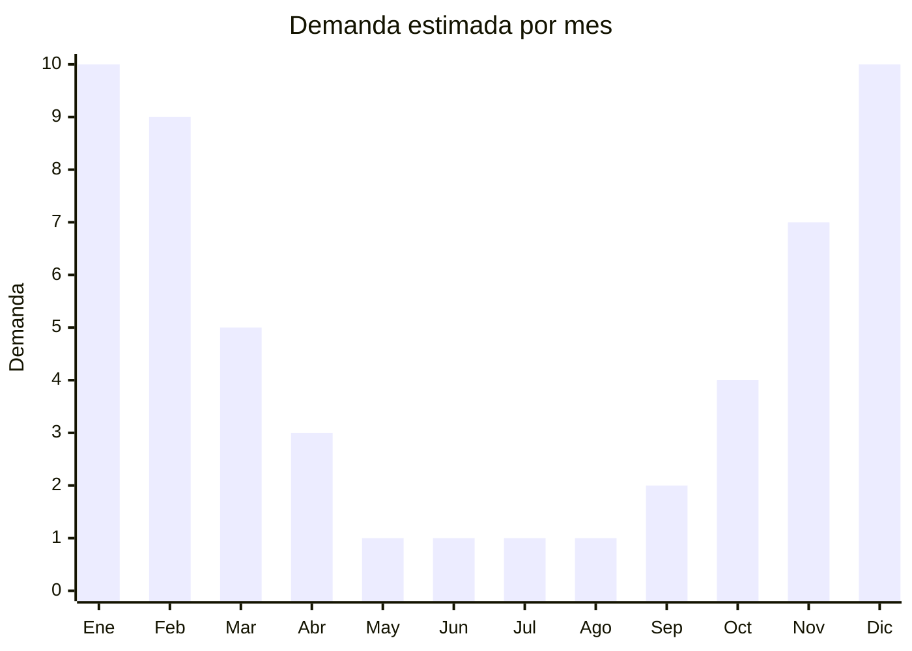

# Sombreros de sol/playa (ala ancha, pamela, bucket)

> **Capítulo NCM 65** — Sombreros, demás tocados y sus partes | **Temporada:** Verano (Dic–Feb)

## Qué es y por qué importarlo

Los sombreros de sol y playa de tela son accesorios de protección solar fabricados en materiales textiles como poliéster, algodón, nylon o mezclas. A diferencia de los sombreros de paja del Capítulo 46, estos modelos son de tela cosida y clasifican en el Capítulo 65 de la nomenclatura arancelaria. Incluyen sombreros de ala ancha (floppy hats), pamelas, bucket hats (sombreros de pescador) y modelos con protección UV certificada.

Son un producto de consumo masivo en verano, con demanda transversal: mujeres, hombres y niños. El bucket hat en particular se ha convertido en un ícono de moda juvenil y streetwear, ampliando su uso más allá de la playa. Los centros de producción principales en China son Yiwu (Zhejiang) para modelos masivos económicos y Shenzhen (Guangdong) para modelos de mayor calidad y diseño.

Con un FOB de USD 0.80 a 3.00 y precios de venta en Argentina de ARS 3.000 a ARS 10.000, los márgenes brutos superan el 200% y pueden alcanzar el 400% en modelos bien diferenciados. Son ultralivianos, ocupan poco espacio de envío y no requieren certificaciones especiales, lo que los convierte en un producto ideal para importadores principiantes.

## Datos clave

| Dato | Valor |
|------|-------|
| **Posiciones NCM típicas** | 6505.00.22 (sombreros de fibras sintéticas — de punto), 6505.00.29 (los demás sombreros de punto), 6506.99.00 (los demás sombreros) |
| **Derecho de importación** | 20% (DIE) + 3% tasa estadística |
| **Rango FOB típico** | USD 0.80 — USD 3.00 por unidad |
| **Precio de venta en Argentina** | ARS 3.000 — ARS 10.000 |
| **Margen bruto estimado** | 200% — 400% |
| **MOQ típico** | 200 — 1.000 unidades |
| **Demanda en MercadoLibre** | Muy Alta (estacional) |
| **Competencia en MercadoLibre** | Alta |
| **Dificultad para importar** | Fácil |
| **Certificaciones necesarias** | No requiere certificaciones especiales |
| **Antidumping** | No |

## Variantes y subtipos más comunes

| Subtipo / Variante | FOB aprox. | Venta AR aprox. | Nota |
|--------------------|-----------|-----------------|------|
| Bucket hat algodón/poliéster | USD 0.80 — 1.50 | ARS 3.000 — 6.000 | **Más vendido**, tendencia moda |
| Sombrero ala ancha mujer | USD 1.50 — 3.00 | ARS 5.000 — 10.000 | Protección solar, playa |
| Pamela elegante | USD 2.00 — 3.00 | ARS 6.000 — 10.000 | Eventos, fotos, premium |
| Sombrero con protección UV | USD 1.50 — 2.50 | ARS 4.000 — 8.000 | UPF 50+, funcional |
| Sombrero infantil con solapa | USD 0.80 — 1.50 | ARS 3.000 — 6.000 | Protección nuca, pileta/playa |

## Regulaciones y requisitos

<Tabs>
  <Tab title="Certificaciones">
    | Organismo | Requiere | Detalle |
    |-----------|----------|---------|
    | ARCA (Aduana) | Sí siempre | Despacho estándar |
    | ANMAT | No | No aplica |
    | ENACOM | No | No es electrónico |
    | SENASA | No | No aplica (material textil, no fibra vegetal) |

    **Recomendación:** Si el sombrero tiene protección UV, solicitar al proveedor certificado de laboratorio que acredite el factor UPF (Ultraviolet Protection Factor). Esto permite diferenciarse en la publicación de venta y justificar un precio más alto. Los certificados UPF son emitidos por laboratorios como SGS, Intertek o Bureau Veritas.
  </Tab>

  <Tab title="Etiquetado">
    | Requisito | Aplica |
    |-----------|--------|
    | Idioma español | Sí |
    | Datos del importador | Sí |
    | Composición / materiales | Sí (indicar % algodón, poliéster, etc.) |
    | Talle / circunferencia | Recomendado |
    | País de origen | Sí |
    | Factor UPF (si aplica) | Recomendado |
    | Instrucciones de lavado | Recomendado |
  </Tab>

  <Tab title="Restricciones">
    Sin restricciones especiales de importación. No hay antidumping ni licencias previas para sombreros de tela.

    **Nota sobre clasificación:** Los sombreros de tela clasifican en el Capítulo 65, a diferencia de los sombreros de paja que pueden clasificar en Cap. 46 (cestería). Si un sombrero combina tela con paja, la clasificación dependerá del material predominante que le da carácter esencial.
  </Tab>
</Tabs>

## Logística

| Dato | Valor |
|------|-------|
| **Peso típico por unidad** | 0.05 — 0.15 kg |
| **Volumen típico** | Bajo (se pliegan, livianos) |
| **Fragilidad** | Muy baja (tela flexible) |
| **Envío recomendado** | Marítimo LCL o aéreo para primeras pruebas |
| **Tiempo total estimado** | 45 — 70 días (marítimo), 7-15 días (aéreo) |
| **Baterías de litio** | No |
| **Requiere empaque especial** | No (bolsa individual + cartón estándar) |

<Tip>
A diferencia de los sombreros de paja (Cap. 46) que son rígidos y frágiles, los sombreros de tela se **pliegan y comprimen** fácilmente. Un cartón de 60x40x40 cm puede contener 80-120 bucket hats. Esto permite enviar grandes cantidades en poco volumen, haciendo viable incluso el envío aéreo para pruebas iniciales o reposiciones urgentes en plena temporada.
</Tip>

## Estacionalidad



| Aspecto | Detalle |
|---------|---------|
| **Meses pico** | Noviembre-Febrero (verano, playa, vacaciones) |
| **Meses valle** | Junio-Agosto (sin demanda) |
| **Cuándo pedir** | Julio-Agosto para tener stock en noviembre |

## Ventajas y riesgos

<CardGroup cols={2}>
  <Card title="Ventajas" icon="circle-check">
    - FOB bajísimo, márgenes excepcionales
    - Ultraliviano y comprimible: flete mínimo
    - Sin certificaciones ni barreras regulatorias
    - Bucket hat con demanda de moda todo el año
    - Ideal para marca propia (bordado/estampado)
  </Card>
  <Card title="Riesgos" icon="triangle-exclamation">
    - Competencia muy alta (producto commodity)
    - Estacionalidad marcada (excepto bucket hat)
    - Calidad de costura y terminación variable
    - Colores pueden desvanecerse con lavados
    - Tendencias de moda cambian rápido
  </Card>
</CardGroup>

## Palabras clave para buscar en Alibaba

```
bucket hat wholesale, sun hat women wide brim, floppy beach hat wholesale,
UPF 50 sun hat, summer hat cotton wholesale, beach hat women packable,
fisherman hat bulk, kids sun hat UV protection wholesale
```

## Fuentes

- [MercadoLibre Argentina — Sombreros de sol](https://listado.mercadolibre.com.ar/sombrero-sol-playa)
- [Alibaba — Sun hat wholesale](https://www.alibaba.com/showroom/sun-hat-wholesale.html)
