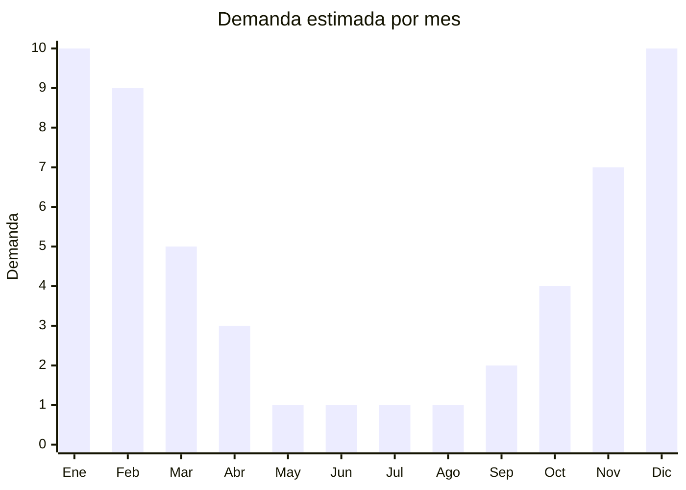

# Viseras de playa/deportivas de verano

> **Capítulo NCM 65** — Sombreros, demás tocados y sus partes | **Temporada:** Verano (Dic–Feb)

## Qué es y por qué importarlo

Las viseras de playa y deportivas son accesorios de protección solar sin copa (abiertas arriba) que cubren la frente y los ojos del sol. Son populares en actividades de verano como playa, tenis, running, golf, caminatas y deportes al aire libre. Su diseño abierto permite ventilación completa de la cabeza, lo que las hace preferidas por muchos usuarios frente a gorras o sombreros cerrados en climas calurosos.

El mercado incluye viseras deportivas técnicas (con materiales dry-fit, ajuste con velcro o elástico), viseras de playa fashion (ala ancha, rafia, colores vivos) y viseras promocionales/corporativas. El FOB es extremadamente bajo (USD 0.50 a 2.00), con precios de venta en Argentina de ARS 2.000 a ARS 8.000, generando márgenes del 200% al 400%.

China produce la gran mayoría de las viseras del mundo, con fábricas concentradas en Yiwu (Zhejiang) para modelos económicos masivos y en Shenzhen (Guangdong) para modelos deportivos de mayor calidad. La inversión inicial es mínima, el producto es ultraliviano y compacto, y no requiere certificaciones especiales. Es un complemento ideal para importar junto con sombreros y gorras, diversificando el catálogo de accesorios de verano.

## Datos clave

| Dato | Valor |
|------|-------|
| **Posiciones NCM típicas** | 6505.00.22 (sombreros de fibras sintéticas — de punto), 6505.00.29 (los demás sombreros de punto), 6506.99.00 (los demás sombreros) |
| **Derecho de importación** | 20% (DIE) + 3% tasa estadística |
| **Rango FOB típico** | USD 0.50 — USD 2.00 por unidad |
| **Precio de venta en Argentina** | ARS 2.000 — ARS 8.000 |
| **Margen bruto estimado** | 200% — 400% |
| **MOQ típico** | 300 — 1.000 unidades |
| **Demanda en MercadoLibre** | Alta (estacional) |
| **Competencia en MercadoLibre** | Media-Alta |
| **Dificultad para importar** | Muy fácil |
| **Certificaciones necesarias** | No requiere certificaciones especiales |
| **Antidumping** | No |

## Variantes y subtipos más comunes

| Subtipo / Variante | FOB aprox. | Venta AR aprox. | Nota |
|--------------------|-----------|-----------------|------|
| Visera deportiva dry-fit | USD 0.50 — 1.00 | ARS 2.000 — 5.000 | **Más vendida**, running/tenis |
| Visera playa ala ancha | USD 1.00 — 2.00 | ARS 4.000 — 8.000 | Moda playa, protección solar |
| Visera golf/tenis premium | USD 1.00 — 1.80 | ARS 3.500 — 7.000 | Ajuste técnico, transpirable |
| Visera con protección UV | USD 0.80 — 1.50 | ARS 3.000 — 6.000 | UPF 50+, funcional |
| Visera enrollable/plegable | USD 1.00 — 2.00 | ARS 3.500 — 7.000 | Viaje, portabilidad |

## Regulaciones y requisitos

<Tabs>
  <Tab title="Certificaciones">
    | Organismo | Requiere | Detalle |
    |-----------|----------|---------|
    | ARCA (Aduana) | Sí siempre | Despacho estándar |
    | ANMAT | No | No aplica |
    | ENACOM | No | No es electrónico |
    | SENASA | No | No aplica |

    **Recomendación:** Las viseras con protección UV certificada (UPF 50+) se venden significativamente mejor y a mayor precio. Solicitar al proveedor certificado de laboratorio UPF si el producto lo ofrece. Es un diferenciador real frente a la competencia genérica.
  </Tab>

  <Tab title="Etiquetado">
    | Requisito | Aplica |
    |-----------|--------|
    | Idioma español | Sí |
    | Datos del importador | Sí |
    | Composición / materiales | Sí (indicar % de cada fibra) |
    | País de origen | Sí |
    | Factor UPF (si aplica) | Recomendado |
    | Instrucciones de lavado | Recomendado |
  </Tab>

  <Tab title="Restricciones">
    Sin restricciones especiales de importación. No hay antidumping ni licencias previas para viseras.

    Producto de mínima complejidad regulatoria. Es uno de los artículos más simples de importar dentro del universo de accesorios de indumentaria.
  </Tab>
</Tabs>

## Logística

| Dato | Valor |
|------|-------|
| **Peso típico por unidad** | 0.03 — 0.10 kg |
| **Volumen típico** | Muy bajo (se apilan, compactas) |
| **Fragilidad** | Muy baja |
| **Envío recomendado** | Marítimo LCL o aéreo para lotes chicos |
| **Tiempo total estimado** | 45 — 70 días (marítimo), 7-15 días (aéreo) |
| **Baterías de litio** | No |
| **Requiere empaque especial** | No (bolsa individual + cartón estándar) |

<Tip>
Las viseras son uno de los productos con **mejor ratio valor/volumen** para importar. Por su forma plana y liviana, un cartón estándar puede contener 150-200 viseras. Combinarlas con gorras y sombreros en un mismo envío permite ofrecer un catálogo completo de accesorios de verano sin multiplicar los costos de flete.
</Tip>

## Estacionalidad



| Aspecto | Detalle |
|---------|---------|
| **Meses pico** | Noviembre-Febrero (verano, playa, deportes outdoor) |
| **Meses valle** | Mayo-Agosto (mínima demanda) |
| **Cuándo pedir** | Julio-Agosto para tener stock en noviembre |

## Ventajas y riesgos

<CardGroup cols={2}>
  <Card title="Ventajas" icon="circle-check">
    - FOB extremadamente bajo (desde USD 0.50)
    - Ultraliviano y compacto: flete casi insignificante por unidad
    - Cero barreras regulatorias
    - Inversión inicial mínima para probar el producto
    - Complemento perfecto para catálogo de accesorios verano
  </Card>
  <Card title="Riesgos" icon="triangle-exclamation">
    - Ticket promedio bajo (necesita volumen para ser rentable)
    - Estacionalidad marcada fuera de uso deportivo
    - Competencia con producción local y marcas deportivas
    - Percepción de producto barato si no hay diferenciación
    - Tendencias de color/estilo cambian cada temporada
  </Card>
</CardGroup>

## Palabras clave para buscar en Alibaba

```
sun visor hat wholesale, beach visor women, sport visor cap bulk,
UV protection visor hat, golf visor wholesale, tennis visor cap,
wide brim visor beach, foldable sun visor wholesale
```

## Fuentes

- [MercadoLibre Argentina — Viseras playa](https://listado.mercadolibre.com.ar/visera-playa)
- [Alibaba — Sun visor wholesale](https://www.alibaba.com/showroom/sun-visor-wholesale.html)
