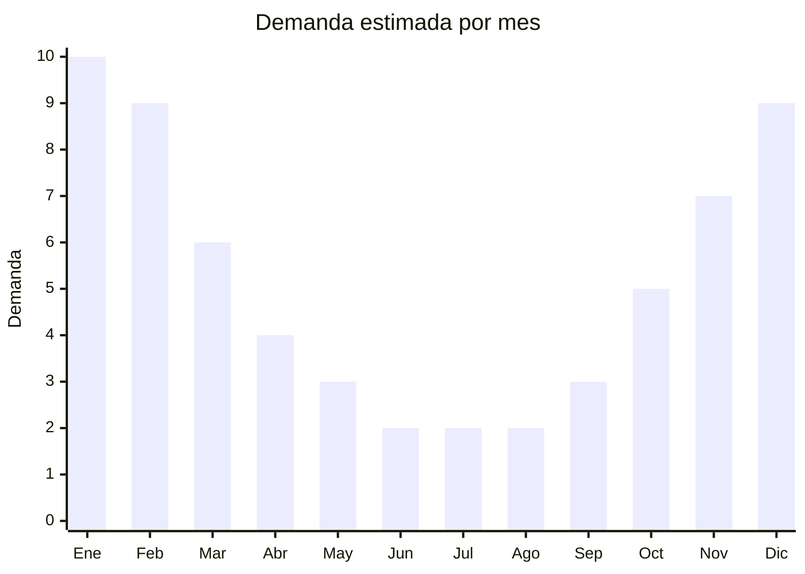

# Parasoles/sombrillas UV personales de mano

> **Capítulo NCM 66** — Paraguas, sombrillas, quitasoles y bastones | **Temporada:** Verano (Dic–Feb)

## Qué es y por qué importarlo

Los parasoles o sombrillas UV personales son paraguas de mano diseñados específicamente para proteger del sol. A diferencia del paraguas de lluvia convencional, estos modelos incorporan revestimiento anti-UV (generalmente una capa negra de poliuretano o vinilo en el interior) que bloquea entre el 95% y el 99% de la radiación ultravioleta. Muchos modelos son de doble uso (lluvia y sol), lo que amplía su período de venta más allá del verano.

Se caracterizan por ser compactos y livianos: plegados miden entre 20 y 30 cm y pesan entre 200 y 400 gramos, lo que permite llevarlos en la cartera o mochila. Son especialmente populares entre mujeres y personas con piel sensible al sol. La tendencia de protección solar ha impulsado fuertemente su demanda en los últimos años.

China (Shaoxing, Zhejiang) es el productor absoluto, con fábricas que ofrecen una variedad infinita de diseños, colores y mecanismos (automático, manual, mini, ultra-light). El FOB oscila entre USD 2 y 5, con precios de venta en Argentina de ARS 5.000 a ARS 12.000, generando márgenes del 200% al 350%. El producto es compacto, liviano, sin regulaciones especiales y con una relación valor/volumen excelente para el envío.

## Datos clave

| Dato | Valor |
|------|-------|
| **Posiciones NCM típicas** | 6601.91.00 (paraguas y quitasoles con mástil telescópico), 6601.99.00 (los demás paraguas y quitasoles) |
| **Derecho de importación** | 18% (DIE) + 3% tasa estadística |
| **Rango FOB típico** | USD 2.00 — USD 5.00 por unidad |
| **Precio de venta en Argentina** | ARS 5.000 — ARS 12.000 |
| **Margen bruto estimado** | 200% — 350% |
| **MOQ típico** | 200 — 1.000 unidades |
| **Demanda en MercadoLibre** | Alta (estacional con piso anual) |
| **Competencia en MercadoLibre** | Media |
| **Dificultad para importar** | Fácil |
| **Certificaciones necesarias** | No requiere certificaciones especiales |
| **Antidumping** | No |

## Variantes y subtipos más comunes

| Subtipo / Variante | FOB aprox. | Venta AR aprox. | Nota |
|--------------------|-----------|-----------------|------|
| Mini paraguas UV 3 pliegues | USD 2.00 — 3.00 | ARS 5.000 — 8.000 | **Más vendido**, compacto, cartera |
| Paraguas UV automático | USD 3.00 — 4.50 | ARS 7.000 — 10.000 | Apertura y cierre automático |
| Parasol UV ultra-light (<200g) | USD 3.00 — 5.00 | ARS 7.000 — 12.000 | Premium, fibra de carbono |
| Paraguas UV doble capa | USD 2.50 — 4.00 | ARS 6.000 — 10.000 | Interior negro + exterior color |
| Paraguas UV con diseño/estampado | USD 2.00 — 3.50 | ARS 5.000 — 9.000 | Diseños florales, moda |

## Regulaciones y requisitos

<Tabs>
  <Tab title="Certificaciones">
    | Organismo | Requiere | Detalle |
    |-----------|----------|---------|
    | ARCA (Aduana) | Sí siempre | Despacho estándar |
    | ANMAT | No | No aplica |
    | ENACOM | No | No es electrónico |
    | SENASA | No | No aplica |

    **Recomendación:** Solicitar al proveedor certificado de protección UV (UPF 50+ o porcentaje de bloqueo UV). Los laboratorios chinos como SGS y Intertek emiten estos certificados. Incluir el dato de protección UV en la publicación de venta es un diferenciador clave frente a paraguas comunes que se venden como "anti-UV" sin respaldo.
  </Tab>

  <Tab title="Etiquetado">
    | Requisito | Aplica |
    |-----------|--------|
    | Idioma español | Sí |
    | Datos del importador | Sí |
    | Composición / materiales | Sí (indicar material de tela y estructura) |
    | Dimensiones abierto/cerrado | Recomendado |
    | Factor UPF / % bloqueo UV | Recomendado |
    | País de origen | Sí |
    | Instrucciones de uso | Recomendado |
    | Garantía legal 6 meses | Sí |
  </Tab>

  <Tab title="Restricciones">
    Sin restricciones especiales de importación. No hay antidumping ni licencias previas para paraguas y parasoles.

    Producto de mínima complejidad regulatoria. Clasifica junto con los paraguas de lluvia convencionales en el Capítulo 66.
  </Tab>
</Tabs>

## Logística

| Dato | Valor |
|------|-------|
| **Peso típico por unidad** | 0.20 — 0.40 kg |
| **Volumen típico** | Bajo (compactos, plegados 20-30 cm) |
| **Fragilidad** | Baja-Media (mecanismo puede dañarse si se aplasta) |
| **Envío recomendado** | Marítimo LCL o aéreo para lotes chicos |
| **Tiempo total estimado** | 45 — 70 días (marítimo), 7-15 días (aéreo) |
| **Baterías de litio** | No |
| **Requiere empaque especial** | No (funda individual + cartón estándar) |

<Tip>
A diferencia de las sombrillas de playa (plegadas miden 1.0-1.5m), los parasoles personales **plegados miden solo 20-30 cm** y pesan menos de 400g. Esto permite una densidad de empaque altísima: un cartón estándar de 60x40x40 cm puede contener 60-80 unidades. Aprovechar este ratio valor/volumen para combinar con otros productos del Cap. 66 en un mismo envío.
</Tip>

## Estacionalidad



| Aspecto | Detalle |
|---------|---------|
| **Meses pico** | Noviembre-Febrero (verano, sol intenso) |
| **Meses valle** | Junio-Agosto (menor demanda, pero venta como paraguas lluvia) |
| **Cuándo pedir** | Julio-Agosto para tener stock en noviembre |

## Ventajas y riesgos

<CardGroup cols={2}>
  <Card title="Ventajas" icon="circle-check">
    - Doble uso (sol y lluvia) extiende la temporada de venta
    - Compacto y liviano: excelente ratio valor/volumen para flete
    - Costo FOB accesible con buenos márgenes
    - Tendencia creciente de protección solar
    - Sin barreras regulatorias
  </Card>
  <Card title="Riesgos" icon="triangle-exclamation">
    - Mecanismo de apertura/cierre es el punto débil (verificar calidad)
    - Competencia con paraguas de lluvia que se venden como "UV"
    - Revestimiento UV puede degradarse con el uso
    - Varillas baratas se doblan con viento
    - Necesidad de verificar que la protección UV sea real (certificado)
  </Card>
</CardGroup>

## Palabras clave para buscar en Alibaba

```
UV umbrella wholesale, anti UV parasol, sun umbrella UPF 50 wholesale,
mini UV umbrella folding, compact sun umbrella wholesale, UV protection umbrella,
black coating UV umbrella, lightweight sun umbrella bulk
```

## Fuentes

- [MercadoLibre Argentina — Sombrillas UV personales](https://listado.mercadolibre.com.ar/sombrilla-uv)
- [Alibaba — UV umbrella wholesale](https://www.alibaba.com/showroom/uv-umbrella.html)
