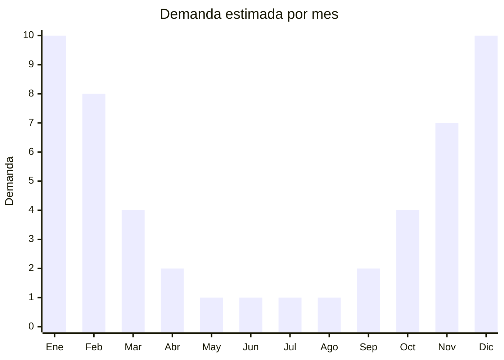

# Sombrillas de playa / quitasoles portátiles

> **Capítulo NCM 66** — Paraguas, sombrillas, quitasoles y bastones | **Temporada:** Verano (Dic–Feb)

## Qué es y por qué importarlo

Las sombrillas de playa (también llamadas quitasoles o parasoles portátiles) son estructuras plegables con mástil central y tela tensada, diseñadas para generar sombra en la playa, pileta, jardín o espacios al aire libre. Se caracterizan por tener un diámetro abierto de 1.5 a 2.5 metros, mástil de acero o aluminio con punta para clavar en la arena, sistema de inclinación y tela con protección UV.

China domina absolutamente la producción mundial de paraguas y sombrillas, con Shaoxing (Zhejiang) como la capital mundial indiscutida del sector. En Shaoxing y alrededores se fabrican más del 70% de los paraguas y sombrillas del mundo. Las sombrillas de playa tienen un FOB de USD 3 a 12 según tamaño y calidad, y en Argentina se venden entre ARS 10.000 y ARS 40.000.

El principal desafío logístico de las sombrillas de playa es su **volumen**: incluso plegadas, miden entre 1.0 y 1.5 metros de largo, lo que dificulta el embalaje estándar y aumenta el costo de flete marítimo. Sin embargo, la demanda es masiva e inelástica en verano (quien va a la playa necesita sombra), los márgenes son atractivos y no hay antidumping ni barreras regulatorias significativas.

## Datos clave

| Dato | Valor |
|------|-------|
| **Posiciones NCM típicas** | 6601.91.00 (paraguas y quitasoles con mástil telescópico), 6601.99.00 (los demás paraguas y quitasoles) |
| **Derecho de importación** | 18% (DIE) + 3% tasa estadística |
| **Rango FOB típico** | USD 3.00 — USD 12.00 por unidad |
| **Precio de venta en Argentina** | ARS 10.000 — ARS 40.000 |
| **Margen bruto estimado** | 150% — 300% |
| **MOQ típico** | 100 — 500 unidades |
| **Demanda en MercadoLibre** | Muy Alta (estacional) |
| **Competencia en MercadoLibre** | Media-Alta |
| **Dificultad para importar** | Media (volumen y fragilidad) |
| **Certificaciones necesarias** | No requiere certificaciones especiales |
| **Antidumping** | No |

## Variantes y subtipos más comunes

| Subtipo / Variante | FOB aprox. | Venta AR aprox. | Nota |
|--------------------|-----------|-----------------|------|
| Sombrilla playa 1.8m básica | USD 3.00 — 5.00 | ARS 10.000 — 18.000 | **Más vendida**, uso general |
| Sombrilla playa 2.0m con inclinación | USD 5.00 — 8.00 | ARS 15.000 — 25.000 | Modelo mejorado, más sombra |
| Quitasol 2.4m con ventilación | USD 7.00 — 10.00 | ARS 20.000 — 32.000 | Doble techo anti-viento |
| Sombrilla playa 2.5m premium | USD 8.00 — 12.00 | ARS 25.000 — 40.000 | Aluminio, UV50+, bolsa transporte |
| Sombrilla con anclaje de arena | USD 6.00 — 10.00 | ARS 18.000 — 30.000 | Sistema de rosca para arena |

## Regulaciones y requisitos

<Tabs>
  <Tab title="Certificaciones">
    | Organismo | Requiere | Detalle |
    |-----------|----------|---------|
    | ARCA (Aduana) | Sí siempre | Despacho estándar |
    | ANMAT | No | No aplica |
    | ENACOM | No | No es electrónico |
    | SENASA | No | No aplica |

    **Recomendación:** Solicitar al proveedor certificado de protección UV (UPF 50+ o similar) para la tela de la sombrilla. En Argentina, los compradores valoran cada vez más la protección solar real. También verificar la resistencia al viento (solicitar test de carga de viento si está disponible) para evitar reclamos por sombrillas que se invierten con brisa moderada.
  </Tab>

  <Tab title="Etiquetado">
    | Requisito | Aplica |
    |-----------|--------|
    | Idioma español | Sí |
    | Datos del importador | Sí |
    | Diámetro / dimensiones | Sí |
    | Material del mástil y tela | Sí |
    | País de origen | Sí |
    | Factor UPF (si aplica) | Recomendado |
    | Instrucciones de armado/uso | Recomendado |
    | Garantía legal 6 meses | Sí |
  </Tab>

  <Tab title="Restricciones">
    Sin restricciones especiales de importación. No hay antidumping ni licencias previas para sombrillas de playa.

    **Atención:** Si la sombrilla incluye iluminación LED integrada (solar o con batería), puede requerir intervención de ENACOM. Los modelos sin electrónica no tienen restricción alguna.
  </Tab>
</Tabs>

## Logística

| Dato | Valor |
|------|-------|
| **Peso típico por unidad** | 1.5 — 3.5 kg (según tamaño y material del mástil) |
| **Volumen típico** | Alto (plegada mide 1.0-1.5m de largo) |
| **Fragilidad** | Media (mástil puede doblarse, tela no) |
| **Envío recomendado** | Marítimo LCL o FCL según volumen |
| **Tiempo total estimado** | 50 — 80 días (marítimo) |
| **Baterías de litio** | No (modelos sin LED) |
| **Requiere empaque especial** | Sí (funda individual + cartón largo reforzado) |

<Tip>
Las sombrillas de playa son **uno de los productos más voluminosos** de importar por su largo plegado (1.0-1.5m). Negociar con el proveedor cajas alargadas que maximicen el apilamiento en contenedor. Una estrategia efectiva es combinar sombrillas con productos compactos (viseras, bolsos plegados) que llenen los espacios vacíos del contenedor, optimizando el costo de flete por unidad total.
</Tip>

## Estacionalidad



| Aspecto | Detalle |
|---------|---------|
| **Meses pico** | Noviembre-Febrero (verano, playa, vacaciones) |
| **Meses valle** | Mayo-Agosto (sin demanda) |
| **Cuándo pedir** | Junio-Julio para tener stock en noviembre (margen extra por volumen) |

## Ventajas y riesgos

<CardGroup cols={2}>
  <Card title="Ventajas" icon="circle-check">
    - Demanda masiva e inelástica en verano (producto necesario)
    - Sin antidumping ni barreras regulatorias
    - Shaoxing ofrece infinidad de proveedores especializados
    - Ticket promedio alto (buena facturación por unidad)
    - Producto de recompra (se deterioran con sal/sol/viento)
  </Card>
  <Card title="Riesgos" icon="triangle-exclamation">
    - Muy voluminoso: alto costo de flete por CBM
    - Estacionalidad extrema: stock muerto 6 meses al año
    - Mástiles pueden doblarse en transporte si empaque es pobre
    - Competencia con sombrillas de almacén/ferretería/supermercado
    - Resistencia al viento es variable (reclamos frecuentes)
  </Card>
</CardGroup>

## Palabras clave para buscar en Alibaba

```
beach umbrella wholesale, sun umbrella beach, parasol beach portable,
outdoor beach umbrella UV, beach umbrella with sand anchor, tilt beach umbrella,
windproof beach umbrella, beach umbrella 2m wholesale Shaoxing
```

## Fuentes

- [MercadoLibre Argentina — Sombrillas de playa](https://listado.mercadolibre.com.ar/sombrilla-playa)
- [Alibaba — Beach umbrella wholesale](https://www.alibaba.com/showroom/beach-umbrella.html)
