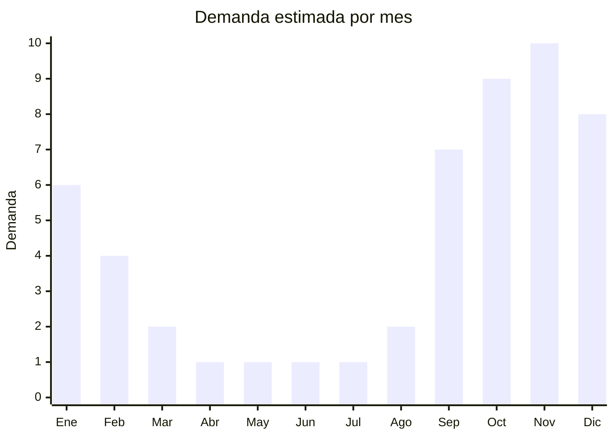

# Bordes atérmicos cerámicos para pileta

> **Capítulo NCM 69** — Productos cerámicos | **Temporada:** Verano (Dic–Feb)

## Qué es y por qué importarlo

Los bordes atérmicos son piezas cerámicas especialmente diseñadas para el perímetro de piletas de natación. Su característica principal es que no acumulan calor bajo el sol: gracias a su composición cerámica porosa y su acabado antideslizante, la superficie permanece fresca al tacto incluso en días de calor extremo, evitando quemaduras en los pies al caminar por el borde de la pileta. Además de su función térmica, actúan como terminación estética y estructural del solarium.

Existen diferentes formatos: rectos para tramos lineales, curvos para esquinas redondeadas y piezas especiales como los bordes tipo "L" que cubren la arista entre la pared vertical y el piso del solarium. China produce bordes atérmicos de calidad competitiva a precios muy inferiores a los fabricantes locales o europeos. Las fábricas de Foshan y Zibo son los principales polos productivos.

El mercado es puramente B2B: pileteros, corralones y distribuidores de materiales para piletas. Es un producto complementario natural a las venecitas cerámicas, por lo que muchos importadores combinan ambos en un mismo contenedor para optimizar el flete y ofrecer una solución completa al piletero.

## Datos clave

| Dato | Valor |
|------|-------|
| **Posiciones NCM típicas** | 6907.40.00 (piezas cerámicas de acabado), 6907.30.00 (baldosas cerámicas) |
| **Derecho de importación** | 18% (DIE) + 3% tasa estadística |
| **Rango FOB típico** | USD 3.00 — USD 8.00 por m2 (o por pieza según formato) |
| **Precio de venta en Argentina** | ARS 3.000 — ARS 8.000 por pieza |
| **Margen bruto estimado** | 100% — 180% |
| **MOQ típico** | 500 — 2.000 metros lineales |
| **Demanda en MercadoLibre** | Baja-Media (nicho B2B) |
| **Competencia en MercadoLibre** | Baja |
| **Dificultad para importar** | Media (pesado y frágil) |
| **Certificaciones necesarias** | No requiere certificaciones especiales |
| **Antidumping** | No |

## Variantes y subtipos más comunes

| Subtipo / Variante | FOB aprox. | Venta AR aprox. | Nota |
|--------------------|-----------|-----------------|------|
| Borde recto liso 50x25 cm | USD 3.00 — 5.00/pieza | ARS 3.000 — 5.000/pieza | **Más vendido**, tramos lineales |
| Borde recto texturado | USD 4.00 — 6.00/pieza | ARS 4.000 — 6.500/pieza | Acabado antideslizante reforzado |
| Esquinero curvo 90° | USD 5.00 — 7.00/pieza | ARS 5.000 — 7.000/pieza | Piezas especiales para esquinas |
| Borde tipo "L" (arista) | USD 5.00 — 8.00/pieza | ARS 5.500 — 8.000/pieza | Cubre la transición pared-piso |
| Borde atérmico color arena | USD 4.00 — 6.00/pieza | ARS 4.000 — 6.500/pieza | Tonos neutros, estética natural |

## Regulaciones y requisitos

<Tabs>
  <Tab title="Certificaciones">
    | Organismo | Requiere | Detalle |
    |-----------|----------|---------|
    | ARCA (Aduana) | Sí siempre | Despacho estándar |
    | ANMAT | No | No aplica |
    | ENACOM | No | No es electrónico |
    | INTI | No obligatorio | Ensayo de resistencia al deslizamiento recomendable |

    **Recomendación:** Solicitar al proveedor certificado de coeficiente de fricción (antideslizamiento) y ensayo de absorción de calor. Estos datos técnicos son el argumento de venta principal y diferencian un borde atérmico genuino de una baldosa cerámica convencional pintada como "atérmica".
  </Tab>

  <Tab title="Etiquetado">
    | Requisito | Aplica |
    |-----------|--------|
    | Idioma español | Sí |
    | Datos del importador | Sí |
    | Composición / materiales | Sí (cerámica, tipo de acabado) |
    | Dimensiones | Sí |
    | País de origen | Sí |
    | Lote / tono de color | Recomendado |
    | Instrucciones de colocación | Recomendado |
  </Tab>

  <Tab title="Restricciones">
    Sin restricciones especiales de importación. No hay antidumping ni licencias previas para bordes cerámicos.

    **Atención:** Los bordes atérmicos son piezas pesadas y frágiles. Las roturas en tránsito son comunes si el empaque no es adecuado. Exigir palletizado con separadores de cartón entre capas y esquineros de protección.
  </Tab>
</Tabs>

## Logística

| Dato | Valor |
|------|-------|
| **Peso típico por pieza** | 1.5 — 3.0 kg |
| **Volumen típico** | Medio (pesado para su volumen) |
| **Fragilidad** | Alta (cerámica, bordes y esquinas vulnerables) |
| **Envío recomendado** | Marítimo FCL (combinar con venecitas para completar contenedor) |
| **Tiempo total estimado** | 60 — 90 días (marítimo) |
| **Baterías de litio** | No |
| **Requiere empaque especial** | Sí (palletizado con separadores, esquineros) |

<Tip>
Combinar bordes atérmicos con venecitas cerámicas en el mismo contenedor es la estrategia más inteligente: ambos productos se venden al mismo cliente (piletero), se fabrican en la misma zona de China (Foshan) y se complementan comercialmente. Un contenedor de 20 pies puede llevar aproximadamente **800 m2 de venecitas + 500 metros lineales de bordes**.
</Tip>

## Estacionalidad



| Aspecto | Detalle |
|---------|---------|
| **Meses pico** | Septiembre-Diciembre (temporada de construcción de piletas) |
| **Meses valle** | Abril-Agosto (no se construyen piletas en invierno) |
| **Cuándo pedir** | Mayo-Junio para tener stock en septiembre (arranque de obra) |

## Ventajas y riesgos

<CardGroup cols={2}>
  <Card title="Ventajas" icon="circle-check">
    - Producto complementario natural a venecitas (venta cruzada)
    - Competencia importadora baja en Argentina
    - Canal B2B con clientes recurrentes
    - Sin certificaciones complejas
    - Márgenes sólidos en nicho técnico
  </Card>
  <Card title="Riesgos" icon="triangle-exclamation">
    - Producto pesado: flete elevado por kg
    - Alta fragilidad: roturas en tránsito frecuentes sin empaque adecuado
    - Estacionalidad pronunciada (sep-dic concentra 70% de ventas)
    - MOQ elevado por peso/volumen del contenedor
    - Diferencias de tono entre lotes generan reclamos
  </Card>
</CardGroup>

## Palabras clave para buscar en Alibaba

```
swimming pool coping tile, pool edge tile anti-slip, ceramic pool border tile,
athermic pool tile, non-slip pool surround tile, pool coping ceramic Foshan,
swimming pool deck tile wholesale, bullnose pool tile ceramic
```

## Fuentes

- [MercadoLibre Argentina — Bordes atérmicos pileta](https://listado.mercadolibre.com.ar/bordes-atermicos-pileta)
- [Alibaba — Swimming pool coping tile](https://www.alibaba.com/showroom/swimming-pool-coping-tile.html)
