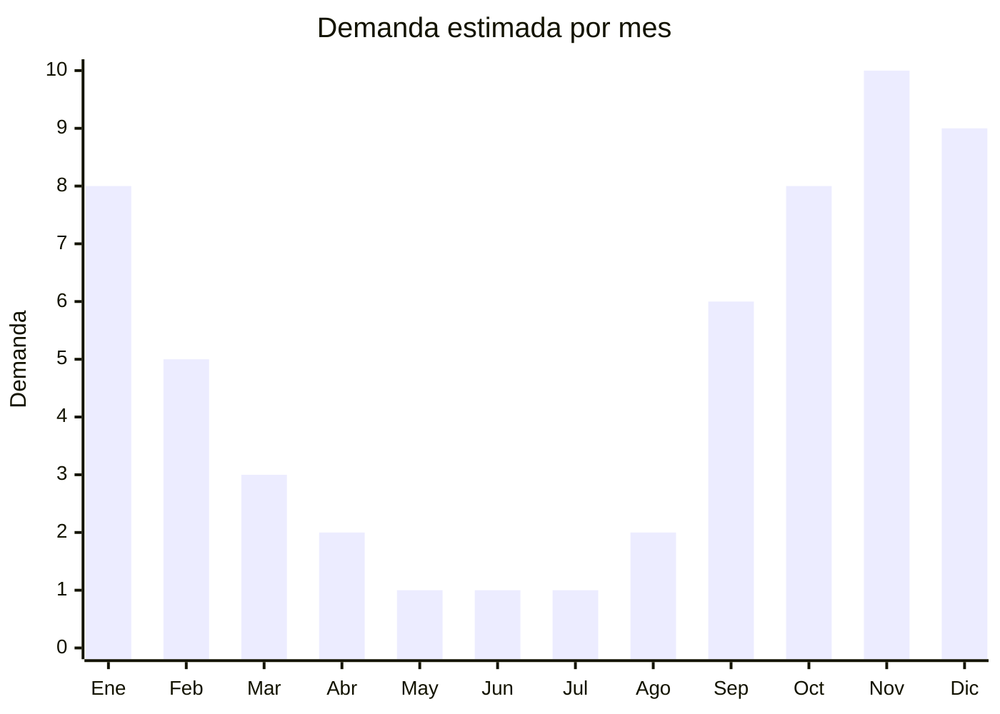

# Venecitas y mosaicos cerámicos para pileta

> **Capítulo NCM 69** — Productos cerámicos | **Temporada:** Verano (Dic–Feb)

## Qué es y por qué importarlo

Las venecitas cerámicas son pequeñas piezas de cerámica esmaltada (generalmente de 2x2 cm o 2.5x2.5 cm) montadas en mallas de fibra de vidrio que facilitan su colocación en piletas de natación, fuentes decorativas y spas. Son el revestimiento clásico de piletas en Argentina y toda Latinoamérica, reconocidas por su durabilidad, resistencia al cloro, a los rayos UV y a los cambios de temperatura del agua.

China, y en particular la ciudad de Foshan (Guangdong), es el centro mundial de producción de venecitas cerámicas. Las fábricas de Foshan abastecen tanto al mercado local como a exportadores de todo el mundo, ofreciendo una variedad enorme de colores, acabados (mate, brillante, antideslizante) y formatos. Los precios FOB chinos son significativamente más bajos que los de fabricantes italianos o españoles, que históricamente dominaban el segmento premium.

El negocio de venecitas cerámicas es fundamentalmente B2B: los compradores principales son pileteros (constructores de piletas), corralones de materiales de construcción y distribuidores especializados. La demanda está atada al ciclo de construcción de piletas, que en Argentina arranca en septiembre y se extiende hasta enero. Es un producto técnico donde la calidad del esmalte, la uniformidad del color y la resistencia química son factores decisivos.

## Datos clave

| Dato | Valor |
|------|-------|
| **Posiciones NCM típicas** | 6907.40.00 (piezas de acabado cerámico), 6908.90.00 (placas cerámicas esmaltadas) |
| **Derecho de importación** | 18% (DIE) + 3% tasa estadística |
| **Rango FOB típico** | USD 5.00 — USD 13.00 por m2 |
| **Precio de venta en Argentina** | ARS 15.000 — ARS 45.000 por m2 |
| **Margen bruto estimado** | 100% — 200% |
| **MOQ típico** | 500 — 2.000 m2 |
| **Demanda en MercadoLibre** | Media (nicho técnico) |
| **Competencia en MercadoLibre** | Media |
| **Dificultad para importar** | Media (peso elevado, producto frágil) |
| **Certificaciones necesarias** | No requiere certificaciones especiales |
| **Antidumping** | No |

## Variantes y subtipos más comunes

| Subtipo / Variante | FOB aprox. | Venta AR aprox. | Nota |
|--------------------|-----------|-----------------|------|
| Venecita cerámica 2x2 cm lisa | USD 5.00 — 7.00/m2 | ARS 15.000 — 22.000/m2 | **Más vendida**, azul/celeste clásico |
| Venecita cerámica 2.5x2.5 cm | USD 5.00 — 8.00/m2 | ARS 16.000 — 25.000/m2 | Formato alternativo popular |
| Mosaico cerámico mix colores | USD 7.00 — 10.00/m2 | ARS 22.000 — 35.000/m2 | Diseños decorativos, guardas |
| Venecita antideslizante (borde) | USD 8.00 — 11.00/m2 | ARS 25.000 — 38.000/m2 | Para solarium y bordes de pileta |
| Venecita cerámica premium | USD 10.00 — 13.00/m2 | ARS 35.000 — 45.000/m2 | Acabados especiales, colores premium |

## Regulaciones y requisitos

<Tabs>
  <Tab title="Certificaciones">
    | Organismo | Requiere | Detalle |
    |-----------|----------|---------|
    | ARCA (Aduana) | Sí siempre | Despacho estándar |
    | ANMAT | No | No aplica |
    | ENACOM | No | No es electrónico |
    | INTI | No obligatorio | Puede solicitarse ensayo de resistencia química |

    **Recomendación:** Solicitar al proveedor certificados de resistencia al cloro (norma ISO 10545), absorción de agua inferior al 3% y resistencia a la abrasión. Estos datos técnicos son esenciales para el canal B2B y generan confianza en pileteros profesionales.
  </Tab>

  <Tab title="Etiquetado">
    | Requisito | Aplica |
    |-----------|--------|
    | Idioma español | Sí |
    | Datos del importador | Sí |
    | Composición / materiales | Sí (cerámica esmaltada, tipo de malla) |
    | Dimensiones por pieza y por malla | Sí |
    | País de origen | Sí |
    | Lote / tono de color | Recomendado (crítico para uniformidad) |
    | Instrucciones de colocación | Recomendado |
  </Tab>

  <Tab title="Restricciones">
    Sin restricciones especiales de importación. No hay antidumping ni licencias previas para venecitas cerámicas.

    **Atención:** Verificar que el tono de color sea uniforme dentro de cada lote. Diferencias de tono entre cajas es la queja más frecuente de pileteros y puede generar devoluciones o pérdida de clientes B2B. Solicitar siempre muestras físicas antes del pedido grande.
  </Tab>
</Tabs>

## Logística

| Dato | Valor |
|------|-------|
| **Peso típico por m2** | 7 — 10 kg |
| **Volumen típico** | Medio-Alto (pesado para su volumen) |
| **Fragilidad** | Alta (cerámica esmaltada, puede astillarse) |
| **Envío recomendado** | Marítimo FCL (peso justifica contenedor) |
| **Tiempo total estimado** | 60 — 90 días (marítimo) |
| **Baterías de litio** | No |
| **Requiere empaque especial** | Sí (cajas reforzadas, palletizado) |

<Tip>
Las venecitas son pesadas: un contenedor de 20 pies puede cargar aproximadamente **1.200-1.500 m2**. Negociar con el proveedor empaque en cajas de cartón reforzado sobre pallets con film stretch. La rotura en tránsito es el principal riesgo logístico; solicitar un **2-3% extra** de material como reserva por rotura.
</Tip>

## Estacionalidad



| Aspecto | Detalle |
|---------|---------|
| **Meses pico** | Septiembre-Enero (temporada de construcción y remodelación de piletas) |
| **Meses valle** | Abril-Agosto (no se construyen piletas en invierno) |
| **Cuándo pedir** | Mayo-Junio para tener stock en septiembre (inicio de temporada de obra) |

## Ventajas y riesgos

<CardGroup cols={2}>
  <Card title="Ventajas" icon="circle-check">
    - Producto con demanda recurrente y predecible
    - Márgenes atractivos en canal B2B
    - China ofrece precios imbatibles vs. Italia/España
    - Variedad enorme de colores y acabados
    - Clientes B2B compran en volumen y repiten
  </Card>
  <Card title="Riesgos" icon="triangle-exclamation">
    - Producto pesado: flete marítimo significativo
    - Fragilidad: riesgo de rotura en tránsito
    - Diferencias de tono entre lotes pueden generar reclamos
    - Estacionalidad marcada (stock parado en invierno)
    - Requiere capital inicial alto por MOQ elevados
  </Card>
</CardGroup>

## Palabras clave para buscar en Alibaba

```
ceramic mosaic tile pool, swimming pool ceramic tile 48x48mm, pool mosaic tile mesh mounted,
blue ceramic mosaic wholesale, swimming pool tile Foshan, ceramic mosaic tile sheet,
pool tile anti-slip ceramic, glazed ceramic mosaic pool tile
```

## Fuentes

- [MercadoLibre Argentina — Venecitas pileta](https://listado.mercadolibre.com.ar/venecitas-pileta)
- [Alibaba — Swimming pool ceramic mosaic tile](https://www.alibaba.com/showroom/swimming-pool-ceramic-mosaic-tile.html)
