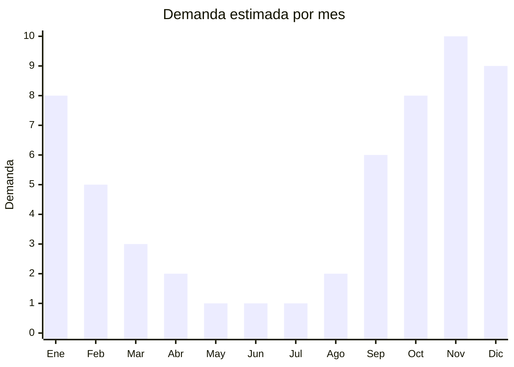

# Venecitas de vidrio para pileta

> **Capítulo NCM 70** — Vidrio y sus manufacturas | **Temporada:** Verano (Dic–Feb)

## Qué es y por qué importarlo

Las venecitas de vidrio (también llamadas mosaicos vítreos) son piezas de vidrio fundido de alta temperatura, generalmente de 2x2 cm o 2.5x2.5 cm, montadas en mallas de fibra de vidrio para revestir piletas de natación, spas, jacuzzis y fuentes decorativas. A diferencia de las venecitas cerámicas, las de vidrio ofrecen acabados premium: efecto iridiscente, tornasol, metalizado, translúcido y una profundidad de color imposible de lograr con cerámica.

China es el principal productor mundial de venecitas de vidrio, con centros de fabricación concentrados en Foshan y Jiangmen (Guangdong). Las fábricas chinas han alcanzado niveles de calidad comparables a los históricos fabricantes italianos (Bisazza, Sicis) pero a una fracción del precio. Un metro cuadrado de venecita de vidrio italiana puede costar USD 80-200 FOB, mientras que la equivalente china está en el rango de USD 9-60 FOB.

El mercado de venecitas de vidrio es B2B premium: pileteros que trabajan para segmentos medio-alto y alto, arquitectos paisajistas, hoteles y spas. El ticket promedio por proyecto es significativamente mayor que con venecitas cerámicas, y los clientes priorizan calidad estética sobre precio. Es un nicho donde la diferenciación por producto es alta y la competencia importadora todavía es limitada en Argentina.

## Datos clave

| Dato | Valor |
|------|-------|
| **Posiciones NCM típicas** | 7016.10.00 (cubos, dados y demás artículos similares de vidrio para mosaicos), 7016.90.00 (demás manufacturas de vidrio para construcción) |
| **Derecho de importación** | 14-18% (DIE) + 3% tasa estadística |
| **Rango FOB típico** | USD 9.00 — USD 60.00 por m2 |
| **Precio de venta en Argentina** | ARS 22.000 — ARS 60.000 por m2 |
| **Margen bruto estimado** | 80% — 180% |
| **MOQ típico** | 200 — 1.000 m2 |
| **Demanda en MercadoLibre** | Baja-Media (nicho premium) |
| **Competencia en MercadoLibre** | Baja |
| **Dificultad para importar** | Media-Alta (frágil, pesado, clasificación NCM) |
| **Certificaciones necesarias** | No requiere certificaciones especiales |
| **Antidumping** | No |

## Variantes y subtipos más comunes

| Subtipo / Variante | FOB aprox. | Venta AR aprox. | Nota |
|--------------------|-----------|-----------------|------|
| Venecita vidrio lisa color sólido | USD 9.00 — 15.00/m2 | ARS 22.000 — 30.000/m2 | Azul, celeste, verde agua |
| Venecita vidrio efecto iridiscente | USD 15.00 — 25.00/m2 | ARS 30.000 — 42.000/m2 | **Más demandada**, brillo tornasol |
| Mosaico vítreo mix degradé | USD 20.00 — 35.00/m2 | ARS 35.000 — 50.000/m2 | Mezcla de tonos, diseño exclusivo |
| Venecita vidrio metalizada | USD 25.00 — 40.00/m2 | ARS 40.000 — 55.000/m2 | Efecto dorado, plateado, cobre |
| Venecita vidrio premium art design | USD 40.00 — 60.00/m2 | ARS 50.000 — 60.000/m2 | Diseños artísticos, murales |

## Regulaciones y requisitos

<Tabs>
  <Tab title="Certificaciones">
    | Organismo | Requiere | Detalle |
    |-----------|----------|---------|
    | ARCA (Aduana) | Sí siempre | Despacho estándar |
    | ANMAT | No | No aplica |
    | ENACOM | No | No es electrónico |
    | INTI | No obligatorio | Puede solicitarse ensayo de resistencia química |

    **Recomendación:** Solicitar al proveedor certificados de resistencia al cloro, absorción de agua cero (el vidrio es no poroso), resistencia a UV y ensayo de bordes (que no sean cortantes una vez colocadas). Para el segmento premium, contar con catálogo profesional con fotos de proyectos terminados es un diferencial comercial clave.
  </Tab>

  <Tab title="Etiquetado">
    | Requisito | Aplica |
    |-----------|--------|
    | Idioma español | Sí |
    | Datos del importador | Sí |
    | Composición / materiales | Sí (vidrio fundido, tipo de malla) |
    | Dimensiones por pieza y por malla | Sí |
    | País de origen | Sí |
    | Lote / tono / código de color | Recomendado (crítico para uniformidad) |
    | Ficha técnica | Recomendado para canal B2B |
  </Tab>

  <Tab title="Restricciones">
    Sin restricciones especiales de importación. No hay antidumping ni licencias previas para mosaicos de vidrio.

    **Atención:** La clasificación arancelaria puede variar según la aduana. Algunos despachantes clasifican las venecitas de vidrio bajo 7016.10 (artículos de vidrio para mosaico) y otros bajo 7013 o 7020. Definir la posición NCM con el despachante antes de importar para evitar diferencias de derechos.
  </Tab>
</Tabs>

## Logística

| Dato | Valor |
|------|-------|
| **Peso típico por m2** | 8 — 12 kg |
| **Volumen típico** | Medio-Alto (muy pesado para su volumen) |
| **Fragilidad** | Muy Alta (vidrio, riesgo de rotura significativo) |
| **Envío recomendado** | Marítimo FCL con empaque reforzado |
| **Tiempo total estimado** | 60 — 90 días (marítimo) |
| **Baterías de litio** | No |
| **Requiere empaque especial** | Sí (cajas doble pared, palletizado, separadores foam) |

<Tip>
Las venecitas de vidrio son más frágiles que las cerámicas y más pesadas por m2. Exigir empaque en **cajas de doble pared de cartón con separadores de espuma** entre cada capa de mallas. Solicitar un **3-5% extra de material** como reserva por rotura en tránsito. El seguro de carga es especialmente importante en este producto.
</Tip>

## Estacionalidad



| Aspecto | Detalle |
|---------|---------|
| **Meses pico** | Septiembre-Enero (temporada de construcción y remodelación de piletas) |
| **Meses valle** | Abril-Agosto (no se construyen piletas en invierno) |
| **Cuándo pedir** | Mayo-Junio para tener stock en septiembre (inicio temporada de obra) |

## Ventajas y riesgos

<CardGroup cols={2}>
  <Card title="Ventajas" icon="circle-check">
    - Producto premium con márgenes superiores a la cerámica
    - Competencia importadora muy limitada en Argentina
    - Efecto iridiscente/tornasol es inimitable por cerámica
    - Clientes B2B premium: pileteros de segmento alto, hoteles, spas
    - China ofrece calidad comparable a Italia a fracción del precio
  </Card>
  <Card title="Riesgos" icon="triangle-exclamation">
    - Producto muy frágil: rotura en tránsito es el riesgo principal
    - Pesado y voluminoso: flete significativo
    - Clasificación NCM ambigua (verificar con despachante)
    - Nicho reducido: no es producto de consumo masivo
    - Capital inicial alto por MOQ y precio unitario elevado
  </Card>
</CardGroup>

## Palabras clave para buscar en Alibaba

```
glass mosaic tile pool, iridescent glass mosaic swimming pool, crystal glass mosaic tile,
glass pool tile Foshan, rainbow glass mosaic wholesale, glass mosaic sheet mesh mounted,
swimming pool glass tile blue, vitreous glass mosaic tile Jiangmen
```

## Fuentes

- [MercadoLibre Argentina — Venecitas vidrio pileta](https://listado.mercadolibre.com.ar/venecitas-vidrio-pileta)
- [Alibaba — Glass mosaic tile swimming pool](https://www.alibaba.com/showroom/glass-mosaic-tile-swimming-pool.html)
