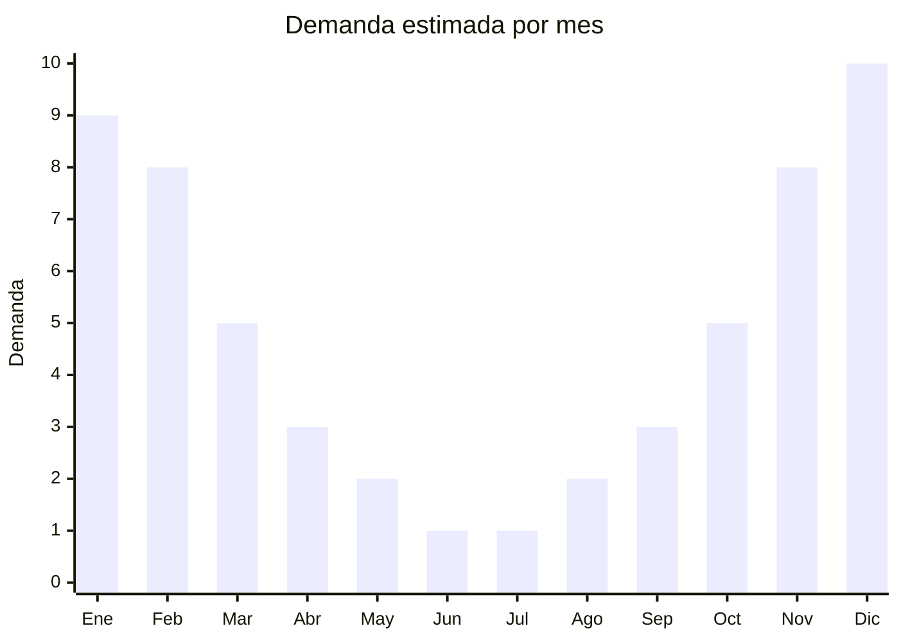

# Bijouterie temática playa y mar

> **Capítulo NCM 71** — Perlas, piedras preciosas, bisutería | **Temporada:** Verano (Dic–Feb)

## Qué es y por qué importarlo

La bijouterie temática de playa y mar engloba collares, pulseras, anillos, aros y accesorios decorados con motivos marinos: caracoles naturales o imitación, estrellas de mar, anclas, caballitos de mar, olas, timones, conchas cowrie y piedras turquesa. Es una categoría de accesorios de moda con fuerte identidad estética asociada al estilo bohemio costero (boho-beach), que se popularizó globalmente a través de Instagram y Pinterest.

Yiwu (Zhejiang, China) es el centro mundial indiscutido de producción de bijouterie económica. Miles de fábricas y talleres producen millones de piezas mensuales en todos los materiales imaginables: aleaciones metálicas, acero inoxidable, hilo encerado, resina, conchas naturales, cuentas de cristal y piedras semipreciosas. Los precios FOB arrancan desde USD 0.20 por pieza, lo que permite márgenes extraordinarios en el mercado argentino.

El canal de venta principal es online (MercadoLibre, Instagram Shopping, ferias de emprendedores) y locales en zonas turísticas costeras. Es un producto ideal para emprendedores que buscan iniciar en importación con baja inversión: el MOQ es bajo, el flete es mínimo por el peso negligible, y no requiere certificaciones ni trámites complejos. La clave del éxito está en la curación del surtido y la presentación visual (fotografía de producto tipo lifestyle).

## Datos clave

| Dato | Valor |
|------|-------|
| **Posiciones NCM típicas** | 7117.19.00 (bisutería de metales comunes), 7117.90.00 (bisutería de otros materiales) |
| **Derecho de importación** | 18% (DIE) + 3% tasa estadística |
| **Rango FOB típico** | USD 0.20 — USD 1.50 por unidad |
| **Precio de venta en Argentina** | ARS 1.500 — ARS 6.000 |
| **Margen bruto estimado** | 200% — 600% |
| **MOQ típico** | 50 — 300 unidades (por modelo) |
| **Demanda en MercadoLibre** | Alta (estacional) |
| **Competencia en MercadoLibre** | Alta |
| **Dificultad para importar** | Muy Fácil (liviano, sin regulaciones) |
| **Certificaciones necesarias** | No requiere certificaciones especiales |
| **Antidumping** | No |

## Variantes y subtipos más comunes

| Subtipo / Variante | FOB aprox. | Venta AR aprox. | Nota |
|--------------------|-----------|-----------------|------|
| Collar conchas cowrie | USD 0.30 — 0.80 | ARS 2.500 — 5.000 | **Más vendido**, icónico boho-playa |
| Pulsera hilo con dije ancla/timón | USD 0.20 — 0.50 | ARS 1.500 — 3.000 | Unisex, bajo costo |
| Set pulseras x5 temática mar | USD 0.80 — 1.50 | ARS 4.000 — 6.000 | Pack variado, ideal regalo |
| Aros colgantes estrella de mar | USD 0.30 — 0.80 | ARS 2.000 — 4.000 | Acero o aleación |
| Anillo ola/surf ajustable | USD 0.20 — 0.50 | ARS 1.500 — 3.500 | Minimalista, tendencia surf |

## Regulaciones y requisitos

<Tabs>
  <Tab title="Certificaciones">
    | Organismo | Requiere | Detalle |
    |-----------|----------|---------|
    | ARCA (Aduana) | Sí siempre | Despacho estándar |
    | ANMAT | No | No aplica |
    | ENACOM | No | No es electrónico |
    | SENASA | No | No aplica |

    **Recomendación:** Solicitar certificado libre de níquel y plomo al proveedor. Para piezas con conchas naturales, verificar que no sean especies protegidas por CITES (las conchas cowrie comunes no están protegidas, pero algunas especies exóticas sí). El acero inoxidable 316L es la mejor opción para resistencia al agua salada.
  </Tab>

  <Tab title="Etiquetado">
    | Requisito | Aplica |
    |-----------|--------|
    | Idioma español | Sí |
    | Datos del importador | Sí |
    | Composición / materiales | Sí (tipo de metal, conchas, cuentas) |
    | País de origen | Sí |
    | Advertencia alérgenos | Recomendado (níquel) |
  </Tab>

  <Tab title="Restricciones">
    Sin restricciones especiales de importación. No hay antidumping ni licencias previas para bisutería.

    **Atención:** Si las piezas incluyen conchas naturales, asegurar que la especie no esté listada en CITES. Las conchas cowrie (Cypraea moneta) de uso común en bijouterie NO están protegidas. En caso de duda, solicitar al proveedor la identificación de la especie de concha utilizada.
  </Tab>
</Tabs>

## Logística

| Dato | Valor |
|------|-------|
| **Peso típico por unidad** | 5 — 50 gramos |
| **Volumen típico** | Mínimo (ultraliviano) |
| **Fragilidad** | Baja-Media (conchas naturales pueden romperse) |
| **Envío recomendado** | Aéreo o courier (peso mínimo) |
| **Tiempo total estimado** | 15 — 30 días (aéreo/courier) |
| **Baterías de litio** | No |
| **Requiere empaque especial** | No (bolsitas OPP, piezas con conchas en burbujas) |

<Tip>
Armar **kits temáticos** con el proveedor (ej: "Kit Playa" con collar + 2 pulseras + tobillera + anillo) para vender como set a mayor ticket promedio. Los kits en packaging bonito (cajita kraft con moño) tienen mejor conversión que piezas sueltas y permiten un precio de venta 30-50% superior a la suma de piezas individuales.
</Tip>

## Estacionalidad



| Aspecto | Detalle |
|---------|---------|
| **Meses pico** | Noviembre-Febrero (verano, vacaciones, playa) |
| **Meses valle** | Mayo-Agosto (invierno, sin demanda estética playera) |
| **Cuándo pedir** | Septiembre-Octubre para tener stock en noviembre |

## Ventajas y riesgos

<CardGroup cols={2}>
  <Card title="Ventajas" icon="circle-check">
    - Márgenes excepcionales (200-600%)
    - Inversión inicial mínima (MOQ bajo, flete irrelevante)
    - Sin barreras regulatorias
    - Ideal para primera importación / emprendedores
    - Tendencia boho-playa sostenida por redes sociales
  </Card>
  <Card title="Riesgos" icon="triangle-exclamation">
    - Muy estacional: stock parado en invierno
    - Competencia muy alta en marketplaces
    - Tendencias de moda efímeras
    - Calidad inconsistente entre proveedores de Yiwu
    - Percepción de producto genérico si no se diferencia con branding
  </Card>
</CardGroup>

## Palabras clave para buscar en Alibaba

```
beach jewelry wholesale, shell necklace cowrie, bohemian beach bracelet,
sea star earrings wholesale, anchor bracelet men, ocean theme jewelry set,
beach accessories Yiwu, summer jewelry wholesale shell charm
```

## Fuentes

- [MercadoLibre Argentina — Bijouterie playa](https://listado.mercadolibre.com.ar/bijouterie-playa)
- [Alibaba — Beach jewelry wholesale](https://www.alibaba.com/showroom/beach-jewelry-wholesale.html)
