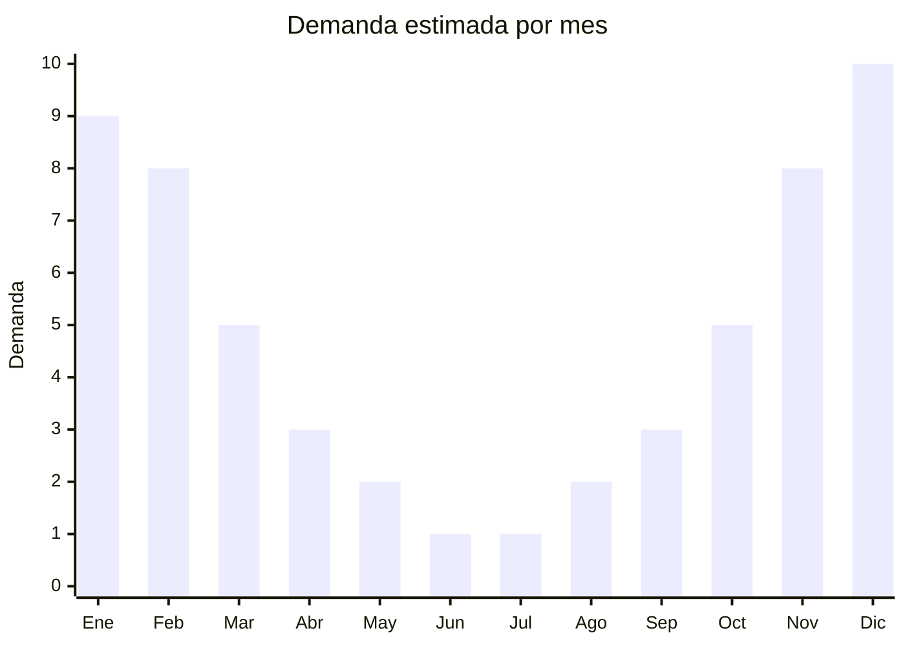

# Tobilleras y pulseras de tobillo playeras

> **Capítulo NCM 71** — Perlas, piedras preciosas, bisutería | **Temporada:** Verano (Dic–Feb)

## Qué es y por qué importarlo

Las tobilleras (anklets o ankle bracelets) son accesorios de bisutería que se usan alrededor del tobillo, especialmente populares durante el verano cuando se usan con sandalias, ojotas o descalzo en la playa. Son piezas ultralivianas fabricadas en aleación metálica, acero inoxidable, hilo encerado, cuentas de cristal o conchas naturales, con diseños que van desde cadenas minimalistas hasta modelos bohemios con dijes de estrella de mar, conchas y piedras turquesa.

Yiwu (Zhejiang, China) es el centro mundial de producción de bisutería económica y concentra miles de fábricas y talleres que producen tobilleras en volúmenes masivos. Los precios FOB son extremadamente bajos (desde USD 0.30 por pieza) lo que permite márgenes muy atractivos en el mercado argentino. La tendencia de tobilleras playeras se impulsa fuertemente por Instagram y TikTok, donde influencers de moda y lifestyle las exhiben en contenido de playa y vacaciones.

Es un producto ideal para venta online (MercadoLibre, Instagram, TikTok Shop), ferias de verano y locales de playa. El peso y volumen mínimos hacen que el flete sea prácticamente irrelevante en la estructura de costos. Se puede combinar con otras categorías de bijouterie playera en el mismo envío para maximizar el aprovechamiento del flete.

## Datos clave

| Dato | Valor |
|------|-------|
| **Posiciones NCM típicas** | 7117.19.00 (bisutería de metales comunes), 7117.90.00 (bisutería de otros materiales) |
| **Derecho de importación** | 18% (DIE) + 3% tasa estadística |
| **Rango FOB típico** | USD 0.30 — USD 2.00 por unidad |
| **Precio de venta en Argentina** | ARS 2.000 — ARS 8.000 |
| **Margen bruto estimado** | 200% — 500% |
| **MOQ típico** | 100 — 500 unidades (por modelo) |
| **Demanda en MercadoLibre** | Alta (estacional) |
| **Competencia en MercadoLibre** | Alta |
| **Dificultad para importar** | Muy Fácil (liviano, sin regulaciones) |
| **Certificaciones necesarias** | No requiere certificaciones especiales |
| **Antidumping** | No |

## Variantes y subtipos más comunes

| Subtipo / Variante | FOB aprox. | Venta AR aprox. | Nota |
|--------------------|-----------|-----------------|------|
| Tobillera cadena simple metal | USD 0.30 — 0.50 | ARS 2.000 — 3.500 | Minimalista, uso diario |
| Tobillera hilo encerado con dijes | USD 0.30 — 0.80 | ARS 2.000 — 4.000 | **Más vendida**, estética boho |
| Set tobilleras x3-5 unidades | USD 0.80 — 1.50 | ARS 4.000 — 6.000 | Pack variado, ideal regalo |
| Tobillera acero inoxidable | USD 1.00 — 2.00 | ARS 5.000 — 8.000 | Premium, no se oxida |
| Tobillera con conchas/caracoles | USD 0.50 — 1.00 | ARS 3.000 — 5.000 | Tendencia playa natural |

## Regulaciones y requisitos

<Tabs>
  <Tab title="Certificaciones">
    | Organismo | Requiere | Detalle |
    |-----------|----------|---------|
    | ARCA (Aduana) | Sí siempre | Despacho estándar |
    | ANMAT | No | No aplica |
    | ENACOM | No | No es electrónico |
    | SENASA | No | No aplica |

    **Recomendación:** Aunque no es obligatorio, solicitar al proveedor certificado de que los metales son libres de níquel y plomo. Las reacciones alérgicas al níquel son comunes y pueden generar reclamos de clientes. El acero inoxidable 316L es hipoalergénico y resiste el agua salada.
  </Tab>

  <Tab title="Etiquetado">
    | Requisito | Aplica |
    |-----------|--------|
    | Idioma español | Sí |
    | Datos del importador | Sí |
    | Composición / materiales | Sí (tipo de metal o material) |
    | País de origen | Sí |
    | Advertencia alérgenos | Recomendado (níquel) |
  </Tab>

  <Tab title="Restricciones">
    Sin restricciones especiales de importación. No hay antidumping ni licencias previas para bisutería.

    **Atención:** Verificar que las tobilleras no contengan plomo ni cadmio, especialmente si se comercializan como "aptas para niñas/adolescentes". En algunos mercados hay regulaciones sobre metales pesados en bisutería; aunque Argentina no las exige formalmente, es buena práctica para evitar problemas reputacionales.
  </Tab>
</Tabs>

## Logística

| Dato | Valor |
|------|-------|
| **Peso típico por unidad** | 5 — 30 gramos |
| **Volumen típico** | Mínimo (ultraliviano) |
| **Fragilidad** | Baja (flexible, no se rompe) |
| **Envío recomendado** | Aéreo o courier (peso mínimo) |
| **Tiempo total estimado** | 15 — 30 días (aéreo/courier) |
| **Baterías de litio** | No |
| **Requiere empaque especial** | No (bolsitas OPP individuales) |

<Tip>
El peso y volumen de las tobilleras es tan bajo que el envío aéreo o por courier resulta viable incluso para pedidos pequeños. **1.000 tobilleras pesan aproximadamente 10-15 kg** y caben en una caja de 40x40x40 cm. Combinar con otros accesorios de bijouterie playera (pulseras, collares, anillos) para armar un surtido completo de verano en un solo envío.
</Tip>

## Estacionalidad



| Aspecto | Detalle |
|---------|---------|
| **Meses pico** | Noviembre-Febrero (verano, playa, vacaciones) |
| **Meses valle** | Mayo-Agosto (invierno, no se usan) |
| **Cuándo pedir** | Septiembre-Octubre para tener stock en noviembre |

## Ventajas y riesgos

<CardGroup cols={2}>
  <Card title="Ventajas" icon="circle-check">
    - Márgenes extraordinarios (200-500%)
    - Peso y volumen mínimos: flete irrelevante
    - Sin barreras regulatorias
    - Tendencia impulsada por redes sociales
    - MOQ bajo: se puede empezar con poca inversión
  </Card>
  <Card title="Riesgos" icon="triangle-exclamation">
    - Muy estacional: demanda cae drásticamente en invierno
    - Competencia alta en MercadoLibre
    - Tendencias de moda cambian rápidamente
    - Calidad variable: metales que se oscurecen o generan alergia
    - Percepción de producto barato puede limitar precio de venta
  </Card>
</CardGroup>

## Palabras clave para buscar en Alibaba

```
anklet wholesale, ankle bracelet beach, bohemian anklet shell,
anklet stainless steel, summer ankle chain wholesale, beach anklet set,
anklet women fashion Yiwu, ankle bracelet charm sea star
```

## Fuentes

- [MercadoLibre Argentina — Tobilleras](https://listado.mercadolibre.com.ar/tobilleras)
- [Alibaba — Anklet wholesale](https://www.alibaba.com/showroom/anklet-wholesale.html)
