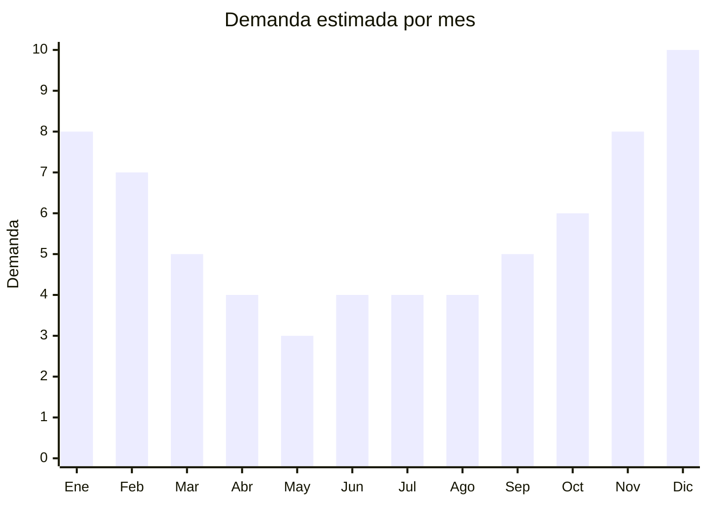

# Accesorios de asado de acero

> **Capítulo NCM 73** — Manufacturas de hierro o acero | **Temporada:** Verano (Dic–Feb)

## Qué es y por qué importarlo

Los accesorios de asado de acero incluyen sets de parrilla, pinchos/brochetas, pinzas, espátulas, tenedores, cepillos de limpieza, sopladores, tablas con pinche y maletines organizadores. En Argentina (y en toda Latinoamérica), el asado es mucho más que una comida: es una tradición social que se intensifica en verano, cuando los encuentros al aire libre son cotidianos. Además, los sets de asado son uno de los regalos más populares para Navidad y Día del Padre.

Yangjiang (Guangdong, China) es la capital mundial de la cuchillería y utensilios de acero, con una tradición productiva de más de 1.500 años. Cientos de fábricas producen accesorios de parrilla en acero inoxidable, acero al carbono y combinaciones con mangos de madera, a precios FOB que arrancan desde USD 5 por set básico. Tramontina (Brasil) es la marca de referencia regional, y los productos chinos compiten directamente en precio con calidad aceptable para el segmento medio.

El canal de venta es amplio: MercadoLibre, bazares, ferreterías, tiendas de regalos, supermercados y venta directa en ferias. Los sets presentados en maletín o caja regalo tienen especial tracción para fechas especiales. Es un producto que se vende todo el año con picos marcados en verano y diciembre.

## Datos clave

| Dato | Valor |
|------|-------|
| **Posiciones NCM típicas** | 7323.93.00 (artículos de uso doméstico de acero inoxidable), 7326.90.90 (demás manufacturas de hierro o acero) |
| **Derecho de importación** | 18% (DIE) + 3% tasa estadística |
| **Rango FOB típico** | USD 5.00 — USD 20.00 por set |
| **Precio de venta en Argentina** | ARS 10.000 — ARS 138.000 |
| **Margen bruto estimado** | 100% — 300% |
| **MOQ típico** | 200 — 1.000 sets |
| **Demanda en MercadoLibre** | Alta |
| **Competencia en MercadoLibre** | Alta |
| **Dificultad para importar** | Fácil-Media |
| **Certificaciones necesarias** | No requiere certificaciones especiales |
| **Antidumping** | No |

## Variantes y subtipos más comunes

| Subtipo / Variante | FOB aprox. | Venta AR aprox. | Nota |
|--------------------|-----------|-----------------|------|
| Set básico 3 piezas (pinza, tenedor, espátula) | USD 5.00 — 8.00 | ARS 10.000 — 25.000 | Entrada de gama |
| Set 5-7 piezas con estuche | USD 8.00 — 12.00 | ARS 25.000 — 50.000 | **Más vendido**, ideal regalo |
| Set premium 10+ piezas en maletín | USD 12.00 — 20.00 | ARS 50.000 — 100.000 | Regalo premium Navidad/Día del Padre |
| Pinchos/brochetas x6-12 unidades | USD 3.00 — 6.00 | ARS 8.000 — 20.000 | Complementario, alto volumen |
| Set con tabla y cuchillo trinchante | USD 10.00 — 18.00 | ARS 40.000 — 138.000 | Presentación premium con madera |

## Regulaciones y requisitos

<Tabs>
  <Tab title="Certificaciones">
    | Organismo | Requiere | Detalle |
    |-----------|----------|---------|
    | ARCA (Aduana) | Sí siempre | Despacho estándar |
    | ANMAT | No obligatorio | No hay contacto prolongado con alimentos |
    | ENACOM | No | No es electrónico |
    | SENASA | No | No aplica |

    **Recomendación:** Aunque no es obligatorio, solicitar certificado de material "food grade" para los utensilios que tendrán contacto con alimentos (pinzas, tenedor, espátula). El acero inoxidable 430 es aceptable para accesorios de parrilla (no requiere la resistencia a corrosión del 304). Verificar que los mangos de madera estén bien fijados y no tengan astillas.
  </Tab>

  <Tab title="Etiquetado">
    | Requisito | Aplica |
    |-----------|--------|
    | Idioma español | Sí |
    | Datos del importador | Sí |
    | Composición / materiales | Sí (tipo de acero, material del mango) |
    | País de origen | Sí |
    | Garantía legal 6 meses | Sí |
    | Contenido del set | Sí (listar piezas incluidas) |
  </Tab>

  <Tab title="Restricciones">
    Sin restricciones especiales de importación. No hay antidumping ni licencias previas para accesorios de asado.

    **Atención:** Los cuchillos incluidos en sets de asado pueden tener restricciones de envío aéreo. Si se envía por courier/aéreo, verificar las políticas del transportista respecto a objetos cortantes. Por marítimo no hay restricción.
  </Tab>
</Tabs>

## Logística

| Dato | Valor |
|------|-------|
| **Peso típico por set** | 0.5 — 3.0 kg |
| **Volumen típico** | Medio (sets en maletín ocupan más) |
| **Fragilidad** | Baja (acero, resistente) |
| **Envío recomendado** | Marítimo LCL o FCL según volumen |
| **Tiempo total estimado** | 50 — 80 días (marítimo) |
| **Baterías de litio** | No |
| **Requiere empaque especial** | No (caja individual estándar) |

<Tip>
Solicitar al proveedor **personalización del packaging** con logo propio y diseño orientado a regalo: caja con ventana transparente, maletín de aluminio o caja de madera. El packaging premium puede aumentar el precio de venta un **30-50%** sin modificar significativamente el costo FOB. En Argentina, un set de asado presentado en maletín se percibe como regalo de categoría y se vende a un precio muy superior al mismo producto en bolsa plástica.
</Tip>

## Estacionalidad



| Aspecto | Detalle |
|---------|---------|
| **Meses pico** | Noviembre-Febrero (verano + Navidad + regalos) |
| **Meses valle** | Marzo-Mayo (post temporada, pero nunca cae a cero) |
| **Cuándo pedir** | Agosto-Septiembre para tener stock en noviembre (inicio verano + previo a Navidad) |

## Ventajas y riesgos

<CardGroup cols={2}>
  <Card title="Ventajas" icon="circle-check">
    - Demanda sostenida todo el año con picos en verano y Navidad
    - Producto cultural: el asado es tradición argentina
    - Ideal para marca propia y packaging premium
    - Sin barreras regulatorias complejas
    - Yangjiang ofrece variedad enorme y precios competitivos
  </Card>
  <Card title="Riesgos" icon="triangle-exclamation">
    - Competencia alta con Tramontina y marcas locales
    - Calidad del filo y terminación variable entre proveedores
    - Mangos de madera pueden aflojarse o astillarse
    - Percepción negativa del "made in China" en cuchillería
    - Sets baratos saturan el mercado en temporada
  </Card>
</CardGroup>

## Palabras clave para buscar en Alibaba

```
BBQ tool set stainless steel, grilling accessories set, barbecue utensil set case,
BBQ skewers stainless steel, grill tool set Yangjiang, barbecue set gift box,
BBQ tongs spatula fork set, stainless steel BBQ set wholesale
```

## Fuentes

- [MercadoLibre Argentina — Set asado acero](https://listado.mercadolibre.com.ar/set-asado)
- [Alibaba — BBQ tool set stainless steel](https://www.alibaba.com/showroom/bbq-tool-set-stainless-steel.html)
