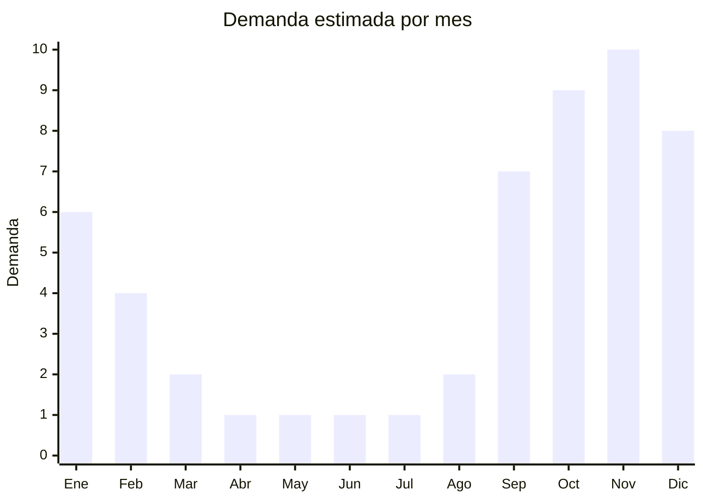

# Cascadas y cortinas de agua inox para pileta

> **Capítulo NCM 73** — Manufacturas de hierro o acero | **Temporada:** Verano (Dic–Feb)

## Qué es y por qué importarlo

Las cascadas y cortinas de agua de acero inoxidable son accesorios decorativos y funcionales que se instalan en el borde de piletas de natación, spas y fuentes ornamentales para crear un efecto visual y sonoro de agua cayendo en cortina o cascada. Se fabrican en acero inoxidable AISI 304 para resistir el contacto permanente con agua clorada y la exposición a la intemperie. Los modelos más populares van desde cascadas compactas de 30 cm de ancho hasta cortinas de agua de 150 cm que crean un muro de agua espectacular.

China es el principal fabricante mundial de cascadas de pileta en acero inoxidable, con fábricas concentradas en Guangdong y Zhejiang que producen modelos para mercados globales. Los precios FOB chinos (USD 20-80 según tamaño) representan una fracción del costo de fabricantes locales o europeos, con calidad de terminación comparable en los proveedores de gama media-alta.

Es un producto de nicho premium dirigido a pileteros que atienden el segmento medio-alto y alto, arquitectos paisajistas, constructores de spas y hoteles. La demanda está vinculada al ciclo de construcción de piletas (septiembre-diciembre) y al mercado de remodelación/upgrade de piletas existentes. Los márgenes son atractivos y la competencia importadora es todavía limitada en Argentina.

## Datos clave

| Dato | Valor |
|------|-------|
| **Posiciones NCM típicas** | 7326.90.90 (demás manufacturas de hierro o acero), 7324.90.00 (artículos de higiene de acero inoxidable) |
| **Derecho de importación** | 14-18% (DIE) + 3% tasa estadística |
| **Rango FOB típico** | USD 20.00 — USD 80.00 por unidad |
| **Precio de venta en Argentina** | ARS 80.000 — ARS 300.000 |
| **Margen bruto estimado** | 100% — 200% |
| **MOQ típico** | 20 — 100 unidades |
| **Demanda en MercadoLibre** | Baja-Media (nicho premium) |
| **Competencia en MercadoLibre** | Baja |
| **Dificultad para importar** | Media (pesado, clasificación NCM) |
| **Certificaciones necesarias** | No requiere certificaciones especiales |
| **Antidumping** | No |

## Variantes y subtipos más comunes

| Subtipo / Variante | FOB aprox. | Venta AR aprox. | Nota |
|--------------------|-----------|-----------------|------|
| Cascada compacta 30 cm | USD 20.00 — 30.00 | ARS 80.000 — 130.000 | Piletas pequeñas/medianas |
| Cascada estándar 60 cm | USD 30.00 — 45.00 | ARS 130.000 — 200.000 | **Más vendida** |
| Cortina de agua 90 cm | USD 40.00 — 55.00 | ARS 180.000 — 240.000 | Efecto muro de agua |
| Cortina de agua 120-150 cm | USD 55.00 — 80.00 | ARS 240.000 — 300.000 | Premium, piletas grandes |
| Cascada con LED integrado | USD 40.00 — 70.00 | ARS 150.000 — 280.000 | Iluminación RGB, efecto nocturno |

## Regulaciones y requisitos

<Tabs>
  <Tab title="Certificaciones">
    | Organismo | Requiere | Detalle |
    |-----------|----------|---------|
    | ARCA (Aduana) | Sí siempre | Despacho estándar |
    | ANMAT | No | No aplica |
    | ENACOM | Según modelo | Solo si incluye controlador LED con módulo inalámbrico |
    | INTI | No obligatorio | Puede solicitarse ensayo de material |

    **Recomendación:** Al igual que con las escaleras, exigir certificado de material AISI 304 genuino. Verificar que las soldaduras sean tipo TIG (soldadura por arco con gas inerte) que producen cordones limpios y estéticos, esenciales en un producto decorativo visible. Para modelos con LED, verificar grado de protección IP68 (sumergible).
  </Tab>

  <Tab title="Etiquetado">
    | Requisito | Aplica |
    |-----------|--------|
    | Idioma español | Sí |
    | Datos del importador | Sí |
    | Composición / materiales | Sí (AISI 304, dimensiones) |
    | País de origen | Sí |
    | Garantía legal 6 meses | Sí |
    | Instrucciones de instalación | Sí |
    | Caudal de agua recomendado | Recomendado |
  </Tab>

  <Tab title="Restricciones">
    Sin restricciones especiales para cascadas de acero inoxidable sin componentes eléctricos.

    **Atención:** Los modelos con iluminación LED integrada pueden requerir intervención de ENACOM si incluyen controlador con conexión WiFi o Bluetooth. Los modelos con LED cableado simple (sin módulo inalámbrico) generalmente no requieren ENACOM, pero verificar con el despachante.
  </Tab>
</Tabs>

## Logística

| Dato | Valor |
|------|-------|
| **Peso típico por unidad** | 3 — 15 kg (según ancho) |
| **Volumen típico** | Medio-Alto (formas irregulares) |
| **Fragilidad** | Baja (acero inoxidable robusto) |
| **Envío recomendado** | Marítimo LCL o FCL según cantidad |
| **Tiempo total estimado** | 60 — 90 días (marítimo) |
| **Baterías de litio** | No (modelos sin LED) / Posible (modelos con controlador LED) |
| **Requiere empaque especial** | Sí (film protector antirrayaduras, cartón reforzado) |

<Tip>
Las cascadas de acero inoxidable son un producto donde la **terminación superficial** es crítica: cualquier rayadura durante el transporte deprecia el producto. Exigir al proveedor **film plástico protector** en toda la superficie visible y empaque individual en caja de cartón con espuma. Combinar cascadas con escaleras de pileta del mismo proveedor para optimizar el flete y ofrecer un catálogo completo al piletero.
</Tip>

## Estacionalidad



| Aspecto | Detalle |
|---------|---------|
| **Meses pico** | Septiembre-Diciembre (construcción y remodelación de piletas) |
| **Meses valle** | Abril-Agosto (no se construyen piletas en invierno) |
| **Cuándo pedir** | Mayo-Junio para tener stock en septiembre (arranque de temporada) |

## Ventajas y riesgos

<CardGroup cols={2}>
  <Card title="Ventajas" icon="circle-check">
    - Nicho premium con pocos importadores en Argentina
    - Márgenes atractivos en segmento medio-alto
    - Producto robusto (acero inoxidable no se rompe)
    - Complementario a escaleras y venecitas (venta cruzada)
    - Tendencia creciente de piletas con diseño
  </Card>
  <Card title="Riesgos" icon="triangle-exclamation">
    - Nicho reducido: mercado limitado
    - Estacionalidad pronunciada (sep-dic)
    - Riesgo de rayadura en tránsito si empaque es inadecuado
    - Verificar calidad AISI 304 real (no 201)
    - Modelos con LED agregan complejidad regulatoria (ENACOM)
  </Card>
</CardGroup>

## Palabras clave para buscar en Alibaba

```
pool waterfall stainless steel, swimming pool water curtain, pool fountain spillway,
stainless steel waterfall 304, pool water feature stainless, cascade pool inox,
swimming pool waterfall LED, water curtain wall pool stainless steel
```

## Fuentes

- [MercadoLibre Argentina — Cascada pileta acero inoxidable](https://listado.mercadolibre.com.ar/cascada-pileta-acero-inoxidable)
- [Alibaba — Stainless steel pool waterfall](https://www.alibaba.com/showroom/stainless-steel-pool-waterfall.html)
