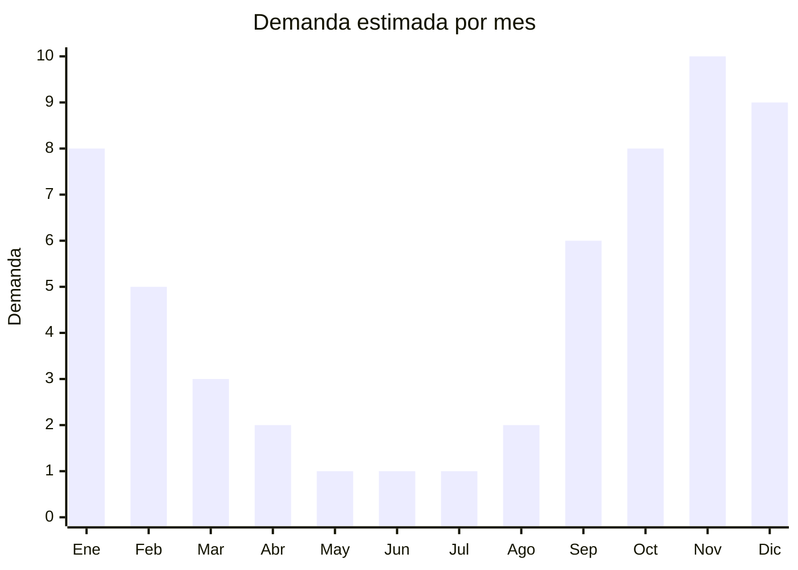

# Escaleras de acero inoxidable para pileta

> **Capítulo NCM 73** — Manufacturas de hierro o acero | **Temporada:** Verano (Dic–Feb)

## Qué es y por qué importarlo

Las escaleras para pileta de acero inoxidable son estructuras de acceso compuestas por pasamanos tubulares y peldaños antideslizantes, fabricadas en acero inoxidable AISI 304 (el estándar para resistencia al cloro y la intemperie). Se instalan en el borde de piletas de natación enterradas para facilitar la entrada y salida del agua de manera segura. Son un componente esencial en toda pileta nueva y un repuesto frecuente en piletas existentes donde la escalera original se deterioró por corrosión.

China produce escaleras de pileta en acero inoxidable a precios FOB entre USD 30 y USD 80, significativamente más baratos que los fabricantes locales argentinos o europeos. Las fábricas principales están en Guangdong y Zhejiang, y muchas de ellas proveen a marcas reconocidas bajo modalidad OEM. Los modelos estándar de 2, 3 y 4 escalones cubren la gran mayoría del mercado.

El canal de venta es predominantemente B2B: pileteros, corralones de materiales y distribuidores de accesorios para piletas. También hay demanda en MercadoLibre de particulares que necesitan reemplazar la escalera de su pileta. El principal desafío logístico es el peso y volumen: cada escalera pesa entre 8 y 20 kg según el modelo, lo que impacta directamente en el costo del flete marítimo.

## Datos clave

| Dato | Valor |
|------|-------|
| **Posiciones NCM típicas** | 7326.90.90 (demás manufacturas de hierro o acero), 7308.90.90 (estructuras de hierro o acero) |
| **Derecho de importación** | 14-18% (DIE) + 3% tasa estadística |
| **Rango FOB típico** | USD 30.00 — USD 80.00 por unidad |
| **Precio de venta en Argentina** | ARS 100.000 — ARS 500.000 |
| **Margen bruto estimado** | 100% — 200% |
| **MOQ típico** | 50 — 200 unidades |
| **Demanda en MercadoLibre** | Media (nicho) |
| **Competencia en MercadoLibre** | Baja-Media |
| **Dificultad para importar** | Media-Alta (pesado, voluminoso) |
| **Certificaciones necesarias** | No requiere certificaciones especiales |
| **Antidumping** | No |

## Variantes y subtipos más comunes

| Subtipo / Variante | FOB aprox. | Venta AR aprox. | Nota |
|--------------------|-----------|-----------------|------|
| Escalera 2 peldaños estándar | USD 30.00 — 40.00 | ARS 100.000 — 180.000 | Piletas poco profundas |
| Escalera 3 peldaños estándar | USD 40.00 — 55.00 | ARS 180.000 — 300.000 | **Más vendida**, profundidad estándar |
| Escalera 4 peldaños | USD 55.00 — 70.00 | ARS 300.000 — 420.000 | Piletas profundas |
| Escalera con pasamanos curvo | USD 50.00 — 65.00 | ARS 250.000 — 380.000 | Diseño premium |
| Escalera tipo romana (ancha) | USD 60.00 — 80.00 | ARS 350.000 — 500.000 | Estética premium, piletas de diseño |

## Regulaciones y requisitos

<Tabs>
  <Tab title="Certificaciones">
    | Organismo | Requiere | Detalle |
    |-----------|----------|---------|
    | ARCA (Aduana) | Sí siempre | Despacho estándar |
    | ANMAT | No | No aplica |
    | ENACOM | No | No es electrónico |
    | INTI | No obligatorio | Puede solicitarse ensayo de resistencia a corrosión |

    **Recomendación:** Exigir certificado de material AISI 304 genuino (composición química con porcentaje de cromo y níquel). Muchos proveedores chinos sustituyen por AISI 201, que es más barato pero se corroe rápidamente con el cloro. El AISI 304 contiene 18% cromo y 8% níquel; el 201 solo 1% níquel. Solicitar reporte de ensayo SGS o equivalente.
  </Tab>

  <Tab title="Etiquetado">
    | Requisito | Aplica |
    |-----------|--------|
    | Idioma español | Sí |
    | Datos del importador | Sí |
    | Composición / materiales | Sí (AISI 304, espesor de tubo) |
    | Capacidad de carga máxima | Recomendado |
    | País de origen | Sí |
    | Garantía legal 6 meses | Sí |
    | Instrucciones de instalación | Sí |
  </Tab>

  <Tab title="Restricciones">
    Sin restricciones especiales de importación. No hay antidumping ni licencias previas para escaleras de acero inoxidable.

    **Atención:** Verificar la calidad de las soldaduras: es el punto de falla más común en escaleras importadas. Soldaduras porosas o con rebabas comprometen tanto la seguridad como la estética. Solicitar fotos de detalle de soldaduras antes de confirmar el pedido.
  </Tab>
</Tabs>

## Logística

| Dato | Valor |
|------|-------|
| **Peso típico por unidad** | 8 — 20 kg |
| **Volumen típico** | Alto (estructura tubular, difícil de anidar) |
| **Fragilidad** | Baja (acero inoxidable, resistente) |
| **Envío recomendado** | Marítimo LCL o FCL según volumen |
| **Tiempo total estimado** | 60 — 90 días (marítimo) |
| **Baterías de litio** | No |
| **Requiere empaque especial** | Sí (cartón + foam en pasamanos, film plástico protector) |

<Tip>
Las escaleras de pileta son voluminosas pero pueden optimizarse para el flete: solicitar al proveedor que envíe **desarmadas** (pasamanos y peldaños por separado) en cajas planas. Esto puede reducir el CBM hasta un **50%** comparado con el envío armado. El ensamblaje final es simple (tornillos y bridas) y puede hacerlo el piletero o el usuario final.
</Tip>

## Estacionalidad



| Aspecto | Detalle |
|---------|---------|
| **Meses pico** | Septiembre-Enero (construcción y puesta a punto de piletas) |
| **Meses valle** | Abril-Agosto (no se instalan piletas en invierno) |
| **Cuándo pedir** | Mayo-Junio para tener stock en septiembre (inicio temporada) |

## Ventajas y riesgos

<CardGroup cols={2}>
  <Card title="Ventajas" icon="circle-check">
    - Producto esencial en toda pileta nueva
    - Demanda de reposición constante (corrosión de escaleras viejas)
    - Pocos importadores especializados en Argentina
    - Canal B2B con clientes recurrentes
    - Sin certificaciones complejas
  </Card>
  <Card title="Riesgos" icon="triangle-exclamation">
    - Producto pesado y voluminoso: flete elevado
    - Riesgo de recibir AISI 201 en lugar de 304 (verificar composición)
    - Calidad de soldaduras variable entre proveedores
    - Estacionalidad marcada (sep-ene)
    - Competencia con fabricantes locales en segmento medio
  </Card>
</CardGroup>

## Palabras clave para buscar en Alibaba

```
swimming pool ladder stainless steel, pool ladder 304 stainless steel, inground pool ladder,
pool handrail stainless steel, 3 step pool ladder wholesale, pool ladder AISI 304,
swimming pool stair stainless, pool ladder manufacturer Guangdong
```

## Fuentes

- [MercadoLibre Argentina — Escalera pileta acero inoxidable](https://listado.mercadolibre.com.ar/escalera-pileta-acero-inoxidable)
- [Alibaba — Stainless steel pool ladder](https://www.alibaba.com/showroom/stainless-steel-swimming-pool-ladder.html)
