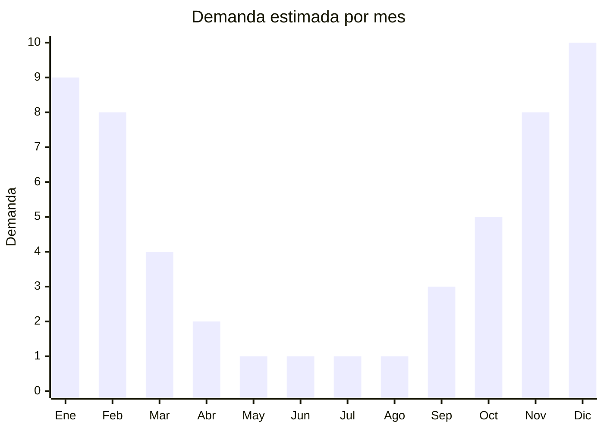

# Estructuras de aluminio para reposeras y sillas de playa

> **Capítulo NCM 76** — Aluminio y sus manufacturas | **Temporada:** Verano (Dic–Feb)

## Qué es y por qué importarlo

Las estructuras de aluminio para reposeras y sillas de playa son los armazones tubulares de aluminio anodizado o pintado que conforman el esqueleto de reposeras, sillas playeras, camastros y tumbonas. Pueden importarse como estructura sola (sin tela) para ensamblar localmente con lona o textileno, o como producto terminado con asiento ya montado. El aluminio es el material preferido para mobiliario de playa por su ligereza, resistencia a la corrosión del salitre y facilidad de plegado.

China domina la producción mundial de estructuras de aluminio para mobiliario outdoor, con fábricas concentradas en Guangdong (Foshan, Dongguan) y Zhejiang. Los precios FOB arrancan desde USD 8 por estructura básica hasta USD 25 para modelos premium con múltiples posiciones de reclinación. En Argentina, las reposeras y sillas de playa tienen demanda explosiva entre diciembre y febrero, con un mercado que incluye tanto consumidor final como hoteles, balnearios y alquiler de sombrillas en playas.

Es un producto donde la clasificación arancelaria puede generar dudas: dependiendo de cómo se presente (estructura sola vs. mueble terminado), puede clasificar bajo el Capítulo 76 (aluminio y manufacturas) o el Capítulo 94 (muebles). Esto afecta los derechos de importación y debe definirse con el despachante antes de importar.

## Datos clave

| Dato | Valor |
|------|-------|
| **Posiciones NCM típicas** | 7616.99.00 (demás manufacturas de aluminio), 9401.79.00 (asientos con armazón de metal — si incluye asiento) |
| **Derecho de importación** | 14-18% (DIE según NCM) + 3% tasa estadística |
| **Rango FOB típico** | USD 8.00 — USD 25.00 por unidad |
| **Precio de venta en Argentina** | ARS 54.000 — ARS 170.000 |
| **Margen bruto estimado** | 100% — 200% |
| **MOQ típico** | 200 — 1.000 unidades |
| **Demanda en MercadoLibre** | Alta (estacional) |
| **Competencia en MercadoLibre** | Media-Alta |
| **Dificultad para importar** | Media (NCM ambiguo, volumen) |
| **Certificaciones necesarias** | No requiere certificaciones especiales |
| **Antidumping** | No |

## Variantes y subtipos más comunes

| Subtipo / Variante | FOB aprox. | Venta AR aprox. | Nota |
|--------------------|-----------|-----------------|------|
| Silla playa plegable baja | USD 8.00 — 12.00 | ARS 54.000 — 80.000 | **Más vendida**, playera clásica |
| Reposera 3 posiciones | USD 12.00 — 18.00 | ARS 80.000 — 130.000 | Reclinable, playa y jardín |
| Reposera 5 posiciones premium | USD 18.00 — 25.00 | ARS 130.000 — 170.000 | Con apoyabrazos, portavasos |
| Camastro plegable plano | USD 15.00 — 22.00 | ARS 100.000 — 150.000 | Balnearios, hoteles |
| Estructura sola (sin tela) | USD 8.00 — 15.00 | ARS 54.000 — 90.000 | Para ensamble local con lona |

## Regulaciones y requisitos

<Tabs>
  <Tab title="Certificaciones">
    | Organismo | Requiere | Detalle |
    |-----------|----------|---------|
    | ARCA (Aduana) | Sí siempre | Despacho estándar |
    | ANMAT | No | No aplica |
    | ENACOM | No | No es electrónico |
    | INTI | No obligatorio | Puede solicitarse ensayo de resistencia de carga |

    **Recomendación:** Solicitar al proveedor ensayo de carga máxima (capacidad en kg) y certificado de calidad del aluminio (aleación 6061 o 6063 son las estándar para mobiliario). Verificar que las articulaciones de plegado sean robustas: es el punto de falla más frecuente. Los modelos con remaches de acero inoxidable en las articulaciones son más duraderos que los de aluminio.
  </Tab>

  <Tab title="Etiquetado">
    | Requisito | Aplica |
    |-----------|--------|
    | Idioma español | Sí |
    | Datos del importador | Sí |
    | Composición / materiales | Sí (aleación de aluminio, tipo de tela si incluye) |
    | Capacidad de carga máxima | Recomendado |
    | País de origen | Sí |
    | Garantía legal 6 meses | Sí |
    | Instrucciones de armado/uso | Sí |
  </Tab>

  <Tab title="Restricciones">
    Sin restricciones especiales de importación. No hay antidumping ni licencias previas.

    **Atención:** La clasificación NCM es ambigua y depende de cómo se presente el producto. **Estructura de aluminio sola** (sin asiento) tiende a clasificar en Cap. 76. **Mueble terminado** (con tela/textileno) puede clasificar en Cap. 94. Esto puede implicar diferentes derechos de importación. Definir con el despachante antes de comprar y solicitar al proveedor que la factura y el packing list reflejen la descripción acordada.
  </Tab>
</Tabs>

## Logística

| Dato | Valor |
|------|-------|
| **Peso típico por unidad** | 2 — 5 kg |
| **Volumen típico** | Alto (plegadas pero voluminosas) |
| **Fragilidad** | Baja (aluminio resistente a impactos) |
| **Envío recomendado** | Marítimo FCL (volumen alto para peso) |
| **Tiempo total estimado** | 50 — 80 días (marítimo) |
| **Baterías de litio** | No |
| **Requiere empaque especial** | No (bolsa plástica individual, caja master) |

<Tip>
Las reposeras y sillas de playa son productos de alto CBM y bajo peso: un contenedor de 20 pies puede cargar aproximadamente **400-600 unidades** plegadas. Negociar con el proveedor que las sillas se envíen **comprimidas al máximo** en su posición plegada y sin empaque individual voluminoso (bolsa plástica fina es suficiente). Cada centímetro de aire dentro del contenedor es dinero perdido.
</Tip>

## Estacionalidad



| Aspecto | Detalle |
|---------|---------|
| **Meses pico** | Diciembre-Febrero (verano, playa, vacaciones) |
| **Meses valle** | Mayo-Agosto (invierno, sin uso outdoor) |
| **Cuándo pedir** | Agosto-Septiembre para tener stock en noviembre (pre-temporada) |

## Ventajas y riesgos

<CardGroup cols={2}>
  <Card title="Ventajas" icon="circle-check">
    - Demanda masiva y predecible en verano
    - Producto liviano (aluminio) facilita transporte local
    - Sin certificaciones complejas
    - Posibilidad de importar estructura y ensamblar localmente
    - Canal amplio: consumidor final + hoteles + balnearios
  </Card>
  <Card title="Riesgos" icon="triangle-exclamation">
    - NCM ambiguo: clasificación puede variar según aduana
    - Alto CBM: flete costoso por volumen ocupado
    - Muy estacional: stock no vendido queda hasta siguiente verano
    - Articulaciones de plegado son punto de falla frecuente
    - Competencia con fabricantes locales y brasileños
  </Card>
</CardGroup>

## Palabras clave para buscar en Alibaba

```
aluminum beach chair wholesale, folding beach chair aluminum, reclining beach lounge chair,
aluminum sun lounger folding, beach chair frame aluminum, portable beach chair lightweight,
outdoor aluminum folding chair, beach lounger 5 position aluminum
```

## Fuentes

- [MercadoLibre Argentina — Reposera aluminio playa](https://listado.mercadolibre.com.ar/reposera-aluminio-playa)
- [Alibaba — Aluminum beach chair wholesale](https://www.alibaba.com/showroom/aluminum-beach-chair.html)
