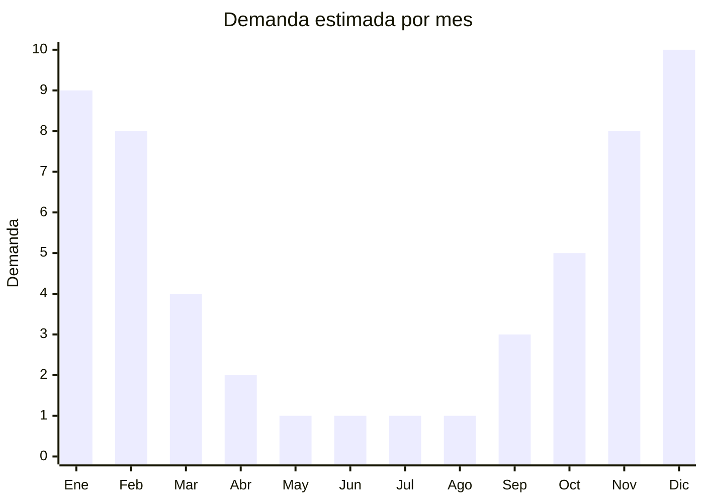

# Mesas plegables de aluminio para camping

> **Capítulo NCM 76** — Aluminio y sus manufacturas | **Temporada:** Verano (Dic–Feb)

## Qué es y por qué importarlo

Las mesas plegables de aluminio para camping son superficies portátiles compactas fabricadas con tablero y estructura de aluminio, diseñadas para actividades al aire libre: camping, picnic, playa, pesca y eventos. Se pliegan o enrollan hasta alcanzar un tamaño compacto que permite transportarlas en una bolsa o mochila. Los formatos principales son: roll-up (tablero de listones que se enrolla), plegable (tablero rígido que se pliega por la mitad) y telescópica (patas de altura ajustable).

China es el productor dominante global, con fábricas en Zhejiang y Guangdong que abastecen marcas como Naturehike, KingCamp y cientos de marcas blancas. Los precios FOB van desde USD 8 para mesas compactas individuales hasta USD 25 para mesas familiares con sillas incorporadas. En Argentina, la demanda de mesas de camping se intensifica en verano cuando las familias salen a acampar, hacer picnic y visitar playas.

Al igual que las reposeras de aluminio, la clasificación arancelaria puede ser ambigua: dependiendo de si se presenta como "estructura de aluminio" (Cap. 76) o como "mueble" (Cap. 94), los derechos de importación pueden variar. Esto debe definirse con el despachante de aduanas antes de realizar la compra.

## Datos clave

| Dato | Valor |
|------|-------|
| **Posiciones NCM típicas** | 7616.99.00 (demás manufacturas de aluminio), 9403.20.00 (demás muebles de metal) |
| **Derecho de importación** | 14-18% (DIE según NCM) + 3% tasa estadística |
| **Rango FOB típico** | USD 8.00 — USD 25.00 por unidad |
| **Precio de venta en Argentina** | ARS 20.000 — ARS 80.000 |
| **Margen bruto estimado** | 100% — 200% |
| **MOQ típico** | 200 — 500 unidades |
| **Demanda en MercadoLibre** | Alta (estacional) |
| **Competencia en MercadoLibre** | Media |
| **Dificultad para importar** | Media (NCM ambiguo, volumen) |
| **Certificaciones necesarias** | No requiere certificaciones especiales |
| **Antidumping** | No |

## Variantes y subtipos más comunes

| Subtipo / Variante | FOB aprox. | Venta AR aprox. | Nota |
|--------------------|-----------|-----------------|------|
| Mesa roll-up compacta individual | USD 8.00 — 12.00 | ARS 20.000 — 35.000 | Ultraliviana, mochileros |
| Mesa plegable por la mitad 60x40 cm | USD 10.00 — 15.00 | ARS 30.000 — 50.000 | **Más vendida**, camping familiar |
| Mesa plegable grande 120x60 cm | USD 15.00 — 22.00 | ARS 50.000 — 70.000 | Eventos, camping grupal |
| Mesa con patas telescópicas | USD 12.00 — 18.00 | ARS 35.000 — 55.000 | Altura ajustable, versátil |
| Mesa con 4 sillas plegables set | USD 18.00 — 25.00 | ARS 60.000 — 80.000 | Set completo camping |

## Regulaciones y requisitos

<Tabs>
  <Tab title="Certificaciones">
    | Organismo | Requiere | Detalle |
    |-----------|----------|---------|
    | ARCA (Aduana) | Sí siempre | Despacho estándar |
    | ANMAT | No | No aplica |
    | ENACOM | No | No es electrónico |
    | INTI | No obligatorio | Puede solicitarse ensayo de capacidad de carga |

    **Recomendación:** Solicitar al proveedor especificación de aleación de aluminio (6061 o 6063 son estándar), capacidad de carga máxima en kg y ensayo de estabilidad. Verificar que las patas tengan tapas antideslizantes de goma y que el mecanismo de plegado/traba sea seguro (que la mesa no se cierre accidentalmente con peso encima).
  </Tab>

  <Tab title="Etiquetado">
    | Requisito | Aplica |
    |-----------|--------|
    | Idioma español | Sí |
    | Datos del importador | Sí |
    | Composición / materiales | Sí (aleación de aluminio, tipo de tablero) |
    | Dimensiones abierta/cerrada | Sí |
    | Capacidad de carga máxima | Recomendado |
    | País de origen | Sí |
    | Garantía legal 6 meses | Sí |
    | Instrucciones de armado/uso | Sí |
  </Tab>

  <Tab title="Restricciones">
    Sin restricciones especiales de importación. No hay antidumping ni licencias previas.

    **Atención:** Al igual que las reposeras, la clasificación NCM depende de la presentación. **Estructura de aluminio desarmada** tiende a Cap. 76. **Mesa terminada lista para usar** puede clasificar en Cap. 94 (muebles). Coordinar con el despachante para definir la posición arancelaria correcta y evitar ajustes en aduana que demoren el despacho.
  </Tab>
</Tabs>

## Logística

| Dato | Valor |
|------|-------|
| **Peso típico por unidad** | 1.5 — 5.0 kg |
| **Volumen típico** | Medio (plegadas son compactas) |
| **Fragilidad** | Baja (aluminio resistente) |
| **Envío recomendado** | Marítimo LCL o FCL según cantidad |
| **Tiempo total estimado** | 50 — 80 días (marítimo) |
| **Baterías de litio** | No |
| **Requiere empaque especial** | No (bolsa de tela con correa incluida, caja master) |

<Tip>
Las mesas roll-up son las más eficientes para el flete porque se enrollan en un tubo compacto de apenas 10-15 cm de diámetro. Un contenedor de 20 pies puede cargar **800-1.200 mesas roll-up** vs. solo **400-600 mesas plegables rígidas**. Si el presupuesto de flete es limitado, priorizar los modelos roll-up que maximizan unidades por contenedor.
</Tip>

## Estacionalidad



| Aspecto | Detalle |
|---------|---------|
| **Meses pico** | Diciembre-Febrero (verano, camping, vacaciones) |
| **Meses valle** | Mayo-Agosto (invierno, sin actividad outdoor) |
| **Cuándo pedir** | Agosto-Septiembre para tener stock en noviembre (pre-temporada) |

## Ventajas y riesgos

<CardGroup cols={2}>
  <Card title="Ventajas" icon="circle-check">
    - Demanda alta y predecible en verano
    - Producto liviano: flete eficiente
    - Modelos roll-up maximizan unidades por contenedor
    - Sin certificaciones complejas
    - Complementario a sillas de camping (venta cruzada)
  </Card>
  <Card title="Riesgos" icon="triangle-exclamation">
    - NCM ambiguo: clasificación puede variar según aduana
    - Muy estacional: stock parado en invierno
    - Mecanismos de plegado pueden fallar con uso intenso
    - Competencia con marcas outdoor posicionadas
    - Tableros de aluminio fino se abollan fácilmente
  </Card>
</CardGroup>

## Palabras clave para buscar en Alibaba

```
aluminum folding table camping, roll up camping table aluminum, portable picnic table folding,
camping table lightweight aluminum, outdoor folding table wholesale, telescopic camping table,
aluminum camping table with chairs, roll up table camping ultralight
```

## Fuentes

- [MercadoLibre Argentina — Mesa plegable camping aluminio](https://listado.mercadolibre.com.ar/mesa-plegable-camping-aluminio)
- [Alibaba — Aluminum folding camping table](https://www.alibaba.com/showroom/aluminum-folding-camping-table.html)
