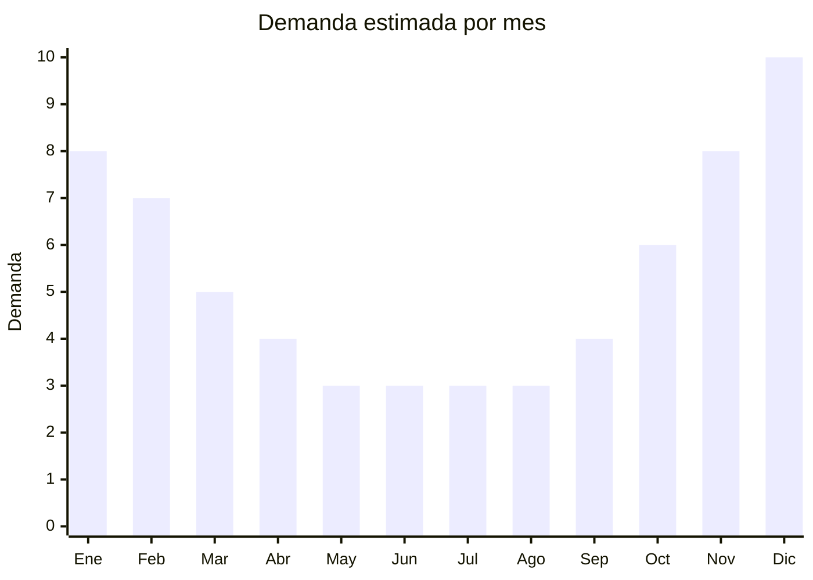

# Cuchillos y cubiertos para asado y camping

> **Capítulo NCM 82** — Herramientas y útiles, artículos de cuchillería | **Temporada:** Verano (Dic–Feb)

## Qué es y por qué importarlo

Los sets de cuchillos y cubiertos para asado y camping incluyen cuchillos de hoja de acero inoxidable con mango de madera, plástico o acero, acompañados de tenedores trincheros, pinzas, tablas y estuches portátiles. En Argentina, donde el asado es una tradición cultural arraigada, estos productos tienen demanda sostenida todo el año con un pico marcado en verano (temporada de parrillas al aire libre) y en diciembre (regalos de Navidad y fiestas).

Yangjiang (provincia de Guangdong, China) es la capital mundial de la cuchillería, concentrando más del 60% de la producción global de cuchillos. Fábricas de esta ciudad producen para marcas internacionales como Tramontina, Victorinox y cientos de marcas blancas. Los sets genéricos chinos ofrecen calidad comparable a precios FOB muy competitivos, permitiendo márgenes atractivos en el mercado argentino. Tramontina (Brasil) es la referencia de precio y calidad en Argentina, por lo que cualquier producto importado debe igualar o superar su relación precio-calidad para competir.

La ventaja de importar sets de cuchillos para asado es que son productos compactos, livianos, resistentes al transporte y no requieren certificaciones complejas. El desafío principal es la competencia con marcas establecidas y la necesidad de diferenciarse por diseño, materiales del mango o presentación del estuche.

## Datos clave

| Dato | Valor |
|------|-------|
| **Posiciones NCM típicas** | 8211.10.00 (surtidos de cuchillos), 8211.91.00 (cuchillos de mesa hoja fija), 8215.20.00 (juegos de cubiertos) |
| **Derecho de importación** | 18% (DIE) + 3% tasa estadística |
| **Rango FOB típico** | USD 1.00 — USD 15.00 por set (según composición y cantidad de piezas) |
| **Precio de venta en Argentina** | ARS 5.000 — ARS 50.000+ |
| **Margen bruto estimado** | 150% — 350% |
| **MOQ típico** | 200 — 1.000 sets |
| **Demanda en MercadoLibre** | Alta (sostenida + picos estacionales) |
| **Competencia en MercadoLibre** | Alta (Tramontina domina) |
| **Dificultad para importar** | Fácil (producto compacto y resistente) |
| **Certificaciones necesarias** | No requiere certificaciones especiales |
| **Antidumping** | No |

## Variantes y subtipos más comunes

| Subtipo / Variante | FOB aprox. | Venta AR aprox. | Nota |
|--------------------|-----------|-----------------|------|
| Cuchillo asado individual | USD 1.00 — 2.50 | ARS 5.000 — 12.000 | Mango madera o plástico |
| Set 4 cubiertos asado | USD 3.00 — 6.00 | ARS 12.000 — 25.000 | **Más vendido** |
| Set 6-8 piezas con estuche | USD 5.00 — 10.00 | ARS 20.000 — 35.000 | Regalo, presentación premium |
| Kit parrillero completo (10+ piezas) | USD 8.00 — 15.00 | ARS 30.000 — 50.000+ | Incluye pinza, tenedor, tabla |
| Set camping plegable | USD 2.00 — 5.00 | ARS 8.000 — 18.000 | Compacto, portátil |

## Regulaciones y requisitos

<Tabs>
  <Tab title="Certificaciones">
    | Organismo | Requiere | Detalle |
    |-----------|----------|---------|
    | ARCA (Aduana) | Sí siempre | Despacho estándar |
    | ANMAT | No | No aplica para cuchillería general |
    | ENACOM | No | No es electrónico |
    | SENASA | No | No aplica |

    **Recomendación:** Solicitar al proveedor certificados de calidad del acero inoxidable (composición 3Cr13 o 5Cr15MoV como mínimo). Los mangos de madera deben estar tratados contra humedad. Incluir ficha técnica con dureza Rockwell del acero para diferenciarse de la competencia genérica.
  </Tab>

  <Tab title="Etiquetado">
    | Requisito | Aplica |
    |-----------|--------|
    | Idioma español | Sí |
    | Datos del importador | Sí |
    | Composición / materiales | Sí (tipo de acero y material del mango) |
    | País de origen | Sí |
    | Garantía legal 6 meses | Sí |
    | Instrucciones de cuidado | Recomendado (no lavavajillas si mango madera) |
  </Tab>

  <Tab title="Restricciones">
    Sin restricciones especiales de importación. No hay antidumping ni licencias previas para cuchillería de uso doméstico y camping.

    **Atención:** Los cuchillos con hoja mayor a 15 cm pueden tener restricciones de venta en algunas jurisdicciones provinciales. Verificar normativa local para cuchillos tipo "caza" o "supervivencia" con hojas muy largas. La cuchillería de cocina y asado estándar no tiene restricción.
  </Tab>
</Tabs>

## Logística

| Dato | Valor |
|------|-------|
| **Peso típico por unidad** | 0.2 — 1.5 kg (según cantidad de piezas) |
| **Volumen típico** | Bajo (productos compactos) |
| **Fragilidad** | Muy baja (acero y madera) |
| **Envío recomendado** | Marítimo LCL o aéreo para pedidos urgentes |
| **Tiempo total estimado** | 45 — 75 días (marítimo) |
| **Baterías de litio** | No |
| **Requiere empaque especial** | Sí (protección de filos con fundas o cartón) |

<Tip>
Los sets con estuche de cuero sintético o madera tienen mayor valor percibido y se venden como regalo. Negociar con el proveedor **packaging premium con logo propio** ya que el costo adicional es mínimo (USD 0.30-0.80 por estuche) y permite posicionar como marca propia frente a Tramontina.
</Tip>

## Estacionalidad



| Aspecto | Detalle |
|---------|---------|
| **Meses pico** | Noviembre-Febrero (asado al aire libre) + Diciembre (regalos Navidad) |
| **Meses valle** | Abril-Agosto (menos parrillas outdoor, demanda base estable) |
| **Cuándo pedir** | Agosto-Septiembre para tener stock en noviembre |

## Ventajas y riesgos

<CardGroup cols={2}>
  <Card title="Ventajas" icon="circle-check">
    - Producto compacto, bajo costo de flete
    - Yangjiang ofrece infinitas opciones de personalización
    - Doble pico: verano + Navidad (regalo ideal)
    - Sin barreras regulatorias complejas
    - Ideal para marca propia con estuche personalizado
  </Card>
  <Card title="Riesgos" icon="triangle-exclamation">
    - Competencia fuerte con Tramontina (marca muy posicionada)
    - Calidad del acero variable entre proveedores
    - Mangos de madera baratos pueden rajarse con humedad
    - Necesidad de diferenciación clara (diseño, packaging)
    - Filos pueden requerir empaque especial para transporte seguro
  </Card>
</CardGroup>

## Palabras clave para buscar en Alibaba

```
bbq knife set wholesale, steak knife set wood handle, camping cutlery set,
barbecue knife fork set, stainless steel bbq tools set, asado knife set,
outdoor camping knife set portable, knife set with case wholesale Yangjiang
```

## Fuentes

- [MercadoLibre Argentina — Cuchillos asado](https://listado.mercadolibre.com.ar/cuchillos-asado)
- [Alibaba — BBQ knife set wholesale](https://www.alibaba.com/showroom/bbq-knife-set.html)
