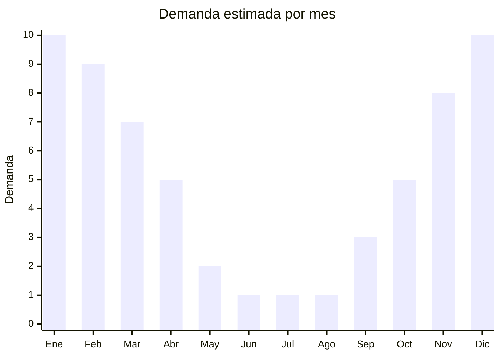

# Raquetas eléctricas mata mosquitos

> **Capítulo NCM 82** — Herramientas y útiles, artículos de cuchillería | **Temporada:** Verano (Dic–Feb)

## Qué es y por qué importarlo

Las raquetas eléctricas mata mosquitos son dispositivos con forma de raqueta de tenis que generan una descarga eléctrica de bajo voltaje (1.500-3.000V) al contacto con insectos voladores. Funcionan con batería recargable (litio o NiMH) o pilas AA, y son una alternativa no química para eliminar mosquitos, moscas y otros insectos. En Argentina, la demanda de estos productos ha crecido de forma explosiva en los últimos años debido a los brotes recurrentes de dengue, alcanzando más de 363 publicaciones activas en MercadoLibre.

China produce la totalidad de las raquetas eléctricas que se comercializan globalmente, con fábricas concentradas en Guangdong y Zhejiang. Los modelos van desde raquetas básicas con pilas hasta versiones premium recargables por USB con luz LED trampa integrada (2 en 1: raqueta + lámpara UV atrapa mosquitos). Esta última variante está ganando mercado rápidamente por su funcionalidad doble.

La ventaja clave de este producto es su demanda creciente impulsada por una problemática sanitaria real (dengue), su bajo costo FOB, su ligereza para el envío y la ausencia de certificaciones especiales. A diferencia de los insecticidas, las raquetas eléctricas no son productos químicos y por lo tanto no requieren registro en SENASA ni ANMAT como plaguicida.

<Note>
**Clasificación arancelaria:** Existe debate sobre si las raquetas eléctricas clasifican en el Capítulo 82 (como herramienta/utensilio) o en el Capítulo 85 (como aparato eléctrico). La clasificación final depende de la aduana y el despachante. Consultar con un agente de aduanas antes de importar para evitar diferencias de derechos.
</Note>

## Datos clave

| Dato | Valor |
|------|-------|
| **Posiciones NCM típicas** | 8205.59.00 (herramientas de mano) o 8543.70.99 (aparatos eléctricos con función propia) |
| **Derecho de importación** | 18-20% (DIE según posición) + 3% tasa estadística |
| **Rango FOB típico** | USD 1.50 — USD 7.80 por unidad |
| **Precio de venta en Argentina** | ARS 8.500 — ARS 33.500 |
| **Margen bruto estimado** | 200% — 400% |
| **MOQ típico** | 200 — 1.000 unidades |
| **Demanda en MercadoLibre** | Muy Alta (363+ publicaciones activas) |
| **Competencia en MercadoLibre** | Media-Alta |
| **Dificultad para importar** | Fácil |
| **Certificaciones necesarias** | No requiere certificación especial (no es insecticida) |
| **Antidumping** | No |

## Variantes y subtipos más comunes

| Subtipo / Variante | FOB aprox. | Venta AR aprox. | Nota |
|--------------------|-----------|-----------------|------|
| Raqueta básica a pilas AA | USD 1.50 — 2.50 | ARS 8.500 — 14.000 | Económica, descartable |
| Raqueta recargable USB | USD 2.50 — 4.50 | ARS 12.000 — 22.000 | **Más vendida** |
| Raqueta 2en1 con lámpara UV trampa | USD 4.00 — 7.80 | ARS 18.000 — 33.500 | Tendencia creciente, mayor ticket |
| Raqueta plegable compacta | USD 3.00 — 5.00 | ARS 14.000 — 25.000 | Portátil, viaje/camping |
| Raqueta con base de carga | USD 3.50 — 6.00 | ARS 15.000 — 28.000 | Presentación premium |

## Regulaciones y requisitos

<Tabs>
  <Tab title="Certificaciones">
    | Organismo | Requiere | Detalle |
    |-----------|----------|---------|
    | ARCA (Aduana) | Sí siempre | Despacho estándar |
    | ANMAT | No | No es producto químico ni insecticida |
    | ENACOM | No | No emite radiofrecuencia (a verificar en modelos con UV LED) |
    | SENASA | No | No es plaguicida (eliminación mecánica/eléctrica) |

    **Recomendación:** Aunque no requiere certificación como insecticida, es recomendable solicitar al proveedor un reporte de seguridad eléctrica (IEC 60335) y verificar que el voltaje de descarga esté dentro de rangos seguros para uso doméstico. Los modelos con batería de litio recargable deben cumplir con UN38.3 para transporte.
  </Tab>

  <Tab title="Etiquetado">
    | Requisito | Aplica |
    |-----------|--------|
    | Idioma español | Sí |
    | Datos del importador | Sí |
    | Voltaje / especificaciones | Sí |
    | País de origen | Sí |
    | Garantía legal 6 meses | Sí |
    | Advertencias de seguridad | Sí (mantener fuera del alcance de niños) |
    | Tipo de batería | Sí (indicar si litio, NiMH o pilas) |
  </Tab>

  <Tab title="Restricciones">
    Sin restricciones especiales de importación como herramienta o aparato eléctrico. No está catalogado como insecticida ni plaguicida.

    **Atención:** Los modelos con batería de litio tienen restricciones de transporte aéreo (normativa IATA). Para envíos aéreos, verificar que las baterías cumplan con UN38.3 y que el embalaje cumpla con la sección II de las instrucciones de embalaje PI967. Para envío marítimo no hay restricción adicional.
  </Tab>
</Tabs>

## Logística

| Dato | Valor |
|------|-------|
| **Peso típico por unidad** | 0.15 — 0.45 kg |
| **Volumen típico** | Bajo (producto plano y liviano) |
| **Fragilidad** | Media (malla eléctrica delicada) |
| **Envío recomendado** | Marítimo LCL o aéreo express para temporada |
| **Tiempo total estimado** | 45 — 70 días (marítimo), 15-20 días (aéreo) |
| **Baterías de litio** | Sí (modelos recargables USB) |
| **Requiere empaque especial** | Sí (protección de la malla, caja individual) |

<Tip>
Dado que la demanda de raquetas mosquitos es muy sensible a brotes de dengue, conviene tener un proveedor con capacidad de **envío aéreo express** (15-20 días) para reabastecer rápido durante picos inesperados. El costo aéreo se justifica por el bajo peso unitario (0.15-0.45 kg) y el alto margen del producto.
</Tip>

## Estacionalidad



| Aspecto | Detalle |
|---------|---------|
| **Meses pico** | Noviembre-Marzo (verano, temporada de mosquitos y dengue) |
| **Meses valle** | Mayo-Agosto (invierno, baja actividad de mosquitos) |
| **Cuándo pedir** | Agosto-Septiembre para tener stock en noviembre. Mantener stock de reserva para reposición rápida por brotes |

## Ventajas y riesgos

<CardGroup cols={2}>
  <Card title="Ventajas" icon="circle-check">
    - Demanda explosiva impulsada por problemática sanitaria (dengue)
    - FOB muy bajo, márgenes excelentes
    - Producto ultraliviano, flete económico
    - Sin certificaciones complejas (no es insecticida)
    - Variante 2en1 (raqueta + lámpara UV) con alto valor percibido
  </Card>
  <Card title="Riesgos" icon="triangle-exclamation">
    - Clasificación arancelaria ambigua (Cap. 82 vs Cap. 85)
    - Calidad de malla variable: modelos baratos duran poco
    - Baterías de litio complican envío aéreo
    - Competencia de precio muy agresiva en MercadoLibre
    - Producto percibido como "descartable" por muchos consumidores
  </Card>
</CardGroup>

## Palabras clave para buscar en Alibaba

```
electric mosquito swatter wholesale, rechargeable bug zapper racket,
mosquito killer racket USB, 2 in 1 mosquito swatter lamp, fly swatter electric,
mosquito bat rechargeable LED, electric insect killer racket wholesale
```

## Fuentes

- [MercadoLibre Argentina — Raqueta eléctrica mosquitos](https://listado.mercadolibre.com.ar/raqueta-electrica-mosquitos)
- [Alibaba — Electric mosquito swatter](https://www.alibaba.com/showroom/electric-mosquito-swatter.html)
