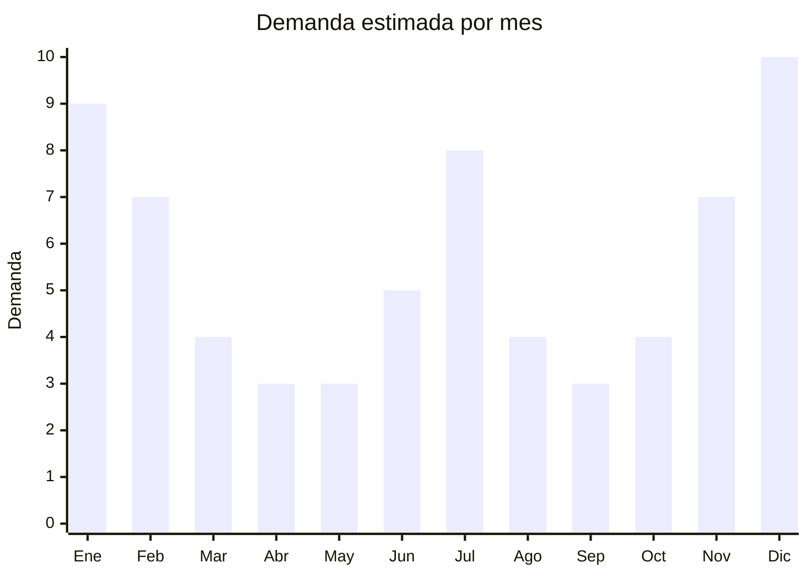

# Candados TSA para equipaje de viaje

> **Capítulo NCM 83** — Manufacturas diversas de metal común | **Temporada:** Verano (Dic–Feb)

## Qué es y por qué importarlo

Los candados TSA (Transportation Security Administration) son candados de combinación o llave que tienen un sistema de apertura maestra estandarizado que permite a las autoridades aeroportuarias (principalmente en EE.UU.) inspeccionar el equipaje sin romper el candado. Se identifican por el logo rojo del rombo TSA en su cuerpo. Aunque el estándar es norteamericano, se han adoptado globalmente como sinónimo de "candado de viaje seguro" y son los más buscados por viajeros en Argentina.

En MercadoLibre Argentina hay más de 704 resultados activos para candados TSA, lo que demuestra una demanda sostenida. El producto tiene dos picos claros: verano (diciembre-febrero, vacaciones de temporada alta) y julio (vacaciones de invierno). Son productos extremadamente compactos, livianos y con márgenes muy atractivos. Un candado que cuesta USD 0.80 FOB se vende a ARS 6.500+ en Argentina.

China fabrica la inmensa mayoría de candados TSA del mundo, con fábricas especializadas en Pujiang (Zhejiang), conocida como la capital de los candados en China. Las opciones van desde candados de combinación de 3 dígitos hasta modelos con huella digital, cable de acero o alarma incorporada.

## Datos clave

| Dato | Valor |
|------|-------|
| **Posiciones NCM típicas** | 8301.10.00 (candados), 8301.40.00 (cerraduras de combinación) |
| **Derecho de importación** | 18% (DIE) + 3% tasa estadística |
| **Rango FOB típico** | USD 0.80 — USD 3.00 por unidad |
| **Precio de venta en Argentina** | ARS 6.500 — ARS 33.000 |
| **Margen bruto estimado** | 250% — 500% |
| **MOQ típico** | 500 — 2.000 unidades |
| **Demanda en MercadoLibre** | Alta (704+ resultados activos) |
| **Competencia en MercadoLibre** | Media |
| **Dificultad para importar** | Muy fácil (compacto, sin regulación) |
| **Certificaciones necesarias** | No requiere certificaciones especiales |
| **Antidumping** | No |

## Variantes y subtipos más comunes

| Subtipo / Variante | FOB aprox. | Venta AR aprox. | Nota |
|--------------------|-----------|-----------------|------|
| Candado TSA combinación 3 dígitos | USD 0.80 — 1.20 | ARS 6.500 — 12.000 | **Más vendido**, económico |
| Candado TSA cable de acero | USD 1.00 — 1.80 | ARS 8.000 — 16.000 | Flexible, para mochilas |
| Candado TSA con llave maestra | USD 0.90 — 1.50 | ARS 7.000 — 14.000 | Para quien prefiere llave |
| Set x2 candados TSA | USD 1.50 — 2.50 | ARS 12.000 — 22.000 | Pack viajero |
| Candado TSA con alarma/huella | USD 2.00 — 3.00 | ARS 20.000 — 33.000 | Premium, mayor ticket |

## Regulaciones y requisitos

<Tabs>
  <Tab title="Certificaciones">
    | Organismo | Requiere | Detalle |
    |-----------|----------|---------|
    | ARCA (Aduana) | Sí siempre | Despacho estándar |
    | ANMAT | No | No aplica |
    | ENACOM | No | No es electrónico (modelos básicos) |
    | SENASA | No | No aplica |

    **Recomendación:** Verificar que los candados tengan la certificación TSA legítima (Travel Sentry Approved) con el logo del rombo rojo. Los candados sin certificación real no sirven para equipaje en vuelos a EE.UU. y generan reclamos. Solicitar al proveedor el número de licencia TSA.
  </Tab>

  <Tab title="Etiquetado">
    | Requisito | Aplica |
    |-----------|--------|
    | Idioma español | Sí |
    | Datos del importador | Sí |
    | Composición / materiales | Sí (tipo de aleación) |
    | País de origen | Sí |
    | Garantía legal 6 meses | Sí |
    | Instrucciones de uso | Sí (cómo configurar combinación) |
  </Tab>

  <Tab title="Restricciones">
    Sin restricciones especiales de importación. No hay antidumping ni licencias previas para candados.

    **Atención:** Los modelos con alarma electrónica incorporada pueden requerir batería de litio tipo botón (CR2032), lo cual agrega restricciones mínimas de transporte pero no afecta la importación. Verificar si modelos con Bluetooth o huella digital requieren intervención de ENACOM.
  </Tab>
</Tabs>

## Logística

| Dato | Valor |
|------|-------|
| **Peso típico por unidad** | 0.03 — 0.12 kg |
| **Volumen típico** | Muy bajo (producto miniatura) |
| **Fragilidad** | Muy baja (metal sólido) |
| **Envío recomendado** | Aéreo express o marítimo LCL (caben miles en una caja) |
| **Tiempo total estimado** | 15 — 25 días (aéreo), 45-70 días (marítimo) |
| **Baterías de litio** | No (modelos básicos) / Sí botón (modelos con alarma) |
| **Requiere empaque especial** | No |

<Tip>
Por su tamaño miniatura y alto margen, los candados TSA son ideales para **envío aéreo express** incluso en pedidos grandes. Un pedido de 1.000 candados pesa apenas 30-120 kg y ocupa menos de 0.1 CBM. El costo aéreo se recupera con creces al tener el producto disponible 30-40 días antes que por marítimo.
</Tip>

## Estacionalidad



| Aspecto | Detalle |
|---------|---------|
| **Meses pico** | Diciembre-Enero (vacaciones verano) + Julio (vacaciones invierno) |
| **Meses valle** | Marzo-Mayo, Agosto-Septiembre |
| **Cuándo pedir** | Octubre para verano, Mayo para vacaciones de julio |

## Ventajas y riesgos

<CardGroup cols={2}>
  <Card title="Ventajas" icon="circle-check">
    - Producto ultracompacto: miles caben en una caja
    - Márgenes excepcionales (250-500%)
    - Doble pico de demanda (verano + julio)
    - Sin regulaciones complejas
    - Ideal para venta en combos y kits de viaje
  </Card>
  <Card title="Riesgos" icon="triangle-exclamation">
    - Competencia de precio agresiva en MercadoLibre
    - Candados sin certificación TSA real generan reclamos
    - Mecanismo de combinación puede fallar en modelos baratos
    - Producto fácil de copiar, difícil fidelizar
    - Cable de acero muy fino en modelos económicos (se corta fácil)
  </Card>
</CardGroup>

## Palabras clave para buscar en Alibaba

```
TSA lock wholesale, TSA combination padlock, travel luggage lock TSA,
TSA cable lock suitcase, TSA approved lock 3 digit, travel lock set wholesale,
TSA padlock Pujiang, fingerprint TSA lock
```

## Fuentes

- [MercadoLibre Argentina — Candado TSA](https://listado.mercadolibre.com.ar/candado-tsa)
- [Alibaba — TSA lock wholesale](https://www.alibaba.com/showroom/tsa-lock.html)
