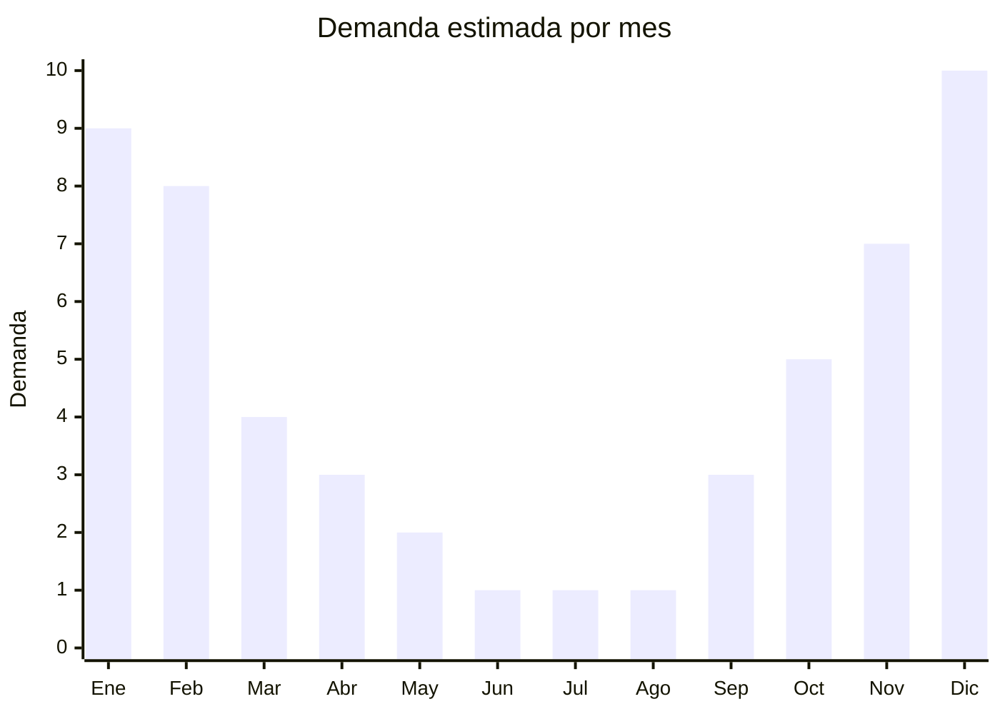

# Estacas y anclajes metálicos para playa y camping

> **Capítulo NCM 83** — Manufacturas diversas de metal común | **Temporada:** Verano (Dic–Feb)

## Qué es y por qué importarlo

Las estacas y anclajes metálicos para playa y camping son accesorios de acero galvanizado o aluminio diseñados para fijar sombrillas, carpas, gazebos y toldos en arena, tierra o césped. Incluyen estacas de anclaje tipo sacacorchos para sombrillas de playa (los más vendidos), estacas de carpas de camping, tensores de vientos metálicos y anclajes de tornillo para parasoles de jardín. Son productos complementarios que se venden junto con sombrillas, carpas y equipamiento outdoor.

El mercado argentino consume estos productos principalmente en verano (playa y camping) pero también tienen demanda en primavera (camping, eventos outdoor). China produce la mayoría de las estacas y anclajes metálicos del mercado global, con costos FOB extremadamente bajos que permiten márgenes atractivos. El acero galvanizado es fundamental para resistir la corrosión del ambiente salino de playa.

La ventaja de importar estos productos es su bajo costo unitario, alta resistencia al transporte (no se rompen), volumen compacto y la posibilidad de venderlos como complemento de otros productos de verano (sombrillas, carpas, lonas). El desafío es que son productos de bajo ticket individual, por lo que conviene venderlos en kits o como accesorio junto a otros artículos.

## Datos clave

| Dato | Valor |
|------|-------|
| **Posiciones NCM típicas** | 8302.49.00 (guarniciones y artículos similares de metal), 7317.00.90 (clavos, tachuelas, grapas de hierro/acero) |
| **Derecho de importación** | 18% (DIE) + 3% tasa estadística |
| **Rango FOB típico** | USD 0.50 — USD 3.00 por unidad/set |
| **Precio de venta en Argentina** | ARS 2.000 — ARS 8.000 |
| **Margen bruto estimado** | 200% — 400% |
| **MOQ típico** | 500 — 3.000 unidades |
| **Demanda en MercadoLibre** | Media (complementario) |
| **Competencia en MercadoLibre** | Baja-Media |
| **Dificultad para importar** | Muy fácil |
| **Certificaciones necesarias** | No requiere certificaciones especiales |
| **Antidumping** | No |

## Variantes y subtipos más comunes

| Subtipo / Variante | FOB aprox. | Venta AR aprox. | Nota |
|--------------------|-----------|-----------------|------|
| Anclaje sacacorchos para sombrilla | USD 1.00 — 2.50 | ARS 4.000 — 8.000 | **Más vendido**, playa |
| Estacas carpa camping x10 | USD 0.50 — 1.50 | ARS 2.000 — 5.000 | Set, acero galvanizado |
| Tensores vientos metálicos x4 | USD 0.80 — 1.50 | ARS 2.500 — 5.000 | Complementario a carpas |
| Anclaje tornillo parasol jardín | USD 1.50 — 3.00 | ARS 4.000 — 8.000 | Uso fijo, jardín/patio |
| Kit anclaje completo sombrilla | USD 2.00 — 3.00 | ARS 5.000 — 8.000 | Sacacorchos + gancho + bolsa |

## Regulaciones y requisitos

<Tabs>
  <Tab title="Certificaciones">
    | Organismo | Requiere | Detalle |
    |-----------|----------|---------|
    | ARCA (Aduana) | Sí siempre | Despacho estándar |
    | ANMAT | No | No aplica |
    | ENACOM | No | No es electrónico |
    | SENASA | No | No aplica |

    **Recomendación:** Exigir al proveedor que el acero sea galvanizado en caliente (hot-dip galvanized) y no solo zincado electrolítico, ya que este último se corroe rápidamente en contacto con arena salada y agua de mar. Solicitar certificado de galvanizado con espesor mínimo de recubrimiento.
  </Tab>

  <Tab title="Etiquetado">
    | Requisito | Aplica |
    |-----------|--------|
    | Idioma español | Sí |
    | Datos del importador | Sí |
    | Composición / materiales | Sí (tipo de acero, galvanizado) |
    | País de origen | Sí |
    | Garantía legal 6 meses | Sí |
    | Capacidad de carga | Recomendado |
  </Tab>

  <Tab title="Restricciones">
    Sin restricciones especiales de importación. No hay antidumping ni licencias previas para artículos de ferretería general.

    **Atención:** Productos de acero pueden estar sujetos a derechos antidumping específicos según la partida arancelaria y el origen. Verificar con el despachante si la posición exacta tiene medidas vigentes para origen China.
  </Tab>
</Tabs>

## Logística

| Dato | Valor |
|------|-------|
| **Peso típico por unidad** | 0.15 — 0.80 kg |
| **Volumen típico** | Bajo (productos compactos y apilables) |
| **Fragilidad** | Nula (acero macizo) |
| **Envío recomendado** | Marítimo LCL (peso alto relativo al volumen) |
| **Tiempo total estimado** | 45 — 70 días (marítimo) |
| **Baterías de litio** | No |
| **Requiere empaque especial** | No (pero proteger puntas con capuchones) |

<Tip>
Los anclajes y estacas son productos con alta relación peso/volumen, lo que los hace ideales para **completar contenedores** combinándolos con productos huecos de verano como conservadoras, sombrillas o piletas inflables. Así se optimiza tanto el peso como el CBM del contenedor.
</Tip>

## Estacionalidad



| Aspecto | Detalle |
|---------|---------|
| **Meses pico** | Noviembre-Febrero (playa, camping, outdoor) |
| **Meses valle** | Mayo-Agosto (invierno, sin actividad outdoor playera) |
| **Cuándo pedir** | Agosto-Septiembre para tener stock en noviembre |

## Ventajas y riesgos

<CardGroup cols={2}>
  <Card title="Ventajas" icon="circle-check">
    - Producto indestructible en transporte
    - FOB muy bajo con márgenes atractivos
    - Complementario a sombrillas, carpas y lonas
    - Sin regulaciones ni certificaciones
    - Alta relación peso/volumen optimiza contenedores mixtos
  </Card>
  <Card title="Riesgos" icon="triangle-exclamation">
    - Ticket individual bajo, requiere volumen o kits
    - Galvanizado de mala calidad se oxida rápido en playa
    - Demanda muy estacional, stock inmovilizado en invierno
    - Producto difícil de diferenciar (commodity)
    - Puntas afiladas requieren empaque cuidadoso
  </Card>
</CardGroup>

## Palabras clave para buscar en Alibaba

```
beach umbrella anchor screw, sand anchor stake, camping tent stakes galvanized,
beach umbrella holder screw, metal tent pegs wholesale, parasol ground anchor,
heavy duty beach anchor, galvanized steel tent stakes bulk
```

## Fuentes

- [MercadoLibre Argentina — Estaca sombrilla playa](https://listado.mercadolibre.com.ar/estaca-sombrilla-playa)
- [Alibaba — Beach umbrella anchor wholesale](https://www.alibaba.com/showroom/beach-umbrella-anchor.html)
