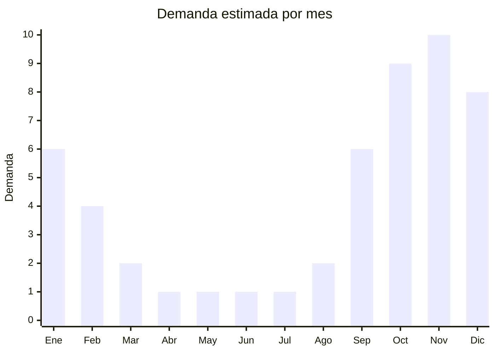

# Bombas para pileta

> **Capítulo NCM 84** — Máquinas y aparatos mecánicos | **Temporada:** Verano (Dic–Feb)

## Qué es y por qué importarlo

Las bombas para pileta (también llamadas bombas de piscina o motobombas) son equipos eléctricos que hacen circular y filtrar el agua de la pileta, manteniéndola limpia y transparente. Funcionan aspirando agua, pasándola a través de un sistema de filtrado (arena, cartucho o diatomeas) y devolviéndola limpia a la pileta. Las potencias más comunes van de 0.5 HP a 2 HP según el volumen de agua de la pileta.

En MercadoLibre Argentina, marcas como Bestway han superado las 5.000 unidades vendidas en modelos populares, lo que demuestra un mercado robusto. Los precios oscilan entre ARS 30.000 y ARS 150.000 según la potencia. La demanda tiene un patrón particular: el pico es pre-verano (septiembre a diciembre), cuando los dueños de piletas preparan sus equipos para la temporada, compran repuestos o reemplazan bombas dañadas.

China fabrica la mayoría de las bombas para piletas del mercado global, incluyendo las que se venden bajo marcas como Bestway e Intex. Las fábricas están concentradas en Taizhou y Wenling (Zhejiang), especializadas en bombas de agua de todo tipo. El canal de venta es doble: consumidor final (dueño de pileta) y profesional (pileteros, empresas de mantenimiento).

<Warning>
Las bombas eléctricas para pileta pueden requerir **certificación IRAM de seguridad eléctrica**. Son productos con motor eléctrico en contacto con agua, lo que implica estándares de seguridad estrictos. Verificar con despachante.
</Warning>

## Datos clave

| Dato | Valor |
|------|-------|
| **Posiciones NCM típicas** | 8413.70.90 (bombas centrífugas), 8413.81.00 (bombas para líquidos) |
| **Derecho de importación** | 14-18% (DIE según posición) + 3% tasa estadística |
| **Rango FOB típico** | USD 25.00 — USD 80.00 por unidad |
| **Precio de venta en Argentina** | ARS 30.000 — ARS 150.000 |
| **Margen bruto estimado** | 100% — 200% |
| **MOQ típico** | 50 — 300 unidades |
| **Demanda en MercadoLibre** | Alta (Bestway +5.000 vendidos en modelos top) |
| **Competencia en MercadoLibre** | Alta (Bestway, Intex, marcas locales) |
| **Dificultad para importar** | Media-Alta (certificación eléctrica + motor/agua) |
| **Certificaciones necesarias** | IRAM seguridad eléctrica (verificar) |
| **Antidumping** | No |

## Variantes y subtipos más comunes

| Subtipo / Variante | FOB aprox. | Venta AR aprox. | Nota |
|--------------------|-----------|-----------------|------|
| Bomba 0.5 HP pileta pequeña | USD 25.00 — 35.00 | ARS 30.000 — 55.000 | Piletas hasta 20.000L |
| Bomba 0.75 HP uso general | USD 30.00 — 45.00 | ARS 45.000 — 75.000 | **Más vendida** |
| Bomba 1.0 HP piletas medianas | USD 40.00 — 55.00 | ARS 60.000 — 100.000 | Piletas 20.000-40.000L |
| Bomba 1.5-2.0 HP piletas grandes | USD 55.00 — 80.00 | ARS 90.000 — 150.000 | Piletas > 40.000L |
| Bomba autocebante prefiltro | USD 35.00 — 60.00 | ARS 50.000 — 90.000 | Con canasto prefiltro integrado |

## Regulaciones y requisitos

<Tabs>
  <Tab title="Certificaciones">
    | Organismo | Requiere | Detalle |
    |-----------|----------|---------|
    | ARCA (Aduana) | Sí siempre | Despacho estándar |
    | IRAM | Sí (verificar) | Seguridad eléctrica motores en contacto con agua |
    | Eficiencia energética | Verificar | Puede requerir según potencia |
    | ENACOM | No | No emite radiofrecuencia |
    | ANMAT | No | No aplica |

    **Recomendación:** Las bombas de pileta son equipos eléctricos que operan en proximidad con agua, lo que eleva los estándares de seguridad. Solicitar al proveedor cumplimiento de IEC 60335-2-41 (seguridad de bombas) y certificado de protección IP (mínimo IPX4). Verificar que el sello mecánico sea de calidad (cerámica, no plástico) ya que es el punto de falla más común.
  </Tab>

  <Tab title="Etiquetado">
    | Requisito | Aplica |
    |-----------|--------|
    | Idioma español | Sí |
    | Datos del importador | Sí |
    | Tensión / frecuencia | Sí (220V - 50Hz Argentina) |
    | Potencia en HP y watts | Sí |
    | Caudal máximo (L/h o m³/h) | Sí |
    | Altura manométrica | Recomendado |
    | País de origen | Sí |
    | Garantía legal 6 meses | Sí |
    | Manual de instalación en español | Sí |
    | Grado de protección IP | Sí |
  </Tab>

  <Tab title="Restricciones">
    Equipo eléctrico con motor en contacto con agua sujeto a controles de seguridad eléctrica estrictos.

    **Atención:** Verificar que el motor esté bobinado para 220V / 50Hz (estándar argentino). Los motores de 60Hz (mercado brasileño o norteamericano) funcionan a menor RPM en 50Hz, reduciendo el caudal. El sello mecánico debe ser de cerámica para resistir el cloro del agua de pileta. Incluir instrucciones claras de instalación eléctrica con protección diferencial obligatoria.
  </Tab>
</Tabs>

## Logística

| Dato | Valor |
|------|-------|
| **Peso típico por unidad** | 5.0 — 15.0 kg (según potencia) |
| **Volumen típico** | Medio (equipo compacto pero pesado) |
| **Fragilidad** | Media (motor robusto, conexiones plásticas delicadas) |
| **Envío recomendado** | Marítimo LCL o FCL según volumen |
| **Tiempo total estimado** | 55 — 85 días (marítimo) |
| **Baterías de litio** | No |
| **Requiere empaque especial** | Sí (protección de conexiones y prefiltro) |

<Tip>
El canal **pileteros/empresas de mantenimiento de piletas** es tan importante como el consumidor final. Ofrecer precios mayoristas a profesionales genera volumen constante y recomendaciones. Los pileteros necesitan repuestos frecuentes (sellos mecánicos, capacitores, prefiltros), que se pueden importar como complemento con margen aún mayor que la bomba completa.
</Tip>

## Estacionalidad



| Aspecto | Detalle |
|---------|---------|
| **Meses pico** | Septiembre-Diciembre (pre-verano, preparación de piletas) |
| **Meses valle** | Abril-Agosto (piletas cerradas) |
| **Cuándo pedir** | Junio-Julio para tener stock en septiembre (inicio de temporada de preparación) |

## Ventajas y riesgos

<CardGroup cols={2}>
  <Card title="Ventajas" icon="circle-check">
    - Demanda predecible con pico pre-verano
    - Doble canal: consumidor final + pileteros profesionales
    - Producto con recompra (se reemplazan cada 3-5 años)
    - Repuestos como negocio complementario alto margen
    - Mercado grande: millones de piletas en Argentina
  </Card>
  <Card title="Riesgos" icon="triangle-exclamation">
    - Certificación eléctrica obligatoria (motor + agua)
    - Competencia con Bestway/Intex muy posicionados
    - Sello mecánico de baja calidad genera fugas y reclamos
    - Motor pesado eleva costo de flete
    - Reclamos por ruido, vibración o corta vida útil
  </Card>
</CardGroup>

## Palabras clave para buscar en Alibaba

```
swimming pool pump wholesale, pool water pump 220V 50Hz, pool filter pump,
centrifugal pool pump 0.75HP, self-priming pool pump, pool pump motor,
above ground pool pump, pool circulation pump wholesale
```

## Fuentes

- [MercadoLibre Argentina — Bomba pileta](https://listado.mercadolibre.com.ar/bomba-pileta)
- [Alibaba — Swimming pool pump](https://www.alibaba.com/showroom/swimming-pool-pump.html)
