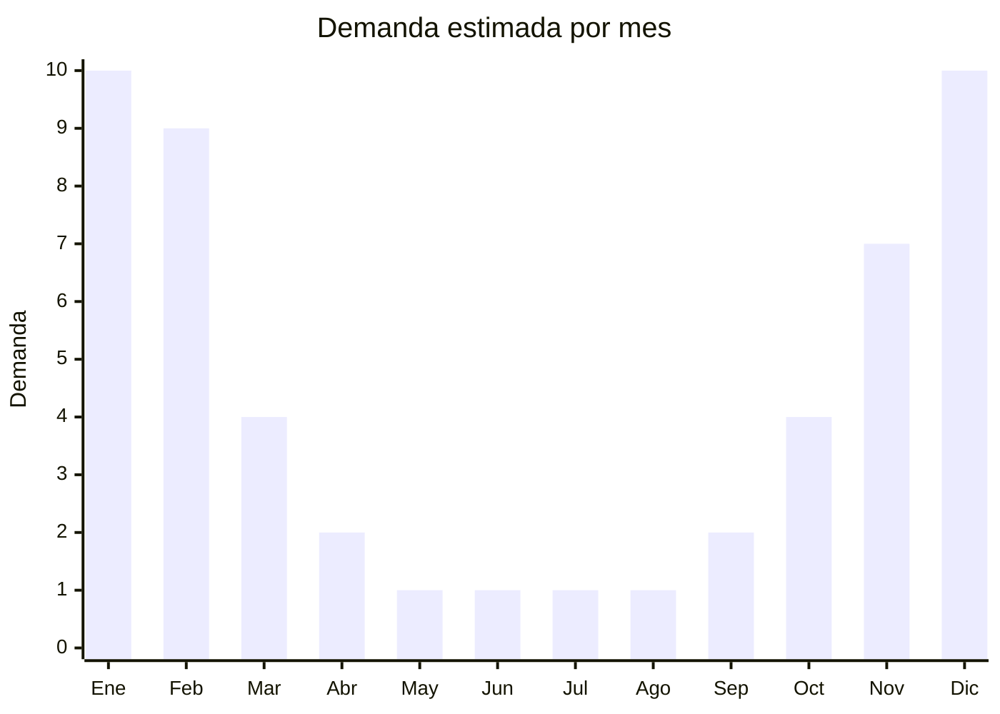

# Climatizadores evaporativos portátiles

> **Capítulo NCM 84** — Máquinas y aparatos mecánicos | **Temporada:** Verano (Dic–Feb)

## Qué es y por qué importarlo

Los climatizadores evaporativos portátiles (también llamados enfriadores de aire o air coolers) son equipos que enfrían el aire mediante la evaporación de agua, sin utilizar gas refrigerante ni compresor. Funcionan haciendo pasar aire caliente a través de un panel húmedo (honeycomb pad), lo que reduce la temperatura del aire entre 5 y 15 grados centígrados dependiendo de la humedad ambiente. Tienen ruedas para moverse fácilmente entre ambientes y un tanque de agua que se rellena manualmente.

En Argentina, estos equipos se posicionan como la alternativa económica al aire acondicionado, con un consumo eléctrico hasta un 70% menor. Son especialmente atractivos para quienes no pueden instalar aire acondicionado (inquilinos, departamentos sin habilitación) o buscan reducir la factura de electricidad. Los precios de venta oscilan entre ARS 50.000 y ARS 200.000 según capacidad y funcionalidades.

China domina la producción global de climatizadores evaporativos, con fábricas en Foshan y Zhongshan que ofrecen modelos desde 3.5 litros (personal) hasta 60 litros (comercial). Los modelos con control remoto, timer y función de ionización son los más demandados en el mercado argentino.

<Warning>
Los climatizadores evaporativos pueden requerir **certificación IRAM de seguridad eléctrica** y **etiqueta de eficiencia energética**. Verificar requisitos vigentes. Importante: estos equipos son **menos efectivos en climas húmedos** (Buenos Aires, litoral), lo que debe comunicarse claramente al consumidor.
</Warning>

## Datos clave

| Dato | Valor |
|------|-------|
| **Posiciones NCM típicas** | 8414.59.90 (ventiladores con función de enfriamiento evaporativo), 8479.89.99 (máquinas con función propia no especificada) |
| **Derecho de importación** | 18-20% (DIE según posición) + 3% tasa estadística |
| **Rango FOB típico** | USD 25.00 — USD 80.00 por unidad |
| **Precio de venta en Argentina** | ARS 50.000 — ARS 200.000 |
| **Margen bruto estimado** | 100% — 200% |
| **MOQ típico** | 50 — 200 unidades |
| **Demanda en MercadoLibre** | Alta (creciente) |
| **Competencia en MercadoLibre** | Media |
| **Dificultad para importar** | Media (certificaciones + volumen) |
| **Certificaciones necesarias** | IRAM seguridad eléctrica (verificar) |
| **Antidumping** | No |

## Variantes y subtipos más comunes

| Subtipo / Variante | FOB aprox. | Venta AR aprox. | Nota |
|--------------------|-----------|-----------------|------|
| Mini air cooler personal 3.5L | USD 25.00 — 35.00 | ARS 50.000 — 80.000 | Escritorio, uso personal |
| Climatizador portátil 10L | USD 35.00 — 50.00 | ARS 70.000 — 120.000 | **Más vendido**, uso doméstico |
| Climatizador portátil 20L | USD 45.00 — 60.00 | ARS 100.000 — 150.000 | Ambientes grandes |
| Climatizador portátil 40-60L | USD 60.00 — 80.00 | ARS 150.000 — 200.000 | Comercial/industrial |
| Climatizador con función calefacción | USD 50.00 — 70.00 | ARS 90.000 — 160.000 | Doble uso, todo el año |

## Regulaciones y requisitos

<Tabs>
  <Tab title="Certificaciones">
    | Organismo | Requiere | Detalle |
    |-----------|----------|---------|
    | ARCA (Aduana) | Sí siempre | Despacho estándar |
    | IRAM | Sí (verificar) | Seguridad eléctrica aparatos electrodomésticos |
    | Eficiencia energética | Verificar | Puede requerir etiqueta |
    | ENACOM | No | No emite radiofrecuencia (modelos básicos) |
    | ANMAT | No | No aplica |

    **Recomendación:** Solicitar al proveedor cumplimiento de IEC 60335-1 (seguridad general electrodomésticos) con reportes de laboratorio acreditado. Verificar que el tanque de agua sea hermético y que el sistema de bombeo interno sea confiable. Los paneles honeycomb de buena calidad duran 2-3 temporadas; los baratos se degradan en meses.
  </Tab>

  <Tab title="Etiquetado">
    | Requisito | Aplica |
    |-----------|--------|
    | Idioma español | Sí |
    | Datos del importador | Sí |
    | Tensión / frecuencia | Sí (220V - 50Hz Argentina) |
    | Potencia en watts | Sí |
    | Capacidad tanque en litros | Sí |
    | Caudal de aire (m³/h) | Sí |
    | País de origen | Sí |
    | Garantía legal 6 meses | Sí |
    | Manual de uso en español | Sí |
  </Tab>

  <Tab title="Restricciones">
    Pueden aplicar requisitos de seguridad eléctrica según la posición arancelaria asignada. Verificar con despachante.

    **Atención:** Estos equipos funcionan bien en climas secos (Mendoza, Córdoba interior, Patagonia) pero pierden eficiencia significativamente en climas húmedos (Buenos Aires, litoral, NEA). Es fundamental comunicar esta limitación en la publicación para evitar reclamos y devoluciones. Un climatizador evaporativo NO es un aire acondicionado.
  </Tab>
</Tabs>

## Logística

| Dato | Valor |
|------|-------|
| **Peso típico por unidad** | 5.0 — 15.0 kg (según tamaño) |
| **Volumen típico** | Alto (equipos grandes con tanque) |
| **Fragilidad** | Media (paneles honeycomb, bomba interna) |
| **Envío recomendado** | Marítimo FCL o LCL según volumen |
| **Tiempo total estimado** | 55 — 85 días (marítimo) |
| **Baterías de litio** | No |
| **Requiere empaque especial** | Sí (protección de paneles, caja reforzada) |

<Tip>
Solicitar al proveedor que incluya **paneles honeycomb de repuesto** (2-3 por unidad, costo adicional mínimo de USD 1-3). Esto permite ofrecer un diferencial frente a la competencia (repuestos incluidos) y reduce reclamos por degradación del panel en temporadas siguientes. Los paneles se pueden vender también como repuesto por separado.
</Tip>

## Estacionalidad



| Aspecto | Detalle |
|---------|---------|
| **Meses pico** | Diciembre-Febrero (pico extremo por calor intenso) |
| **Meses valle** | Mayo-Agosto (sin demanda, salvo modelos con calefacción) |
| **Cuándo pedir** | Julio-Agosto para tener stock en noviembre (considerar tiempo de certificación) |

## Ventajas y riesgos

<CardGroup cols={2}>
  <Card title="Ventajas" icon="circle-check">
    - Alternativa económica al aire acondicionado
    - 70% menos consumo eléctrico que AA
    - No requiere instalación (plug and play)
    - Ticket medio-alto con buenos márgenes
    - Tendencia creciente por costos de energía
  </Card>
  <Card title="Riesgos" icon="triangle-exclamation">
    - Ineficaz en climas húmedos (Buenos Aires, litoral)
    - Expectativa del consumidor vs. realidad (no es AA)
    - Alto CBM, costo de flete significativo
    - Paneles honeycomb se degradan, generan reclamos
    - Requiere certificación eléctrica (costo y tiempo)
  </Card>
</CardGroup>

## Palabras clave para buscar en Alibaba

```
evaporative air cooler portable wholesale, air cooler 220V 50Hz,
portable evaporative cooler with remote, air cooler honeycomb pad,
industrial air cooler portable, room air cooler OEM, water air cooler fan,
evaporative cooling fan wholesale
```

## Fuentes

- [MercadoLibre Argentina — Climatizador evaporativo](https://listado.mercadolibre.com.ar/climatizador-evaporativo)
- [Alibaba — Evaporative air cooler](https://www.alibaba.com/showroom/evaporative-air-cooler.html)
