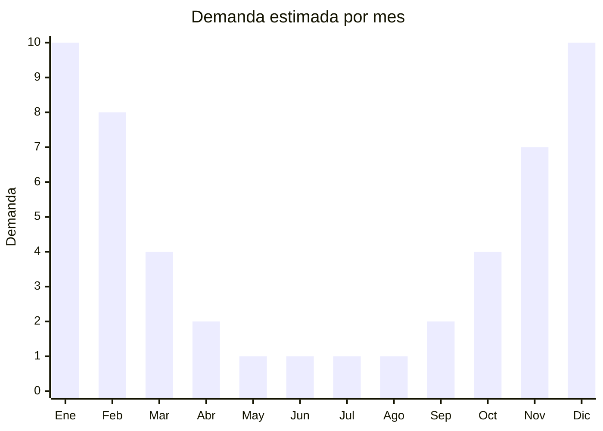

# Fabricadoras de hielo portátiles

> **Capítulo NCM 84** — Máquinas y aparatos mecánicos | **Temporada:** Verano (Dic–Feb)

## Qué es y por qué importarlo

Las fabricadoras de hielo portátiles (también llamadas máquinas de hielo countertop o ice makers) son electrodomésticos compactos que producen cubitos de hielo en ciclos rápidos de 6 a 15 minutos, sin necesidad de instalación de agua fija. Se llenan manualmente con agua y producen entre 12 y 50 kg de hielo por día según el modelo. Son ideales para hogares, oficinas, bares, food trucks y eventos donde se necesita hielo rápido sin depender de comprar bolsas.

En Argentina, la demanda ha crecido significativamente impulsada por la cultura del consumo de bebidas frías, la gastronomía y la incomodidad de depender de bolsas de hielo comerciales (caras y no siempre disponibles). Los precios de venta en MercadoLibre oscilan entre ARS 179.000 y ARS 300.000, lo que las posiciona como un producto de ticket alto con márgenes atractivos.

China produce la mayoría de las fabricadoras portátiles del mercado global, con fábricas especializadas en Guangdong (Foshan, Shunde) y Zhejiang. Los modelos más vendidos producen cubitos tipo "bullet" (forma de bala) en dos tamaños. Las variantes premium ofrecen cubitos transparentes, máquina autopurga y pantalla LED táctil.

<Warning>
Las fabricadoras de hielo son electrodomésticos con compresor y gas refrigerante (R134a o R600a). Pueden requerir **certificación IRAM de seguridad eléctrica** y estar sujetas a regulaciones sobre gases refrigerantes. Verificar con despachante.
</Warning>

## Datos clave

| Dato | Valor |
|------|-------|
| **Posiciones NCM típicas** | 8418.69.99 (aparatos de producción de frío), 8418.10.00 (combinación refrigerador-congelador) |
| **Derecho de importación** | 20% (DIE) + 3% tasa estadística |
| **Rango FOB típico** | USD 55.00 — USD 120.00 por unidad |
| **Precio de venta en Argentina** | ARS 179.000 — ARS 300.000 |
| **Margen bruto estimado** | 80% — 180% |
| **MOQ típico** | 50 — 200 unidades |
| **Demanda en MercadoLibre** | Alta (creciente) |
| **Competencia en MercadoLibre** | Media |
| **Dificultad para importar** | Media-Alta (certificaciones + gas refrigerante) |
| **Certificaciones necesarias** | IRAM seguridad eléctrica (verificar) + control gas refrigerante |
| **Antidumping** | No |

## Variantes y subtipos más comunes

| Subtipo / Variante | FOB aprox. | Venta AR aprox. | Nota |
|--------------------|-----------|-----------------|------|
| Fabricadora 12 kg/día compacta | USD 55.00 — 70.00 | ARS 179.000 — 220.000 | Uso personal/oficina |
| Fabricadora 15-20 kg/día | USD 65.00 — 85.00 | ARS 200.000 — 250.000 | **Más vendida**, hogar |
| Fabricadora 25-30 kg/día | USD 80.00 — 100.00 | ARS 230.000 — 270.000 | Bar, reuniones grandes |
| Fabricadora 40-50 kg/día | USD 95.00 — 120.00 | ARS 260.000 — 300.000 | Gastronómico, comercial |
| Fabricadora cubitos transparentes | USD 90.00 — 120.00 | ARS 250.000 — 300.000 | Premium, coctelería |

## Regulaciones y requisitos

<Tabs>
  <Tab title="Certificaciones">
    | Organismo | Requiere | Detalle |
    |-----------|----------|---------|
    | ARCA (Aduana) | Sí siempre | Despacho estándar |
    | IRAM | Sí (verificar) | Seguridad eléctrica electrodomésticos con compresor |
    | Eficiencia energética | Verificar | Puede aplicar como equipo de refrigeración |
    | ENACOM | No | No emite radiofrecuencia |
    | ANMAT | Verificar | Contacto con agua para consumo humano |

    **Recomendación:** Las fabricadoras usan gas refrigerante (R134a tradicional o R600a ecológico). Verificar que el gas utilizado esté permitido en Argentina y no tenga restricciones de importación por protocolo de Montreal. El gas R600a (isobutano) es la tendencia actual por ser más ecológico. Solicitar al proveedor certificación del compresor y del circuito de refrigeración hermético.
  </Tab>

  <Tab title="Etiquetado">
    | Requisito | Aplica |
    |-----------|--------|
    | Idioma español | Sí |
    | Datos del importador | Sí |
    | Tensión / frecuencia | Sí (220V - 50Hz Argentina) |
    | Potencia en watts | Sí |
    | Capacidad producción (kg/día) | Sí |
    | Tipo de gas refrigerante | Sí |
    | País de origen | Sí |
    | Garantía legal 6 meses | Sí |
    | Etiqueta eficiencia energética | Verificar |
    | Manual de uso en español | Sí |
  </Tab>

  <Tab title="Restricciones">
    Equipo con compresor y gas refrigerante sujeto a controles especiales. Verificar regulaciones vigentes sobre importación de equipos con gas refrigerante.

    **Atención:** Algunos modelos usan gas refrigerante sujeto al Protocolo de Montreal (HFC). Verificar que el gas utilizado no tenga restricciones de importación vigentes. El R600a (isobutano) es inflamable en grandes cantidades pero seguro en las cantidades utilizadas en fabricadoras portátiles. Incluir advertencias de seguridad sobre ventilación adecuada.
  </Tab>
</Tabs>

## Logística

| Dato | Valor |
|------|-------|
| **Peso típico por unidad** | 8.0 — 15.0 kg |
| **Volumen típico** | Medio-Alto (equipo compacto pero con protección) |
| **Fragilidad** | Alta (compresor, circuito refrigerante, componentes internos) |
| **Envío recomendado** | Marítimo LCL o FCL con empaque reforzado |
| **Tiempo total estimado** | 55 — 85 días (marítimo) |
| **Baterías de litio** | No |
| **Requiere empaque especial** | Sí (transporte vertical obligatorio, protección anti-impacto) |

<Tip>
Las fabricadoras de hielo deben transportarse y almacenarse en **posición vertical** para evitar daños en el compresor y fugas de gas refrigerante. Exigir al proveedor que el embalaje incluya indicación clara de "THIS SIDE UP" y protección de poliestireno expandido en los 6 lados. Verificar que el contenedor mantenga la posición durante todo el trayecto.
</Tip>

## Estacionalidad



| Aspecto | Detalle |
|---------|---------|
| **Meses pico** | Diciembre-Febrero (verano, fiestas, reuniones) |
| **Meses valle** | Mayo-Agosto (bajo consumo de hielo) |
| **Cuándo pedir** | Julio-Agosto para tener stock en noviembre (sumar tiempo de certificación) |

## Ventajas y riesgos

<CardGroup cols={2}>
  <Card title="Ventajas" icon="circle-check">
    - Ticket alto con márgenes atractivos
    - Demanda creciente por conveniencia
    - Producto percibido como premium
    - Pocas marcas dominantes en Argentina
    - Canal B2B (gastronomía) complementa B2C
  </Card>
  <Card title="Riesgos" icon="triangle-exclamation">
    - Compresor y gas refrigerante complican certificación
    - Producto frágil: transporte vertical obligatorio
    - Reclamos por nivel de ruido del compresor
    - Gas refrigerante sujeto a regulaciones ambientales
    - Reparación requiere técnico especializado
  </Card>
</CardGroup>

## Palabras clave para buscar en Alibaba

```
portable ice maker wholesale, countertop ice machine, bullet ice maker 220V,
ice maker machine home use, small ice maker portable, commercial ice maker portable,
clear ice maker machine, ice cube maker 15kg wholesale
```

## Fuentes

- [MercadoLibre Argentina — Fabricadora de hielo](https://listado.mercadolibre.com.ar/fabricadora-de-hielo)
- [Alibaba — Portable ice maker](https://www.alibaba.com/showroom/portable-ice-maker.html)
