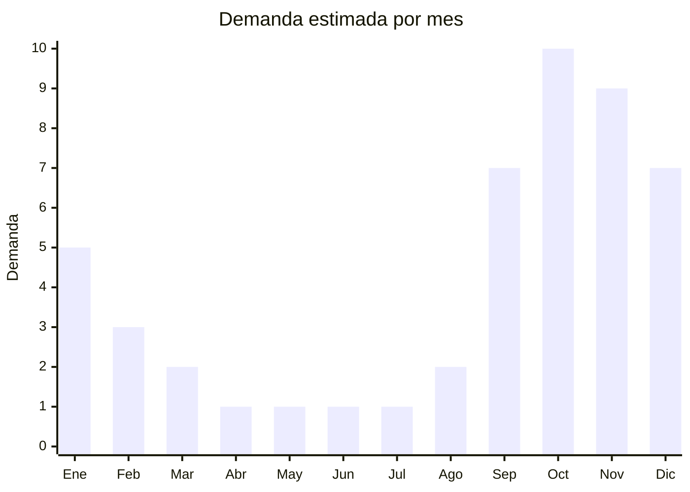

# Filtros de arena para pileta

> **Capítulo NCM 84** — Máquinas y aparatos mecánicos | **Temporada:** Verano (Dic–Feb)

## Qué es y por qué importarlo

Los filtros de arena para pileta son sistemas de filtración que purifican el agua de la piscina haciéndola pasar a través de un lecho de arena sílice (arena especial de granulometría controlada). El agua ingresa por la parte superior del tanque, atraviesa la arena que retiene impurezas, bacterias y partículas sólidas, y sale limpia por la parte inferior. Son el sistema de filtración más utilizado en piletas medianas y grandes por su eficiencia, durabilidad y bajo costo de mantenimiento (la arena se reemplaza cada 3-5 años).

En Argentina, los filtros de arena se venden tanto como unidad independiente como en kit bomba + filtro. Las marcas Bestway e Intex dominan el mercado con kits completos que incluyen bomba, tanque de filtro, válvula selectora multiposición (filtrar, retrolavado, recircular, vaciar, cerrar) y mangueras. Los precios de venta oscilan entre ARS 50.000 y ARS 200.000 según tamaño y si incluye bomba. Son productos complementarios a las piletas de lona/estructura (Cap. 39) y piletas inflables (Cap. 95).

China fabrica la totalidad de los filtros Bestway e Intex, además de infinitas marcas blancas. Las fábricas están en Taizhou y Ningbo (Zhejiang). El kit completo bomba + filtro de arena es el producto con mejor relación margen/utilidad en el segmento de accesorios de pileta.

<Warning>
Los kits con bomba eléctrica pueden requerir **certificación IRAM de seguridad eléctrica**. El tanque de filtro a presión debe cumplir estándares de seguridad de recipientes presurizados. Verificar con despachante.
</Warning>

## Datos clave

| Dato | Valor |
|------|-------|
| **Posiciones NCM típicas** | 8421.21.00 (aparatos para filtrar o depurar agua), 8421.29.90 (otros aparatos de filtrado) |
| **Derecho de importación** | 14-18% (DIE según posición) + 3% tasa estadística |
| **Rango FOB típico** | USD 79.00 — USD 399.00 por set (kit bomba + filtro) |
| **Precio de venta en Argentina** | ARS 50.000 — ARS 200.000 |
| **Margen bruto estimado** | 80% — 150% |
| **MOQ típico** | 20 — 100 sets |
| **Demanda en MercadoLibre** | Alta (complementario a piletas) |
| **Competencia en MercadoLibre** | Alta (Bestway, Intex dominan) |
| **Dificultad para importar** | Media-Alta (volumen + certificación) |
| **Certificaciones necesarias** | IRAM seguridad eléctrica para bomba (verificar) |
| **Antidumping** | No |

## Variantes y subtipos más comunes

| Subtipo / Variante | FOB aprox. | Venta AR aprox. | Nota |
|--------------------|-----------|-----------------|------|
| Kit filtro arena + bomba 0.25 HP (pileta chica) | USD 79.00 — 120.00 | ARS 50.000 — 80.000 | Piletas hasta 15.000L |
| Kit filtro arena + bomba 0.5 HP | USD 120.00 — 180.00 | ARS 80.000 — 120.000 | **Más vendido**, piletas medianas |
| Kit filtro arena + bomba 0.75-1 HP | USD 180.00 — 280.00 | ARS 120.000 — 160.000 | Piletas grandes |
| Kit filtro arena + bomba 1.5-2 HP | USD 280.00 — 399.00 | ARS 160.000 — 200.000 | Comercial/profesional |
| Filtro arena solo (sin bomba) | USD 40.00 — 150.00 | ARS 35.000 — 100.000 | Repuesto/upgrade |

## Regulaciones y requisitos

<Tabs>
  <Tab title="Certificaciones">
    | Organismo | Requiere | Detalle |
    |-----------|----------|---------|
    | ARCA (Aduana) | Sí siempre | Despacho estándar |
    | IRAM | Sí (verificar) | Seguridad eléctrica de la bomba |
    | Eficiencia energética | Verificar | Puede aplicar a la bomba |
    | ENACOM | No | No es electrónico |
    | ANMAT | No | No aplica |

    **Recomendación:** El tanque del filtro opera bajo presión (0.5-2.0 bar). Solicitar al proveedor certificado de prueba de presión hidrostática (mínimo 3x presión de trabajo). La válvula selectora multiposición es el componente más propenso a fallas; verificar que sea de plástico ABS reforzado, no polipropileno barato. Exigir que las juntas tóricas sean de EPDM (resistente al cloro).
  </Tab>

  <Tab title="Etiquetado">
    | Requisito | Aplica |
    |-----------|--------|
    | Idioma español | Sí |
    | Datos del importador | Sí |
    | Tensión / frecuencia (bomba) | Sí (220V - 50Hz Argentina) |
    | Potencia bomba en HP/watts | Sí |
    | Caudal de filtración (L/h) | Sí |
    | Capacidad de arena (kg) | Sí |
    | Presión máxima de trabajo | Sí |
    | País de origen | Sí |
    | Garantía legal 6 meses | Sí |
    | Manual de instalación en español | Sí |
  </Tab>

  <Tab title="Restricciones">
    La bomba eléctrica puede requerir certificación de seguridad. El tanque presurizado debe cumplir estándares de seguridad mecánica.

    **Atención:** La arena sílice para el filtro NO se importa con el kit (se compra localmente por peso y volumen). Indicar claramente en la publicación que la arena no está incluida y especificar la granulometría requerida (generalmente #20 o 0.45-0.85 mm). Esto evita confusiones y reclamos del comprador.
  </Tab>
</Tabs>

## Logística

| Dato | Valor |
|------|-------|
| **Peso típico por unidad** | 8.0 — 25.0 kg (kit completo sin arena) |
| **Volumen típico** | Alto (tanque + bomba + accesorios) |
| **Fragilidad** | Media (tanque plástico robusto, válvula delicada) |
| **Envío recomendado** | Marítimo FCL o LCL (producto voluminoso y pesado) |
| **Tiempo total estimado** | 55 — 85 días (marítimo) |
| **Baterías de litio** | No |
| **Requiere empaque especial** | Sí (protección válvula selectora, conexiones) |

<Tip>
Para optimizar el contenedor, negociar con el proveedor que los tanques de filtro se envíen **anidados** cuando sea posible (tanques chicos dentro de grandes). Las mangueras y accesorios pueden ir dentro del tanque vacío. Combinar en el mismo contenedor con bombas de pileta y otros accesorios de pileta para optimizar flete. Pedir al proveedor que **no incluya arena** ya que se consigue localmente a menor costo.
</Tip>

## Estacionalidad



| Aspecto | Detalle |
|---------|---------|
| **Meses pico** | Septiembre-Diciembre (pre-verano, preparación y compra de piletas nuevas) |
| **Meses valle** | Abril-Agosto (piletas cerradas, sin demanda) |
| **Cuándo pedir** | Junio-Julio para tener stock en septiembre (los compradores de piletas nuevas compran filtro junto con la pileta) |

## Ventajas y riesgos

<CardGroup cols={2}>
  <Card title="Ventajas" icon="circle-check">
    - Producto complementario obligatorio para piletas
    - Kit bomba+filtro tiene ticket alto y buen margen
    - Repuestos (válvula, juntas, arena) como negocio recurrente
    - Demanda vinculada al crecimiento de piletas de lona
    - Canal pileteros profesionales genera volumen
  </Card>
  <Card title="Riesgos" icon="triangle-exclamation">
    - Bestway/Intex dominan con marca fuerte
    - Alto CBM y peso elevan costo de flete
    - Válvula selectora de mala calidad genera fugas masivas
    - Certificación eléctrica de la bomba (costo y tiempo)
    - Reclamos por presión, fugas y rendimiento del filtrado
  </Card>
</CardGroup>

## Palabras clave para buscar en Alibaba

```
sand filter pump pool wholesale, swimming pool sand filter, pool filter system,
sand filter with pump combo, above ground pool sand filter, pool sand filter valve,
pool filtration system wholesale, sand filter tank pool 220V
```

## Fuentes

- [MercadoLibre Argentina — Filtro arena pileta](https://listado.mercadolibre.com.ar/filtro-arena-pileta)
- [Alibaba — Swimming pool sand filter](https://www.alibaba.com/showroom/swimming-pool-sand-filter.html)
