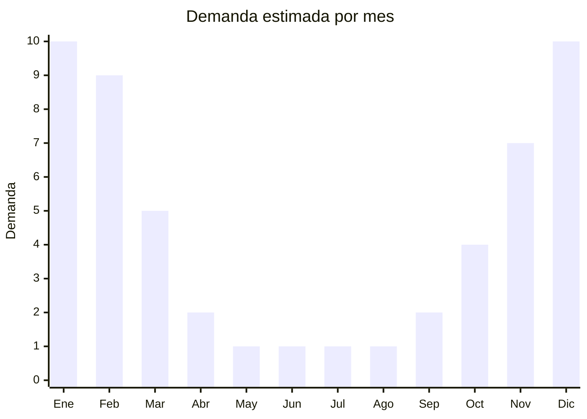

# Ventiladores nebulizadores

> **Capítulo NCM 84** — Máquinas y aparatos mecánicos | **Temporada:** Verano (Dic–Feb)

## Qué es y por qué importarlo

Los ventiladores nebulizadores (también llamados ventiladores con spray, mist fans o ventiladores humidificadores) son ventiladores que combinan el flujo de aire con una nebulización fina de agua, creando un efecto de enfriamiento más intenso que un ventilador convencional. La micro-nebulización (gotas de 5-15 micras) se evapora rápidamente en contacto con el aire caliente, reduciendo la temperatura percibida entre 5 y 12 grados centígrados.

Son especialmente populares para uso exterior: patios, terrazas, asadores, restaurantes al aire libre, eventos y comercios con acceso a la calle. En Argentina, la tendencia es creciente impulsada por la gastronomía con mesas al exterior y los espacios al aire libre residenciales. Los modelos van desde pequeños ventiladores de mano con spray (USD 3 FOB) hasta grandes ventiladores industriales nebulizadores de pie (USD 60 FOB) con tanque de agua de 40 litros.

China es el productor dominante, con fábricas en Foshan y Ningbo que ofrecen desde ventiladores portátiles recargables con spray hasta modelos industriales de alta presión. El rango de precios y tamaños es muy amplio, permitiendo cubrir desde el segmento personal/playa hasta el profesional/gastronómico.

<Warning>
Los modelos eléctricos de alta potencia pueden requerir **certificación IRAM de seguridad eléctrica**. Los modelos portátiles a batería recargable tienen menor exigencia regulatoria. Verificar según la potencia y tipo de alimentación.
</Warning>

## Datos clave

| Dato | Valor |
|------|-------|
| **Posiciones NCM típicas** | 8414.51.10 (ventiladores con motor eléctrico ≤ 125 W), 8414.59.90 (otros ventiladores) |
| **Derecho de importación** | 20% (DIE) + 3% tasa estadística |
| **Rango FOB típico** | USD 3.00 — USD 60.00 por unidad (según tamaño) |
| **Precio de venta en Argentina** | ARS 5.000 — ARS 40.000+ |
| **Margen bruto estimado** | 150% — 300% |
| **MOQ típico** | 100 — 500 unidades |
| **Demanda en MercadoLibre** | Media-Alta (tendencia creciente) |
| **Competencia en MercadoLibre** | Media |
| **Dificultad para importar** | Fácil-Media (según tamaño y potencia) |
| **Certificaciones necesarias** | IRAM para modelos eléctricos de alta potencia (verificar) |
| **Antidumping** | No |

## Variantes y subtipos más comunes

| Subtipo / Variante | FOB aprox. | Venta AR aprox. | Nota |
|--------------------|-----------|-----------------|------|
| Mini ventilador mano con spray | USD 3.00 — 5.00 | ARS 5.000 — 12.000 | Playa, personal, recargable |
| Ventilador escritorio nebulizador | USD 8.00 — 15.00 | ARS 12.000 — 22.000 | Uso interior, USB/220V |
| Ventilador pie nebulizador 16" | USD 25.00 — 40.00 | ARS 22.000 — 35.000 | **Más versátil** |
| Ventilador industrial nebulizador 26" | USD 40.00 — 60.00 | ARS 30.000 — 40.000+ | Gastronomía, eventos |
| Ventilador mural nebulizador | USD 20.00 — 35.00 | ARS 18.000 — 30.000 | Montaje pared, terrazas |

## Regulaciones y requisitos

<Tabs>
  <Tab title="Certificaciones">
    | Organismo | Requiere | Detalle |
    |-----------|----------|---------|
    | ARCA (Aduana) | Sí siempre | Despacho estándar |
    | IRAM | Según potencia | Modelos > 50W probablemente requieran |
    | Eficiencia energética | Verificar | Puede aplicar según clasificación |
    | ENACOM | No | No emite radiofrecuencia |
    | ANMAT | No | No aplica |

    **Recomendación:** Los modelos portátiles a batería recargable (mini mist fan) tienen menor exigencia regulatoria que los modelos de pie enchufables a 220V. Para una primera importación, considerar comenzar con modelos portátiles recargables para evitar el proceso de certificación IRAM. Verificar que las boquillas nebulizadoras sean de calidad (latón o acero inoxidable, no plástico barato que se obstruye).
  </Tab>

  <Tab title="Etiquetado">
    | Requisito | Aplica |
    |-----------|--------|
    | Idioma español | Sí |
    | Datos del importador | Sí |
    | Tensión / frecuencia | Sí (si es eléctrico 220V - 50Hz) |
    | Potencia en watts | Sí |
    | Capacidad tanque agua | Sí |
    | País de origen | Sí |
    | Garantía legal 6 meses | Sí |
    | Manual de uso en español | Sí |
    | Tipo de batería | Sí (si recargable) |
  </Tab>

  <Tab title="Restricciones">
    Modelos eléctricos de alta potencia sujetos a control de seguridad eléctrica. Modelos portátiles a batería con menor exigencia.

    **Atención:** Los ventiladores nebulizadores deben usar agua limpia (no salada ni con cloro). Indicar claramente en las instrucciones. Los modelos con bomba de alta presión pueden tener fugas si las conexiones son de baja calidad. Verificar estanqueidad antes de comercializar.
  </Tab>
</Tabs>

## Logística

| Dato | Valor |
|------|-------|
| **Peso típico por unidad** | 0.3 — 8.0 kg (según tamaño) |
| **Volumen típico** | Variable (bajo para portátiles, alto para industriales) |
| **Fragilidad** | Media (boquillas, tanque, bomba) |
| **Envío recomendado** | Aéreo para portátiles, marítimo LCL/FCL para grandes |
| **Tiempo total estimado** | 15-25 días (aéreo portátiles), 55-85 días (marítimo) |
| **Baterías de litio** | Sí (modelos recargables portátiles) |
| **Requiere empaque especial** | Sí (protección de boquillas y tanque) |

<Tip>
Los ventiladores nebulizadores portátiles (mini mist fan recargable) son ideales como **primer producto de prueba**: bajo FOB, bajo peso, envío aéreo posible, sin certificación IRAM compleja y margen alto. Si funcionan bien, escalar a modelos de pie para canal gastronómico (restaurantes, bares con terraza) que generan mayor ticket y recompra.
</Tip>

## Estacionalidad



| Aspecto | Detalle |
|---------|---------|
| **Meses pico** | Diciembre-Febrero (pico extremo, uso exterior verano) |
| **Meses valle** | Mayo-Agosto (sin uso) |
| **Cuándo pedir** | Agosto-Septiembre para tener stock en noviembre |

## Ventajas y riesgos

<CardGroup cols={2}>
  <Card title="Ventajas" icon="circle-check">
    - Tendencia creciente en gastronomía outdoor
    - Amplio rango de precios (USD 3-60 FOB)
    - Modelos portátiles: fácil de importar, sin certificación
    - Diferenciación frente a ventiladores convencionales
    - Canal B2B (restaurantes, bares) con recompra
  </Card>
  <Card title="Riesgos" icon="triangle-exclamation">
    - Boquillas de baja calidad se obstruyen rápidamente
    - Modelos baratos tienen fugas de agua
    - Estacionalidad extrema (solo verano)
    - Modelos grandes requieren certificación eléctrica
    - Consumidor no siempre entiende la diferencia con humidificador
  </Card>
</CardGroup>

## Palabras clave para buscar en Alibaba

```
mist fan wholesale, spray fan portable, nebulizer fan outdoor,
misting fan with water tank, portable mist fan rechargeable USB,
industrial mist fan stand, outdoor cooling mist fan, water spray fan 220V
```

## Fuentes

- [MercadoLibre Argentina — Ventilador nebulizador](https://listado.mercadolibre.com.ar/ventilador-nebulizador)
- [Alibaba — Mist fan wholesale](https://www.alibaba.com/showroom/mist-fan.html)
