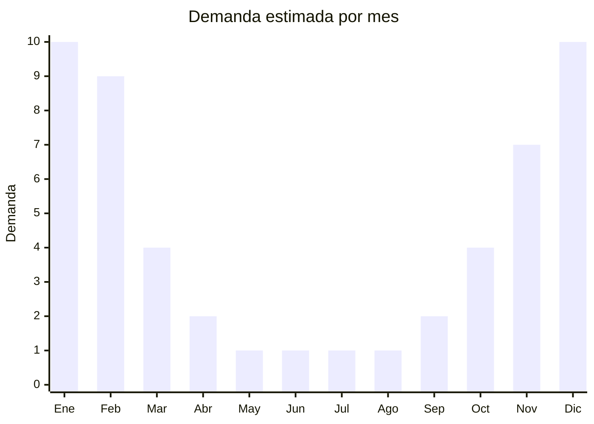

# Ventiladores de pie 16"-20"

> **Capítulo NCM 84** — Máquinas y aparatos mecánicos | **Temporada:** Verano (Dic–Feb)

## Qué es y por qué importarlo

Los ventiladores de pie (también llamados ventiladores de pedestal) son aparatos de climatización mecánica compuestos por un motor eléctrico, aspas de plástico de 16" a 20" de diámetro, una columna telescópica regulable en altura y una base estable. Son el producto número uno en climatización por volumen de ventas en Argentina, donde el calor intenso del verano genera una demanda que se multiplica entre 5 y 8 veces respecto al resto del año.

En MercadoLibre, modelos como el Liliana VP16P han superado las 50.000 unidades vendidas, demostrando la magnitud del mercado. Los precios de venta oscilan entre ARS 25.000 y ARS 80.000 según tamaño, marca y funcionalidades (velocidades, oscilación, timer, control remoto). China es el principal productor mundial de ventiladores, con fábricas concentradas en Foshan y Zhongshan (Guangdong) que fabrican tanto para marcas globales como para exportación de marca blanca.

La oportunidad de importación es clara: el FOB de un ventilador de pie de 16" ronda los USD 17-29, mientras el precio de venta en Argentina permite márgenes del 100-200%. El desafío principal es la logística (alto volumen/CBM), la necesidad de certificación IRAM para seguridad eléctrica y la competencia con marcas locales establecidas.

<Warning>
Los ventiladores de pie pueden requerir **certificación IRAM de seguridad eléctrica** y **etiqueta de eficiencia energética**. Verificar requisitos vigentes con un despachante antes de importar. El incumplimiento puede generar retención en aduana.
</Warning>

## Datos clave

| Dato | Valor |
|------|-------|
| **Posiciones NCM típicas** | 8414.51.10 (ventiladores de mesa, pie o pared, con motor eléctrico de potencia ≤ 125 W) |
| **Derecho de importación** | 20% (DIE) + 3% tasa estadística |
| **Rango FOB típico** | USD 17.00 — USD 29.00 por unidad |
| **Precio de venta en Argentina** | ARS 25.000 — ARS 80.000 |
| **Margen bruto estimado** | 100% — 200% |
| **MOQ típico** | 100 — 500 unidades |
| **Demanda en MercadoLibre** | Extremadamente Alta (estacional, pico x5-8) |
| **Competencia en MercadoLibre** | Alta (Liliana, Peabody, Atma, marcas chinas) |
| **Dificultad para importar** | Media (certificaciones + volumen) |
| **Certificaciones necesarias** | IRAM seguridad eléctrica + etiqueta eficiencia energética (verificar) |
| **Antidumping** | No |

## Variantes y subtipos más comunes

| Subtipo / Variante | FOB aprox. | Venta AR aprox. | Nota |
|--------------------|-----------|-----------------|------|
| Ventilador pie 16" básico 3 vel. | USD 17.00 — 20.00 | ARS 25.000 — 40.000 | **Más vendido por volumen** |
| Ventilador pie 18" oscilante | USD 20.00 — 24.00 | ARS 35.000 — 55.000 | Mayor caudal de aire |
| Ventilador pie 20" industrial | USD 24.00 — 29.00 | ARS 50.000 — 80.000 | Gastronomía, oficinas |
| Ventilador pie con control remoto | USD 22.00 — 27.00 | ARS 40.000 — 65.000 | Premium, mayor ticket |
| Ventilador pie con timer digital | USD 23.00 — 29.00 | ARS 45.000 — 70.000 | Funcionalidad extra |

## Regulaciones y requisitos

<Tabs>
  <Tab title="Certificaciones">
    | Organismo | Requiere | Detalle |
    |-----------|----------|---------|
    | ARCA (Aduana) | Sí siempre | Despacho estándar |
    | IRAM | Sí (verificar) | Seguridad eléctrica (IEC 60335-2-80) |
    | Eficiencia energética | Sí (verificar) | Etiqueta de eficiencia energética |
    | ENACOM | No | No emite radiofrecuencia |
    | ANMAT | No | No aplica |

    **Recomendación:** Antes de realizar el pedido, confirmar con un despachante aduanero los requisitos vigentes de certificación IRAM y etiqueta de eficiencia energética para ventiladores. Solicitar al proveedor chino que el producto cumpla con la norma IEC 60335-2-80 (seguridad de ventiladores) y obtener reportes de laboratorio acreditado. El proceso de certificación puede demorar 2-4 meses y costar USD 2.000-5.000.
  </Tab>

  <Tab title="Etiquetado">
    | Requisito | Aplica |
    |-----------|--------|
    | Idioma español | Sí |
    | Datos del importador | Sí |
    | Tensión / frecuencia | Sí (220V - 50Hz Argentina) |
    | Potencia en watts | Sí |
    | Etiqueta eficiencia energética | Sí (verificar vigencia) |
    | País de origen | Sí |
    | Garantía legal 6 meses | Sí |
    | Manual de uso en español | Sí |
  </Tab>

  <Tab title="Restricciones">
    Los ventiladores eléctricos están sujetos a control de seguridad eléctrica. La falta de certificación puede resultar en retención aduanera o imposibilidad de despachar.

    **Atención:** Verificar que el motor esté diseñado para 220V / 50Hz (estándar argentino). Los ventiladores fabricados para mercados de 110V o 60Hz no funcionan correctamente en Argentina y pueden ser peligrosos. Solicitar al proveedor que configure específicamente para el mercado sudamericano.
  </Tab>
</Tabs>

## Logística

| Dato | Valor |
|------|-------|
| **Peso típico por unidad** | 3.5 — 6.0 kg |
| **Volumen típico** | Alto (cajas grandes, aspas no se comprimen) |
| **Fragilidad** | Media (aspas plásticas, rejilla metálica) |
| **Envío recomendado** | Marítimo FCL para volúmenes grandes, LCL para prueba |
| **Tiempo total estimado** | 55 — 85 días (marítimo) |
| **Baterías de litio** | No |
| **Requiere empaque especial** | Sí (caja individual reforzada, protección de rejilla) |

<Tip>
Para la primera importación, solicitar al proveedor que envíe los ventiladores **desarmados en caja plana** (flat pack). Esto reduce el CBM hasta un 40% respecto a los enviados armados. El comprador final los ensambla fácilmente (5 minutos, sin herramientas). Esta práctica es estándar en el mercado y los consumidores la aceptan.
</Tip>

## Estacionalidad



| Aspecto | Detalle |
|---------|---------|
| **Meses pico** | Diciembre-Febrero (pico extremo, demanda x5-8 vs. promedio) |
| **Meses valle** | Mayo-Agosto (demanda casi nula) |
| **Cuándo pedir** | Julio-Agosto para tener stock listo en noviembre (considerar 2-4 meses adicionales si necesita certificación IRAM) |

## Ventajas y riesgos

<CardGroup cols={2}>
  <Card title="Ventajas" icon="circle-check">
    - Demanda masiva y predecible cada verano
    - Producto #1 en climatización por volumen
    - Modelo de 16" cubre el 60%+ del mercado
    - Fábricas chinas con décadas de experiencia
    - Posibilidad de marca propia con bajo MOQ
  </Card>
  <Card title="Riesgos" icon="triangle-exclamation">
    - Requiere certificación IRAM (costo y tiempo)
    - Alto CBM eleva costo de flete significativamente
    - Competencia feroz con marcas establecidas
    - Estacionalidad extrema: stock no vendido se inmoviliza 8 meses
    - Reclamos por ruido, vibración o durabilidad del motor
  </Card>
</CardGroup>

## Palabras clave para buscar en Alibaba

```
stand fan 16 inch wholesale, pedestal fan 18 inch factory, standing fan OEM,
16 inch oscillating stand fan, electric stand fan 220V 50Hz, floor standing fan,
pedestal fan with remote control, industrial stand fan 20 inch
```

## Fuentes

- [MercadoLibre Argentina — Ventilador de pie](https://listado.mercadolibre.com.ar/ventilador-de-pie)
- [Alibaba — Stand fan wholesale](https://www.alibaba.com/showroom/stand-fan.html)
