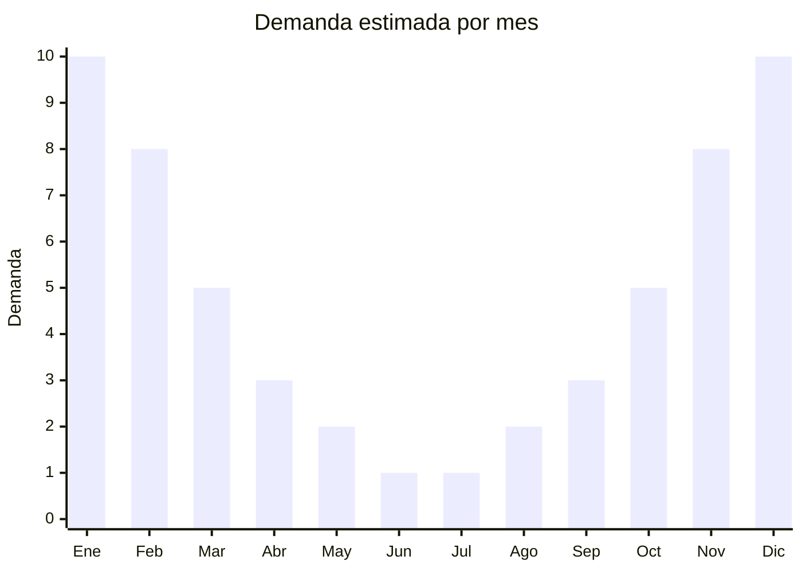

# Ventiladores de techo con luz LED

> **Capítulo NCM 84** — Máquinas y aparatos mecánicos | **Temporada:** Verano (Dic–Feb)

## Qué es y por qué importarlo

Los ventiladores de techo con luz LED integrada son aparatos de climatización que combinan la función de ventilación con iluminación en un solo producto montado en el techo. Los modelos modernos incluyen control remoto, múltiples velocidades, función inversa (para invierno) y regulación de intensidad y temperatura de color de la luz LED. La tendencia más fuerte del mercado son los ventiladores retráctiles (también llamados de aspas ocultas o invisibles), donde las aspas se pliegan dentro del cuerpo cuando no están en uso, quedando solo la lámpara visible.

En Argentina, los ventiladores de techo han ganado terreno como solución de climatización para espacios donde un ventilador de pie ocupa lugar (departamentos, comercios, restaurantes). Los modelos retráctiles con diseño moderno son especialmente populares en decoración de interiores. El precio de venta en Argentina oscila entre ARS 40.000 y ARS 120.000, posicionándose como un producto de ticket medio-alto con buenos márgenes.

China es el principal productor mundial, con fábricas en Zhongshan y Foshan especializadas en ventiladores decorativos. Los modelos con aspas retráctiles y control por app/Wi-Fi representan la gama más alta y la mayor tendencia de crecimiento.

<Warning>
Los ventiladores de techo pueden requerir **certificación IRAM de seguridad eléctrica** y **etiqueta de eficiencia energética**. Requieren instalación eléctrica, lo que implica responsabilidad sobre la seguridad del producto. Verificar con despachante antes de importar.
</Warning>

## Datos clave

| Dato | Valor |
|------|-------|
| **Posiciones NCM típicas** | 8414.51.10 (ventiladores de techo con motor eléctrico ≤ 125 W) |
| **Derecho de importación** | 20% (DIE) + 3% tasa estadística |
| **Rango FOB típico** | USD 15.00 — USD 45.00 por unidad |
| **Precio de venta en Argentina** | ARS 40.000 — ARS 120.000 |
| **Margen bruto estimado** | 120% — 250% |
| **MOQ típico** | 50 — 300 unidades |
| **Demanda en MercadoLibre** | Alta |
| **Competencia en MercadoLibre** | Media |
| **Dificultad para importar** | Media (certificaciones + fragilidad) |
| **Certificaciones necesarias** | IRAM seguridad eléctrica + etiqueta eficiencia energética (verificar) |
| **Antidumping** | No |

## Variantes y subtipos más comunes

| Subtipo / Variante | FOB aprox. | Venta AR aprox. | Nota |
|--------------------|-----------|-----------------|------|
| Ventilador techo clásico 42" con luz | USD 15.00 — 22.00 | ARS 40.000 — 60.000 | Diseño tradicional |
| Ventilador techo retráctil 42" | USD 22.00 — 35.00 | ARS 60.000 — 90.000 | **Tendencia**, aspas ocultas |
| Ventilador techo retráctil 52" | USD 30.00 — 45.00 | ARS 80.000 — 120.000 | Premium, ambientes grandes |
| Ventilador techo moderno sin aspas | USD 35.00 — 45.00 | ARS 85.000 — 120.000 | Diseño minimalista |
| Ventilador techo industrial/comercial | USD 25.00 — 40.00 | ARS 55.000 — 95.000 | Gastronomía, comercios |

## Regulaciones y requisitos

<Tabs>
  <Tab title="Certificaciones">
    | Organismo | Requiere | Detalle |
    |-----------|----------|---------|
    | ARCA (Aduana) | Sí siempre | Despacho estándar |
    | IRAM | Sí (verificar) | Seguridad eléctrica (IEC 60335-2-80) |
    | Eficiencia energética | Sí (verificar) | Etiqueta de eficiencia energética |
    | ENACOM | Posible | Si tiene control Wi-Fi o Bluetooth |
    | ANMAT | No | No aplica |

    **Recomendación:** Los ventiladores de techo con control remoto por radiofrecuencia o Wi-Fi pueden requerir homologación ENACOM. Verificar si el modelo específico emite señales de radio. Solicitar al proveedor cumplimiento de IEC 60335-2-80 y reportes de laboratorio. Los modelos retráctiles deben tener mecanismo de plegado confiable (verificar ciclos de vida del mecanismo).
  </Tab>

  <Tab title="Etiquetado">
    | Requisito | Aplica |
    |-----------|--------|
    | Idioma español | Sí |
    | Datos del importador | Sí |
    | Tensión / frecuencia | Sí (220V - 50Hz Argentina) |
    | Potencia en watts (motor + LED) | Sí |
    | Etiqueta eficiencia energética | Sí (verificar vigencia) |
    | País de origen | Sí |
    | Garantía legal 6 meses | Sí |
    | Manual de instalación en español | Sí (incluir esquema eléctrico) |
  </Tab>

  <Tab title="Restricciones">
    Los ventiladores de techo requieren instalación eléctrica fija, lo que implica mayor responsabilidad sobre seguridad. La certificación eléctrica es fundamental.

    **Atención:** Los modelos con control Wi-Fi o Bluetooth pueden requerir homologación ENACOM adicional. Verificar que el motor sea compatible con 220V / 50Hz. Los ventiladores de techo requieren soporte estructural adecuado en el techo (peso del producto + vibración), lo que debe indicarse claramente en las instrucciones de instalación.
  </Tab>
</Tabs>

## Logística

| Dato | Valor |
|------|-------|
| **Peso típico por unidad** | 4.0 — 9.0 kg |
| **Volumen típico** | Alto (cajas grandes, aspas extendidas) |
| **Fragilidad** | Alta (vidrio de lámpara, aspas decorativas, mecanismo retráctil) |
| **Envío recomendado** | Marítimo LCL o FCL con empaque reforzado |
| **Tiempo total estimado** | 55 — 85 días (marítimo) |
| **Baterías de litio** | No (algunos controles remotos usan pilas botón) |
| **Requiere empaque especial** | Sí (protección de vidrio LED, mecanismo retráctil, aspas) |

<Tip>
Los ventiladores retráctiles son el producto con mayor crecimiento en esta categoría. Al negociar con el proveedor, solicitar **video de prueba del mecanismo retráctil** en funcionamiento (mínimo 1.000 ciclos de apertura/cierre sin fallas). Los mecanismos baratos fallan a los pocos meses y generan devoluciones masivas.
</Tip>

## Estacionalidad



| Aspecto | Detalle |
|---------|---------|
| **Meses pico** | Noviembre-Febrero (verano, pico extremo en dic-ene) |
| **Meses valle** | Mayo-Agosto (demanda muy baja) |
| **Cuándo pedir** | Julio-Agosto para tener stock en noviembre (sumar tiempo de certificación si aplica) |

## Ventajas y riesgos

<CardGroup cols={2}>
  <Card title="Ventajas" icon="circle-check">
    - Ticket alto con buenos márgenes
    - Tendencia retráctil en fuerte crecimiento
    - Producto 2 en 1 (ventilador + lámpara LED)
    - Menor competencia que ventiladores de pie
    - Se percibe como producto de diseño/decoración
  </Card>
  <Card title="Riesgos" icon="triangle-exclamation">
    - Requiere certificación IRAM (inversión inicial)
    - Producto frágil: vidrio y mecanismos delicados
    - Alto CBM aumenta costo de flete
    - Instalación requiere electricista (barrera para consumidor)
    - Mecanismo retráctil barato puede fallar y generar devoluciones
  </Card>
</CardGroup>

## Palabras clave para buscar en Alibaba

```
ceiling fan with light LED wholesale, retractable ceiling fan, invisible blade ceiling fan,
modern ceiling fan light 42 inch, foldable ceiling fan LED, ceiling fan 220V 50Hz,
decorative ceiling fan lamp, remote control ceiling fan with light
```

## Fuentes

- [MercadoLibre Argentina — Ventilador de techo](https://listado.mercadolibre.com.ar/ventilador-de-techo)
- [Alibaba — Ceiling fan with light](https://www.alibaba.com/showroom/ceiling-fan-with-light.html)
