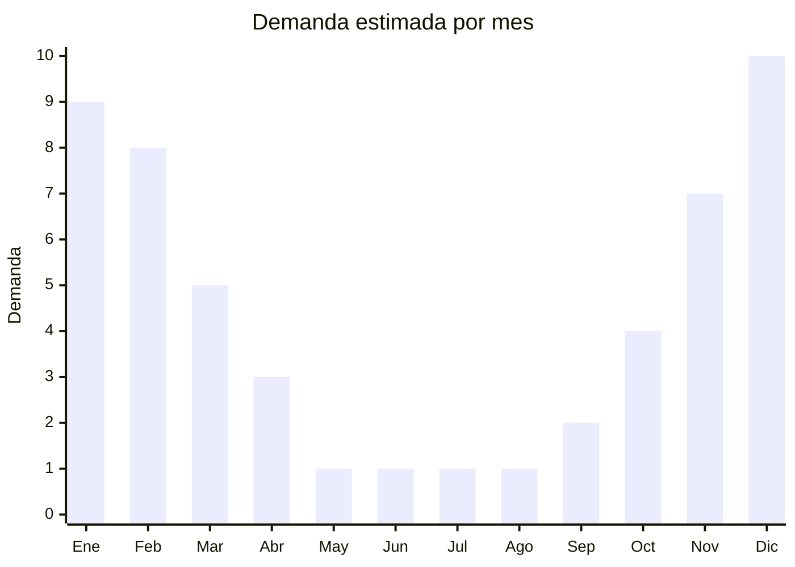

# Duchas portatiles electricas 12V

> **Capitulo NCM 85** — Maquinas, aparatos y material electrico | **Temporada:** Verano (Dic-Feb)

## Que es y por que importarlo

Las duchas portatiles electricas 12V son sistemas de bombeo compactos disenados para proporcionar un chorro de agua presurizado en cualquier lugar sin acceso a plomeria: campings, playas, motorhomes, lavado de mascotas, enjuague de equipos de pesca y limpieza de vehiculos. El sistema consiste en una bomba sumergible de 12V que se conecta al encendedor del auto (o a una bateria portatil), una manguera flexible de 2-3 metros y un cabezal tipo ducha con regulador de caudal.

El kit completo generalmente incluye: bomba sumergible, cabezal de ducha, manguera, gancho ventosa para colgar, y cable con conector 12V para encendedor de auto. Algunos modelos premium incluyen bateria recargable propia, eliminando la dependencia del vehiculo. Es un producto de nicho creciente en Argentina, impulsado por el auge del camping, los viajes en motorhome/camper y las escapadas a playas sin servicios.

La demanda se concentra fuertemente en verano (noviembre-febrero), cuando la gente acampa, va a la playa y necesita enjuagarse despues de actividades acuaticas. China fabrica estos kits a precios FOB muy accesibles (USD 5-15 kit completo), y al ser un producto electrico simple de 12V sin conectividad inalambrica, NO requiere homologacion ENACOM. Es un producto con poca competencia en Argentina comparado con otros accesorios de camping mas masivos.

## Datos clave

| Dato | Valor |
|------|-------|
| **Posiciones NCM tipicas** | 8413.70.90 (bombas centrifugas), 8424.89.00 (aparatos mecanicos para proyectar liquidos) |
| **Derecho de importacion** | 18-20% (DIE) + 3% tasa estadistica |
| **Rango FOB tipico** | USD 5.00 — USD 15.00 por kit completo |
| **Precio de venta en Argentina** | ARS 13.000 — ARS 46.500 |
| **Margen bruto estimado** | 150% — 300% |
| **MOQ tipico** | 50 — 300 unidades |
| **Demanda en MercadoLibre** | Media-Alta (nicho creciente) |
| **Competencia en MercadoLibre** | Baja-Media |
| **Dificultad para importar** | Facil (sin certificaciones especiales) |
| **Certificaciones necesarias** | No requiere ENACOM ni certificaciones especiales |
| **Antidumping** | No |

## Variantes y subtipos mas comunes

| Subtipo / Variante | FOB aprox. | Venta AR aprox. | Nota |
|--------------------|-----------|-----------------|------|
| Kit basico 12V encendedor auto | USD 5.00 — 8.00 | ARS 13.000 — 25.000 | **Mas vendido**, conexion auto |
| Kit 12V con gancho ventosa + bolsa | USD 7.00 — 10.00 | ARS 20.000 — 32.000 | Kit completo listo para usar |
| Kit con bateria recargable propia | USD 10.00 — 15.00 | ARS 30.000 — 46.500 | Premium, independiente del auto |
| Ducha 12V doble cabezal (persona + mascotas) | USD 8.00 — 12.00 | ARS 22.000 — 38.000 | Versatil, mayor caudal |
| Kit 12V + calentador solar bolsa 20L | USD 6.00 — 10.00 | ARS 18.000 — 35.000 | Combo ducha tibia, diferenciador |

## Regulaciones y requisitos

<Tabs>
  <Tab title="Certificaciones">
    | Organismo | Requiere | Detalle |
    |-----------|----------|---------|
    | ARCA (Aduana) | Si siempre | Despacho estandar |
    | ENACOM | **NO** | No tiene WiFi, Bluetooth ni conexion a red electrica (opera a 12V DC) |
    | ANMAT | No | No aplica |
    | SENASA | No | No aplica |

    **Recomendacion:** Verificar que la bomba sumergible sea efectivamente de 12V DC y no incluya adaptador a 220V AC (lo cual cambiaria la clasificacion y podria requerir certificaciones adicionales). Los modelos de 12V que se conectan al encendedor del auto son los mas simples de importar. Solicitar al proveedor certificado de estanqueidad (waterproof) de la bomba.
  </Tab>

  <Tab title="Etiquetado">
    | Requisito | Aplica |
    |-----------|--------|
    | Idioma espanol | Si |
    | Datos del importador | Si |
    | Voltaje y consumo (12V DC) | Si |
    | Caudal en litros/minuto | Recomendado |
    | Longitud de manguera | Si |
    | Pais de origen | Si |
    | Garantia legal 6 meses | Si |
    | Instrucciones de uso y conexion | Si |
  </Tab>

  <Tab title="Restricciones">
    Sin restricciones especiales de importacion. No hay antidumping, licencias previas ni intervenciones de organismos para bombas de agua 12V de uso recreativo.

    **Atencion:** Si el kit incluye bateria de litio recargable (modelos con bateria propia), se necesita documentacion MSDS para el transporte. Los kits que solo usan la bateria del auto (12V encendedor) no tienen esta complicacion. Verificar que el conector de encendedor sea compatible con vehiculos argentinos (estandar universal).
  </Tab>
</Tabs>

## Logistica

| Dato | Valor |
|------|-------|
| **Peso tipico por unidad** | 0.5 — 1.2 kg (kit completo) |
| **Volumen tipico** | Bajo (kit compacto empacado) |
| **Fragilidad** | Baja (componentes resistentes al agua) |
| **Envio recomendado** | Maritimo LCL |
| **Tiempo total estimado** | 50 — 80 dias (maritimo) |
| **Baterias de litio** | Solo en modelos con bateria propia |
| **Requiere empaque especial** | No (caja con compartimentos para cada componente) |

<Tip>
Ofrecer el kit con una **bolsa calentadora solar de 20L** (FOB USD 1-2) como combo diferenciador. La bolsa se llena con agua, se deja al sol 2-3 horas y permite ducharse con agua tibia. Este combo "ducha tibia portatil" se vende con un margen muy superior al kit basico. Tambien considerar incluir un **adaptador a USB 5V** para modelos que funcionen con power bank ademas del auto.
</Tip>

## Estacionalidad



| Aspecto | Detalle |
|---------|---------|
| **Meses pico** | Noviembre-Febrero (temporada de camping, playa, vacaciones) |
| **Meses valle** | Mayo-Agosto (sin actividad outdoor significativa) |
| **Cuando pedir** | Julio-Agosto para tener stock en octubre-noviembre |

## Ventajas y riesgos

<CardGroup cols={2}>
  <Card title="Ventajas" icon="circle-check">
    - Nicho creciente con poca competencia en Argentina
    - Sin ENACOM ni certificaciones complejas
    - Kit completo a FOB muy bajo (desde USD 5)
    - Producto liviano y compacto (flete economico)
    - Multiples usos: camping, playa, mascotas, vehiculos
    - Ideal para combos con accesorios de camping
  </Card>
  <Card title="Riesgos" icon="triangle-exclamation">
    - Muy estacional (demanda concentrada en verano)
    - Mercado de nicho (volumen total menor que productos masivos)
    - Calidad de bomba variable (verificar presion y durabilidad)
    - Conectores de encendedor de baja calidad pueden fallar
    - Manguera puede deteriorarse con exposicion al sol prolongada
    - Producto poco conocido: requiere educacion del comprador (fotos, videos)
  </Card>
</CardGroup>

## Palabras clave para buscar en Alibaba

```
portable shower 12V camping, car shower pump 12V outdoor,
camping shower electric portable, 12V shower kit car wash,
portable outdoor shower pump, camping shower set wholesale,
car wash shower pump 12V, portable shower head camping outdoor
```

## Fuentes

- [MercadoLibre Argentina — Duchas portatiles camping](https://listado.mercadolibre.com.ar/ducha-portatil-camping)
- [Alibaba — Portable 12V camping shower](https://www.alibaba.com/showroom/portable-12v-camping-shower.html)
