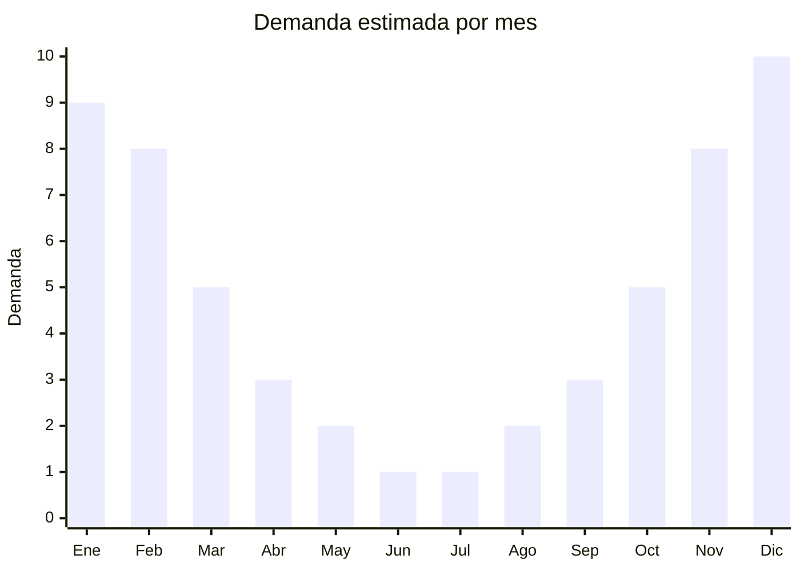

# Faroles LED recargables solares para camping

> **Capitulo NCM 85** — Maquinas, aparatos y material electrico | **Temporada:** Verano (Dic-Feb)

## Que es y por que importarlo

Los faroles LED recargables solares para camping son lamparas portatiles con multiples fuentes de carga (panel solar integrado y puerto USB) que proporcionan iluminacion en situaciones donde no hay acceso a electricidad: camping, excursiones, pesca, cortes de luz y emergencias. Los modelos mas populares incluyen funcion de power bank, permitiendo cargar el celular desde el mismo farol, lo que agrega un valor enorme para el usuario outdoor.

Estos faroles son compactos, livianos y disenados para colgar dentro de carpas, enganchar en mochilas o colocar sobre superficies planas. Ofrecen multiples modos de luz (alta, baja, SOS/emergencia) y autonomias de 6 a 30 horas segun el modo. La carga solar permite recargar durante el dia mientras se camina o se deja al sol en el campamento.

En Argentina, el camping y las actividades outdoor han crecido enormemente, especialmente desde la pandemia. El verano es la temporada alta de camping (vacaciones, feriados largos, escapadas de fin de semana), y la demanda de faroles se concentra entre noviembre y febrero. China produce la totalidad de estos faroles a precios FOB muy accesibles (USD 2-8), y al no requerir ENACOM (sin Bluetooth ni WiFi), la importacion es simple y directa.

## Datos clave

| Dato | Valor |
|------|-------|
| **Posiciones NCM tipicas** | 8513.10.00 (lamparas electricas portatiles), 8507.60.00 (acumuladores de litio) |
| **Derecho de importacion** | 18-20% (DIE) + 3% tasa estadistica |
| **Rango FOB tipico** | USD 2.00 — USD 8.00 por unidad |
| **Precio de venta en Argentina** | ARS 9.500 — ARS 44.500 |
| **Margen bruto estimado** | 200% — 350% |
| **MOQ tipico** | 100 — 500 unidades |
| **Demanda en MercadoLibre** | Alta (estacional, pico en verano) |
| **Competencia en MercadoLibre** | Media |
| **Dificultad para importar** | Facil (sin ENACOM si no tiene BT) |
| **Certificaciones necesarias** | No requiere ENACOM si no tiene BT/WiFi |
| **Antidumping** | No |

## Variantes y subtipos mas comunes

| Subtipo / Variante | FOB aprox. | Venta AR aprox. | Nota |
|--------------------|-----------|-----------------|------|
| Farol LED basico recargable USB | USD 2.00 — 3.50 | ARS 9.500 — 18.000 | Economico, sin solar |
| Farol LED solar + USB | USD 3.00 — 5.00 | ARS 15.000 — 28.000 | **Mas vendido**, doble carga |
| Farol LED solar + power bank | USD 4.00 — 6.50 | ARS 20.000 — 35.000 | Carga celular, mayor valor |
| Farol LED plegable/colapsable solar | USD 3.50 — 5.50 | ARS 15.000 — 30.000 | Ultra compacto, tipo acordeon |
| Farol LED alta potencia + SOS | USD 5.00 — 8.00 | ARS 28.000 — 44.500 | Premium, emergencias, mayor autonomia |

## Regulaciones y requisitos

<Tabs>
  <Tab title="Certificaciones">
    | Organismo | Requiere | Detalle |
    |-----------|----------|---------|
    | ARCA (Aduana) | Si siempre | Despacho estandar |
    | ENACOM | **NO** (sin BT/WiFi) | Solo si el modelo incluye parlante Bluetooth o WiFi |
    | ANMAT | No | No aplica |
    | SENASA | No | No aplica |

    **Recomendacion:** Evitar modelos con parlante Bluetooth integrado (existen en el mercado) para no requerir ENACOM. Los faroles puramente de iluminacion con carga solar/USB no necesitan ninguna certificacion especial. Solicitar certificado MSDS de la bateria de litio al proveedor (obligatorio para el transporte).
  </Tab>

  <Tab title="Etiquetado">
    | Requisito | Aplica |
    |-----------|--------|
    | Idioma espanol | Si |
    | Datos del importador | Si |
    | Potencia LED en watts/lumenes | Recomendado |
    | Capacidad bateria en mAh | Si |
    | Tipo de bateria | Si (litio) |
    | Pais de origen | Si |
    | Garantia legal 6 meses | Si |
    | Instrucciones de uso y carga | Si |
  </Tab>

  <Tab title="Restricciones">
    Sin restricciones especiales para faroles LED sin conectividad inalambrica. No hay antidumping ni licencias previas.

    **Atencion:** La bateria de litio requiere documentacion MSDS (Material Safety Data Sheet) para el transporte maritimo y aereo. Sin este documento la naviera puede rechazar el embarque. Pedir al proveedor el MSDS y el informe UN38.3 de la bateria antes de confirmar el pedido.
  </Tab>
</Tabs>

## Logistica

| Dato | Valor |
|------|-------|
| **Peso tipico por unidad** | 0.15 — 0.5 kg |
| **Volumen tipico** | Muy bajo (producto compacto y liviano) |
| **Fragilidad** | Baja (diseno resistente para outdoor) |
| **Envio recomendado** | Maritimo LCL o aereo (producto liviano) |
| **Tiempo total estimado** | 50 — 80 dias (maritimo), 15 — 25 dias (aereo) |
| **Baterias de litio** | Si (requiere MSDS y UN38.3) |
| **Requiere empaque especial** | No (caja individual estandar) |

<Tip>
Armar **kits de camping** combinando el farol con otros productos del mismo capitulo o complementarios: farol + linterna frontal + cargador solar portatil. Los kits camping se venden con mayor margen y menor competencia que las unidades sueltas. El farol con funcion power bank es el mas atractivo porque resuelve dos necesidades (luz + carga celular) en un solo producto.
</Tip>

## Estacionalidad



| Aspecto | Detalle |
|---------|---------|
| **Meses pico** | Noviembre-Febrero (temporada de camping, vacaciones, feriados largos) |
| **Meses valle** | Mayo-Agosto (menor actividad outdoor) |
| **Cuando pedir** | Julio-Agosto para tener stock en octubre-noviembre |

## Ventajas y riesgos

<CardGroup cols={2}>
  <Card title="Ventajas" icon="circle-check">
    - Sin ENACOM ni certificaciones complejas
    - FOB muy bajo (desde USD 2) con margenes superiores al 200%
    - Extremadamente liviano y compacto (flete minimo)
    - Doble funcion lampara + power bank (alto valor percibido)
    - Ideal para combos y kits de camping
    - Mercado camping en crecimiento constante en Argentina
  </Card>
  <Card title="Riesgos" icon="triangle-exclamation">
    - Estacionalidad marcada (verano = pico)
    - Baterias de litio baratas pueden perder capacidad rapidamente
    - Lumenes reales frecuentemente menores a los publicados
    - Panel solar pequeno = carga solar lenta (complemento, no carga principal)
    - Documentacion MSDS de bateria obligatoria para transporte
    - Competencia de precio con modelos de bazar/feria
  </Card>
</CardGroup>

## Palabras clave para buscar en Alibaba

```
camping lantern LED rechargeable solar, portable LED lantern solar USB,
camping light power bank, collapsible solar lantern wholesale,
rechargeable camping lamp outdoor, solar LED tent light,
emergency lantern LED solar, camping lantern foldable wholesale
```

## Fuentes

- [MercadoLibre Argentina — Faroles LED camping](https://listado.mercadolibre.com.ar/farol-led-camping)
- [Alibaba — Solar camping lantern wholesale](https://www.alibaba.com/showroom/solar-camping-lantern.html)
