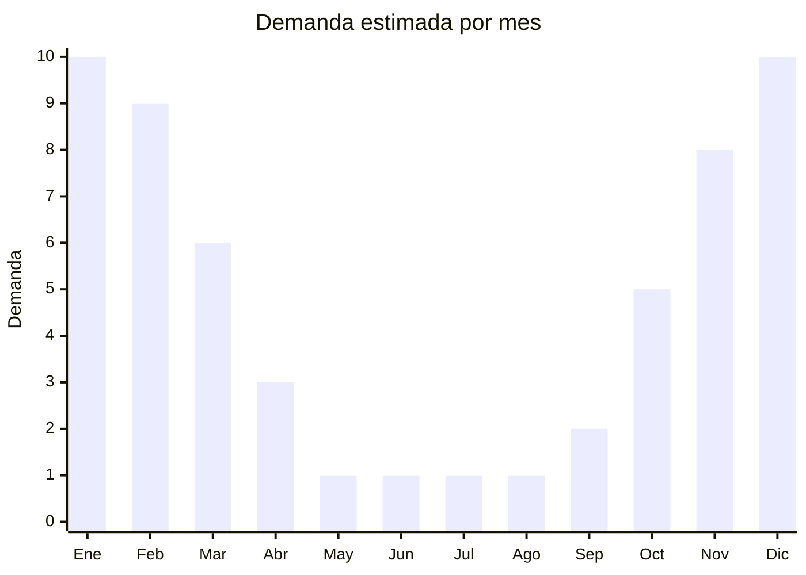

# Lamparas y trampas mata mosquitos UV

> **Capitulo NCM 85** — Maquinas, aparatos y material electrico | **Temporada:** Verano (Dic-Feb)

## Que es y por que importarlo

Las lamparas y trampas mata mosquitos UV son dispositivos electricos que atraen insectos voladores mediante luz ultravioleta y los eliminan por medio de una grilla electrificada o un ventilador de succion. Son la solucion mas demandada en Argentina durante los meses de calor, cuando los mosquitos (incluyendo el Aedes aegypti, transmisor del dengue) proliferan en hogares, comercios y espacios al aire libre. La demanda se vuelve EXPLOSIVA entre noviembre y marzo, impulsada no solo por la molestia de los mosquitos sino por las campanas de prevencion del dengue que generan conciencia y urgencia de compra.

China es el principal fabricante mundial de estos dispositivos, con clusters productivos en Guangdong y Zhejiang que ofrecen una variedad enorme de modelos: desde lamparas de mesa compactas hasta trampas de exterior de gran cobertura. Los precios FOB son muy accesibles (desde USD 3) y los margenes en Argentina son excelentes, especialmente durante los picos de alerta sanitaria por dengue.

La ventaja clave de este producto es que NO requiere homologacion ENACOM cuando no incluye conectividad Bluetooth o WiFi (la gran mayoria de los modelos son puramente electricos con enchufe o recarga USB). Esto simplifica enormemente la importacion. Ademas, es un producto liviano, compacto y resistente al transporte, con un CBM muy favorable.

## Datos clave

| Dato | Valor |
|------|-------|
| **Posiciones NCM tipicas** | 8543.70.99 (maquinas y aparatos electricos con funcion propia), 8513.10.00 (lamparas electricas portatiles) |
| **Derecho de importacion** | 20% (DIE) + 3% tasa estadistica |
| **Rango FOB tipico** | USD 3.00 — USD 21.00 por unidad (segun tipo y cobertura) |
| **Precio de venta en Argentina** | ARS 8.000 — ARS 100.000+ |
| **Margen bruto estimado** | 200% — 400% |
| **MOQ tipico** | 100 — 1.000 unidades |
| **Demanda en MercadoLibre** | Muy Alta (estacional, picos por alertas dengue) |
| **Competencia en MercadoLibre** | Alta (2.745+ resultados) |
| **Dificultad para importar** | Facil (sin ENACOM si no tiene BT/WiFi) |
| **Certificaciones necesarias** | No requiere ENACOM si no tiene BT/WiFi |
| **Antidumping** | No |

## Variantes y subtipos mas comunes

| Subtipo / Variante | FOB aprox. | Venta AR aprox. | Nota |
|--------------------|-----------|-----------------|------|
| Lampara UV con grilla electrica de mesa | USD 3.00 — 7.00 | ARS 8.000 — 25.000 | **Mas vendida**, enchufe o USB |
| Lampara UV con ventilador de succion | USD 5.00 — 12.00 | ARS 15.000 — 45.000 | Mas silenciosa, atrapa sin ruido |
| Trampa UV combo (grilla + succion) | USD 8.00 — 15.00 | ARS 25.000 — 60.000 | Doble metodo, mayor efectividad |
| Trampa UV exterior gran cobertura | USD 12.00 — 21.00 | ARS 45.000 — 100.000+ | Para jardines, patios, comercios |
| Raqueta electrica mata mosquitos | USD 1.50 — 4.00 | ARS 5.000 — 15.000 | Complemento, venta cruzada |

## Regulaciones y requisitos

<Tabs>
  <Tab title="Certificaciones">
    | Organismo | Requiere | Detalle |
    |-----------|----------|---------|
    | ARCA (Aduana) | Si siempre | Despacho estandar |
    | ENACOM | **NO** (sin BT/WiFi) | Solo si el modelo incluye Bluetooth o WiFi (~USD 200-500 homologacion) |
    | ANMAT | No | No es producto de uso medico |
    | SENASA | No | No aplica |

    **Recomendacion:** Verificar SIEMPRE que el modelo elegido NO incluya conectividad inalambrica (Bluetooth/WiFi). Los modelos con control por app requieren homologacion ENACOM que cuesta USD 200-500 y demora semanas. Los modelos puramente electricos (enchufe, USB o bateria) no requieren ENACOM y son la mejor opcion para importar.
  </Tab>

  <Tab title="Etiquetado">
    | Requisito | Aplica |
    |-----------|--------|
    | Idioma espanol | Si |
    | Datos del importador | Si |
    | Voltaje y frecuencia | Si (220V/50Hz Argentina) |
    | Potencia en watts | Si |
    | Pais de origen | Si |
    | Garantia legal 6 meses | Si |
    | Instrucciones de uso y seguridad | Si (riesgo electrico) |
  </Tab>

  <Tab title="Restricciones">
    Sin restricciones especiales de importacion para modelos sin conectividad inalambrica. No hay antidumping ni licencias previas.

    **Atencion:** Si el modelo incluye bateria de litio recargable, verificar que cumpla con regulaciones de transporte aereo (si se envia por avion). Por maritimo no hay restriccion. Los modelos con grilla electrica deben incluir proteccion para evitar contacto accidental con dedos (rejilla de seguridad).
  </Tab>
</Tabs>

## Logistica

| Dato | Valor |
|------|-------|
| **Peso tipico por unidad** | 0.3 — 2.0 kg (segun modelo) |
| **Volumen tipico** | Bajo-Medio (producto compacto) |
| **Fragilidad** | Media (grilla UV requiere cuidado) |
| **Envio recomendado** | Maritimo LCL o aereo para urgencias de temporada |
| **Tiempo total estimado** | 50 — 80 dias (maritimo), 15 — 25 dias (aereo) |
| **Baterias de litio** | Algunos modelos (verificar regulacion transporte) |
| **Requiere empaque especial** | Si (proteccion para tubos UV y grilla) |

<Tip>
Este producto tiene un ratio peso/volumen muy favorable: se pueden enviar grandes cantidades en poco espacio. Negociar con el proveedor empaque individual en caja color (retail-ready) para vender directamente sin re-empaquetar. Pedir que incluyan el **adaptador de enchufe** para Argentina (tipo I) o al menos el cable con enchufe universal.
</Tip>

## Estacionalidad



| Aspecto | Detalle |
|---------|---------|
| **Meses pico** | Noviembre-Marzo (verano + temporada de dengue) |
| **Meses valle** | Mayo-Agosto (invierno, sin mosquitos) |
| **Cuando pedir** | Julio-Agosto para tener stock en octubre-noviembre |

## Ventajas y riesgos

<CardGroup cols={2}>
  <Card title="Ventajas" icon="circle-check">
    - Demanda EXPLOSIVA en verano, potenciada por alertas de dengue
    - Sin ENACOM para modelos sin BT/WiFi (importacion simple)
    - FOB muy bajo con margenes superiores al 200%
    - Producto liviano y compacto (flete economico)
    - Venta cruzada con repelentes, mosquiteros, raquetas
    - Recompra frecuente (se regalan, se rompen, se compran para cada ambiente)
  </Card>
  <Card title="Riesgos" icon="triangle-exclamation">
    - Altamente estacional: stock no vendido queda hasta el proximo verano
    - Competencia intensa en MercadoLibre (2.745+ publicaciones)
    - Calidad de tubo UV variable (verificar vida util con proveedor)
    - Modelos con BT/WiFi requieren ENACOM costoso
    - Grilla electrica defectuosa puede generar reclamos de seguridad
    - Dependencia de temporada de mosquitos (inviernos suaves = menos demanda)
  </Card>
</CardGroup>

## Palabras clave para buscar en Alibaba

```
mosquito killer lamp UV wholesale, electric mosquito trap UV light,
insect killer lamp UV LED, mosquito zapper electric wholesale,
fly killer lamp commercial, UV mosquito killer suction fan,
rechargeable mosquito killer lamp USB, outdoor mosquito trap UV
```

## Fuentes

- [MercadoLibre Argentina — Lamparas mata mosquitos](https://listado.mercadolibre.com.ar/lampara-mata-mosquitos)
- [Alibaba — Mosquito killer lamp wholesale](https://www.alibaba.com/showroom/mosquito-killer-lamp.html)
