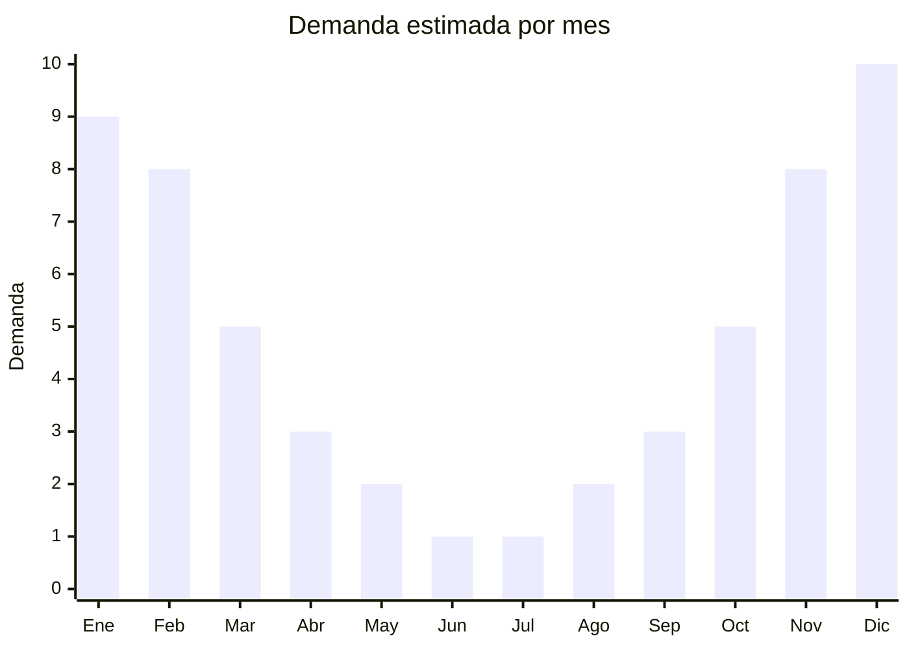

# Luces solares de exterior

> **Capitulo NCM 85** — Maquinas, aparatos y material electrico | **Temporada:** Verano (Dic-Feb)

## Que es y por que importarlo

Las luces solares de exterior son luminarias autonomas que se cargan con energia solar durante el dia y se encienden automaticamente al anochecer, iluminando jardines, senderos, patios, terrazas y balcones sin consumir electricidad. Incluyen un panel solar integrado, bateria recargable y LEDs de bajo consumo. Los formatos mas populares son: estacas para jardin (se clavan en la tierra), guirnaldas solares decorativas, reflectores solares con sensor de movimiento y balizas para senderos.

El verano argentino potencia la demanda de luces solares por una combinacion de factores: mas horas de sol para cargar los paneles, mas uso nocturno de jardines y terrazas, y la temporada de reuniones al aire libre (fiestas, cenas, asados). Marcas como Etheos, Candela y Macroled dominan el mercado formal, pero hay amplio espacio para importadores con modelos genericos de calidad que compiten en precio.

La gran ventaja de las luces solares es que NO requieren homologacion ENACOM (no tienen WiFi, Bluetooth ni conexion a red electrica). La regulacion es minima, el producto es liviano, compacto y resistente al transporte. Los margenes son altos porque el consumidor percibe valor en la tecnologia solar y la instalacion sin cables. China concentra mas del 90% de la produccion mundial de luces solares, con precios FOB desde USD 1 por unidad.

## Datos clave

| Dato | Valor |
|------|-------|
| **Posiciones NCM tipicas** | 8513.10.00 (lamparas electricas portatiles), 9405.40.90 (aparatos de alumbrado no electricos / solares) |
| **Derecho de importacion** | 18-20% (DIE) + 3% tasa estadistica |
| **Rango FOB tipico** | USD 1.00 — USD 15.00 por unidad (segun tipo y potencia) |
| **Precio de venta en Argentina** | ARS 5.000 — ARS 50.000 |
| **Margen bruto estimado** | 200% — 400% |
| **MOQ tipico** | 100 — 1.000 unidades |
| **Demanda en MercadoLibre** | Alta (estacional con pico en verano) |
| **Competencia en MercadoLibre** | Media |
| **Dificultad para importar** | Facil (sin ENACOM, sin certificaciones especiales) |
| **Certificaciones necesarias** | No requiere ENACOM ni certificaciones especiales |
| **Antidumping** | No |

## Variantes y subtipos mas comunes

| Subtipo / Variante | FOB aprox. | Venta AR aprox. | Nota |
|--------------------|-----------|-----------------|------|
| Estacas solares jardin (pack x4-6) | USD 1.00 — 3.00 /u | ARS 5.000 — 15.000 /pack | **Mas vendidas**, facil instalacion |
| Guirnaldas solares LED (5-10m) | USD 2.00 — 6.00 | ARS 8.000 — 25.000 | Decorativas, terrazas y patios |
| Reflector solar con sensor movimiento | USD 5.00 — 12.00 | ARS 15.000 — 40.000 | Seguridad + iluminacion |
| Balizas solares sendero (pack x4-8) | USD 2.00 — 5.00 /u | ARS 10.000 — 30.000 /pack | Senderos, entradas de casa |
| Farol solar colgante decorativo | USD 3.00 — 8.00 | ARS 10.000 — 30.000 | Estilo vintage, terrazas |
| Aplique solar pared exterior | USD 3.00 — 10.00 | ARS 8.000 — 35.000 | Fachadas, muros perimetrales |

## Regulaciones y requisitos

<Tabs>
  <Tab title="Certificaciones">
    | Organismo | Requiere | Detalle |
    |-----------|----------|---------|
    | ARCA (Aduana) | Si siempre | Despacho estandar |
    | ENACOM | **NO** | No tiene WiFi, Bluetooth ni conexion a red electrica |
    | ANMAT | No | No aplica |
    | SENASA | No | No aplica |

    **Recomendacion:** Aunque no se requieren certificaciones, solicitar al proveedor certificados CE y/o RoHS para los LEDs y la bateria. Verificar que la bateria incluida sea de calidad (preferir litio-fosfato de hierro LiFePO4 sobre NiMH para mayor durabilidad). Pedir ficha tecnica con lumenes reales, no solo watts.
  </Tab>

  <Tab title="Etiquetado">
    | Requisito | Aplica |
    |-----------|--------|
    | Idioma espanol | Si |
    | Datos del importador | Si |
    | Potencia LED en watts y lumenes | Recomendado |
    | Tipo de bateria incluida | Si |
    | Grado de proteccion IP (IP44/IP65) | Recomendado |
    | Pais de origen | Si |
    | Garantia legal 6 meses | Si |
    | Instrucciones de instalacion | Si |
  </Tab>

  <Tab title="Restricciones">
    Sin restricciones especiales de importacion. No hay antidumping, licencias previas ni intervenciones de organismos especiales para luces solares sin conectividad inalambrica.

    **Atencion:** Si el modelo incluye control remoto por radiofrecuencia (RF) o conectividad WiFi/Bluetooth para app, pasa a requerir ENACOM. Elegir modelos con control manual o boton fisico para evitar este tramite. Verificar grado de proteccion IP para exterior (minimo IP44, idealmente IP65).
  </Tab>
</Tabs>

## Logistica

| Dato | Valor |
|------|-------|
| **Peso tipico por unidad** | 0.1 — 1.5 kg (segun modelo) |
| **Volumen tipico** | Bajo (producto compacto, empaque eficiente) |
| **Fragilidad** | Baja-Media (paneles solares requieren proteccion) |
| **Envio recomendado** | Maritimo LCL (volumen bajo por unidad) |
| **Tiempo total estimado** | 50 — 80 dias (maritimo) |
| **Baterias de litio** | Si (pequenas, integradas — verificar MSDS) |
| **Requiere empaque especial** | No (empaque estandar con proteccion para panel solar) |

<Tip>
Armar **kits combinados** para aumentar el ticket promedio: pack de 6 estacas + guirnalda solar + reflector con sensor. Los kits se venden mejor que las unidades sueltas y permiten mejorar el margen. Pedir al proveedor empaque en caja retail con fotos del producto instalado en jardin (vende mucho mas que caja blanca).
</Tip>

## Estacionalidad



| Aspecto | Detalle |
|---------|---------|
| **Meses pico** | Noviembre-Febrero (mas horas de sol, uso de jardines, fiestas outdoor) |
| **Meses valle** | Mayo-Agosto (menos horas de sol, menos uso de exteriores) |
| **Cuando pedir** | Julio-Agosto para tener stock en octubre-noviembre |

## Ventajas y riesgos

<CardGroup cols={2}>
  <Card title="Ventajas" icon="circle-check">
    - Sin ENACOM ni certificaciones especiales (importacion simple)
    - FOB muy bajo con margenes superiores al 200%
    - Producto liviano y compacto (flete economico)
    - Alto valor percibido (tecnologia solar, ecologico)
    - No requiere instalacion electrica (plug & play)
    - Ideal para venta en kits y combos
  </Card>
  <Card title="Riesgos" icon="triangle-exclamation">
    - Estacionalidad marcada (verano = pico, invierno = valle)
    - Calidad de bateria variable (baterias baratas pierden capacidad rapido)
    - Lumenes reales vs publicados (diferencia frecuente)
    - Panel solar de baja calidad = poca autonomia nocturna
    - Grado IP insuficiente puede generar fallas con lluvia
    - Competencia con marcas posicionadas (Etheos, Candela, Macroled)
  </Card>
</CardGroup>

## Palabras clave para buscar en Alibaba

```
solar garden light wholesale, solar stake light outdoor,
solar string lights LED, solar flood light sensor motion,
solar pathway light wholesale, solar wall light outdoor,
solar lantern hanging garden, solar LED landscape light
```

## Fuentes

- [MercadoLibre Argentina — Luces solares exterior](https://listado.mercadolibre.com.ar/luces-solares-exterior)
- [Alibaba — Solar garden light wholesale](https://www.alibaba.com/showroom/solar-garden-light.html)
