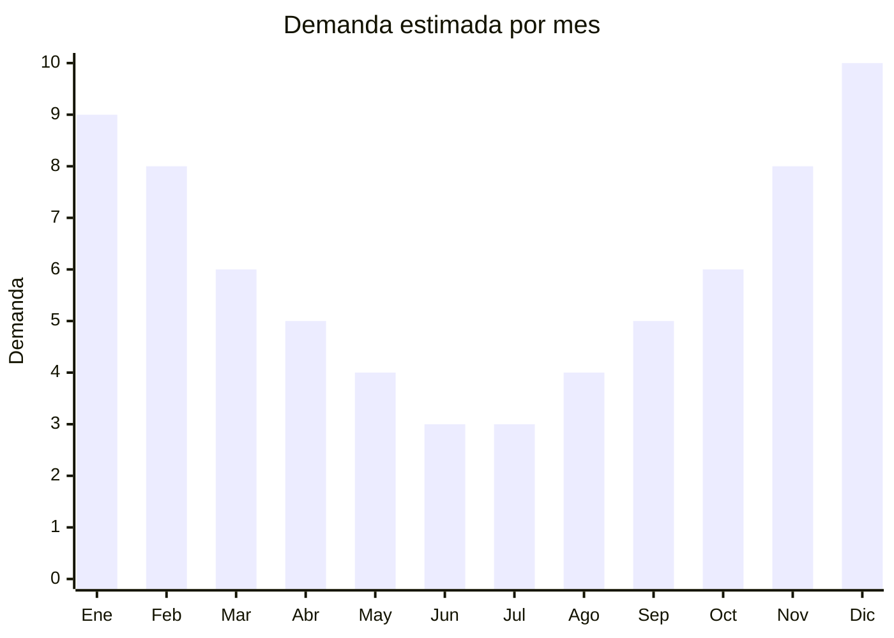

# Parlantes Bluetooth waterproof

> **Capitulo NCM 85** — Maquinas, aparatos y material electrico | **Temporada:** Verano (Dic-Feb)

## Que es y por que importarlo

Los parlantes Bluetooth waterproof son altavoces portatiles inalambricos con certificacion de resistencia al agua (IPX5 a IPX7) disenados para uso en ambientes humedos o al aire libre: piletas, playas, duchas, camping y actividades deportivas. Se conectan via Bluetooth al celular y reproducen musica sin cables, soportando salpicaduras, lluvia e incluso inmersion breve en agua (IPX7).

El mercado argentino tiene una demanda fuerte de parlantes portatiles durante todo el ano, pero el segmento waterproof se dispara en verano cuando la gente busca llevar musica a la pileta, la playa o el camping. La referencia premium es el JBL Flip 6, pero el grueso del mercado se mueve con marcas chinas que ofrecen prestaciones similares a precios mucho mas accesibles. Modelos genericos chinos con buena calidad de sonido, IPX5+ y diseno atractivo se venden muy bien en MercadoLibre.

China concentra la fabricacion mundial de parlantes Bluetooth, con hubs en Shenzhen (Guangdong) que producen desde modelos basicos hasta clones de alta fidelidad. El punto critico de este producto es que REQUIERE homologacion ENACOM por incluir tecnologia Bluetooth, lo que agrega un costo de USD 200-500 y varias semanas de tramite. Esto funciona como barrera de entrada que reduce la competencia para importadores que invierten en la homologacion.

## Datos clave

| Dato | Valor |
|------|-------|
| **Posiciones NCM tipicas** | 8518.22.00 (altavoces montados en caja), 8518.29.90 (otros altavoces) |
| **Derecho de importacion** | 20% (DIE) + 3% tasa estadistica |
| **Rango FOB tipico** | USD 5.00 — USD 25.00 por unidad (segun calidad y potencia) |
| **Precio de venta en Argentina** | ARS 9.400 — ARS 329.000 |
| **Margen bruto estimado** | 150% — 350% |
| **MOQ tipico** | 100 — 500 unidades |
| **Demanda en MercadoLibre** | Muy Alta (todo el ano, pico en verano) |
| **Competencia en MercadoLibre** | Alta |
| **Dificultad para importar** | Media (requiere ENACOM) |
| **Certificaciones necesarias** | ENACOM obligatorio (Bluetooth) |
| **Antidumping** | No |

## Variantes y subtipos mas comunes

| Subtipo / Variante | FOB aprox. | Venta AR aprox. | Nota |
|--------------------|-----------|-----------------|------|
| Mini parlante BT IPX5 (3-5W) | USD 5.00 — 8.00 | ARS 9.400 — 30.000 | Compacto, portatil, precio accesible |
| Parlante BT IPX6 (10W) | USD 8.00 — 14.00 | ARS 30.000 — 80.000 | **Segmento mas vendido** |
| Parlante BT IPX7 (20W+) | USD 14.00 — 20.00 | ARS 80.000 — 180.000 | Alta potencia, competidor JBL |
| Parlante BT con luces LED RGB | USD 10.00 — 18.00 | ARS 35.000 — 120.000 | Visual atractivo, fiestas en pileta |
| Parlante BT con mosqueton/ventosa | USD 6.00 — 12.00 | ARS 15.000 — 50.000 | Para ducha, bicicleta, mochila |

## Regulaciones y requisitos

<Tabs>
  <Tab title="Certificaciones">
    | Organismo | Requiere | Detalle |
    |-----------|----------|---------|
    | ARCA (Aduana) | Si siempre | Despacho estandar |
    | ENACOM | **SI obligatorio** | Homologacion por Bluetooth (~USD 200-500, 4-8 semanas) |
    | ANMAT | No | No aplica |
    | SENASA | No | No aplica |

    **Recomendacion:** Iniciar el tramite ENACOM ANTES de embarcar la mercaderia. La homologacion se tramita por modelo especifico, asi que elegir 2-3 modelos y homologarlos todos juntos para optimizar costos. Verificar que la marca china tenga documentacion tecnica (FCC/CE del modulo Bluetooth) que facilita el tramite ENACOM. Marcas chinas con nombre creible y documentacion ordenada agilizan la homologacion.
  </Tab>

  <Tab title="Etiquetado">
    | Requisito | Aplica |
    |-----------|--------|
    | Idioma espanol | Si |
    | Datos del importador | Si |
    | Numero de homologacion ENACOM | Si (obligatorio en empaque) |
    | Potencia en watts | Si |
    | Certificacion IPX (resistencia agua) | Recomendado |
    | Pais de origen | Si |
    | Garantia legal 6 meses | Si |
    | Instrucciones de uso | Si |
  </Tab>

  <Tab title="Restricciones">
    Requiere homologacion ENACOM obligatoria por contener modulo Bluetooth. No se puede comercializar legalmente sin el numero de homologacion.

    **Atencion:** La homologacion ENACOM es por modelo y marca. Si cambias de modelo o proveedor, necesitas una nueva homologacion. El costo aproximado es USD 200-500 dependiendo del laboratorio y la complejidad. Incluye bateria de litio, verificar cumplimiento de normas de transporte (UN3481 para baterias contenidas en equipo).
  </Tab>
</Tabs>

## Logistica

| Dato | Valor |
|------|-------|
| **Peso tipico por unidad** | 0.2 — 0.8 kg (segun modelo) |
| **Volumen tipico** | Bajo (producto compacto) |
| **Fragilidad** | Media (electronica interna) |
| **Envio recomendado** | Maritimo LCL o aereo para urgencias |
| **Tiempo total estimado** | 50 — 80 dias (maritimo), 15 — 25 dias (aereo) |
| **Baterias de litio** | Si (verificar regulacion UN3481) |
| **Requiere empaque especial** | Si (proteccion para electronica + caja retail) |

<Tip>
Pedir al proveedor que envie los parlantes con **caja retail full color** (retail-ready) con especificaciones en espanol. Incluir cable de carga USB-C en la caja. Solicitar certificados de bateria (MSDS) antes del embarque: sin estos documentos la naviera puede rechazar el envio. Negociar incluir un **mosqueton o ventosa** como accesorio diferenciador.
</Tip>

## Estacionalidad



| Aspecto | Detalle |
|---------|---------|
| **Meses pico** | Noviembre-Febrero (verano, pileta, playa, regalos navidad) |
| **Meses valle** | Junio-Agosto (menor uso outdoor) |
| **Cuando pedir** | Julio-Agosto para tener stock y ENACOM listo en noviembre |

## Ventajas y riesgos

<CardGroup cols={2}>
  <Card title="Ventajas" icon="circle-check">
    - Demanda alta todo el ano con pico fuerte en verano
    - ENACOM funciona como barrera de entrada (menos competencia informal)
    - Producto liviano y compacto (flete economico)
    - Alto valor percibido vs costo FOB (margenes atractivos)
    - Ideal para marca propia con diseno personalizado
    - Venta cruzada con accesorios (fundas, cables, soportes)
  </Card>
  <Card title="Riesgos" icon="triangle-exclamation">
    - ENACOM obligatorio: costo USD 200-500 y demora 4-8 semanas
    - Competencia con marcas posicionadas (JBL, Sony, Xiaomi)
    - Calidad de sonido variable en modelos genericos
    - Bateria de litio requiere documentacion MSDS para transporte
    - Marca china debe ser creible para el consumidor argentino
    - Garantia tecnica: reparaciones complejas en caso de fallas
  </Card>
</CardGroup>

## Palabras clave para buscar en Alibaba

```
waterproof bluetooth speaker wholesale, IPX7 portable speaker,
outdoor wireless speaker waterproof, pool bluetooth speaker,
shower speaker bluetooth IPX5, rugged bluetooth speaker wholesale,
portable speaker waterproof camping, bluetooth speaker LED RGB waterproof
```

## Fuentes

- [MercadoLibre Argentina — Parlantes Bluetooth waterproof](https://listado.mercadolibre.com.ar/parlante-bluetooth-waterproof)
- [Alibaba — Waterproof bluetooth speaker](https://www.alibaba.com/showroom/waterproof-bluetooth-speaker.html)
