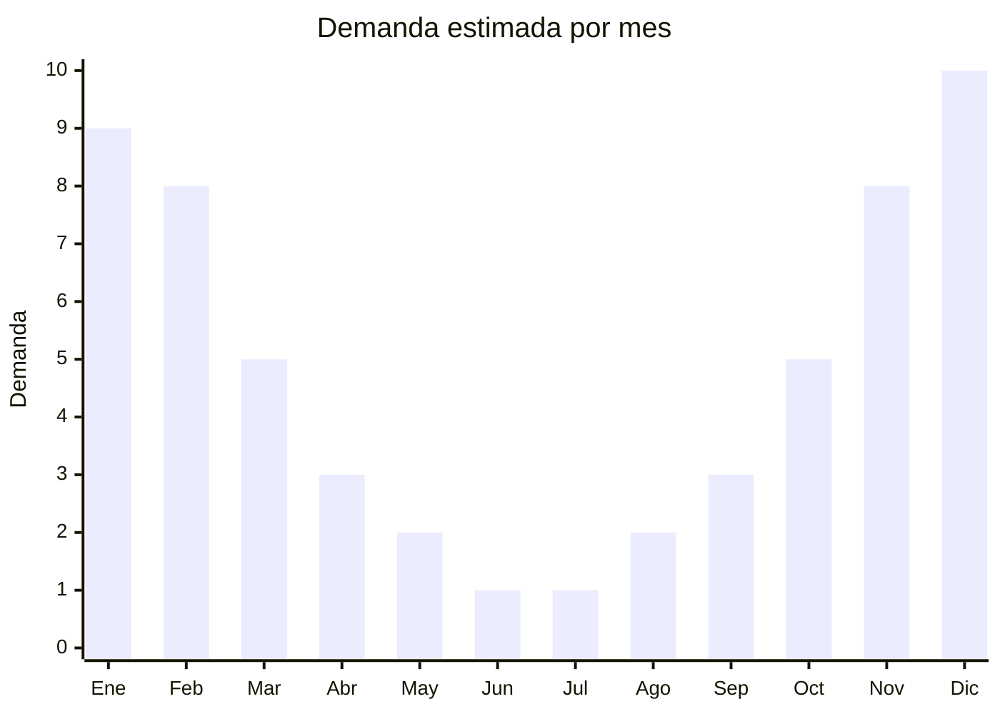

# Barras de techo universales y portabicicletas

> **Capítulo NCM 87** — Vehículos terrestres y sus partes | **Temporada:** Verano (Dic–Feb)

## Qué es y por qué importarlo

Las barras de techo (también llamadas barras portaequipaje o rack de techo) son estructuras transversales de aluminio o acero que se montan sobre el techo del vehículo para transportar carga adicional. Los portabicicletas son soportes específicos que se montan sobre las barras (o directamente en el portón trasero) para transportar bicicletas. En Argentina, el verano impulsa fuertemente la demanda de ambos productos: las familias viajan en auto a destinos turísticos y el cicloturismo vacacional crece cada temporada en destinos como la Patagonia, Córdoba y la costa atlántica.

Las barras de aluminio universales son las más vendidas porque se adaptan a múltiples modelos de auto mediante kits de fijación ajustables. China domina la producción mundial de estos accesorios, con fábricas en Ningbo y Taizhou que fabrican para marcas como Yakima, Cruz y marcas blancas. Los portabicicletas de techo (fork mount o frame mount) y los portabicicletas traseros (tipo enganche o portón) son complementos naturales.

La oportunidad de negocio está en ofrecer kits completos (barras + portabicicletas) a precio competitivo contra las marcas posicionadas. El aluminio ofrece la mejor relación resistencia/peso y es el material preferido por el mercado argentino.

## Datos clave

| Dato | Valor |
|------|-------|
| **Posiciones NCM típicas** | 8708.29.99 (partes y accesorios de carrocería), 7616.99.00 (manufacturas de aluminio) |
| **Derecho de importación** | 18% (DIE) + 3% tasa estadística |
| **Rango FOB típico** | USD 10.00 — USD 40.00 por unidad (barras USD 10-30, portabicicletas USD 15-40) |
| **Precio de venta en Argentina** | ARS 35.000 — ARS 150.000 |
| **Margen bruto estimado** | 150% — 280% |
| **MOQ típico** | 100 — 500 unidades |
| **Demanda en MercadoLibre** | Alta (estacional) |
| **Competencia en MercadoLibre** | Media-Alta |
| **Dificultad para importar** | Media (peso moderado, volumen manejable) |
| **Certificaciones necesarias** | No requiere certificaciones especiales |
| **Antidumping** | No |

## Variantes y subtipos más comunes

| Subtipo / Variante | FOB aprox. | Venta AR aprox. | Nota |
|--------------------|-----------|-----------------|------|
| Barras aluminio universales (par) | USD 10.00 — 18.00 | ARS 35.000 — 65.000 | **Más vendido**, ajustables |
| Barras aluminio con llave (par) | USD 15.00 — 25.00 | ARS 50.000 — 85.000 | Antirrobo integrado |
| Barras aerodinámicas (par) | USD 20.00 — 30.00 | ARS 70.000 — 110.000 | Silenciosas, menos resistencia al viento |
| Portabicicletas techo (1 bici) | USD 15.00 — 25.00 | ARS 45.000 — 80.000 | Fork mount o frame mount |
| Portabicicletas trasero (2-3 bicis) | USD 20.00 — 40.00 | ARS 60.000 — 150.000 | Enganche o portón |

## Regulaciones y requisitos

<Tabs>
  <Tab title="Certificaciones">
    | Organismo | Requiere | Detalle |
    |-----------|----------|---------|
    | ARCA (Aduana) | Sí siempre | Despacho estándar |
    | ANMAT | No | No aplica |
    | ENACOM | No | No es electrónico |
    | SENASA | No | No aplica |
    | INTI | No obligatorio | Recomendado para testear capacidad de carga |

    **Recomendación:** Solicitar al proveedor certificado de capacidad de carga máxima (en kg) y test de resistencia al viento. Las barras deben soportar como mínimo 75 kg de carga dinámica (en movimiento). Incluir en el packaging la tabla de compatibilidad con modelos de autos argentinos más comunes.
  </Tab>

  <Tab title="Etiquetado">
    | Requisito | Aplica |
    |-----------|--------|
    | Idioma español | Sí |
    | Datos del importador | Sí |
    | Composición / materiales | Sí (aluminio, acero, plástico ABS) |
    | Capacidad de carga máxima | Sí (en kg) |
    | País de origen | Sí |
    | Garantía legal 6 meses | Sí |
    | Instrucciones de instalación | Sí (con diagramas) |
  </Tab>

  <Tab title="Restricciones">
    Sin restricciones especiales de importación. No hay antidumping ni licencias previas para barras de techo o portabicicletas.

    **Atención:** La clasificación NCM puede variar entre Cap. 87 (accesorios de vehículos) y Cap. 76 (manufacturas de aluminio) según la composición. Consultar con despachante para determinar la posición más favorable.
  </Tab>
</Tabs>

## Logística

| Dato | Valor |
|------|-------|
| **Peso típico por unidad** | 2.5 — 6.0 kg (barras), 3.0 — 8.0 kg (portabicicletas) |
| **Volumen típico** | Medio (barras largas, hasta 130 cm) |
| **Fragilidad** | Baja (aluminio/acero, resistentes) |
| **Envío recomendado** | Marítimo LCL o FCL según volumen |
| **Tiempo total estimado** | 50 — 80 días (marítimo) |
| **Baterías de litio** | No |
| **Requiere empaque especial** | Sí (proteger extremos para evitar rayaduras) |

<Tip>
Las barras de aluminio son largas pero apilables. Solicitar al proveedor que embale en **cajas rectangulares compactas** con las piezas desmontadas y los kits de fijación en bolsas separadas. Esto reduce el CBM hasta un 30% y facilita el control de calidad al recibir. Verificar que cada caja incluya el kit de herrajes completo.
</Tip>

## Estacionalidad



| Aspecto | Detalle |
|---------|---------|
| **Meses pico** | Noviembre-Febrero (vacaciones en auto, cicloturismo) |
| **Meses valle** | Mayo-Agosto (sin viajes largos, bicicleta de interior) |
| **Cuándo pedir** | Julio-Agosto para tener stock en noviembre (inicio temporada) |

## Ventajas y riesgos

<CardGroup cols={2}>
  <Card title="Ventajas" icon="circle-check">
    - Demanda creciente con auge del cicloturismo
    - Producto duradero, baja tasa de devolución
    - Aluminio: liviano, resistente a corrosión
    - Ideal para kits combo (barras + portabicicletas)
    - Ticket medio-alto con buenos márgenes
  </Card>
  <Card title="Riesgos" icon="triangle-exclamation">
    - Estacional: demanda cae significativamente en invierno
    - Compatibilidad de vehículos (no todas las barras son universales)
    - Competencia con marcas establecidas (Thule, Yakima)
    - Reclamos si no incluye kit de fijación completo
    - Barras largas pueden complicar logística interna
  </Card>
</CardGroup>

## Palabras clave para buscar en Alibaba

```
universal roof rack crossbar aluminum, car roof bar wholesale,
roof rack cross bar adjustable, bike carrier roof mount,
bicycle rack car roof, rear bike carrier 3 bikes,
aluminum roof rail car wholesale, cross bar roof rack universal
```

## Fuentes

- [MercadoLibre Argentina — Barras de techo](https://listado.mercadolibre.com.ar/barras-techo-auto)
- [Alibaba — Car roof rack crossbar wholesale](https://www.alibaba.com/showroom/car-roof-rack-crossbar.html)
