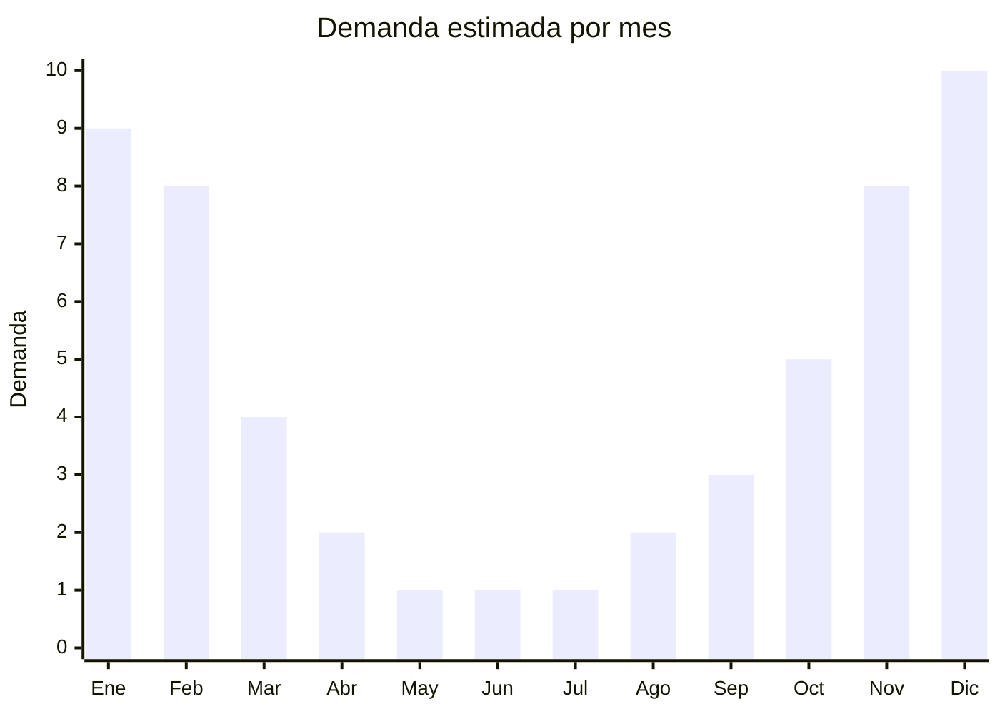

# Heladeras portátiles y conservadoras para auto 12V

> **Capítulo NCM 87** — Vehículos terrestres y sus partes | **Temporada:** Verano (Dic–Feb)

## Qué es y por qué importarlo

Las heladeras portátiles para auto son dispositivos de refrigeración compactos que funcionan con corriente de 12V (encendedor del vehículo) y mantienen bebidas y alimentos fríos durante viajes largos. El mecanismo más común es el termoeléctrico (efecto Peltier), que permite enfriar entre 15 y 25 grados por debajo de la temperatura ambiente. También existen modelos con compresor (tipo minibar) que alcanzan temperaturas bajo cero, pero son significativamente más caros.

En Argentina, donde los viajes en ruta hacia la costa atlántica, Córdoba, Mendoza o la Patagonia implican trayectos de 5 a 15 horas en auto bajo temperaturas de 30-40 grados, la heladera portátil 12V se convierte en un accesorio esencial. La demanda se dispara entre noviembre y febrero, coincidiendo con las vacaciones de verano y el calor intenso. Las marcas de referencia en el mercado local son Gadnic, Midea y Coolbox, pero el grueso del mercado lo cubren productos genéricos importados de China.

El negocio es atractivo porque combina un FOB accesible (USD 15-50 para termoeléctricas), márgenes amplios y una necesidad real del consumidor. El principal desafío es que los modelos con compresor clasifican diferente y pueden requerir intervención de ENACOM por componentes electrónicos.

## Datos clave

| Dato | Valor |
|------|-------|
| **Posiciones NCM típicas** | 8708.99.90 (accesorios de vehículos), 8418.69.99 (material y equipos para producción de frío) |
| **Derecho de importación** | 18-20% (DIE) + 3% tasa estadística |
| **Rango FOB típico** | USD 15.00 — USD 50.00 por unidad (termoeléctricas) |
| **Precio de venta en Argentina** | ARS 50.000 — ARS 180.000 |
| **Margen bruto estimado** | 130% — 250% |
| **MOQ típico** | 50 — 300 unidades |
| **Demanda en MercadoLibre** | Alta (estacional) |
| **Competencia en MercadoLibre** | Media |
| **Dificultad para importar** | Media (electrónico, clasificación NCM) |
| **Certificaciones necesarias** | ENACOM posible según modelo |
| **Antidumping** | No |

## Variantes y subtipos más comunes

| Subtipo / Variante | FOB aprox. | Venta AR aprox. | Nota |
|--------------------|-----------|-----------------|------|
| Termoeléctrica 6L (12V) | USD 15.00 — 22.00 | ARS 50.000 — 80.000 | Compacta, bebidas |
| Termoeléctrica 12L (12V) | USD 20.00 — 30.00 | ARS 70.000 — 110.000 | **Más vendida**, familiar |
| Termoeléctrica 20L (12V/220V) | USD 30.00 — 40.00 | ARS 100.000 — 140.000 | Dual: auto + hogar |
| Termoeléctrica 28L (12V/220V) | USD 35.00 — 50.00 | ARS 120.000 — 180.000 | Gran capacidad |
| Con compresor 15L (12V/24V) | USD 80.00 — 150.00 | ARS 250.000 — 500.000 | Premium, congela |

## Regulaciones y requisitos

<Tabs>
  <Tab title="Certificaciones">
    | Organismo | Requiere | Detalle |
    |-----------|----------|---------|
    | ARCA (Aduana) | Sí siempre | Despacho estándar |
    | ANMAT | No | No hay contacto directo con alimentos |
    | ENACOM | Posible | Si incluye adaptador 220V o bluetooth, puede requerir habilitación |
    | SENASA | No | No aplica |
    | IRAM | No obligatorio | Recomendado para seguridad eléctrica |

    **Recomendación:** Las heladeras termoeléctricas simples (solo 12V con ficha encendedor) generalmente no requieren ENACOM. Si el modelo incluye adaptador 220V o conectividad bluetooth/wifi, consultar con el despachante. Solicitar al proveedor certificados CE y FCC del componente electrónico.
  </Tab>

  <Tab title="Etiquetado">
    | Requisito | Aplica |
    |-----------|--------|
    | Idioma español | Sí |
    | Datos del importador | Sí |
    | Voltaje y consumo | Sí (12V DC, watts) |
    | Capacidad en litros | Sí |
    | Rango de temperatura | Sí (capacidad de enfriamiento) |
    | País de origen | Sí |
    | Garantía legal 6 meses | Sí |
    | Instrucciones de uso | Sí |
  </Tab>

  <Tab title="Restricciones">
    Sin antidumping ni licencias previas para heladeras portátiles termoeléctricas 12V.

    **Atención:** La clasificación NCM varía según el tipo de refrigeración. Los modelos termoeléctricos (Peltier) clasifican diferente de los modelos con compresor. Los modelos con compresor usan gas refrigerante y pueden tener requisitos adicionales relacionados con sustancias controladas (Protocolo de Montreal). Consultar con despachante antes de importar modelos con compresor.
  </Tab>
</Tabs>

## Logística

| Dato | Valor |
|------|-------|
| **Peso típico por unidad** | 2.5 — 8.0 kg (según capacidad) |
| **Volumen típico** | Medio (cajas rectangulares compactas) |
| **Fragilidad** | Media (componente electrónico, aislamiento) |
| **Envío recomendado** | Marítimo LCL o FCL según volumen |
| **Tiempo total estimado** | 50 — 80 días (marítimo) |
| **Baterías de litio** | No (funciona con 12V vehicular) |
| **Requiere empaque especial** | Sí (protección del componente Peltier y cable) |

<Tip>
Solicitar al proveedor que incluya **cable 12V de mínimo 1.8 metros** de largo. Muchos proveedores incluyen cables de 1 metro que no alcanzan desde el encendedor hasta el asiento trasero. Este detalle genera muchas devoluciones y reseñas negativas. También verificar que la ficha 12V tenga fusible incorporado.
</Tip>

## Estacionalidad



| Aspecto | Detalle |
|---------|---------|
| **Meses pico** | Noviembre-Febrero (viajes largos en ruta, calor intenso) |
| **Meses valle** | Mayo-Agosto (sin viajes largos, sin calor) |
| **Cuándo pedir** | Julio-Agosto para tener stock en noviembre (inicio temporada) |

## Ventajas y riesgos

<CardGroup cols={2}>
  <Card title="Ventajas" icon="circle-check">
    - Necesidad real del consumidor en viajes largos
    - Producto compacto, buen ratio peso/volumen
    - Márgenes amplios en modelos termoeléctricos
    - Versatilidad: auto, camping, pesca, playa
    - Modelos dual 12V/220V amplían uso a hogar
  </Card>
  <Card title="Riesgos" icon="triangle-exclamation">
    - Estacional: demanda cae drásticamente en invierno
    - Componente electrónico puede fallar (garantía)
    - Clasificación NCM ambigua (Cap. 84 vs Cap. 87)
    - Modelos termoeléctricos enfrían poco en calor extremo
    - Consumo eléctrico puede agotar batería del auto si el motor está apagado
  </Card>
</CardGroup>

## Palabras clave para buscar en Alibaba

```
car cooler 12V thermoelectric, portable car fridge 12V,
mini fridge car cooler warmer, car refrigerator 12V camping,
cooler box 12V electric, thermoelectric cooler car portable,
car fridge 12L 12V wholesale, dual 12V 220V cooler box
```

## Fuentes

- [MercadoLibre Argentina — Heladera portátil auto 12V](https://listado.mercadolibre.com.ar/heladera-portatil-auto-12v)
- [Alibaba — Car cooler 12V wholesale](https://www.alibaba.com/showroom/car-cooler-12v.html)
