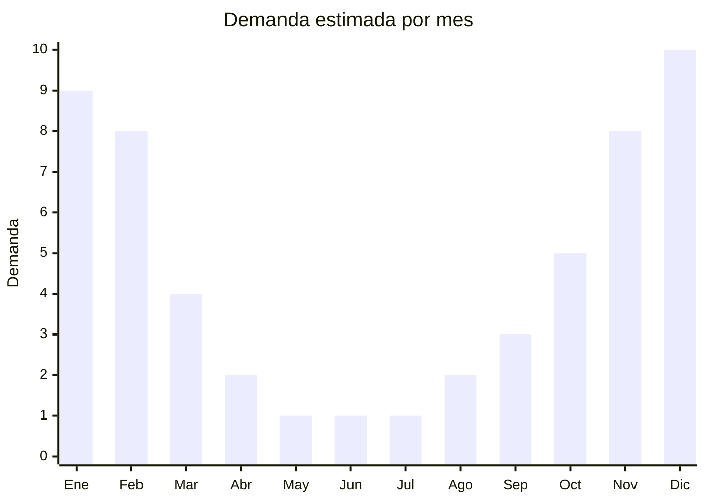

# Portaequipajes de techo

> **Capítulo NCM 87** — Vehículos terrestres y sus partes | **Temporada:** Verano (Dic–Feb)

## Qué es y por qué importarlo

Los portaequipajes de techo son accesorios vehiculares diseñados para ampliar la capacidad de carga del auto, montándose sobre las barras del techo. Existen tres formatos principales: bolsos blandos impermeables, cofres rígidos (tipo Thule) y canastos abiertos. En Argentina, donde el verano significa éxodo masivo en auto hacia la costa atlántica, Córdoba, Mendoza y la Patagonia, la demanda de portaequipajes se multiplica 3 a 4 veces entre noviembre y febrero.

El mercado argentino muestra una preferencia marcada por los bolsos impermeables tipo rooftop bag, que son más económicos, no requieren barras específicas y se pliegan cuando no se usan. Los cofres rígidos apuntan al segmento premium y tienen tickets más altos pero menor rotación. China produce ambos formatos a escala, con fábricas concentradas en Zhejiang y Guangdong que fabrican para marcas globales y marcas blancas. Las marcas de referencia en Argentina son Thule (premium importado) y Doble Tracción (nacional), pero el grueso del mercado consume productos genéricos importados.

La ventaja de importar portaequipajes es la estacionalidad predecible: se sabe exactamente cuándo pedir y cuándo vender. Los bolsos blandos tienen excelente relación peso/volumen para el envío y márgenes atractivos. El principal desafío es la competencia creciente y la necesidad de garantizar impermeabilidad real (el reclamo más frecuente en devoluciones).

## Datos clave

| Dato | Valor |
|------|-------|
| **Posiciones NCM típicas** | 8708.29.99 (partes y accesorios de carrocería), 4202.92.00 (bolsos con superficie exterior de materia textil) |
| **Derecho de importación** | 18% (DIE) + 3% tasa estadística |
| **Rango FOB típico** | USD 15.00 — USD 150.00 por unidad (bolsos blandos a cofres rígidos) |
| **Precio de venta en Argentina** | ARS 40.000 — ARS 350.000 |
| **Margen bruto estimado** | 120% — 250% |
| **MOQ típico** | 50 — 300 unidades |
| **Demanda en MercadoLibre** | Alta (estacional) |
| **Competencia en MercadoLibre** | Media |
| **Dificultad para importar** | Media (cofres rígidos volumétricos) |
| **Certificaciones necesarias** | No requiere certificaciones especiales |
| **Antidumping** | No |

## Variantes y subtipos más comunes

| Subtipo / Variante | FOB aprox. | Venta AR aprox. | Nota |
|--------------------|-----------|-----------------|------|
| Bolso blando impermeable 300L | USD 15.00 — 25.00 | ARS 40.000 — 70.000 | **Más vendido**, plegable |
| Bolso blando impermeable 450L | USD 25.00 — 40.00 | ARS 60.000 — 100.000 | Familias numerosas |
| Bolso blando premium 600L | USD 40.00 — 60.00 | ARS 90.000 — 150.000 | Doble cierre, correas reforzadas |
| Cofre rígido 350L | USD 40.00 — 80.00 | ARS 120.000 — 220.000 | Requiere barras, estético |
| Cofre rígido 450L | USD 80.00 — 150.00 | ARS 200.000 — 350.000 | Premium, aerodinámica |

## Regulaciones y requisitos

<Tabs>
  <Tab title="Certificaciones">
    | Organismo | Requiere | Detalle |
    |-----------|----------|---------|
    | ARCA (Aduana) | Sí siempre | Despacho estándar |
    | ANMAT | No | No aplica |
    | ENACOM | No | No es electrónico |
    | SENASA | No | No aplica |
    | INTI | No obligatorio | Recomendado para testear resistencia UV y carga máxima |

    **Recomendación:** Solicitar al proveedor certificado de resistencia al agua (waterproof rating IPX4 o superior) y test de carga máxima en kg. Estos certificados generan confianza en el comprador y reducen devoluciones. Los bolsos con costuras termoselladas (no cosidas) ofrecen mejor impermeabilidad.
  </Tab>

  <Tab title="Etiquetado">
    | Requisito | Aplica |
    |-----------|--------|
    | Idioma español | Sí |
    | Datos del importador | Sí |
    | Composición / materiales | Sí (indicar material exterior e interior) |
    | Capacidad en litros y kg máximo | Sí |
    | País de origen | Sí |
    | Garantía legal 6 meses | Sí |
    | Instrucciones de instalación | Sí (incluir diagrama) |
  </Tab>

  <Tab title="Restricciones">
    Sin restricciones especiales de importación. No hay antidumping ni licencias previas para portaequipajes.

    **Atención:** La clasificación arancelaria puede variar según material. Los bolsos textiles pueden clasificar en Cap. 42 (artículos de viaje) en vez de Cap. 87 (accesorios de vehículos). Consultar con despachante para optimizar la posición NCM y el derecho de importación aplicable.
  </Tab>
</Tabs>

## Logística

| Dato | Valor |
|------|-------|
| **Peso típico por unidad** | 2.0 — 12.0 kg (bolsos blandos a cofres rígidos) |
| **Volumen típico** | Bajo-medio (bolsos plegables), Alto (cofres rígidos) |
| **Fragilidad** | Baja (bolsos), Media (cofres rígidos) |
| **Envío recomendado** | Marítimo LCL (bolsos), FCL (cofres por volumen) |
| **Tiempo total estimado** | 50 — 80 días (marítimo) |
| **Baterías de litio** | No |
| **Requiere empaque especial** | Cofres rígidos: sí (protección esquinas) |

<Tip>
Los bolsos blandos se envían **plegados y comprimidos** al vacío, reduciendo el CBM drásticamente. Un contenedor 20' puede transportar 800-1200 bolsos plegados vs. solo 80-120 cofres rígidos. Si estás empezando, los bolsos blandos son la opción logísticamente más eficiente.
</Tip>

## Estacionalidad



| Aspecto | Detalle |
|---------|---------|
| **Meses pico** | Noviembre-Febrero (vacaciones en auto, éxodo turístico) |
| **Meses valle** | Mayo-Agosto (sin viajes largos en auto) |
| **Cuándo pedir** | Julio-Agosto para tener stock en noviembre (inicio temporada) |

## Ventajas y riesgos

<CardGroup cols={2}>
  <Card title="Ventajas" icon="circle-check">
    - Demanda predecible y concentrada en verano
    - Bolsos blandos: bajo costo FOB, alto margen
    - Producto liviano y compacto para envío (plegados)
    - Ideal para marca propia (logo impreso)
    - Recompra frecuente (se deterioran con UV/lluvia)
  </Card>
  <Card title="Riesgos" icon="triangle-exclamation">
    - 100% estacional: stock sobrante queda hasta siguiente verano
    - Reclamos por filtraciones si la impermeabilidad falla
    - Cofres rígidos ocupan mucho volumen (CBM alto)
    - Competencia con Thule/Doble Tracción en segmento premium
    - Requiere instrucciones claras de instalación
  </Card>
</CardGroup>

## Palabras clave para buscar en Alibaba

```
rooftop cargo bag waterproof, car roof bag 600D, roof cargo carrier bag,
car top carrier bag foldable, roof box cargo carrier, ABS roof box car,
waterproof rooftop bag universal, car luggage carrier roof wholesale
```

## Fuentes

- [MercadoLibre Argentina — Portaequipajes de techo](https://listado.mercadolibre.com.ar/portaequipaje-techo)
- [Alibaba — Rooftop cargo bag wholesale](https://www.alibaba.com/showroom/rooftop-cargo-bag.html)
