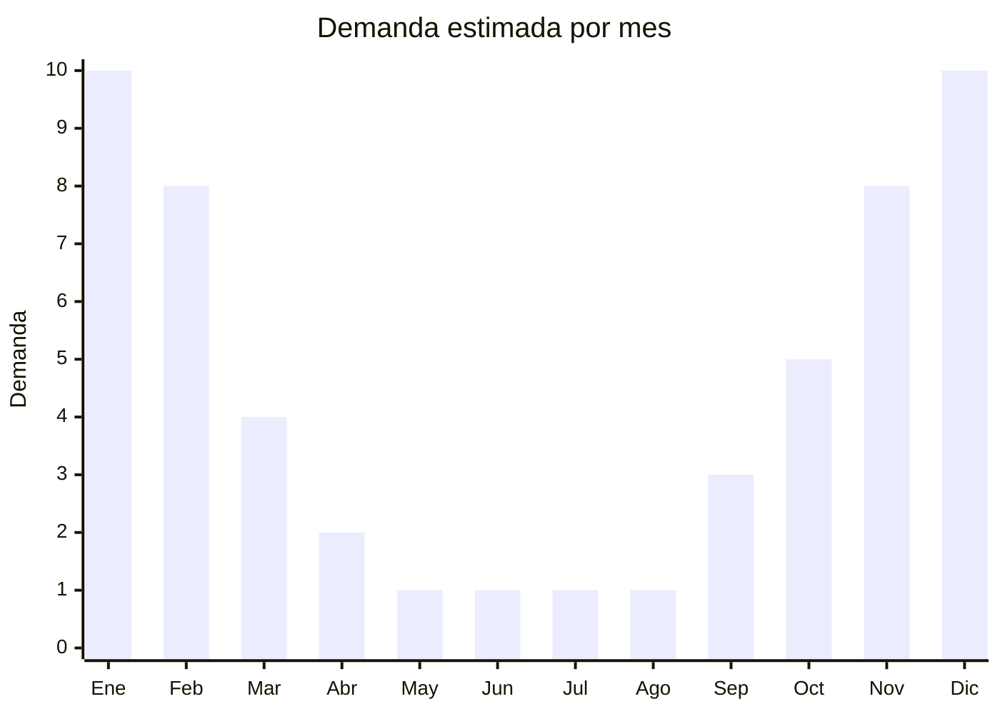

# Ventiladores portátiles 12V para auto

> **Capítulo NCM 87** — Vehículos terrestres y sus partes | **Temporada:** Verano (Dic–Feb)

## Qué es y por qué importarlo

Los ventiladores portátiles para auto son pequeños dispositivos de ventilación que funcionan con corriente de 12V (encendedor del vehículo) o USB, diseñados para generar circulación de aire dentro del habitáculo. Se montan con clip, ventosa o adhesivo en el tablero, parasol o reposacabezas. Son especialmente útiles en autos sin aire acondicionado, como complemento del aire acondicionado en asientos traseros, o para mantener ventilación con el auto estacionado.

En Argentina, donde el parque automotor incluye una gran proporción de vehículos sin aire acondicionado (especialmente autos de trabajo, utilitarios y modelos económicos), los ventiladores 12V tienen un mercado amplio y estable en verano. El producto destaca por su costo FOB extremadamente bajo (USD 3-10), lo que permite márgenes de hasta 400% en venta minorista. China concentra el 95% de la producción mundial con fábricas en Shenzhen y Dongguan.

La principal ventaja de negocio es el bajo riesgo: la inversión inicial es mínima, el producto pesa gramos, ocupa poco espacio y tiene rotación rápida en verano. Es un excelente producto complementario para vender junto con otros accesorios de auto.

## Datos clave

| Dato | Valor |
|------|-------|
| **Posiciones NCM típicas** | 8708.29.99 (accesorios de vehículos), 8414.51.90 (ventiladores de mesa con motor eléctrico) |
| **Derecho de importación** | 18% (DIE) + 3% tasa estadística |
| **Rango FOB típico** | USD 3.00 — USD 10.00 por unidad |
| **Precio de venta en Argentina** | ARS 8.000 — ARS 35.000 |
| **Margen bruto estimado** | 200% — 400% |
| **MOQ típico** | 200 — 1000 unidades |
| **Demanda en MercadoLibre** | Alta (estacional) |
| **Competencia en MercadoLibre** | Alta |
| **Dificultad para importar** | Fácil |
| **Certificaciones necesarias** | No requiere certificaciones especiales |
| **Antidumping** | No |

## Variantes y subtipos más comunes

| Subtipo / Variante | FOB aprox. | Venta AR aprox. | Nota |
|--------------------|-----------|-----------------|------|
| Ventilador simple 12V con clip | USD 3.00 — 4.00 | ARS 8.000 — 12.000 | Económico, básico |
| Ventilador doble cabezal 12V | USD 5.00 — 7.00 | ARS 15.000 — 22.000 | **Más vendido**, cubre más área |
| Ventilador con ventosa 12V | USD 3.50 — 5.00 | ARS 10.000 — 18.000 | Se fija al parabrisas |
| Ventilador reposacabezas USB | USD 4.00 — 6.00 | ARS 12.000 — 20.000 | Para asientos traseros |
| Ventilador oscilante 12V | USD 6.00 — 10.00 | ARS 20.000 — 35.000 | Premium, giro automático |

## Regulaciones y requisitos

<Tabs>
  <Tab title="Certificaciones">
    | Organismo | Requiere | Detalle |
    |-----------|----------|---------|
    | ARCA (Aduana) | Sí siempre | Despacho estándar |
    | ANMAT | No | No aplica |
    | ENACOM | No | Dispositivo 12V DC simple, sin emisión RF |
    | SENASA | No | No aplica |

    **Recomendación:** Aunque no requiere certificaciones, verificar que el ventilador tenga protección en las aspas (rejilla de seguridad) para evitar accidentes con niños en el asiento trasero. Solicitar al proveedor certificado CE del motor eléctrico.
  </Tab>

  <Tab title="Etiquetado">
    | Requisito | Aplica |
    |-----------|--------|
    | Idioma español | Sí |
    | Datos del importador | Sí |
    | Voltaje y consumo | Sí (12V DC, watts) |
    | País de origen | Sí |
    | Garantía legal 6 meses | Sí |
    | Instrucciones de uso | Recomendado |
  </Tab>

  <Tab title="Restricciones">
    Sin restricciones especiales de importación. No hay antidumping ni licencias previas para ventiladores portátiles 12V.

    **Atención:** La clasificación NCM puede variar entre Cap. 87 (accesorios de vehículos) y Cap. 84 (ventiladores eléctricos). La clasificación como accesorio de vehículo suele tener el mismo o menor derecho de importación. Consultar con despachante.
  </Tab>
</Tabs>

## Logística

| Dato | Valor |
|------|-------|
| **Peso típico por unidad** | 0.15 — 0.50 kg |
| **Volumen típico** | Muy bajo (cajas pequeñas) |
| **Fragilidad** | Baja (plástico resistente) |
| **Envío recomendado** | Marítimo LCL (consolida con otros productos) o aéreo si urgente |
| **Tiempo total estimado** | 45 — 75 días (marítimo), 15-25 días (aéreo) |
| **Baterías de litio** | No (12V vehicular o USB) |
| **Requiere empaque especial** | No |

<Tip>
Por su bajo peso y volumen, los ventiladores 12V son ideales para **consolidar con otros accesorios de auto** en el mismo envío (portaequipajes, organizadores, parasoles). Pueden rellenar espacios vacíos en cajas más grandes. También son candidatos a envío aéreo si se llega tarde a la temporada: el costo por unidad es tan bajo que el flete aéreo puede justificarse.
</Tip>

## Estacionalidad



| Aspecto | Detalle |
|---------|---------|
| **Meses pico** | Noviembre-Febrero (calor intenso, viajes en auto) |
| **Meses valle** | Mayo-Agosto (sin calor, sin necesidad de ventilación extra) |
| **Cuándo pedir** | Agosto-Septiembre para tener stock en noviembre (inicio temporada) |

## Ventajas y riesgos

<CardGroup cols={2}>
  <Card title="Ventajas" icon="circle-check">
    - FOB muy bajo, inversión mínima
    - Márgenes altísimos (200-400%)
    - Producto ultraliviano, flete casi insignificante
    - Sin barreras regulatorias
    - Excelente producto complementario para combo
  </Card>
  <Card title="Riesgos" icon="triangle-exclamation">
    - Alta competencia por precio bajo
    - Producto percibido como descartable
    - Ruido del motor puede generar reclamos
    - Clip/ventosa de baja calidad puede soltarse
    - Estacional: demanda cero en invierno
  </Card>
</CardGroup>

## Palabras clave para buscar en Alibaba

```
car fan 12V clip, car cooling fan 12V wholesale,
dual head car fan 12V, car fan suction cup 12V,
USB car fan headrest, oscillating car fan 12V,
mini car fan clip portable, 12V vehicle fan wholesale
```

## Fuentes

- [MercadoLibre Argentina — Ventilador auto 12V](https://listado.mercadolibre.com.ar/ventilador-auto-12v)
- [Alibaba — Car fan 12V wholesale](https://www.alibaba.com/showroom/car-fan-12v.html)
