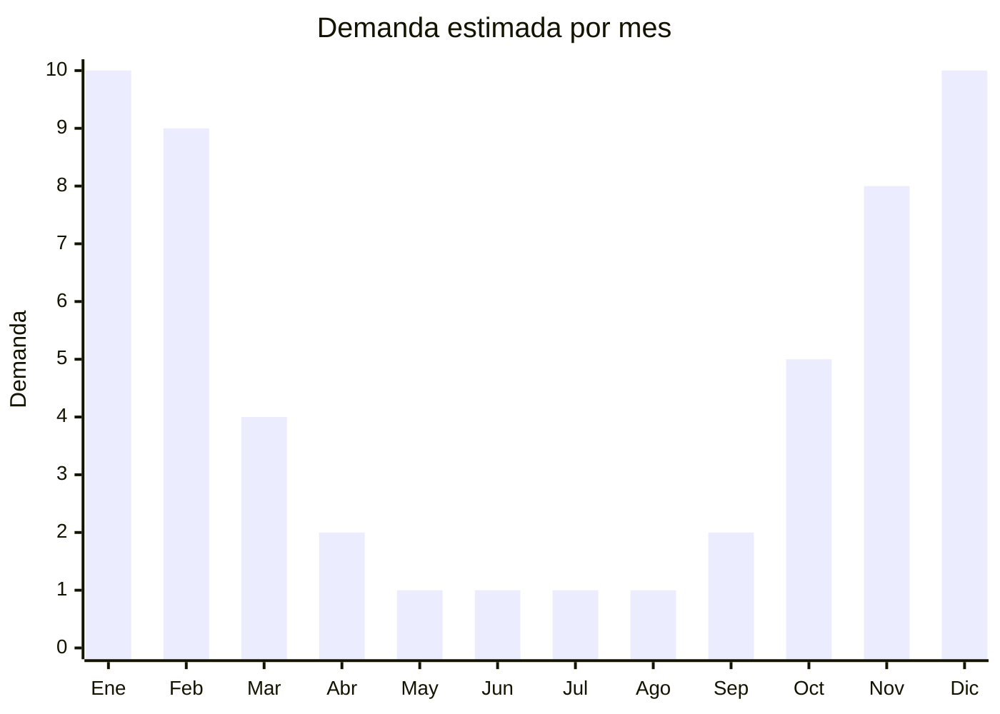

# Antiparras y gafas de natación

> **Capítulo NCM 90** — Instrumentos de óptica y aparatos médico-quirúrgicos | **Temporada:** Verano (Dic–Feb)

## Qué es y por qué importarlo

Las antiparras de natación (también llamadas gafas de natación, goggles o lentes de pileta) son elementos ópticos protectores diseñados para permitir la visión subacuática, proteger los ojos del cloro (piletas) y la sal (mar), y mejorar la experiencia en el agua. Existen modelos estándar, modelos con graduación óptica (miopía), modelos espejados para aguas abiertas y modelos junior para niños. Los materiales principales son policarbonato (lentes), silicona (junta) y caucho termoplástico (armazón).

En Argentina, la demanda de antiparras se concentra entre diciembre y febrero, cuando piletas públicas, clubes, balnearios y playas alcanzan su pico de uso. El mercado se divide en dos segmentos claros: el premium (Speedo, Arena, TYR) dirigido a nadadores frecuentes y competitivos, y el económico (genéricas chinas) que domina el consumo masivo de pileta familiar y playa. Las antiparras genéricas chinas representan más del 70% del volumen vendido en Argentina.

El negocio es atractivo por el FOB extremadamente bajo (USD 1-5), márgenes elevados y una demanda masiva y predecible. El producto pesa gramos, ocupa mínimo espacio y permite envíos eficientes. Es un excelente producto para venta en lotes o combos.

<Note>
**Clasificación arancelaria:** Las antiparras de natación pueden clasificar en Cap. 90 (instrumentos de óptica, posición 9004) si se consideran gafas protectoras, o en Cap. 95 (artículos deportivos, posición 9506.29) si se consideran equipamiento deportivo. La clasificación afecta el derecho de importación. Consultar con despachante para determinar la posición más favorable.
</Note>

## Datos clave

| Dato | Valor |
|------|-------|
| **Posiciones NCM típicas** | 9004.90.90 (gafas protectoras/ópticas), 9506.29.00 (artículos para deportes acuáticos) |
| **Derecho de importación** | 18-20% (DIE) + 3% tasa estadística |
| **Rango FOB típico** | USD 1.00 — USD 5.00 por unidad |
| **Precio de venta en Argentina** | ARS 5.000 — ARS 25.000 |
| **Margen bruto estimado** | 200% — 500% |
| **MOQ típico** | 500 — 2000 unidades |
| **Demanda en MercadoLibre** | Muy Alta (estacional) |
| **Competencia en MercadoLibre** | Alta |
| **Dificultad para importar** | Fácil |
| **Certificaciones necesarias** | No requiere certificaciones especiales |
| **Antidumping** | No |

## Variantes y subtipos más comunes

| Subtipo / Variante | FOB aprox. | Venta AR aprox. | Nota |
|--------------------|-----------|-----------------|------|
| Antiparras junior (niños) | USD 1.00 — 1.50 | ARS 5.000 — 8.000 | Colores, diseños divertidos |
| Antiparras adulto básicas | USD 1.00 — 2.00 | ARS 6.000 — 10.000 | **Más vendidas** |
| Antiparras silicona premium | USD 2.00 — 3.50 | ARS 10.000 — 18.000 | Anti-fog, UV protection |
| Antiparras espejadas | USD 2.50 — 4.00 | ARS 12.000 — 20.000 | Aguas abiertas, triatlón |
| Antiparras con graduación | USD 3.00 — 5.00 | ARS 15.000 — 25.000 | Miopía -1.5 a -8.0 |

## Regulaciones y requisitos

<Tabs>
  <Tab title="Certificaciones">
    | Organismo | Requiere | Detalle |
    |-----------|----------|---------|
    | ARCA (Aduana) | Sí siempre | Despacho estándar |
    | ANMAT | No | No es dispositivo médico (excepto con graduación óptica) |
    | ENACOM | No | No es electrónico |
    | SENASA | No | No aplica |

    **Recomendación:** Solicitar al proveedor certificado de protección UV400 y tratamiento anti-fog. Verificar que la silicona de la junta sea hipoalergénica (importante para pieles sensibles y niños). Los modelos con lentes de policarbonato son más resistentes a impactos que los de vidrio orgánico.
  </Tab>

  <Tab title="Etiquetado">
    | Requisito | Aplica |
    |-----------|--------|
    | Idioma español | Sí |
    | Datos del importador | Sí |
    | Composición / materiales | Sí (policarbonato, silicona, TPR) |
    | Protección UV | Recomendado (UV400) |
    | País de origen | Sí |
    | Garantía legal 6 meses | Sí |
    | Rango etario (junior/adulto) | Recomendado |
  </Tab>

  <Tab title="Restricciones">
    Sin restricciones especiales de importación. No hay antidumping ni licencias previas para antiparras de natación.

    **Atención:** Los modelos con graduación óptica podrían requerir intervención de ANMAT si se comercializan como dispositivo óptico correctivo. Para evitar complicaciones, comercializarlos como "antiparras de natación con aumento" y no como "lentes recetados".
  </Tab>
</Tabs>

## Logística

| Dato | Valor |
|------|-------|
| **Peso típico por unidad** | 0.05 — 0.10 kg |
| **Volumen típico** | Muy bajo (cajas individuales pequeñas) |
| **Fragilidad** | Baja (policarbonato flexible) |
| **Envío recomendado** | Marítimo LCL consolidado, o aéreo si urgente |
| **Tiempo total estimado** | 45 — 75 días (marítimo), 12-20 días (aéreo) |
| **Baterías de litio** | No |
| **Requiere empaque especial** | No (estuche plástico individual estándar) |

<Tip>
Las antiparras son uno de los productos con **mejor ratio valor/volumen** para importar. Un cartón de 200 unidades pesa menos de 15 kg y ocupa menos de 0.1 CBM. Esto permite combinarlas fácilmente con otros productos en envíos consolidados o incluso enviarlas por courier si el lote es pequeño. Ideal para primeros importadores que quieren testear el mercado con bajo riesgo.
</Tip>

## Estacionalidad



| Aspecto | Detalle |
|---------|---------|
| **Meses pico** | Noviembre-Febrero (piletas, playa, vacaciones) |
| **Meses valle** | Mayo-Agosto (sin actividad acuática al aire libre) |
| **Cuándo pedir** | Agosto-Septiembre para tener stock en noviembre (inicio temporada) |

## Ventajas y riesgos

<CardGroup cols={2}>
  <Card title="Ventajas" icon="circle-check">
    - FOB bajísimo, inversión mínima
    - Márgenes excepcionales (200-500%)
    - Producto ultraliviano, flete casi nulo
    - Demanda masiva y predecible
    - Ideal para combos y venta en lotes
  </Card>
  <Card title="Riesgos" icon="triangle-exclamation">
    - Altísima competencia por precio bajo
    - Calidad variable: juntas de silicona que filtran agua
    - Tratamiento anti-fog que dura poco
    - Estacional: demanda mínima en invierno
    - Clasificación arancelaria ambigua (Cap. 90 vs 95)
  </Card>
</CardGroup>

## Palabras clave para buscar en Alibaba

```
swimming goggles wholesale, swim goggles anti fog UV,
swimming goggles kids colorful, adult swim goggles silicone,
mirrored swimming goggles, prescription swim goggles myopia,
swimming goggles bulk wholesale, swimming goggles polycarbonate
```

## Fuentes

- [MercadoLibre Argentina — Antiparras natación](https://listado.mercadolibre.com.ar/antiparras-natacion)
- [Alibaba — Swimming goggles wholesale](https://www.alibaba.com/showroom/swimming-goggles.html)
