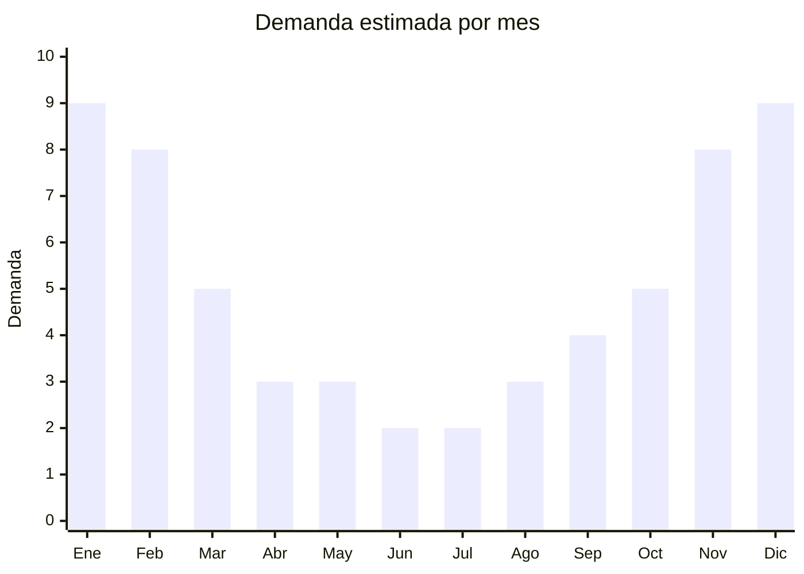

# Antiparras de natación

> **Capítulo NCM 90** — Instrumentos y aparatos de óptica | **Temporada:** Verano (Dic–Feb)

## Qué es y por qué importarlo

Las antiparras (también llamadas gafas o goggles de natación) son accesorios indispensables para nadar en pileta (protección contra el cloro) y en el mar (protección contra la sal y visibilidad submarina). El mercado incluye antiparras de silicona transparente para adultos (uso recreativo y entrenamiento), modelos espejados de competición, antiparras infantiles con diseños coloridos, sets con tubo snorkel integrado para playa, e incluso antiparras graduadas con aumento para personas con miopía.

En Argentina, la demanda de antiparras tiene un pico marcado en verano (diciembre a febrero) coincidiendo con las vacaciones, la apertura de piletas municipales y clubes, y los viajes a la costa. Si bien hay demanda base todo el año por parte de nadadores de club, el grueso del volumen se concentra en la temporada estival, donde el público recreativo (no competitivo) es el principal comprador.

China (Dongguan, Guangdong) es el principal productor mundial de antiparras de natación, fabricando para marcas globales como Speedo, Arena y TYR, así como modelos genéricos con calidad comparable a precios FOB muy inferiores. Las antiparras de silicona con lente de policarbonato antivaho son el estándar esperado por el consumidor. El producto es liviano, pequeño y fácil de enviar, con márgenes atractivos especialmente en el segmento de diseño (espejadas, colores fashion, infantiles con personajes).

## Datos clave

| Dato | Valor |
|------|-------|
| **Posiciones NCM típicas** | 9004.90.00 (gafas protectoras), 9506.29.00 (artículos para deportes acuáticos) |
| **Derecho de importación** | 14-18% (DIE) + 3% tasa estadística |
| **Rango FOB típico** | USD 0.50 — USD 3.00 por unidad |
| **Precio de venta en Argentina** | ARS 3.000 — ARS 15.000 |
| **Margen bruto estimado** | 200% — 400% |
| **MOQ típico** | 100 — 500 unidades |
| **Demanda en MercadoLibre** | Alta (pico verano) |
| **Competencia en MercadoLibre** | Media-Alta |
| **Dificultad para importar** | Fácil |
| **Certificaciones necesarias** | No requiere certificación especial |
| **Antidumping** | No |

## Variantes y subtipos más comunes

| Subtipo / Variante | FOB aprox. | Venta AR aprox. | Nota |
|--------------------|-----------|-----------------|------|
| Silicona adulto transparente | USD 0.50 — 1.50 | ARS 3.000 — 7.000 | **Más vendido** — uso recreativo |
| Espejadas competición | USD 1.50 — 3.00 | ARS 7.000 — 15.000 | Nadadores, triatletas |
| Infantil con diseños coloridos | USD 0.50 — 1.50 | ARS 3.000 — 8.000 | Alta rotación verano |
| Set antiparras + tubo snorkel | USD 1.50 — 3.00 | ARS 6.000 — 12.000 | Playa, vacaciones |
| Graduadas (con aumento) | USD 2.00 — 4.00 | ARS 8.000 — 18.000 | Nicho, margen alto |

## Regulaciones y requisitos

<Tabs>
  <Tab title="Certificaciones">
    | Organismo | Requiere | Detalle |
    |-----------|----------|---------|
    | ARCA (Aduana) | Sí siempre | Despacho estándar |
    | IRAM | No obligatorio | No clasifican como EPI (equipo de protección individual) ni juguete |
    | ANMAT | No | No aplica |
    | ENACOM | No | No es electrónico |

    **Recomendación:** Solicitar al proveedor certificados de calidad de la silicona (hipoalergénica, libre de látex) y del lente (policarbonato con protección UV y tratamiento antivaho). Estos certificados son argumentos de venta fuertes y diferencian del producto genérico sin documentación.
  </Tab>

  <Tab title="Etiquetado">
    | Requisito | Aplica |
    |-----------|--------|
    | Idioma español | Sí |
    | Datos del importador | Sí |
    | Composición / materiales | Sí ("Silicona hipoalergénica, lente policarbonato") |
    | Protección UV | Indicar si tiene |
    | Tratamiento antivaho | Indicar si tiene |
    | Instrucciones de cuidado | Recomendado |
    | País de origen | Sí |
    | Garantía legal 6 meses | Sí |
  </Tab>

  <Tab title="Restricciones">
    Sin restricciones de importación. No hay antidumping ni licencias previas para antiparras de natación.

    **Nota sobre clasificación NCM:** Las antiparras pueden clasificar en la posición 9004 (gafas protectoras) o 9506 (artículos deportivos acuáticos) según la interpretación del despachante de aduanas. La diferencia en el DIE puede ser de 14% a 18%. Consultar con despachante la clasificación más conveniente antes de importar.
  </Tab>
</Tabs>

## Logística

| Dato | Valor |
|------|-------|
| **Peso típico por unidad** | 0.05 — 0.15 kg |
| **Volumen típico** | Muy Bajo (producto compacto con estuche rígido) |
| **Fragilidad** | Baja-Media (lentes pueden rayarse sin estuche) |
| **Envío recomendado** | Marítimo LCL (incluso aéreo viable por bajo volumen) |
| **Tiempo total estimado** | 45 — 75 días (marítimo) |
| **Baterías de litio** | No |
| **Requiere empaque especial** | Estuche rígido individual recomendado |

<Tip>
Las antiparras son un excelente producto para **combinar en el mismo envío** con flotadores, colchonetas y pelotas de playa. Su volumen es mínimo pero su precio de venta es significativo. Agregar 200-500 antiparras a un pedido LCL de inflables diversifica la oferta con mínimo impacto en flete. Los sets "antiparras + gorra de natación" o "antiparras + snorkel" tienen mayor ticket promedio.
</Tip>

## Estacionalidad



| Aspecto | Detalle |
|---------|---------|
| **Meses pico** | Noviembre-Febrero (apertura piletas, vacaciones, playa) |
| **Meses valle** | Junio-Julio (mínima demanda, solo nadadores de club) |
| **Cuándo pedir** | Agosto-Septiembre para tener stock en noviembre |

## Ventajas y riesgos

<CardGroup cols={2}>
  <Card title="Ventajas" icon="circle-check">
    - Márgenes altos (200-400%)
    - Producto ultra liviano y compacto
    - Sin regulación compleja
    - Demanda base todo el año (nadadores de club)
    - Ideal para kits y combos (antiparras + gorra + snorkel)
  </Card>
  <Card title="Riesgos" icon="triangle-exclamation">
    - Silicona de baja calidad irrita la piel (alergias)
    - Lentes sin antivaho se empañan rápido (devoluciones)
    - Fugas de agua por sellado deficiente del marco
    - Competencia con marcas reconocidas (Speedo, Arena)
    - Correas elásticas de baja calidad se rompen
  </Card>
</CardGroup>

<Warning>
**Verificar calidad de silicona.** La causa principal de reclamos en antiparras importadas es la irritación de piel por silicona de baja calidad o con exceso de químicos. Solicitar al proveedor certificado de silicona hipoalergénica y hacer pruebas de uso prolongado (mínimo 1 hora en agua) con las muestras antes del pedido grande.
</Warning>

## Palabras clave para buscar en Alibaba

```
swimming goggles wholesale, swim goggles silicone anti fog,
mirrored swim goggles, kids swimming goggles wholesale,
snorkel set goggles tube, prescription swimming goggles,
UV protection swim goggles, swimming goggles polycarbonate lens,
competition goggles wholesale, children swim goggles cartoon
```

## Fuentes

- [MercadoLibre Argentina — Antiparras natación](https://listado.mercadolibre.com.ar/antiparras-natacion)
- [Alibaba — Swimming goggles wholesale](https://www.alibaba.com/showroom/swimming-goggles-wholesale.html)
