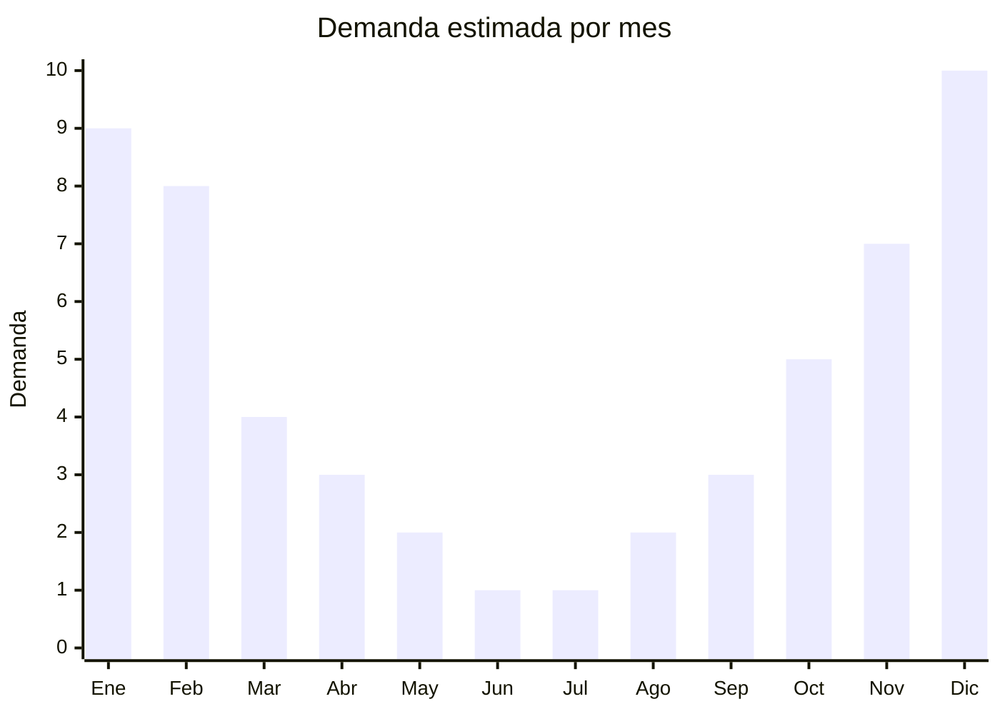

# Cámaras acuáticas y carcasas sumergibles

> **Capítulo NCM 90** — Instrumentos de óptica y aparatos médico-quirúrgicos | **Temporada:** Verano (Dic–Feb)

## Qué es y por qué importarlo

Las cámaras acuáticas (action cameras) son cámaras compactas resistentes al agua, diseñadas para capturar fotos y videos en actividades al aire libre y deportes acuáticos. Las carcasas sumergibles (waterproof cases o housings) permiten sumergir cámaras o celulares que no son acuáticos de fábrica. En Argentina, la demanda de estos productos se dispara en verano cuando millones de personas vacacionan en playas, piletas, ríos y lagos, buscando documentar sus experiencias de snorkel, buceo recreativo, kayak y playa.

El mercado se divide en dos segmentos: GoPro domina el segmento premium (USD 200+ venta al público), mientras que las action cameras genéricas chinas 4K (Akaso, SJCAM, Eken) compiten en el segmento económico con precios de venta entre ARS 50.000 y ARS 150.000. Las carcasas universales para celulares (bolsas IPX8) son el producto de mayor volumen por su precio accesible.

El negocio es atractivo por el ticket medio-alto y los márgenes sólidos. Las action cameras genéricas 4K ofrecen especificaciones competitivas a una fracción del FOB de GoPro. China (Shenzhen) es el epicentro global de producción de action cameras y accesorios.

## Datos clave

| Dato | Valor |
|------|-------|
| **Posiciones NCM típicas** | 9006.59.00 (cámaras fotográficas), 9006.91.00 (partes de cámaras - carcasas) |
| **Derecho de importación** | 20% (DIE) + 3% tasa estadística |
| **Rango FOB típico** | USD 10.00 — USD 40.00 por unidad (action cameras genéricas) |
| **Precio de venta en Argentina** | ARS 40.000 — ARS 150.000 |
| **Margen bruto estimado** | 100% — 200% |
| **MOQ típico** | 50 — 200 unidades |
| **Demanda en MercadoLibre** | Alta (estacional) |
| **Competencia en MercadoLibre** | Media-Alta |
| **Dificultad para importar** | Media (electrónico, ENACOM posible) |
| **Certificaciones necesarias** | ENACOM (si tiene WiFi/Bluetooth) |
| **Antidumping** | No |

## Variantes y subtipos más comunes

| Subtipo / Variante | FOB aprox. | Venta AR aprox. | Nota |
|--------------------|-----------|-----------------|------|
| Funda sumergible celular (bolsa IPX8) | USD 1.00 — 3.00 | ARS 5.000 — 12.000 | Altísimo volumen |
| Action camera 1080p básica | USD 10.00 — 15.00 | ARS 40.000 — 60.000 | Entrada, sin WiFi |
| Action camera 4K genérica | USD 20.00 — 30.00 | ARS 70.000 — 110.000 | **Más vendida** |
| Action camera 4K + WiFi + accesorios | USD 25.00 — 40.00 | ARS 90.000 — 150.000 | Kit completo |
| Carcasa sumergible para GoPro | USD 5.00 — 12.00 | ARS 15.000 — 40.000 | Accesorio complementario |

## Regulaciones y requisitos

<Tabs>
  <Tab title="Certificaciones">
    | Organismo | Requiere | Detalle |
    |-----------|----------|---------|
    | ARCA (Aduana) | Sí siempre | Despacho estándar |
    | ANMAT | No | No aplica |
    | ENACOM | Sí (si tiene WiFi/Bluetooth) | Habilitación obligatoria para dispositivos con emisión RF |
    | SENASA | No | No aplica |
    | IRAM | No obligatorio | Recomendado para seguridad eléctrica |

    **Recomendación:** Las action cameras con WiFi y Bluetooth requieren habilitación de ENACOM, lo que agrega tiempo y costo al proceso. Los modelos sin conectividad inalámbrica (solo 1080p básicas) no requieren ENACOM y son más rápidos de despachar. Las fundas sumergibles para celular no requieren ninguna certificación especial. Solicitar al proveedor los certificados FCC/CE del módulo WiFi para agilizar el trámite ENACOM.
  </Tab>

  <Tab title="Etiquetado">
    | Requisito | Aplica |
    |-----------|--------|
    | Idioma español | Sí |
    | Datos del importador | Sí |
    | Resolución y especificaciones | Sí (4K, 1080p, MP) |
    | Profundidad sumergible | Sí (en metros, ej: IPX8 / 30m) |
    | País de origen | Sí |
    | Garantía legal 6 meses | Sí |
    | Instrucciones de uso | Sí (incluir cuidado de carcasa) |
    | Número ENACOM | Sí (si tiene WiFi/BT) |
  </Tab>

  <Tab title="Restricciones">
    No hay antidumping para action cameras genéricas.

    **Atención:** Los modelos con WiFi y Bluetooth son dispositivos de telecomunicaciones y requieren homologación ENACOM obligatoria antes de la venta. El trámite puede demorar 30-60 días adicionales. Las cámaras sin conectividad inalámbrica y las fundas/carcasas sumergibles no tienen restricciones. Considerar importar modelos sin WiFi para simplificar el proceso.
  </Tab>
</Tabs>

## Logística

| Dato | Valor |
|------|-------|
| **Peso típico por unidad** | 0.08 — 0.30 kg (cámaras), 0.02 — 0.05 kg (fundas) |
| **Volumen típico** | Bajo (cajas compactas) |
| **Fragilidad** | Media (electrónico, requiere protección) |
| **Envío recomendado** | Marítimo LCL o aéreo según urgencia |
| **Tiempo total estimado** | 50 — 80 días (marítimo), 15-25 días (aéreo) |
| **Baterías de litio** | Sí (batería integrada o removible, verificar regulación IATA) |
| **Requiere empaque especial** | Sí (antiestático, protección impactos) |

<Tip>
Las action cameras incluyen **baterías de litio**, lo que agrega restricciones al envío aéreo (regulación IATA PI 966/967). Para envío marítimo, las baterías deben declararse correctamente. Solicitar al proveedor que las baterías vengan **empacadas por separado dentro de la caja** (no instaladas en la cámara) y con la documentación MSDS (Material Safety Data Sheet) correspondiente.
</Tip>

## Estacionalidad



| Aspecto | Detalle |
|---------|---------|
| **Meses pico** | Noviembre-Febrero (vacaciones acuáticas, playa, snorkel) |
| **Meses valle** | Junio-Agosto (sin actividades acuáticas al aire libre) |
| **Cuándo pedir** | Julio-Agosto para tener stock en noviembre (considerar tiempo ENACOM) |

## Ventajas y riesgos

<CardGroup cols={2}>
  <Card title="Ventajas" icon="circle-check">
    - Ticket medio-alto con buenos márgenes
    - Producto compacto, flete eficiente
    - Mercado en crecimiento (contenido redes sociales)
    - Múltiples accesorios como venta cruzada
    - Fundas sumergibles: altísimo volumen, riesgo mínimo
  </Card>
  <Card title="Riesgos" icon="triangle-exclamation">
    - ENACOM obligatorio para modelos con WiFi (tiempo + costo)
    - Baterías de litio complican logística
    - Competencia con GoPro y marcas posicionadas
    - Calidad de imagen variable en genéricas "4K"
    - Filtración de agua = reclamo seguro y pérdida total
  </Card>
</CardGroup>

## Palabras clave para buscar en Alibaba

```
action camera 4K waterproof wholesale, underwater camera sport,
waterproof phone case IPX8 universal, action camera WiFi 4K,
sport camera waterproof 30m, GoPro housing waterproof case,
action camera accessories kit, underwater camera 1080p cheap
```

## Fuentes

- [MercadoLibre Argentina — Cámaras acuáticas](https://listado.mercadolibre.com.ar/camara-acuatica)
- [Alibaba — Action camera waterproof wholesale](https://www.alibaba.com/showroom/action-camera-waterproof.html)
