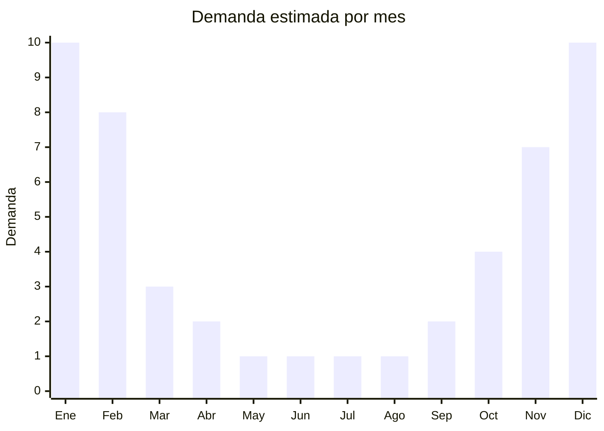

# Snorkels y máscaras de buceo recreativo

> **Capítulo NCM 90** — Instrumentos de óptica y aparatos médico-quirúrgicos | **Temporada:** Verano (Dic–Feb)

## Qué es y por qué importarlo

Los snorkels y máscaras de buceo recreativo son equipos que permiten respirar y ver bajo el agua en la superficie o a poca profundidad. El producto estrella de los últimos años es la máscara panorámica full-face (tipo Decathlon Easybreath), que integra snorkel y máscara en una sola pieza cubriendo todo el rostro, permitiendo respirar por nariz y boca simultáneamente. Este diseño eliminó la barrera de entrada para principiantes y familias, generando un mercado masivo.

En Argentina, el snorkel recreativo se practica principalmente en la costa atlántica (Mar del Plata, Pinamar), lagos patagónicos, ríos del litoral y destinos internacionales favoritos como Brasil y el Caribe. La demanda es 100% estacional, concentrada entre diciembre y febrero. Las máscaras full-face genéricas chinas dominan el mercado económico, mientras que Decathlon (Subea) y Cressi compiten en el segmento premium.

El negocio destaca por márgenes atractivos, un FOB accesible y un producto que se diferencia fácilmente por diseño y colores. Las máscaras full-face tienen un ticket de venta superior a los sets tradicionales snorkel + máscara.

<Note>
**Clasificación arancelaria:** Los snorkels y máscaras de buceo pueden clasificar en Cap. 90 (posición 9004 como gafas/aparatos ópticos protectores) o en Cap. 95 (posición 9506.29 como artículos para deportes acuáticos). La clasificación impacta en el derecho de importación. Consultar con despachante.
</Note>

## Datos clave

| Dato | Valor |
|------|-------|
| **Posiciones NCM típicas** | 9004.90.90 (gafas protectoras), 9506.29.00 (artículos para deportes acuáticos) |
| **Derecho de importación** | 18-20% (DIE) + 3% tasa estadística |
| **Rango FOB típico** | USD 5.00 — USD 15.00 por unidad |
| **Precio de venta en Argentina** | ARS 20.000 — ARS 65.000 |
| **Margen bruto estimado** | 150% — 300% |
| **MOQ típico** | 100 — 500 unidades |
| **Demanda en MercadoLibre** | Alta (estacional) |
| **Competencia en MercadoLibre** | Media-Alta |
| **Dificultad para importar** | Fácil |
| **Certificaciones necesarias** | No requiere certificaciones especiales |
| **Antidumping** | No |

## Variantes y subtipos más comunes

| Subtipo / Variante | FOB aprox. | Venta AR aprox. | Nota |
|--------------------|-----------|-----------------|------|
| Set snorkel + máscara básico | USD 5.00 — 7.00 | ARS 20.000 — 30.000 | Tradicional, económico |
| Máscara full-face S/M | USD 7.00 — 10.00 | ARS 30.000 — 45.000 | **Más vendida** |
| Máscara full-face L/XL | USD 8.00 — 12.00 | ARS 35.000 — 50.000 | Adulto grande |
| Máscara full-face junior | USD 6.00 — 9.00 | ARS 25.000 — 40.000 | Niños, colores vivos |
| Máscara full-face + soporte GoPro | USD 10.00 — 15.00 | ARS 40.000 — 65.000 | Premium, filmación subacuática |

## Regulaciones y requisitos

<Tabs>
  <Tab title="Certificaciones">
    | Organismo | Requiere | Detalle |
    |-----------|----------|---------|
    | ARCA (Aduana) | Sí siempre | Despacho estándar |
    | ANMAT | No | No es dispositivo médico |
    | ENACOM | No | No es electrónico |
    | SENASA | No | No aplica |

    **Recomendación:** Las máscaras full-face han tenido controversias por acumulación de CO2 en modelos de baja calidad. Solicitar al proveedor certificado de test de seguridad respiratoria y verificar que el diseño incluya canales de ventilación separados para inhalación y exhalación. Priorizar proveedores que fabriquen con sistema anti-fog seco (sin necesidad de spray).
  </Tab>

  <Tab title="Etiquetado">
    | Requisito | Aplica |
    |-----------|--------|
    | Idioma español | Sí |
    | Datos del importador | Sí |
    | Composición / materiales | Sí (policarbonato, silicona, PP) |
    | Talle (S/M, L/XL) | Sí |
    | País de origen | Sí |
    | Garantía legal 6 meses | Sí |
    | Instrucciones de uso y seguridad | Sí (incluir advertencias de profundidad máxima) |
  </Tab>

  <Tab title="Restricciones">
    Sin restricciones especiales de importación. No hay antidumping ni licencias previas para equipamiento de snorkel recreativo.

    **Atención:** Las máscaras full-face NO son aptas para buceo en profundidad (solo superficie/snorkel). Incluir siempre una advertencia clara en el packaging: "Solo para snorkel en superficie. No apto para buceo en apnea ni con tanque." Esto reduce reclamos y responsabilidad legal.
  </Tab>
</Tabs>

## Logística

| Dato | Valor |
|------|-------|
| **Peso típico por unidad** | 0.30 — 0.60 kg |
| **Volumen típico** | Medio (máscaras full-face son voluminosas) |
| **Fragilidad** | Baja (policarbonato y silicona flexibles) |
| **Envío recomendado** | Marítimo LCL o FCL según volumen |
| **Tiempo total estimado** | 50 — 80 días (marítimo) |
| **Baterías de litio** | No |
| **Requiere empaque especial** | No (bolsa o caja individual estándar) |

<Tip>
Las máscaras full-face son más voluminosas que las antiparras tradicionales. Solicitar al proveedor que las embale **sin caja individual** (solo en bolsa plástica con etiqueta) para reducir el CBM hasta un 50%. El packaging retail se puede agregar localmente con una caja genérica de tu marca. Cada cartón master puede contener 20-30 máscaras embaladas en bolsa vs. 10-15 con caja individual.
</Tip>

## Estacionalidad



| Aspecto | Detalle |
|---------|---------|
| **Meses pico** | Diciembre-Febrero (playa, pileta, vacaciones acuáticas) |
| **Meses valle** | Mayo-Agosto (cero actividad de snorkel) |
| **Cuándo pedir** | Julio-Agosto para tener stock en noviembre (inicio temporada) |

## Ventajas y riesgos

<CardGroup cols={2}>
  <Card title="Ventajas" icon="circle-check">
    - Producto innovador (full-face) con alta demanda
    - FOB accesible, márgenes sólidos
    - Sin barreras regulatorias
    - Diferenciación por colores y diseño
    - Combo natural con antiparras, aletas, cámaras
  </Card>
  <Card title="Riesgos" icon="triangle-exclamation">
    - 100% estacional: cero demanda en invierno
    - Controversia de seguridad en modelos baratos (CO2)
    - Competencia con Decathlon (Subea) muy posicionada
    - Filtración de agua = devolución segura
    - Tallaje variable entre fabricantes chinos
  </Card>
</CardGroup>

## Palabras clave para buscar en Alibaba

```
full face snorkel mask wholesale, snorkel mask 180 panoramic,
diving mask full face anti fog, snorkel set adult wholesale,
full face snorkel mask GoPro mount, snorkel mask kids,
diving mask snorkel set, full face swimming mask wholesale
```

## Fuentes

- [MercadoLibre Argentina — Máscara snorkel full face](https://listado.mercadolibre.com.ar/mascara-snorkel-full-face)
- [Alibaba — Full face snorkel mask wholesale](https://www.alibaba.com/showroom/full-face-snorkel-mask.html)
