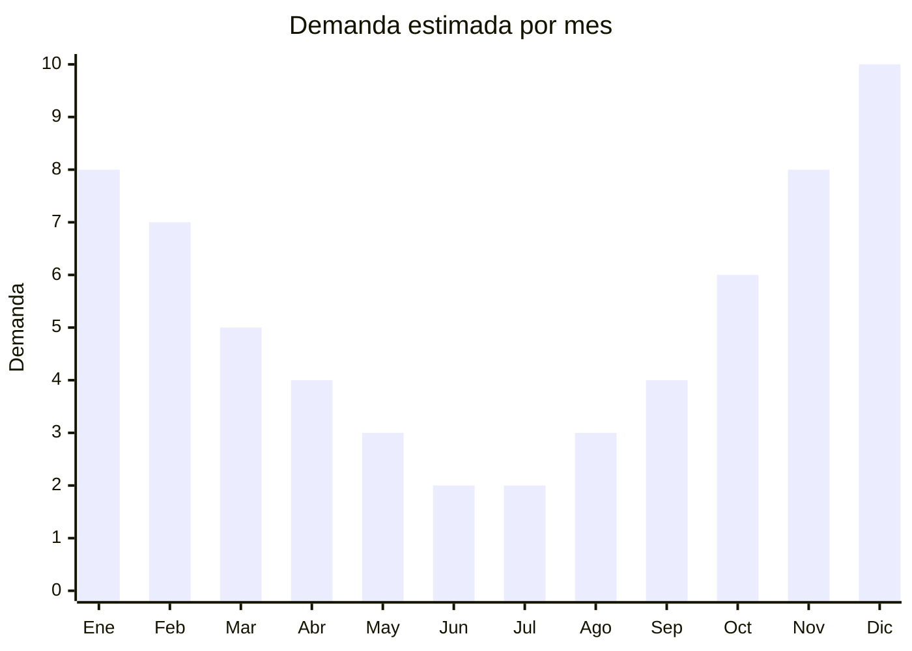

# Gazebos y carpas plegables

> **Capitulo NCM 94** — Muebles, iluminacion y construcciones prefabricadas | **Temporada:** Verano (Dic--Feb)

## Que es y por que importarlo

Los gazebos plegables (tambien llamados carpas plegables, toldos plegables o gazebos pop-up) son estructuras portatiles con techo de tela de poliester y armazon de acero o aluminio que se arman y desarman en minutos sin herramientas. El formato mas popular es el 3x3 metros, aunque existen versiones de 2x2, 3x4.5 y 3x6 metros. Se utilizan para eventos al aire libre, ferias, camping, patios, piletas, casamientos y actividades comerciales (puestos de venta).

En Argentina, marcas como Kushiro y Waterdog dominan el segmento con modelos importados de China. La demanda se dispara en verano (eventos al aire libre, fiestas de fin de ano) pero tambien tiene traccion en ferias artesanales y eventos comerciales durante todo el ano. China concentra la produccion mundial en Zhejiang (Yongkang, Jinhua) y Guangdong.

La ventaja de los gazebos plegables es que, a pesar de ser un producto grande armado (3x3m), se pliegan en un bolso de transporte relativamente compacto (aprox. 1.5m de largo x 0.25m x 0.25m), lo que optimiza significativamente el CBM comparado con otros muebles de exterior.

## Datos clave

| Dato | Valor |
|------|-------|
| **Posiciones NCM tipicas** | 9406.20.00 (construcciones prefabricadas modulares), 6306.22.00 (tiendas de fibras sinteticas) |
| **Derecho de importacion** | 20% (DIE) + 3% tasa estadistica |
| **Rango FOB tipico** | USD 20.00 — USD 60.00 por unidad (3x3m) |
| **Precio de venta en Argentina** | ARS 50,000 — ARS 150,000 |
| **Margen bruto estimado** | 100% — 200% |
| **MOQ tipico** | 50 — 200 unidades |
| **Demanda en MercadoLibre** | Alta (estacional con base anual) |
| **Competencia en MercadoLibre** | Media (Kushiro, Waterdog) |
| **Dificultad para importar** | Media |
| **Certificaciones necesarias** | No requiere certificaciones especiales |
| **Antidumping** | No |

## Variantes y subtipos mas comunes

| Subtipo / Variante | FOB aprox. | Venta AR aprox. | Nota |
|--------------------|-----------|-----------------|------|
| Gazebo 3x3 basico acero | USD 20.00 — 30.00 | ARS 50,000 — 80,000 | Entry-level, mayor volumen de ventas |
| Gazebo 3x3 reforzado acero | USD 30.00 — 42.00 | ARS 80,000 — 110,000 | **Mas vendido**, tubo mas grueso |
| Gazebo 3x3 aluminio premium | USD 40.00 — 60.00 | ARS 100,000 — 150,000 | Mas liviano, mas resistente |
| Gazebo 3x4.5 reforzado | USD 35.00 — 55.00 | ARS 90,000 — 130,000 | Para eventos comerciales |
| Paredes laterales (set x4) | USD 8.00 — 15.00 | ARS 20,000 — 40,000 | Accesorio complementario, margen alto |

## Regulaciones y requisitos

<Tabs>
  <Tab title="Certificaciones">
    | Organismo | Requiere | Detalle |
    |-----------|----------|---------|
    | ARCA (Aduana) | Si siempre | Despacho estandar |
    | INTI | No obligatorio | No hay norma IRAM obligatoria para gazebos |
    | ENACOM | No | No es producto electronico |
    | SENASA | No | No aplica |

    **Recomendacion:** Solicitar al proveedor certificado de resistencia de la tela (impermeabilidad minimo 2000mm columna de agua, proteccion UV UPF 50+) y certificado de resistencia de la estructura (viento minimo 40 km/h). Los modelos ultra-baratos usan tela que se moja y estructuras que se deforman con viento moderado.
  </Tab>

  <Tab title="Etiquetado">
    | Requisito | Aplica |
    |-----------|--------|
    | Idioma espanol | Si |
    | Datos del importador | Si |
    | Materiales (estructura y tela) | Si |
    | Medidas armado y plegado | Si |
    | Peso maximo soportado (nieve/agua) | Recomendado |
    | Pais de origen | Si |
    | Garantia legal 6 meses | Si |
    | Instrucciones de armado | Si |
  </Tab>

  <Tab title="Restricciones">
    Sin restricciones especiales de importacion. No hay antidumping ni licencias previas.

    **Atencion a la clasificacion:** Los gazebos plegables pueden clasificar como "construcciones prefabricadas" (Cap. 94) o como "tiendas/carpas" (Cap. 63). La clasificacion depende de la estructura y uso declarado. Consultar con despachante de aduanas para confirmar posicion arancelaria, ya que los derechos pueden variar significativamente.
  </Tab>
</Tabs>

## Logistica

| Dato | Valor |
|------|-------|
| **Peso tipico por unidad** | 12 — 25 kg (estructura + techo + bolso) |
| **Volumen tipico** | 0.08 — 0.15 CBM por unidad (plegado en bolso) |
| **Fragilidad** | Baja-Media (articulaciones son el punto debil) |
| **Envio recomendado** | Maritimo LCL o FCL segun volumen |
| **Tiempo total estimado** | 60 — 90 dias (maritimo) |
| **Baterias de litio** | No |
| **Requiere empaque especial** | Si: bolso de transporte + caja exterior reforzada |

<Tip>
Los gazebos plegables tienen una ventaja logistica clave frente a otros muebles de exterior: se comprimen en bolsos de transporte de aprox. 0.08-0.15 CBM. Un contenedor de 20 pies (28 CBM) puede cargar 180-350 gazebos 3x3 dependiendo del modelo. Esto hace viable incluso el envio LCL para pedidos pequenos. Complementar el pedido con juegos de paredes laterales (muy bajo volumen) para maximizar el valor por CBM.
</Tip>

## Estacionalidad



| Aspecto | Detalle |
|---------|---------|
| **Meses pico** | Noviembre-Febrero (verano, eventos, fiestas al aire libre) |
| **Meses valle** | Junio-Julio (invierno, pocos eventos outdoor) |
| **Cuando pedir** | Julio-Agosto para tener stock en octubre-noviembre |

<Note>
A diferencia de otros productos puramente de verano, los gazebos tienen demanda complementaria todo el ano por ferias artesanales, eventos comerciales y food trucks. Esto reduce el riesgo de stock muerto en invierno.
</Note>

## Ventajas y riesgos

<CardGroup cols={2}>
  <Card title="Ventajas" icon="circle-check">
    - Alta demanda en verano + demanda base anual (ferias, eventos)
    - Buena relacion CBM/valor (se pliegan compactos)
    - Ticket alto con margenes atractivos
    - Venta cruzada natural: gazebo + paredes + estacas + peso
    - Posibilidad de personalizacion con logo (eventos corporativos)
    - Marcas de referencia (Kushiro, Waterdog) validan el mercado
  </Card>
  <Card title="Riesgos" icon="triangle-exclamation">
    - Estructuras baratas se deforman con viento moderado
    - Tela de baja calidad filtra agua y pierde color
    - Articulaciones de plegado son el punto de falla critico
    - Peso del producto (12-25 kg) encarece ultimo tramo logistico
    - Competencia de marcas establecidas en el mercado
    - Reclamos de garantia por articulaciones rotas son frecuentes
  </Card>
</CardGroup>

## Palabras clave para buscar en Alibaba

```
pop up gazebo 3x3 wholesale, folding canopy tent steel frame,
portable gazebo tent outdoor, event tent 3x3 aluminum,
trade show tent pop up, camping gazebo folding,
gazebo sidewalls set, pop up tent waterproof UV
```

## Fuentes

- [MercadoLibre Argentina — Gazebos plegables](https://listado.mercadolibre.com.ar/gazebo-plegable-3x3)
- [Alibaba — Pop up gazebo wholesale](https://www.alibaba.com/trade/search?SearchText=pop+up+gazebo+3x3)
- [Nomenclador NCM - ARCA (ex-AFIP)](https://www.arca.gob.ar)
