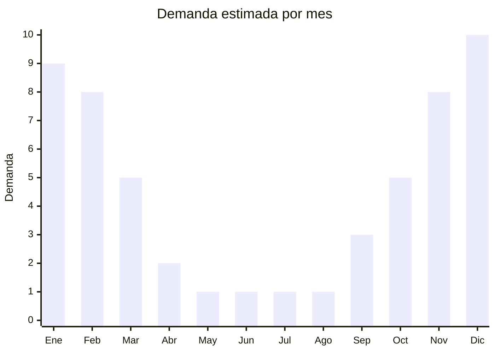

# Hamacas colgantes y paraguayas

> **Capitulo NCM 94** — Muebles, iluminacion y construcciones prefabricadas | **Temporada:** Verano (Dic--Feb)

## Que es y por que importarlo

Las hamacas colgantes son piezas de tela, lona o red suspendidas entre dos puntos de anclaje (arboles, columnas, soportes) para recostarse y descansar al aire libre. Incluyen las hamacas paraguayas (de tela tejida con flecos, tipicas de Sudamerica), hamacas brasilenas (algodon con barras separadoras), hamacas tipo red (cuerda o nylon) y hamacas con soporte metalico independiente.

En Argentina, las hamacas son un producto clasico de verano asociado a jardines, quinchos, galerias y espacios de descanso al aire libre. La demanda crece fuertemente entre noviembre y febrero. China produce hamacas a gran escala en Zhejiang y Shandong, tanto en modelos tipo red como en tela de algodon y poliester, a precios FOB muy competitivos.

La clave de este producto para la importacion es la diferencia de volumen entre hamacas de tela (sin soporte) y hamacas con soporte metalico. Las hamacas de tela se enrollan y comprimen en bolsas de menos de 0.01 CBM cada una, lo que las convierte en uno de los productos de exterior con mejor relacion valor/volumen. En cambio, los soportes metalicos ocupan 0.10-0.20 CBM y agregan peso considerable, cambiando completamente la ecuacion logistica.

## Datos clave

| Dato | Valor |
|------|-------|
| **Posiciones NCM tipicas** | 9401.80.00 (otros asientos), 5608.19.00 (redes confeccionadas) |
| **Derecho de importacion** | 20% (DIE) + 3% tasa estadistica |
| **Rango FOB tipico** | USD 5.00 — USD 15.00 (tela), USD 15.00 — USD 30.00 (con soporte) |
| **Precio de venta en Argentina** | ARS 18,000 — ARS 80,000 |
| **Margen bruto estimado** | 150% — 300% |
| **MOQ tipico** | 200 — 1000 unidades (tela), 50 — 200 (con soporte) |
| **Demanda en MercadoLibre** | Alta (estacional) |
| **Competencia en MercadoLibre** | Media |
| **Dificultad para importar** | Facil (tela) / Media (con soporte por volumen) |
| **Certificaciones necesarias** | No requiere certificaciones especiales |
| **Antidumping** | No |

<Warning>
**CUIDADO CON LOS SOPORTES METALICOS.** Una hamaca de tela enrollada ocupa menos de 0.01 CBM y pesa 1-2 kg. Un soporte metalico ocupa 0.10-0.20 CBM y pesa 8-15 kg. Si el objetivo es optimizar flete, importar hamacas de tela sin soporte y evaluar sourcing de soportes localmente o en un envio separado optimizado para peso/volumen.
</Warning>

## Variantes y subtipos mas comunes

| Subtipo / Variante | FOB aprox. | Venta AR aprox. | Nota |
|--------------------|-----------|-----------------|------|
| Hamaca red nylon individual | USD 3.00 — 6.00 | ARS 12,000 — 25,000 | Clasica, bajo costo, muy compacta |
| Hamaca tela algodon individual | USD 5.00 — 8.00 | ARS 18,000 — 30,000 | Comoda, colores variados |
| Hamaca tela algodon familiar | USD 8.00 — 12.00 | ARS 28,000 — 45,000 | **Mas vendida**, mayor ancho |
| Hamaca paraguaya con flecos | USD 10.00 — 15.00 | ARS 35,000 — 55,000 | Estetica premium, decorativa |
| Hamaca con barra separadora | USD 7.00 — 12.00 | ARS 25,000 — 40,000 | Estilo brasileno, superficie plana |
| Soporte metalico universal | USD 15.00 — 30.00 | ARS 40,000 — 80,000 | CUIDADO: alto CBM y peso |

## Regulaciones y requisitos

<Tabs>
  <Tab title="Certificaciones">
    | Organismo | Requiere | Detalle |
    |-----------|----------|---------|
    | ARCA (Aduana) | Si siempre | Despacho estandar |
    | INTI | No obligatorio | No hay norma IRAM obligatoria para hamacas |
    | ENACOM | No | No es producto electronico |
    | SENASA | No | No aplica |

    **Recomendacion:** Solicitar al proveedor test de carga (minimo 150 kg para individual, 200 kg para familiar) y test de resistencia de las cuerdas y ojales de sujecion. El punto de falla mas comun es donde las cuerdas se unen a la tela. Los ojales metalicos reforzados son preferibles a los cosidos simples.
  </Tab>

  <Tab title="Etiquetado">
    | Requisito | Aplica |
    |-----------|--------|
    | Idioma espanol | Si |
    | Datos del importador | Si |
    | Materiales (tipo de tela, cuerdas) | Si |
    | Peso maximo soportado | Si (critico por seguridad) |
    | Medidas (largo x ancho) | Si |
    | Pais de origen | Si |
    | Garantia legal 6 meses | Si |
    | Instrucciones de instalacion | Si |
  </Tab>

  <Tab title="Restricciones">
    Sin restricciones especiales de importacion. No hay antidumping ni licencias previas.

    **Atencion:** Verificar que las cuerdas de sujecion tengan resistencia certificada. Las hamacas con cuerdas de baja calidad pueden romperse generando caidas y lesiones. Solicitar que incluyan mosquetones o ganchos de acero (no aluminio blando) y kit de instalacion con tornillos para pared/viga.
  </Tab>
</Tabs>

## Logistica

| Dato | Valor |
|------|-------|
| **Peso tipico por unidad** | Tela: 1.0 — 2.5 kg / Con soporte: 10 — 18 kg |
| **Volumen tipico** | Tela: 0.005 — 0.01 CBM / Con soporte: 0.10 — 0.20 CBM |
| **Fragilidad** | Muy baja (tela se enrolla, no se rompe) |
| **Envio recomendado** | Maritimo LCL (tela) / FCL (con soportes) |
| **Tiempo total estimado** | 50 — 80 dias (maritimo) |
| **Baterias de litio** | No |
| **Requiere empaque especial** | No (bolsa de tela + caja exterior) |

<Tip>
Las hamacas de tela sin soporte son uno de los mejores productos de exterior para importar por primera vez. Un contenedor de 20 pies (28 CBM) puede cargar **2,800-5,600 hamacas de tela**, lo que las hace viables incluso en envio LCL de pocos metros cubicos. Un palet de 1 CBM puede contener 100-200 hamacas de tela. Ideal para testear el mercado con inversion baja. Los soportes metalicos se pueden sourcing por separado o incluso fabricar localmente.
</Tip>

## Estacionalidad



| Aspecto | Detalle |
|---------|---------|
| **Meses pico** | Noviembre-Febrero (verano, jardines, vacaciones) |
| **Meses valle** | Mayo-Agosto (sin uso exterior) |
| **Cuando pedir** | Julio-Agosto para tener stock en octubre-noviembre |

## Ventajas y riesgos

<CardGroup cols={2}>
  <Card title="Ventajas" icon="circle-check">
    - **Volumen minimo:** hamacas de tela ocupan menos de 0.01 CBM cada una
    - Inversion inicial baja, ideal para primera importacion
    - Margenes excelentes (150-300%)
    - Producto liviano, flete muy economico (sin soporte)
    - Sin barreras regulatorias
    - Variedad de estilos, colores y materiales para diferenciar
    - Producto aspiracional/decorativo, no solo funcional
  </Card>
  <Card title="Riesgos" icon="triangle-exclamation">
    - Fuertemente estacional: stock sobrante queda hasta siguiente verano
    - Cuerdas y ojales de baja calidad pueden romperse (riesgo de lesiones)
    - Tela de algodon barata puede desteñirse o encogerse
    - Soportes metalicos cambian completamente la ecuacion de flete
    - Competencia de hamacas artesanales locales (Paraguay, nordeste argentino)
    - Requiere instrucciones claras de instalacion segura
  </Card>
</CardGroup>

## Palabras clave para buscar en Alibaba

```
cotton hammock wholesale, camping hammock outdoor,
brazilian hammock with spreader bar, hammock net nylon,
hammock with stand metal frame, portable hammock travel,
family hammock extra wide cotton, hammock with carry bag
```

## Fuentes

- [MercadoLibre Argentina — Hamacas colgantes](https://listado.mercadolibre.com.ar/hamaca-colgante)
- [Alibaba — Cotton hammock wholesale](https://www.alibaba.com/trade/search?SearchText=cotton+hammock+wholesale)
- [Nomenclador NCM - ARCA (ex-AFIP)](https://www.arca.gob.ar)
