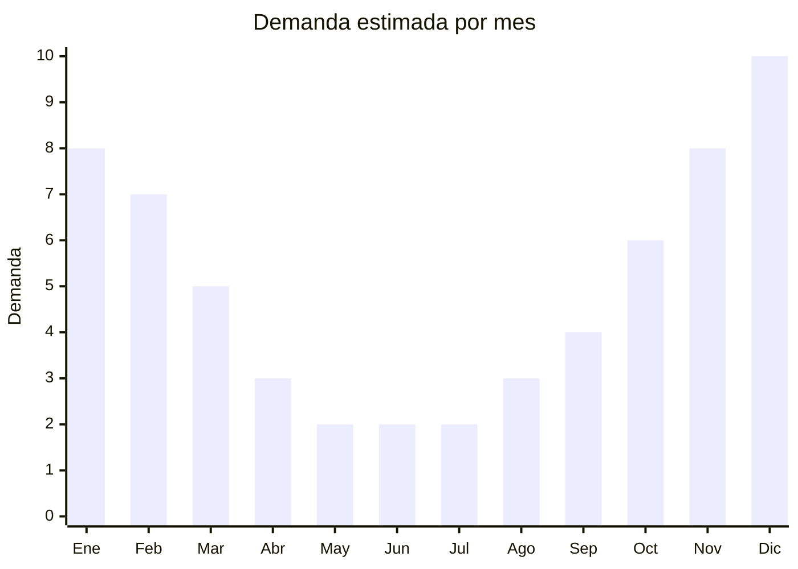

# Luces solares de jardin

> **Capitulo NCM 94** — Muebles, iluminacion y construcciones prefabricadas | **Temporada:** Verano (Dic--Feb)

## Que es y por que importarlo

Las luces solares de jardin son luminarias LED alimentadas por panel solar integrado que se cargan durante el dia y se encienden automaticamente al anochecer. Incluyen estacas solares para caminos y canteros, guirnaldas solares decorativas, faroles solares colgantes, apliques solares de pared y proyectores solares para fachadas. Son productos de exterior que combinan funcionalidad (iluminacion sin cableado) con estetica decorativa.

En verano, la demanda se maximiza por dos factores: mas horas de sol para la carga (mejor rendimiento del panel) y mayor uso nocturno de jardines, terrazas y patios. Las fiestas de fin de ano y la decoracion exterior de verano impulsan especialmente las guirnaldas y faroles solares. China (Shenzhen, Ningbo, Zhongshan) concentra mas del 90% de la produccion mundial de luces solares de bajo costo.

La gran ventaja de este producto es su perfil logistico: son compactos, livianos y con alto valor por CBM. Un contenedor puede cargar miles de unidades. Los margenes son atractivos, especialmente en estacas y guirnaldas donde el FOB es USD 1-5 y el precio de venta supera los ARS 5,000-20,000.

<Note>
**Sobre la clasificacion arancelaria:** Las luces solares de jardin pueden clasificar en el **Capitulo 94** (iluminacion: 9405.40) si se consideran aparatos de alumbrado, o en el **Capitulo 85** (equipos electricos: 8543.70) si el componente principal es el panel solar/circuito electronico. La clasificacion exacta depende del modelo y criterio del despachante. Consultar antes de importar para evitar diferencias en derechos y posibles intervenciones de ENACOM.
</Note>

## Datos clave

| Dato | Valor |
|------|-------|
| **Posiciones NCM tipicas** | 9405.40.90 (aparatos de alumbrado electrico), 8543.70.99 (maquinas y aparatos electricos) |
| **Derecho de importacion** | 18-20% (DIE, segun posicion) + 3% tasa estadistica |
| **Rango FOB tipico** | USD 1.00 — USD 8.00 por unidad |
| **Precio de venta en Argentina** | ARS 5,000 — ARS 30,000 |
| **Margen bruto estimado** | 200% — 400% |
| **MOQ tipico** | 500 — 2000 unidades |
| **Demanda en MercadoLibre** | Alta (estacional con base anual) |
| **Competencia en MercadoLibre** | Media-Alta |
| **Dificultad para importar** | Facil-Media |
| **Certificaciones necesarias** | Posible intervencion ENACOM segun clasificacion |
| **Antidumping** | No |

## Variantes y subtipos mas comunes

| Subtipo / Variante | FOB aprox. | Venta AR aprox. | Nota |
|--------------------|-----------|-----------------|------|
| Estacas solares camino (pack x4-6) | USD 2.00 — 4.00 | ARS 8,000 — 18,000 | **Mas vendido**, decoracion de senderos |
| Guirnalda solar LED 5-10m | USD 2.00 — 5.00 | ARS 8,000 — 20,000 | Fiestas, terrazas, arboles |
| Farol solar colgante | USD 3.00 — 6.00 | ARS 10,000 — 22,000 | Estetica vintage/rustica |
| Aplique solar de pared | USD 3.00 — 7.00 | ARS 10,000 — 25,000 | Seguridad + decoracion |
| Proyector solar con sensor | USD 5.00 — 8.00 | ARS 15,000 — 30,000 | Seguridad perimetral |
| Figura decorativa solar (animal, hada) | USD 3.00 — 8.00 | ARS 12,000 — 28,000 | Decoracion tematica jardin |

## Regulaciones y requisitos

<Tabs>
  <Tab title="Certificaciones">
    | Organismo | Requiere | Detalle |
    |-----------|----------|---------|
    | ARCA (Aduana) | Si siempre | Despacho estandar |
    | ENACOM | Posible | Si clasifica como equipo electronico (Cap. 85), puede requerir intervencion. Si clasifica como luminaria (Cap. 94), generalmente no |
    | INTI / S-Mark | No obligatorio | No hay norma obligatoria para luminarias solares de baja tension |
    | SENASA | No | No aplica |

    **Recomendacion:** Confirmar la clasificacion arancelaria con el despachante ANTES de embarcar. Si clasifica en Cap. 85, puede requerir declaracion jurada ante ENACOM. Si clasifica en Cap. 94 como luminaria, el proceso es mas simple. La diferencia puede ser significativa en tiempo y costo.
  </Tab>

  <Tab title="Etiquetado">
    | Requisito | Aplica |
    |-----------|--------|
    | Idioma espanol | Si |
    | Datos del importador | Si |
    | Especificaciones electricas (voltaje LED, panel solar) | Si |
    | Tipo de bateria incluida | Si (critico para transporte) |
    | Grado de proteccion IP | Recomendado (minimo IP44 para exterior) |
    | Pais de origen | Si |
    | Garantia legal 6 meses | Si |
    | Instrucciones de instalacion | Si |
  </Tab>

  <Tab title="Restricciones">
    La principal consideracion es la **bateria recargable** incluida en cada luz solar. La mayoria usa baterias NiMH (niquel-metal hidruro) de 1.2V que no tienen restricciones de transporte. Algunos modelos premium usan baterias de litio (Li-ion) de 3.7V que SI tienen restricciones:

    - **Baterias NiMH:** Sin restricciones especiales de transporte aereo ni maritimo
    - **Baterias Li-ion:** Requieren embalaje especial, etiquetado UN3481, y pueden tener restricciones en envio aereo

    **Recomendacion:** Preferir modelos con bateria NiMH para simplificar la logistica. Si se eligen modelos con Li-ion, verificar que el proveedor cumpla con embalaje y documentacion IATA/IMDG.
  </Tab>
</Tabs>

## Logistica

| Dato | Valor |
|------|-------|
| **Peso tipico por unidad** | 0.1 — 0.8 kg |
| **Volumen tipico** | 0.002 — 0.01 CBM por unidad |
| **Fragilidad** | Media (paneles solares y LEDs sensibles a golpes) |
| **Envio recomendado** | Maritimo LCL o FCL segun volumen |
| **Tiempo total estimado** | 50 — 80 dias (maritimo) |
| **Baterias de litio** | Depende del modelo (ver Restricciones) |
| **Requiere empaque especial** | Si: proteccion contra golpes para paneles solares |

<Tip>
Las luces solares de jardin tienen una de las **mejores relaciones valor/CBM** de todo el mobiliario de exterior. Un contenedor de 20 pies (28 CBM) puede cargar 2,800-14,000 unidades dependiendo del modelo. Incluso envios LCL de 1-2 CBM (500-2000 unidades) son viables y rentables. Ideal como complemento para llenar espacio sobrante en contenedores con otros productos de mayor volumen (reposeras, mesas, gazebos). El combo "mueble exterior + luces solares" es una excelente estrategia de diversificacion.
</Tip>

## Estacionalidad



| Aspecto | Detalle |
|---------|---------|
| **Meses pico** | Noviembre-Enero (fiestas, decoracion verano, mas horas sol) |
| **Meses valle** | Mayo-Julio (menos horas sol, sin uso jardin) |
| **Cuando pedir** | Julio-Agosto para tener stock en octubre-noviembre |

<Note>
Las luces solares mantienen demanda base durante todo el ano por el segmento de seguridad perimetral (apliques y proyectores con sensor de movimiento). Estos modelos no dependen de la estacion y pueden comercializarse como producto de seguridad en invierno.
</Note>

## Ventajas y riesgos

<CardGroup cols={2}>
  <Card title="Ventajas" icon="circle-check">
    - **Alto margen** (200-400%) por bajo FOB y precio de venta atractivo
    - Compactas y livianas: flete minimo por unidad
    - Excelente para completar contenedores con otros productos
    - Sin cableado: instalacion simple, amplio publico objetivo
    - Variedad enorme: estacas, guirnaldas, faroles, apliques
    - Demanda base anual por segmento seguridad
    - Tendencia creciente de decoracion exterior con LED
  </Card>
  <Card title="Riesgos" icon="triangle-exclamation">
    - Clasificacion arancelaria ambigua (Cap. 94 vs Cap. 85)
    - Posible intervencion ENACOM segun clasificacion
    - Paneles solares de baja calidad pierden eficiencia en 6 meses
    - Baterias de mala calidad se degradan rapidamente (principal queja)
    - Grado IP insuficiente genera fallas con lluvia
    - Modelos con bateria Li-ion complican logistica
    - Alta competencia en modelos genericos de bajo precio
  </Card>
</CardGroup>

## Palabras clave para buscar en Alibaba

```
solar garden light stake wholesale, solar string lights outdoor,
solar lantern garden hanging, solar wall light sensor,
solar pathway light LED, solar flood light outdoor,
solar decorative garden light, solar fairy lights waterproof IP65
```

## Fuentes

- [MercadoLibre Argentina — Luces solares jardin](https://listado.mercadolibre.com.ar/luces-solares-jardin)
- [Alibaba — Solar garden light wholesale](https://www.alibaba.com/trade/search?SearchText=solar+garden+light)
- [Nomenclador NCM - ARCA (ex-AFIP)](https://www.arca.gob.ar)
