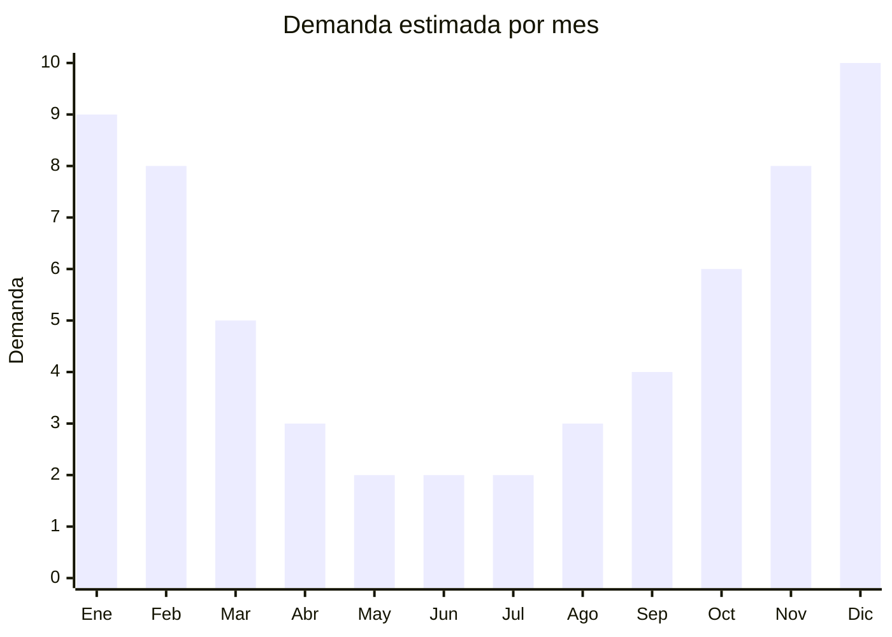

# Mesas y sillas plegables de camping y jardin

> **Capitulo NCM 94** — Muebles, iluminacion y construcciones prefabricadas | **Temporada:** Verano (Dic--Feb)

## Que es y por que importarlo

Las mesas y sillas plegables de camping y jardin son mobiliario portatil de estructura de aluminio (o acero ligero) con superficie de MDF, aluminio, tela o plastico, disenadas para desarmarse o plegarse en tamano compacto para transporte y almacenamiento. Se utilizan para camping, picnics, pesca, eventos al aire libre, jardines y terrazas. Los sets combinados (mesa + 4 sillas en un solo bolso) son especialmente populares en Argentina.

El mercado argentino esta dominado por marcas como Waterdog, National Geographic (NatGeo) y Kushiro, todas importadas desde China. La demanda se concentra en verano (camping, vacaciones) pero tiene traccion complementaria todo el ano para actividades de pesca y eventos. China (Zhejiang: Yongkang, Wuyi) es el epicentro mundial de produccion de mobiliario plegable de aluminio.

La gran ventaja de este producto para la importacion es que los modelos desarmables y plegables optimizan significativamente el CBM comparado con muebles convencionales. Una mesa plegable de 120 cm, desarmada, puede ocupar tan solo 0.03-0.05 CBM. Esto permite envios LCL viables e incluso aereos para pedidos urgentes de temporada.

## Datos clave

| Dato | Valor |
|------|-------|
| **Posiciones NCM tipicas** | 9403.20.00 (muebles de metal), 9401.79.00 (asientos con armazon de metal) |
| **Derecho de importacion** | 20% (DIE) + 3% tasa estadistica |
| **Rango FOB tipico** | USD 3.00 — USD 10.00 (silla), USD 8.00 — USD 25.00 (mesa) |
| **Precio de venta en Argentina** | ARS 15,000 — ARS 80,000 (segun pieza o set) |
| **Margen bruto estimado** | 120% — 250% |
| **MOQ tipico** | 200 — 500 unidades |
| **Demanda en MercadoLibre** | Alta (estacional con base anual) |
| **Competencia en MercadoLibre** | Media-Alta (marcas posicionadas) |
| **Dificultad para importar** | Media (volumen manejable) |
| **Certificaciones necesarias** | No requiere certificaciones especiales |
| **Antidumping** | No |

## Variantes y subtipos mas comunes

| Subtipo / Variante | FOB aprox. | Venta AR aprox. | Nota |
|--------------------|-----------|-----------------|------|
| Silla plegable camping basica | USD 3.00 — 5.00 | ARS 15,000 — 25,000 | Tela poliester, aluminio |
| Silla director plegable | USD 5.00 — 10.00 | ARS 25,000 — 45,000 | Con apoyabrazos, portavaso |
| Mesa plegable aluminio 60cm | USD 8.00 — 12.00 | ARS 25,000 — 40,000 | Personal/pareja |
| Mesa plegable aluminio 120cm | USD 15.00 — 22.00 | ARS 40,000 — 65,000 | **Mas vendida**, familiar |
| Set mesa + 4 sillas plegable | USD 20.00 — 35.00 | ARS 55,000 — 95,000 | Valor percibido alto, todo-en-uno |
| Banqueta plegable baja | USD 2.00 — 4.00 | ARS 8,000 — 18,000 | Pesca, playa, bajo CBM |

## Regulaciones y requisitos

<Tabs>
  <Tab title="Certificaciones">
    | Organismo | Requiere | Detalle |
    |-----------|----------|---------|
    | ARCA (Aduana) | Si siempre | Despacho estandar |
    | INTI | No obligatorio | No hay norma IRAM obligatoria para muebles plegables |
    | ENACOM | No | No es producto electronico |
    | SENASA | No | No aplica |

    **Recomendacion:** Solicitar al proveedor test de carga estatica (minimo 100 kg para sillas, 30 kg distribuidos para mesas) y test de apertura/cierre (minimo 500 ciclos sin falla). Los modelos baratos fallan en los mecanismos de bloqueo, generando riesgo de colapso y reclamos.
  </Tab>

  <Tab title="Etiquetado">
    | Requisito | Aplica |
    |-----------|--------|
    | Idioma espanol | Si |
    | Datos del importador | Si |
    | Materiales de fabricacion | Si |
    | Peso maximo soportado | Recomendado (critico para seguridad) |
    | Medidas armado y plegado | Si |
    | Pais de origen | Si |
    | Garantia legal 6 meses | Si |
    | Instrucciones de armado | Si |
  </Tab>

  <Tab title="Restricciones">
    Sin restricciones especiales de importacion. No hay antidumping ni licencias previas para muebles plegables.

    **Atencion:** Verificar que los mecanismos de traba (locks) de patas y articulaciones funcionen correctamente. El colapso de una silla o mesa puede causar lesiones. Los modelos con doble traba de seguridad son preferibles. Solicitar video del proceso de plegado/desplegado al proveedor antes de cerrar la compra.
  </Tab>
</Tabs>

## Logistica

| Dato | Valor |
|------|-------|
| **Peso tipico por unidad** | Silla: 1.5 — 3.5 kg / Mesa: 3.0 — 7.0 kg |
| **Volumen tipico** | Silla: 0.02 — 0.05 CBM / Mesa: 0.03 — 0.08 CBM (plegada) |
| **Fragilidad** | Baja (aluminio resistente, tela flexible) |
| **Envio recomendado** | Maritimo LCL o FCL segun volumen |
| **Tiempo total estimado** | 55 — 85 dias (maritimo) |
| **Baterias de litio** | No |
| **Requiere empaque especial** | No (bolso de transporte + caja exterior) |

<Tip>
La gran ventaja de mesas y sillas plegables es su **excelente relacion valor/CBM**. Una mesa de 120cm plegada ocupa solo 0.05-0.08 CBM y una silla 0.02-0.05 CBM. Un contenedor de 20 pies (28 CBM) puede cargar 350-700 sillas o 350-550 mesas. Esto permite importar en LCL con margenes viables. Combinar sillas + mesas + banquetas en un mismo envio para diversificar riesgo y ofrecer sets completos.
</Tip>

## Estacionalidad



| Aspecto | Detalle |
|---------|---------|
| **Meses pico** | Noviembre-Febrero (camping, vacaciones, pileta, jardin) |
| **Meses valle** | Mayo-Julio (poco uso outdoor) |
| **Cuando pedir** | Julio-Agosto para tener stock en octubre-noviembre |

<Note>
Las sillas y mesas plegables mantienen demanda base durante todo el ano por el segmento de pesca deportiva y eventos. Los modelos de pesca (banquetas bajas, sillas con portacanas) tienen pico en otono-invierno, lo que complementa la estacionalidad de verano.
</Note>

## Ventajas y riesgos

<CardGroup cols={2}>
  <Card title="Ventajas" icon="circle-check">
    - Excelente relacion valor/CBM (se pliegan muy compactos)
    - Variedad de productos permite diversificar (sillas, mesas, sets, banquetas)
    - Demanda estacional fuerte + base anual (pesca, eventos)
    - Viable importar en LCL para pedidos iniciales
    - Sin barreras regulatorias
    - Venta cruzada natural: mesa + sillas + accesorios
  </Card>
  <Card title="Riesgos" icon="triangle-exclamation">
    - Mecanismos de bloqueo defectuosos generan riesgo de lesiones
    - Competencia de marcas establecidas (Waterdog, NatGeo, Kushiro)
    - Aluminio muy fino (menos de 1.0 mm) se deforma rapidamente
    - Tela de baja calidad se rasga o decolora en una temporada
    - Remaches y tornillos pueden aflojarse con el uso
    - Garantia: el colapso de un mueble puede generar reclamos legales
  </Card>
</CardGroup>

## Palabras clave para buscar en Alibaba

```
folding camping table aluminum wholesale, portable folding chair outdoor,
camping table and chairs set, aluminum folding picnic table,
lightweight camping chair foldable, director chair folding wholesale,
outdoor folding stool fishing, roll up camping table aluminum
```

## Fuentes

- [MercadoLibre Argentina — Mesas plegables camping](https://listado.mercadolibre.com.ar/mesa-plegable-camping)
- [MercadoLibre Argentina — Sillas plegables camping](https://listado.mercadolibre.com.ar/silla-plegable-camping)
- [Alibaba — Folding camping table wholesale](https://www.alibaba.com/trade/search?SearchText=folding+camping+table+aluminum)
- [Nomenclador NCM - ARCA (ex-AFIP)](https://www.arca.gob.ar)
